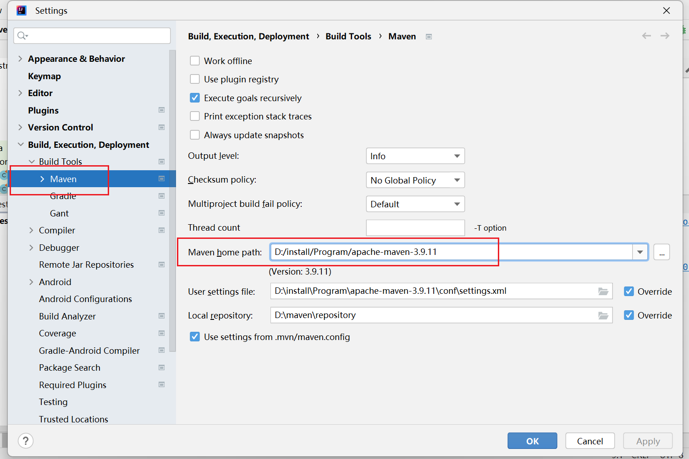

从您提供的输出信息来看，您在 **IDEA 中执行 Maven 命令** 和 **命令行中执行 Maven 命令** 时，使用的 Maven 版本和 JDK 版本是不同的。

### 1. **IDEA 中的 Maven 配置**

- **Maven 版本**: 3.9.9
- **JDK 版本**: 17.0.0.1
- **Maven 安装路径**: `C:\Users\Athena\.m2\wrapper\dists\apache-maven-3.9.9-bin\4nf9hui3q3djbarqar9g711ggc\apache-maven-3.9.9`
- **配置文件**: 使用了 `-s D:\install\Program\apache-maven-3.9.2\conf\settings.xml`，指定了一个自定义的 `settings.xml`。

### 2. **命令行中的 Maven 配置**

- **Maven 版本**: 3.9.2
- **JDK 版本**: 1.8.0_202
- **Maven 安装路径**: `D:\install\Program\apache-maven-3.9.2`
- **平台编码**: GBK（命令行中使用的编码可能导致某些文件路径等出现问题）

### 3. **差异总结**

- **Maven 版本差异**：命令行中使用的 Maven 版本是 **3.9.2**，而 IDEA 中使用的是 **3.9.9**。这意味着，IDEA 中的 Maven 版本更新，可能包含对某些插件或功能的修复，而命令行中的旧版本则可能缺少某些更新。
- **JDK 版本差异**：IDEA 中使用的是 **JDK 17**，而命令行中使用的是 **JDK 8**。这可能导致在某些构建中使用不同的 JDK 特性（例如，`JDK 17` 有一些 JDK 8 没有的特性）。确保您的构建工具使用与项目兼容的 JDK。

### 4. **如何解决版本不一致问题**

如果您希望让 **命令行** 和 **IDEA** 中使用相同的 Maven 和 JDK 版本，可以按照以下步骤调整：

#### 1. **将命令行的 Maven 版本升级为 3.9.9**

- 下载并安装 **Maven 3.9.9** 版本：[Maven 官方下载页面](https://maven.apache.org/download.cgi)。
- 设置环境变量，将 **MAVEN_HOME** 指向 **Maven 3.9.9** 的安装目录。
- 更新 `PATH` 变量，确保命令行使用的是新版本的 Maven。
- 使用 `mvn -version` 检查命令行中的 Maven 版本，确保与 IDEA 中的一致。

#### 2. **将命令行的 JDK 版本升级为 JDK 17**

- 如果您希望命令行和 IDEA 中的 JDK 版本一致，可以安装 JDK 17 并在命令行中设置环境变量：
  - 设置 **JAVA_HOME** 为 JDK 17 的安装目录。
  - 更新 `PATH` 变量，确保命令行使用 JDK 17。
- 通过 `java -version` 确认命令行使用的是 JDK 17。

#### 3. **配置 IDEA 中的 Maven 使用命令行的 Maven**

- 如果您希望 IDEA 使用与命令行相同的 Maven 版本，可以在 IDEA 中设置 `Maven home directory` 为您安装的 Maven 3.9.9 版本的路径：
  - 打开 **Settings**（Windows: `File` > `Settings`，macOS: `IntelliJ IDEA` > `Preferences`）。
  - 进入 **Build, Execution, Deployment** > **Build Tools** > **Maven**。
  - 设置 **Maven home directory** 为您安装的 Maven 3.9.9 路径。

------

### 结论

- 目前您在 IDEA 中和命令行中使用的 Maven 版本不同，建议统一使用 **Maven 3.9.9** 版本。
- JDK 版本也不一致，确保 **命令行和 IDEA** 中使用的 JDK 版本一致，建议统一使用 **JDK 17**。
- 调整好版本之后，IDEA 和命令行的构建结果应该保持一致。

 