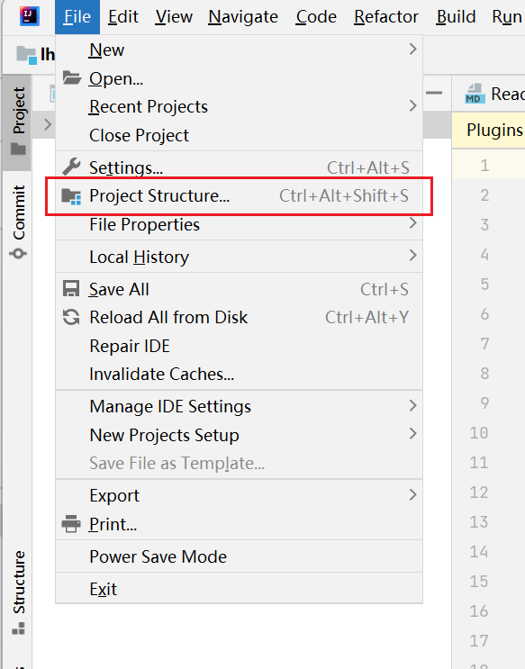
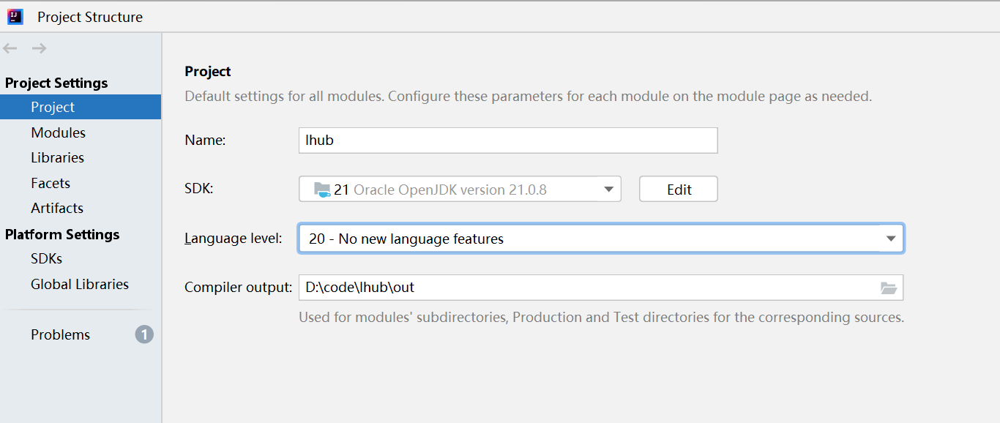
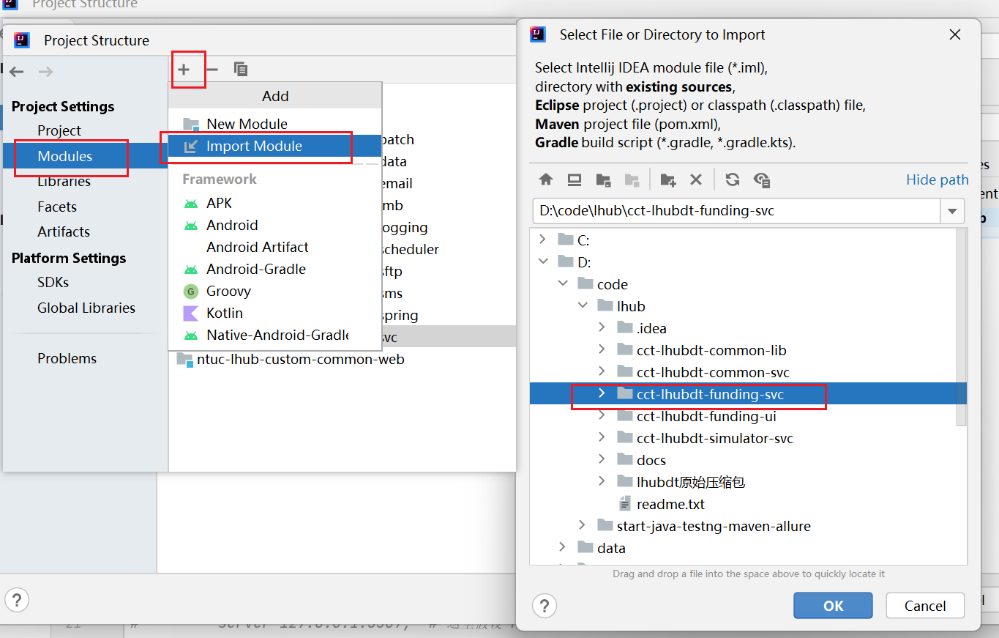
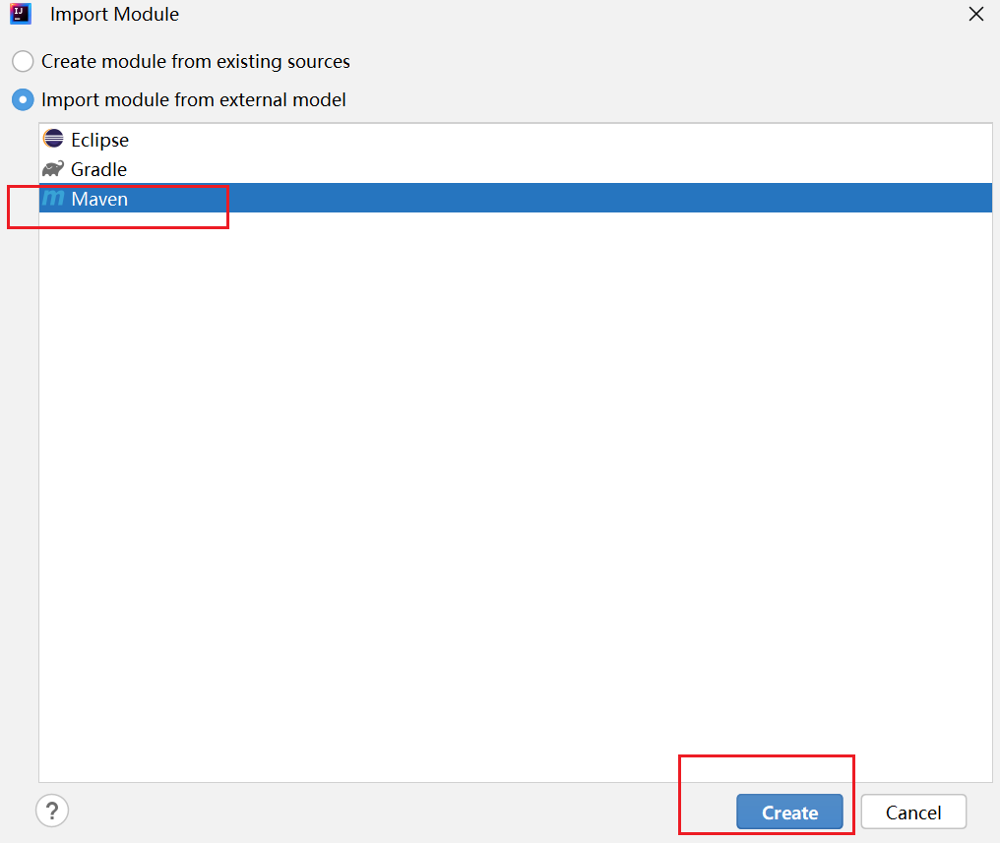

在 IntelliJ IDEA 中，项目设置结构（**Project Structure**）允许你管理项目的模块、SDK、库、构建工具（如 Maven、Gradle）等。通过这个设置，你可以配置项目的基本结构和各项设置。以下是操作步骤和说明：

### 1. 打开 **Project Structure**

- 你可以通过以下两种方式之一来打开 **Project Structure**：

  - 在菜单栏中点击 **File** -> **Project Structure...**

  - 或者直接使用快捷键 `Ctrl + Alt + Shift + S`。

    

### 2. 配置 **Project Structure**

打开 **Project Structure** 后，你会看到左侧有几个重要的选项卡：

#### 2.1 **Project**（项目）

- **Project SDK**：选择你项目的 SDK（如 Java SDK）。如果你没有设置 SDK，IDEA 会提示你选择一个合适的版本，或者你可以点击 **Add SDK** 来添加一个新版本。
- **Project language level**：选择项目的语言级别（例如，Java 8、Java 11 等）。这个选项决定了代码中可用的语言特性。

#### 2.2 **Modules**（模块）

- 这个选项显示当前项目中的所有模块。在一个项目中，你可以有多个模块（如 Java、Maven、Gradle 等）。
- **添加模块**：如果你的项目没有模块，可以通过点击 **+** 按钮来添加一个新模块。选择合适的模块类型（例如，**Java**、**Maven**、**Gradle** 等）。
- **修改模块配置**：选择一个模块，你可以在右侧设置源代码目录、编译输出目录等。你可以设置源代码（`src`）和资源文件夹（`resources`）。
- **模块依赖**：在每个模块下，你还可以设置它的依赖关系，如其他模块、外部库等。

#### 2.3 **Libraries**（库）

- 在这里，你可以添加项目所需的外部库或 JAR 文件。
- **添加库**：点击 **+** 按钮，选择 **Java** 或 **Maven** 来添加依赖的库。
  - 对于 Maven 项目，IDEA 会自动识别并加载 `pom.xml` 文件中的依赖。
  - 对于非 Maven 项目，你可以手动添加 JAR 文件或本地库。

#### 2.4 **Artifacts**（构建产物）

- 如果你希望构建 JAR、WAR 或其他类型的构建产物，可以在这里配置。
- **添加构建产物**：点击 **+**，选择你要生成的构建类型（如 **JAR**、**WAR**）。
- 配置构建目录和相关资源，设置项目构建时需要的文件。

#### 2.5 **Facets**（特性）

- **Facets** 用于为项目或模块添加特殊功能，如 Java EE、Spring、Web 等。根据项目的需求，你可以为模块添加相应的 Facet 以启用特定的框架支持。

#### 2.6 **Artifacts**（构建产物）

- 这个选项让你配置项目生成的构建产物（如 JAR 文件、WAR 文件等）。你可以在这里设置将项目编译后输出为特定格式的文件。

### 3. 配置 **Maven** 或 **Gradle** 项目

如果你的项目是 **Maven** 或 **Gradle** 项目，你可以通过 **Project Structure** 设置相关的构建工具支持：

#### 3.1 **Maven 项目**

- **添加 Maven 支持**：如果你的项目没有 `pom.xml` 文件，你可以通过点击 **Modules** -> **Add Framework Support**，选择 **Maven** 来添加 Maven 支持。
- **Maven 配置**：在 **Project Structure** 中的 **Libraries** 和 **Modules** 页面，IDEA 会自动加载 `pom.xml` 中的依赖，并允许你在构建时使用它们。

#### 3.2 **Gradle 项目**

- **添加 Gradle 支持**：如果你使用 Gradle，选择 **Add Framework Support** 并选择 **Gradle**。
- **Gradle 配置**：同样，IDEA 会自动识别 `build.gradle` 文件，并允许你配置 Gradle 构建。

### 4. 配置 **运行/调试配置**（Run/Debug Configurations）

- 你可以通过 **Run** -> **Edit Configurations** 来设置如何运行或调试项目。这包括设置主类、程序参数、环境变量等。
- 在 **Project Structure** 中并不涉及具体的运行配置，但你可以为每个模块或应用创建不同的运行配置。

### 5. **应用并保存设置**

- 完成所有配置后，点击 **Apply** 按钮保存设置，然后点击 **OK** 关闭窗口。

通过这些步骤，你可以在 **Project Structure** 中全面管理 IntelliJ IDEA 中项目的结构、模块、依赖和构建工具设置。

