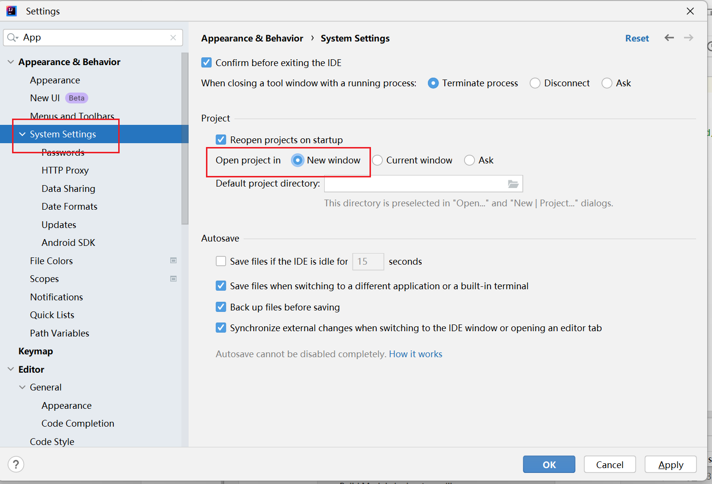

### IDEA启用提示选择新窗口或当前窗口

1. **打开 IntelliJ IDEA 设置**：
    
    - 在 IDEA 中，点击 **File > Settings**（在 macOS 上是 **IntelliJ IDEA > Preferences**）。
        
2. **进入外观与行为设置**：
    
    - 在设置窗口中，选择 **Appearance & Behavior** > **System Settings**。
        
3. **修改 "Project Opening" 设置**：
    
    - 在 **Project Opening** 部分，查找 **"Confirm window to open project in"** 选项。
        
    - 勾选 **"Confirm window to open project in"**，这样当你尝试打开一个项目时，IDEA 会提示你是想在当前窗口中打开，还是在新窗口中打开。
        
4. **保存设置并关闭窗口**：
    
    - 点击 **OK** 保存更改。
        

  
 
### 完成后：

- 当你尝试打开一个新项目时，IDEA 会弹出提示，允许你选择是否在当前窗口中打开，还是打开新窗口。