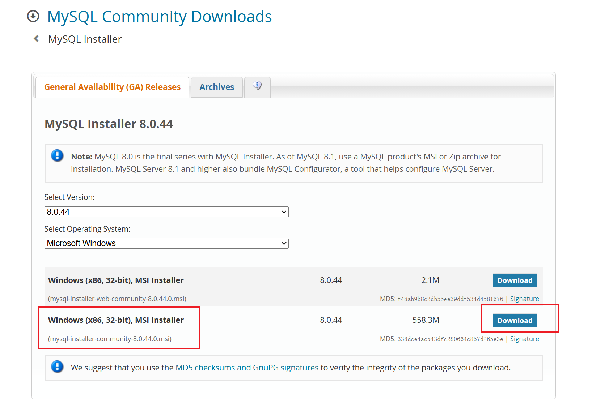
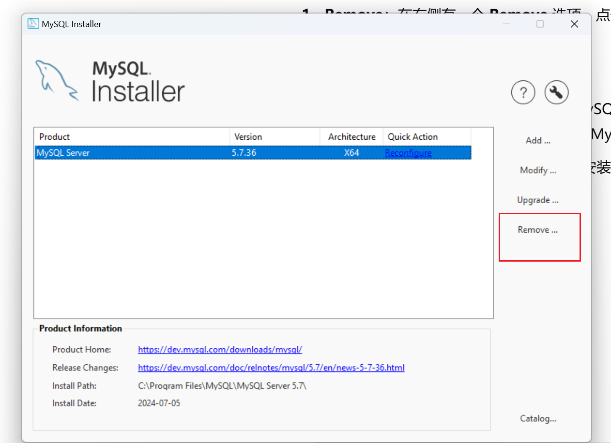
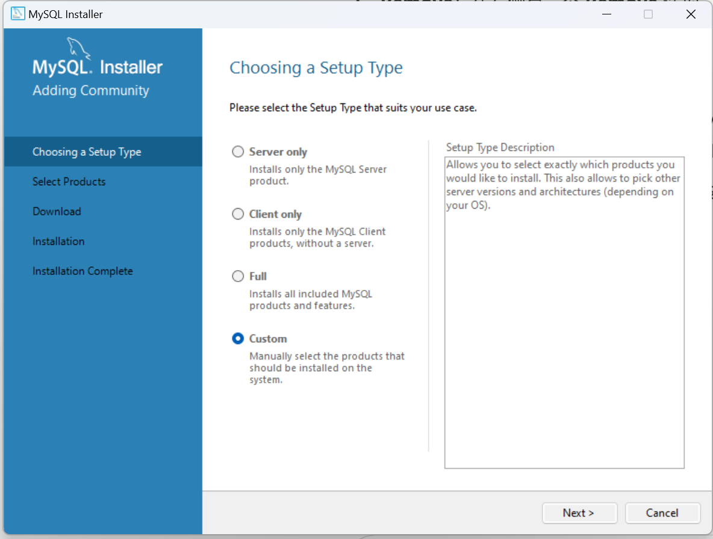
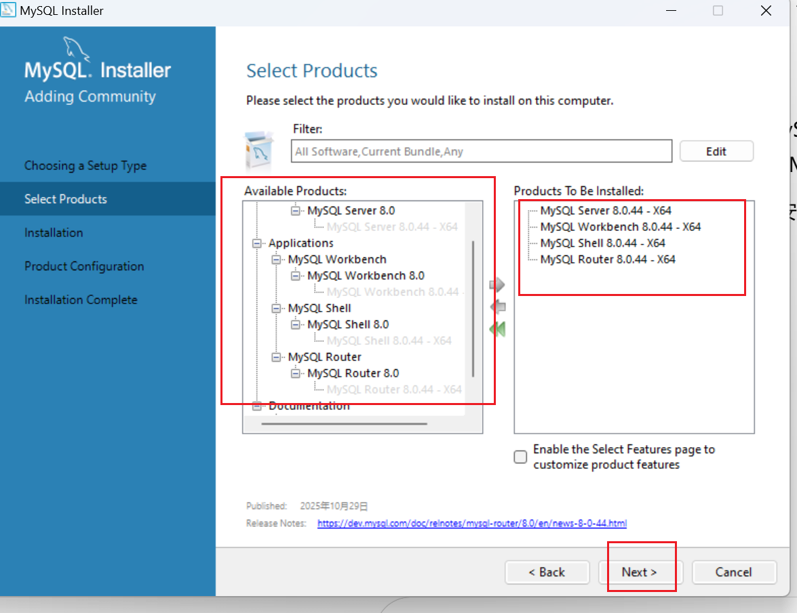
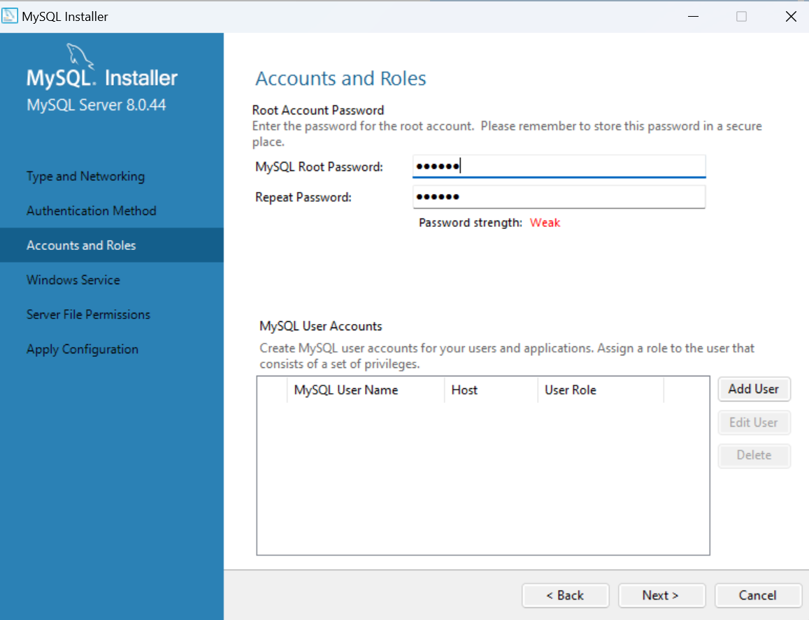
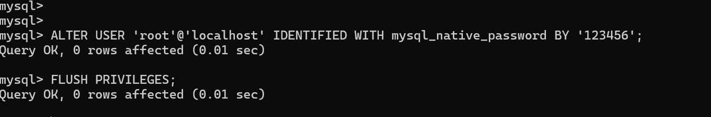
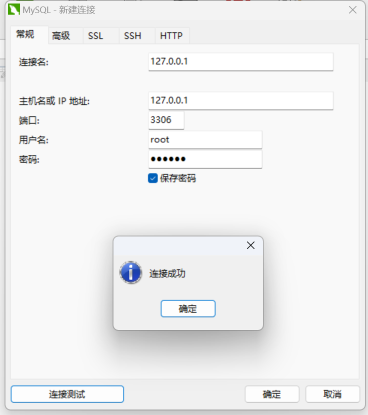

Windows 环境下安装 MySQL 8.0 的步骤如下：

# 卸载 **MySQL 5.7**

### 步骤 1：备份数据（非常重要）

在卸载 MySQL 5.7 之前，确保你已经备份了所有重要的数据库，以防丢失数据。

你可以使用 `mysqldump` 进行备份：

```
mysqldump -u root -p --all-databases > backup.sql
```

这将备份所有数据库，保存为 `backup.sql` 文件。你也可以备份特定的数据库：

```
mysqldump -u root -p your_database_name > your_database_backup.sql
```

### 步骤 2：停止 MySQL 5.7 服务

在卸载 MySQL 之前，你需要停止 MySQL 5.7 服务。

1. **通过服务管理器停止 MySQL 服务**：

   - 打开 **服务**（按下 `Win + R`，输入 `services.msc`，然后按回车）。
   - 找到 **MySQL** 或 **MySQL 5.7** 服务。
   - 右键点击服务，选择 **停止**。

2. **通过命令行停止 MySQL 服务**：

   - 打开 **命令提示符**（以管理员身份运行）或 **PowerShell**。

   - 输入以下命令停止 MySQL 服务：

     ```
     net stop mysql
     ```

### 步骤 3：卸载 MySQL 5.7

1. 打开 **控制面板**（通过 **开始菜单**，搜索 **控制面板**）。
2. 点击 **程序和功能**，找到 **MySQL 5.7**。
3. 右键点击 **MySQL 5.7**，然后选择 **卸载**。

### 步骤 4：删除 MySQL 文件和文件夹

1. **删除 MySQL 安装目录**：

   - 如果你在安装时没有更改目录，MySQL 的默认安装目录通常位于 `C:\Program Files\MySQL\MySQL Server 5.7`。
   - 删除该目录中的所有文件。

2. **删除数据目录**：

   - 默认情况下，MySQL 5.7 的数据文件通常位于 `C:\ProgramData\MySQL\MySQL Server 5.7`。
   - 删除该文件夹中的所有数据文件。如果你已经备份了数据文件，可以安全删除。

   **注意**：如果你希望保留数据（如数据库文件）以便迁移到 MySQL 8.0，请在删除之前确保已经备份。

3. **清理注册表项（可选）**：

   - 打开 **注册表编辑器**（按 `Win + R`，输入 `regedit` 并按回车）。

   - 查找并删除与 MySQL 5.7 相关的注册表项。路径通常是：

     ```
     HKEY_LOCAL_MACHINE\SYSTEM\CurrentControlSet\Services\MySQL
     ```

# 安装 MySQL 8.0

### 步骤 1：下载 MySQL 安装包

1. 访问 MySQL 官方下载页面：[MySQL Downloads](https://dev.mysql.com/downloads/installer/)

   

2. 在页面中选择 **MySQL Installer for Windows**。
   - 可以选择 **Windows (x86, 32-bit), MSI Installer** 版本，或者 **Windows (x86, 64-bit), MSI Installer** 版本，具体选择取决于你系统的架构。

3. 点击 **Download** 按钮。
   - 你会看到一个提示，选择 **No thanks, just start my download** 来跳过注册。

### 步骤 2：安装 MySQL 8.0

1. 下载完成后，运行安装包 **mysql-installer-web-community-x.x.x.x.msi**。

   检测到之前安装就要先移除后再add

    

2. 在安装向导中，选择 **Custom**（自定义）安装选项，点击 **Next**。

   

3. 在安装选项中，选择你需要安装的组件：
   - **MySQL Server**：MySQL 数据库服务器。
   - **MySQL Workbench**：用于管理和配置 MySQL 的 GUI 工具（推荐安装）。
   - **MySQL Shell**：用于执行 SQL 命令的交互式 Shell（推荐安装）。
   - **MySQL Router**（可选）：用于路由请求的工具。

4. 安装过程中，选择 **MySQL 8.0** 版本。

   

5. 点击 **Next** 继续安装。

### 步骤 3：配置 MySQL

1. 安装程序会让你配置 MySQL 服务器。

2. **选择配置类型**：推荐选择 **Developer Machine**（开发机器）或 **Server Machine**（服务器机器），根据你的使用需求。

3. **选择数据库的字符集**：推荐选择 **utf8mb4**。

4. **设置 MySQL Root 密码**：
   - 输入一个强密码，并确认密码。这个密码用于 MySQL 管理员账户（`root`）。

5. **配置 MySQL 服务**：

   - 选择 **Configure MySQL as a Windows Service**，并启用 **Start MySQL at System Startup**，使 MySQL 在 Windows 启动时自动启动。
   - 你可以设置服务名称（默认为 `MySQL`）。

6. 点击 **Next**，完成配置。

   
   

   

### 步骤 4：安装完成

1. 安装程序将开始安装和配置 MySQL。等待安装完成。
2. 安装完成后，点击 **Finish**。

### 步骤 5：启动 MySQL

1. 打开 **命令提示符**（CMD）或者 **PowerShell**，并输入以下命令来启动 MySQL 服务：

   ```
   net start mysql
   ```

   这将启动 MySQL 服务。

2. 你也可以通过 **MySQL Workbench** 来连接和管理 MySQL 数据库。启动 **MySQL Workbench**，并使用 `localhost` 和 `root` 用户（密码为你在配置时设置的密码）连接。

### 步骤 6：将 MySQL 添加到环境变量

在 **系统变量** 中，找到并选中 `Path` 变量，点击 **编辑**。

在编辑窗口中，点击 **新建**MYSQLHOME，然后输入 MySQL 的 目录路径，例如：

```
C:\Program Files\MySQL\MySQL Server 8.0
```

找到PATH，点击 **新建**，然后输入 MySQL 的 `bin` 目录路径，例如：

```
C:\Program Files\MySQL\MySQL Server 8.0\bin
```

### 步骤 7：验证安装

1. 打开 **命令提示符**（CMD）或 **PowerShell**，输入以下命令以连接 MySQL：

   ```
   mysql -u root -p
   ```

   然后输入你在安装过程中设置的 **root 密码**。

2. 连接成功后，你将看到 MySQL 提示符，表示 MySQL 已成功安装并正在运行。

   

### 步骤8：设置navicat可以连接

登录后，执行以下 SQL 语句，将用户的认证协议更改为 `mysql_native_password`（这种方式是向后兼容的）。

```
ALTER USER 'root'@'localhost' IDENTIFIED WITH mysql_native_password BY '123456';
FLUSH PRIVILEGES;

```


### 常见问题：

1. **MySQL 服务未启动**：如果在命令提示符中遇到问题，尝试手动启动 MySQL 服务：

   ```
   net start mysql
   ```

2. **防火墙问题**：如果无法从其他设备连接 MySQL，请确保 Windows 防火墙没有阻止 MySQL 端口（默认是 3306）。