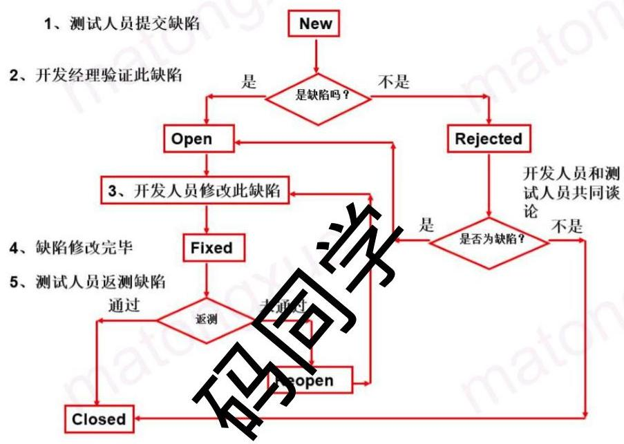
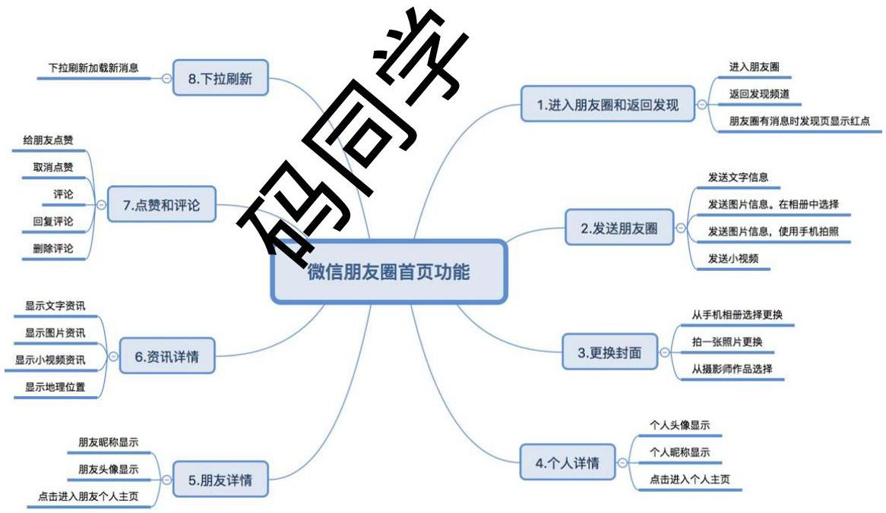
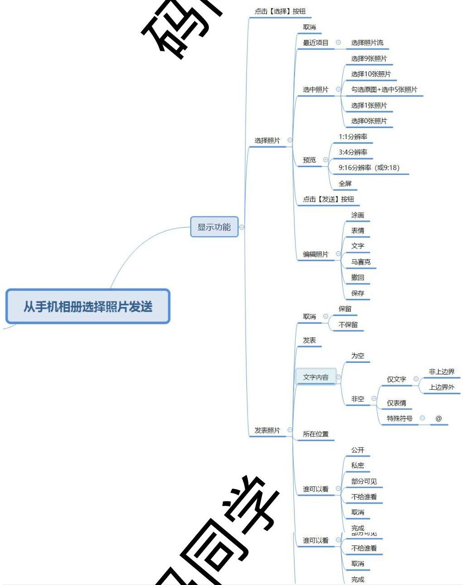
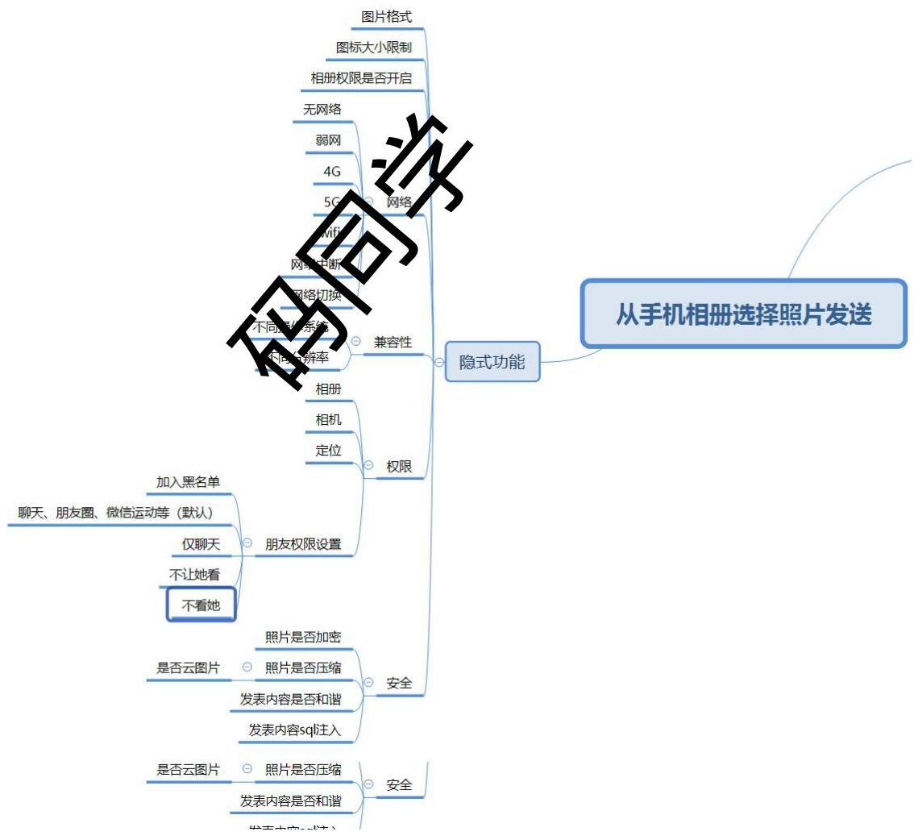
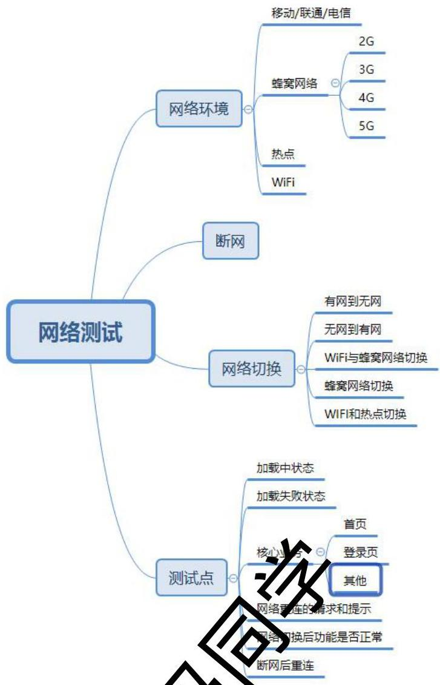
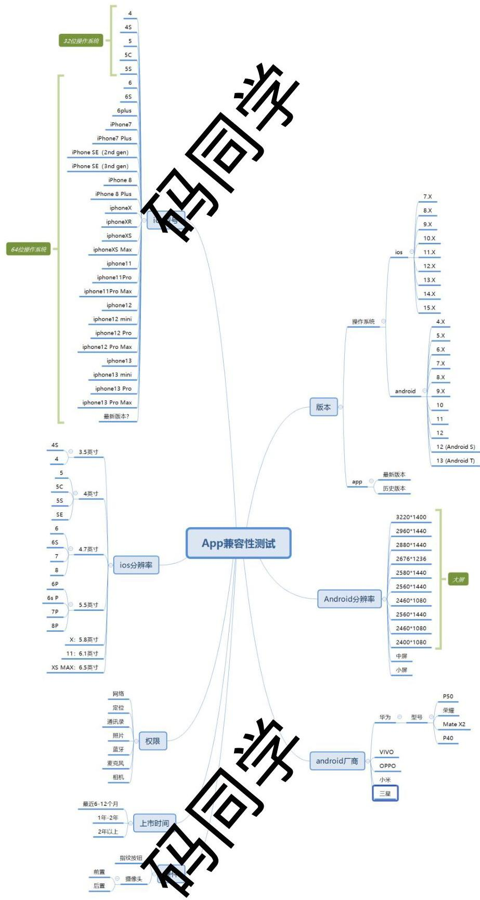
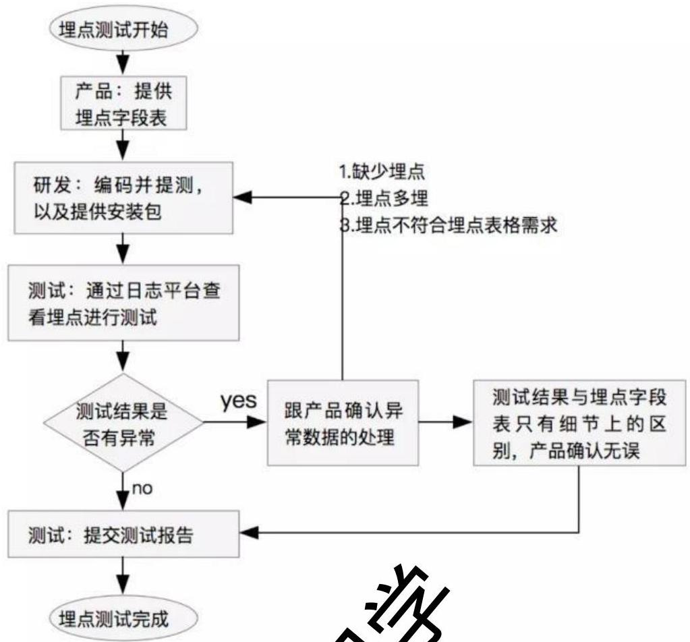
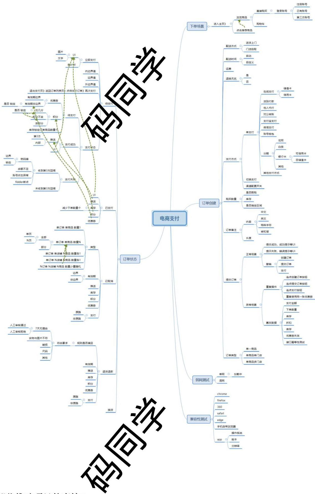
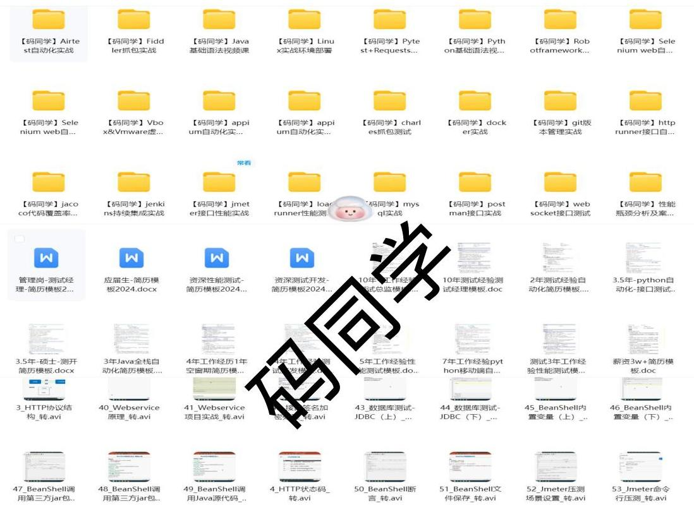

码同学面试题

# 一．测试基础

## 1. 如何制定测试计划

参考答案：

测试计划包括测试目标、测试范围、测试环境的说明、测试类型的说明（功能，安全，性能，稳定性）、测试工具、模块的划分、测试负责人、测试执行轮次的时间安排、相关文档在文档管理库中的位置、测试的风险。其中模块划分需要根据测试人员对于业务的熟悉程度及个人能力进行分配，工作量的估算需要根据以往测试时的经验，结合本次需求的修改，可以大致估算出测试量

## 2. 在项目中如何保证软件质量

参考答案：

项目质量不仅仅是某个人或某个团队来保障的，而是整个团队一起努力的结果，在公司级别需要有一个规范的项目流程

1. 产品，保证迭代过程中的产品逻辑，对于可能的兼容，升级做出预判，并给出方案
2. 设计，满足产品表达的同时，保证设计的延续性
3. 开发，产品细节的保证，技术方案选择要严谨，考虑兼容，性能，开发完成后要充分自测，严格遵循开发规范操作
4. 测试，验证产品逻辑，站在用户角度对交互设计进行系统验证，尽可能多的使用技术手段保证测试质量

## 3. 功能测试用例一般包含哪些内容？

参考答案：

要素一般包括：用例编号、用例优先级、测试目标、所属模块、前提条件、测试环境、输入数据、测试步骤、预期结果、测试脚本等

核心要素：用例优先级、测试目的、结果

## 4. 黑盒（或功能）测试用例设计方法有哪些？

参考答案：

等价类划分方法：等价类划分法将程序所有可能的输入数据（有效的和无效的）划分成若干个等价类。

---

码同学面试题

边界值方法：边界值分析法就是对输入或输出的边界值进行测试的一种黑盒测试方法。

错误推测方法：在测试程序时，人们可以根据经验或直觉推测程序中可能存在的各种错误，从而有针对性地编写检查这些错误的测试用例的方法。

因果图方法：因果图法是一种适合于描述对于多种输入条件组合的测试方法，根据输入条件的组合、约束关系和输出条件的因果关系，分析输入条件的各种组合情况，从而设计测试用例的方法，它适合于检查程序输入条件涉及的各种测试情况。

判定表驱动分析方法：判定表是黑盒测试的方法之一，判定表是把作为条件的所有输入的各种组合值以及对应输出值都罗列出来而形成的表现。

正交分解法：是研究多因素多水平的一种数学方法，它是根据正交性，由试验因素的全部水平组合中挑选出部分有代表性的点进正交线，通过对这部分试验结果的分析了解全面试验的情况，找出最优的水平组合。

场景分析法：分析软件应用的场景，从用户的角度出发，从场景的角度来设计测试用例，是一种面向用户的测试用例设计方法。关心用户做什么，而不是关心产品做什么。

全局探索式测试方法：测试人员根据应用程序所提供的信息自由发挥，不受限制，不受任何约束的探索程序的各种功能。

# 5. APP 测试和 web 测试有什么区别

Web 端测试和移动端测试类型基本相似，都需要进行功能测试、性能测试、安全性测试，他们主要区分 web 端一般都是 b/s 架构，基于浏览器的，app 是 c/s 架构，是有客户端的。

(1) 从系统架构来看的话：web 测试只要更新了服务器端，客户端就会同步更新；而如果是 app 端下修改了服务端，意味着客户端用户所有使用的核心版本都需要进行回归测试一遍。

(2) 客户端性能方面：Web 端可能只会关注响应时间；App 则还要关心流量、电量、cpu、等；

(3) 兼容方面：Web 是基于浏览器的，所以更倾向于浏览器（IE、Chrome、firefox）和电脑硬件，电脑系统方向的兼容；App 测试则必须依赖于手机或者 pad，不仅要看分辨率、频目尺寸、重要看设备系统。

# 6. 发现一个 bug，怎么定位是 APP 端还是服务端的问题

1. 抓包分析 通过对客户端进行抓包，分析服务端返回的数据是否符合预期，如果服务端数据是正确的，那就是客户端的问题
2. 日志分析 可以通过查看客户端/服务端的日志，分析有没有异常的日志信息，从而确定具体原因

# 7. 针对 App 的安装功能，写出测试表？

1. 正常安装测试，检查是否安装成功。
2. APP 版本覆盖测试。例如：先安装一个 1.0 版本的 APP，再安装一个高版本(1.1 版本)的 APP，检查是否被覆盖。
3. 回退版本测试。例如：先装一个 2.0 版本的 APP，再安装一个 1.0 版本的 APP，正常情况下版

---

码同学面试题

本是可以回退的。

4. 安装时内存不足，弹出提示。
5. 根据安装手册操作，是否正确安装。
6. 安装过程中的意外情况（强行断电、断网、来电话了、查看信息）等等，检查会发生的情况。
7. 通过‘同步软件’，检查安装时是否同步安装了不正常件。
8. 在不同型号、系统、屏幕大小、分辨率上都不相适合安装。
9. 安装时是否识别有 SD 卡，并默认安装“正常”卡。
10. 安装完成后，能否正常启动应用程序。
11. 安装完成后，重启手机能否正常启动应用程序。
12. 安装完成后，是否对其他应用程序进行详解。
13. 安装完成后，能否添加快捷方式。
14. 安装完成后，杀毒软件是否会对其当做病毒处理。
15. 多进程进行安装，是否安装成功。
16. 在安装过程中，所有的提示信息必须是英文或者中文，提示信息中不能出现代码、符号、乱码等。
17. 安装之后，是否自动启动程序。
18. 是否支持第三方安装。
19. 在安装中点击取消。

## 8. 持续集成的目的是什么

持续集成指的是，频繁地（一天多次）将代码集成到主干。

它的好处主要有两个：

（1）快速发现错误。每完成一点更新，就集成到主干，可以快速发现错误，定位错误也比较容易。
（2）防止分支大幅偏离主干。如果不是经常集成，主干又在不断更新，会导致以后集成的难度变大，甚至难以集成。

持续集成的目的，就是让产品可以快速迭代，同时还能保持高质量。它的核心措施是，代码集成到主干之前，必须通过自动化测试，只要有一个测试用例失败，就不能集成。

## 9. 如何测试纸杯

功能度：纸杯容量（空杯、满杯升数、半杯升数），产品不能被喝到；纸杯形状（正圆柱、上宽下窄圆柱、上窄下宽圆柱、其他形状）的纸杯质（全纸质、全塑料、半纸半塑料）、纸杯耐温程度（冷水、热水、冷水、冰）、纸杯高温液体名称（水、咖啡、牛奶、可乐）

安全性：杯子有没有毒或细菌、装液体多入有化学反应（例如：异味）

可靠性：杯子从不同高度落下的纸杯量收

可移植性：杯子在不同的地方、区域等环境下是否都可以正常使用

兼容性：杯子是否能够容纳果汁、白水、酒精、汽油等

易用性：杯子是否烫手、是否有防滑措施、是否方便饮用、装液体多入漏水、装热水多入变形、装多少度热水变形

用户文档：使用手册是否对杯子的用法、限制、使用条件等有详细描述

---

码同学面试题

疲劳测试：将杯子盛上水放24小时检查泄漏时间和情况；盛上汽油放24小时检查泄漏时间和情况等

压力测试：用根针并在针上面不断加重量，看压强多大时会穿透；手挤压多久变形（单手、双手）

## 10. 当开发人员说不是BUG时，你如何应对？

开发人员说不是bug，有2种情况，一是如果没有确定，所以这个时候可以找来产品经理进行确认，需不需要改动，商量确定好并不需要必要改。二是这种情况不可能发生，所以不需要修改，这个时候可以先尽可能的多用于商量的依据是什么？如果被用户发现或出了问题，会有什么不良结果？程序员可能会给你很多理由，你可以对他的解释进行反驳。如果还是不行，那可以给这个问题提出来，跟开发经理和测试经理进行确认，如果要修改就改，如果不要修改就不改。如果最终bug被确定不改，那么就要在测试报告里面记录一下，以便以后查阅。

## 11. 遇到概率性bug怎么办？

概率性bug，又叫幽灵bug，首先需要明确的是，该类bug也是需要提单的，描述清楚当时操作环境、操作步骤、数据、并提供必要日志，可备注上可能产生原因。然后耐心一点，运用排除法、错误推测找规律，必要时找开发人员、项目经理一起定位分析讨论，如果最终仍未解决，那么需要在测试报告中体现，并分析可能造成的影响，大家一起权衡该bug是否可遗留。

## 12. 一个身份证号码输入框，怎么设计用例

- 校验身份证号规则的有效性（包括地址码、生日期码、顺序码和校验码）
- 校验15位身份证号和18位身份正好都是可用的
- 校验末位是X的情况
- 校验不足15位、16-17位和大于18位的情况
- 如果是必输项，校验不输入的时候会不会有正确的提示
- 如果不是必输项，则要校验不输入的时候流程能否正常进行
- 校验输入非数字的情况，是否会有正确提示信息（包括大小写字母、汉字、特殊字符和标点符号）
- 校验输入全角的数字的时候，系统是否会识别，当之得根据需求确定是否可以使用全角的数字）

## 13. 什么是回归测试？如何做回归测试？

回归测试，即就是在软件生命周期中，只要软件发生了改变，就可能给该软件产生问题；所以，每当软件发生变化时

我们就必须重新测试现有的功能，以便确定修改是否达到了预期的目的，检查修改是否破坏原有的正常功能。

---

码同学软件测试专注 IT 培训 15 年，提供系统完整软件测试类目课程培训如下：

1、软件测试 0 基础就业班——针对应届生，转行人员高薪就业课
2、高级自动化测试，性能测试，测试开发课程——测试人员高级进阶课，冲击年薪 30W+ 的必备课程
3、再就业速成服务——针对失业人员就业机会，快速帮助大家实现再次就业
4、Ai 大模型全栈测试开发班——iP 300+ 课程技术方向，所有人都要会的 it 技术，抓住时代风口，抓紧上车

码同学软件测试还提供其他 it 类目课程培训，课程咨询详情请扫下方二维码，备注“课程咨询”。

更多干货资料报名 VIP 课程后可以领取,领取扫上方二维码

---

码同学面试题

回归测试可以发生在任何一个阶段，包括单元测试、集成测试和系统测试
那我们改如何做回归测试呢？总结为以下几点

1、在测试策略制定阶段，制定回归测试策略
2、确定需要回归测试的版本
3、回归测试版本发布，按照回归测试策略执行的自测试
4、回归测试通过，关闭缺陷跟踪单（问题）
5、回归测试不通过，缺陷跟踪单返回并投入的，会发人员重新修改问题，再次提交测试人员回归测试

## 14. 如何提交一份高质量的缺陷跟踪单

首先要明确，缺陷跟踪单不仅仅是给自己看的，所以高质量的缺陷单，最主要的一条判断标准是，别人一看就懂，标题简洁明了，步骤条理清晰。还需考虑缺陷的完备性，比如缺陷等级、所属功能模块、版本、复现步骤、预期结果、实际结果、产生原因、日志截图等

## 15. 项目测试流程有哪些？

需求评审、测试计划、技术评审、用例编写、用例评审、测试执行、测试报告、线上验证、项目总结

## 16. Bug 优先级和严重程度如何划分

Priority(优先级)和 Severity(严重程度)是提交 bug 的两个重要属性。

通常，测试人员在提交 Bug 时，只定义 Bug 的 Severity，即该 Bug 的严重程度，而将 Priority 交给 Project Leader 或 Team Leader 来定义，由他们来决定该 Bug 被修复的优先等级。某种意义上来说，Priority 的定义要依赖于 Severity，在大多数情况下，Severity 越严重，那这个 Bug 的 Priority 就越高。

Severity（严重程度）如下：

Blocker（有妨碍的）：即系统无法执行、崩溃或严重资源不足、应用模块无法启动或异常退出、无法测试、造成系统不稳定

Critical（紧要的）：即影响系统功能或操作、主要功能存在严重缺陷，但不会影响到系统稳定性

Major（严重的）：即界面、性能缺陷、更异性。

Minor/Trivial（次要的/不严重的人，即不用性及建议性问题）

Priority（优先级）：Immediate（立刻）、urgent（紧要、优先）、High（高度重视）、

Normal（正常）、Low（稍缓）

## 17. 您认为做好测试用例设计工作的关键是什么

---

码同学面试题

关键点就是熟悉需求，但是需求可以分为以下几个方面

1. 熟悉本次业务需求
2. 熟悉其他系统和本次需求的关联
3. 熟悉开发设计文档，了解开发实现逻辑
4. 熟悉数据库设计文档，了解数据存储
5. 熟悉项目架构，发现隐藏需求

## 18. 给你一个网站，如何开展测试

1. 查找需求说明、网站设计等设计文档，分析测试需求。
2. 制定测试计划，确定测试结果和测试策略。
3. 设计测试用例，包括功能、兼容、性能、安全等方面
4. 开展测试执行
5. 回归测试及测试总结

## 19. bug 的生命周期

New: 发现 bug，未经评审决定是否指派给开发人员进行修改。

Open: 确认 bug，并且认为需要进行修改，指派给相应的开发人员。

Fixed: 开发人员进行修改后标识成修改状态，有待测试人员的回归测试验证。

Rejected: 如果认为不是 Bug，则拒绝修改。

Delay: 如果认为暂时不需要修改或暂时不能修改，则延后修改。

Closed: 修改状态的 Bug 经测试人员的回归测试验证通过，则关闭 Bug。

Reopen: 如果经验证 Bug 仍然存在，则需要重新打开 Bug，开发人员重新修改。

---

码同学面试题

# 20. 说说微信朋友圈功能的核心测试点

参考答案：

# 21. 测试用例里都包含哪些要素？

用例编号、所属模块、用例标题、前置条件、操作步骤、优先级、预期结果等

# 22. 在项目测试过程中，你都测出过哪些类型的 bug？哪些地方最容易出 bug？

bug 的类型：主要是代码逻辑错误、配置错误

哪些地方容易出 bug：参数校验、边界条件、复杂的逻辑、以及一些异常的场景没考虑周全

# 23. 如何查看一个 APP 的错误日志？

a. 查看 APP 的包名
b. 通过报名查看 APP 的进程号
c. 通过进程号，过滤 adb logcat 的错误日志

# 24. 小明在刷抖音时发了一个评论，但是 APP 界面没显示出来，如何排查这个问题？

1. 检查客户端网络是否有问题，可以查看其他 APP 能否正常使用

---

码同学面试题

2. 检查是否为版本问题，可以换个操作系统（安卓、ios），或者换个其他软件版本试试
3. 检查是否为兼容性问题，可以换个手机试试
4. 抓包分析，如果APP没有向服务器发送请求，或者请求参数对不对，就是APP的问题；如果服务端响应数据不对，就是服务端的问题

# 25. 没有需求文档，如何开展测试

1、没有需求文档不代表没有需求
2、可以找相关人员进行沟通，找他需求，比如产品经理、开发人员
3、可以参考同行业竞品人员，找他需求
4、可以根据用户的使用习惯和一些行业的规范，来总结一些功能需求

# 26. 如何提高用例的覆盖率，减少漏测

1、要根据需求文档来编写用例，确保每条需求都被对应的用例覆盖
2、要充分理解业务，挖掘隐形需求，并编写对应的用例
3、除了正常的业务场景，多考虑一些异常的场景和数据
4、要从多个维度对软件进行测试，功能、性能、安全等各方面来考虑
5、多站在用户的角度去思考问题，模拟用户的使用场景
6、组织用例评审

# 27. 如何通过Fiddler确定是前端还是后端BUG

（1）测试遇到bug，首先Fiddler开启抓包后看是否能抓到接口，如果不能抓到接口，说明是前端BUG
（2）如果抓到接口，但是接口请求参数或者参数值错误，说明是前端BUG
（3）如果是接口应答信息错误，说明是后端BUG

# 28. 弱网下等待页面加载超时时间一般多久？

每个公司可能会有不同，有些可能是5秒、7秒。等待加载过程中出现菊花提示，如果加载到5-10秒钟还没有加载好，就自动报告其故障，并进入下一个页面（提示加载失败请检查网络）。

# 29. 你们公司是怎么做 app 兼容性测试的？公司的测试机少怎么办？

（1）主要还是通过手工去测试已有的机器。
（2）有时可能会有测试机不够的情况，用自己的新手机或者跟公司的同事借一下，以及交叉测试。
（3）个别用户会反馈在哪些机型上出现一些崩溃，有时哪些机型确实要去测试一

---

码同学面试题

下。

（4）录制自动化脚本，夜间执行自动化测试用例
（5）部分机型通过云测平台（testIn、weTest）的云真机测试，付费居多。
（6）使用模拟器测试可能会出问题，经常出现模拟器没有问题而真机有问题，所以尽可能拿真机覆盖。

# 30. 请设计某信从手机相册选择照片发回从图测试点

---

码同学面试题

# 31. App 做过哪些专项测试

（1）APP 冷/热启动测试
（2）APP 权限测试（设备权限、app 权限设置）
（3）APP 安装/卸载/（弱、强）升级
（4）APP 消息推送（APP、短信、微信、QQ）
（5）APP 前端性能（耗电量、顺滑度、耗电量）
（6）APP 弱网
（7）APP 稳定性测试

# 32. 埋点测试如何做？

1. 抓取手机日志（不推荐）
（1）比如 iOS 的 XCoder、安卓的 ADB 去进行调试
（2）手机客户端是通过接口向服务器传递数据
2. 使用 Fiddler 等抓包工具抓取手机日志
手机客户端是通过接口向服务器传递数据

---

码同学面试题

3. 在 Linux 服务器上进行测试（推荐）

数据最后是存储在服务器里面的，

因此可以直接在服务器里面查看数据是否存储成功，

一般在测试环境测试（防止删除）。

4. 在数据平台上进行测试

打下埋点后，去数据平台查看数据是否存储不到、App 有多少新的埋点，

很多数据平台有一定延迟性，不会被一个单独在刻在数据平台上显示出来，

一般数据平台会隔一天或者半天的时间跟期。

# 33. 弱网测试点有哪些

参考答案：

34. 在实际工作中，是不是要 Bug 全部修复完才能达到上线呢？如果上线时间很紧急，还有没修复完的 Bug 怎么办？

参考答案：

1）一般来说，如果有等级是 1 级、2 级的 Bug，是不允许带上线的。

---

码同学面试题

2）如果有 3 级 Bug、4 级 Bug 的话，可以让产品（或项目经理）进行定夺。
3) 如果影响范围不大时间又比较急的话，带着不严重的 Bug 上线也是可以接受的，但是一定要在测试报告中注明该遗留 BUG，并说明修复排期。

# 35. 介绍下你最近做过的一个项目

参考答案：

结合自己测过的业务细节，从以下几个方面来回答：

1）项目名称
2）项目平台（终端）：app/web.com
3）主要业务：针对***（如：群体，例如青少年群体、上班族）提供**、**、**等功能的软件
4）主要模块：
5）我负责**、**、**模块的测试，包括功能、接口、兼容性、界面（app 专项）
6）项目的主流程：例如冒烟测试用例
7）系统架构
8）优势亮点：技术亮点（技术在***项目的应用，例如，使用 Fiddler 断点、mock），管理亮点（例如，协调把控项目进度，分配测试任务，文档质量评审），其他亮点（例如，沟通能力、工作态度、多角度换位思考）

# 36. 你最近这家公司都用过哪些测试机

参考答案：

1，6、8p、x、xmax，小米 6、华为荣耀、vivo，
2，也可以参考云测平台列举的机型（例如：wetest，testin）
3，大公司测试机多，小公司测试机少
4，根据埋点数据选购热门机型测试。

# 37. 你上一家公司***APP项目里面开发和测试人员的比例分配是多少？

参考答案：

我上一家公司，加上我，一共是四个测试人，在测试的小组长加上三个组员，

前端开发大概是八九个人左右，后端开发大概是四五个人左右，产品是三个人。

# 38. APP 兼容性测试测试点有哪些？

参考答案：

---

码同学软件测试专注 IT 培训 15 年，提供系统完整软件测试类目课程培训如下：

1、软件测试 0 基础就业班——针对应届生，转行人员高薪就业课
2、高级自动化测试，性能测试，测试开发课程——测试人员高级进阶课，冲击年薪 30W+ 的必备课程
3、再就业速成服务——针对失业人员就业机会，快速帮助大家实现再次就业
4、Ai 大模型全栈测试开发班——iP 3 型的进展技术方向，所有人都要会的 it 技术，抓住时代风口，抓紧上车

码同学软件测试还提供其他 it 类目课程培训，课程咨询详情请扫下方二维码，备注“课程咨询”。

更多干货资料报名 VIP 课程后可以领取,领取扫上方二维码

---

码同学面试题

---

码同学面试题

## 39. 都用过哪些 BUG 缺陷管理工具？

参考答案：
1. 市面上常用的是禅道、JIRA
2. 有些公司会自己开发一套 Bug 管理工具
3. Bugzilla、Bugfree 用得不多

## 40. APP 埋点测试流程

参考答案：

## 41. iOS 系统和 Android 系统的区别

参考答案：
1）iOS 稳定性与安全性高，iOS 可能没有系统性问题，只是可能有屏幕分辨率兼容性问题。
2）Android 因为开源而导致碎片化严重，每个厂商都定制了自己的 ROM。

14

---

码同学面试题

3）Android 容易信息泄露，各手机厂商都会对 Android 进行修改，有权限等安全性问题。
4）流畅度上，Android 采用虚拟机运行机制，这种机制导致运行一段时间后就容易出现卡顿；ios 几乎不会出现卡顿现象。
5）性价比上，iso 系统拥有自研专利，并且目前为止禁止其他生产厂商使用；
Android 系统是 Google 公司提供的免费计算机系统，Android 比 IOS 开放更多的应用接口 API，Android 的性价比要远高于 IOS。

# 42. 你怎么保证你的测试用例能否为人们覆盖所有测试点？

参考答案：

如果拿到一个比较大的功能需求，我会按照以下顺序去写测试用例以及执行

1、冒烟测试，正常的流程是否走的通
2、页面元素的检验，即检查页面字段内容、格式、边界值、数据类型、特殊字符、样式、布局等等跟业务没关系的检查，适用所有系统
3、接口测试，通过工具传参看接口能否正常响应，包括输入一些异常的数据，看接口是否有校验
4、业务逻辑检查，这个需要充分解读需求文档上的每一句话，逻辑判断控制，以及有耦合关系的模块，前置、后置等相关联的业务模块是否都正常，而不只是检查当前的功能模块没问题就可以了
5、数据库表检查，即前台提交的表单是否在对应的每一个表字段都正确的写入。
6、异常类测试，例如系统在弱网或者断网情况下页面是都有提示或者相关的判断，或者是一些交易类的功能可能会回调超时，超时代码是否有重发机制等等（具体要看你测的是什么领域的业务，都有一些特殊的场景或者异常操作，往往这些就是测试的盲点）
7、兼容性测试，即你的系统或者是 App 等是否能在不同的浏览器、系统版本、手机、pad 等各种终端都能够正常运行，一般往往主流的即可
8、性能测试，本次功能根据实际用户的需求具有并发的场景，核心业务、促销活动、复杂逻辑算法等，这些都有可能引起人们，内存、I/O、带宽、数据库等性能问题，这个是需要提前预判的，因为一般出现的问题都是大问题，如果用户体量很小，可以暂时忽略
8、安全测试，一般是用专业测试，具对系统进行扫描，检查系统权限、网络、端口、敏感字、加密信息、配置管理等是否有安全隐患
9、易用性测试，即开发的产品是否通俗易懂，容易操作

---

码同学面试题

10、回归测试，以上测试都完成之后，bug 修复完，需要对系统进行一个全量的测试，至少相关的功能点都要去执行一下。

11、通过 jacoco 等开源白盒测试技术统计代码覆盖率。

以上就是写测试用例或者是界定测试范围的测试路，基本适用于更多场景。当然这样也不能保证 100%覆盖，只能说，做到自己开放，基本覆盖 80-90%，

如果还有 bug 就是你认知以外做事的，直到随时差缺补漏到自己的测试用例中。

## 43. App 发布上线测试人员都应该是什么？

参考答案：

1. 首先对 ios、android 生产环境（有些公司有 UAT 环境）打包验证新功能，包括老功能是否受到影响。
2. 验收测试通过的生产包渠道审核：IOS 提交 App Store，Android 打包提交各大应用商店，如小米商店，华为商店，应用宝等；

安卓会审核得比较快，IOS 一般一到三天。

3. 通过主要渠道下载线上包，协助产品进行验收测试。
4. 收集用户的反馈信息，跟进线上 BUG、埋点数据。

## 44. 如何测试椅子

### 一、功能测试（Function test）

1. 能否坐人，能坐下几个人
2. 能放哪些东西，称重量多少
3. 能否挂东西
4. 是否有按摩功能
5. 是否有弹簧减震
6. 能否移动
7. 椅子能不能折叠起来
8. 能不能旋转，能不能平躺
9. 能不能调节高度
10. 是否有背靠
11. 是否有颈靠
12. 是否有扶手

### 二、界面测试（UI Test）

1. 颜色怎么样，是否好看。
2. 材质是什么
3. 形状怎么样
4. 大小是否与客户要求的一致
5. 椅子有几条腿、几个转轮

---

码同学面试题

6. 是硬垫 还是软垫

## 三、性能测试 (performance test)

1. 能否持续承受高温或低温
2. 防水效果怎么样
3. 防火效果怎么样
4. 椅子能挂多少东西
5. 它的舒适程度怎么样
6. 椅子的减震程度怎么样
7. 能折叠或者旋转到什么程度
8. 椅子的颜色或者图案在周围还是不会脱落

## 四、安全性测试 (Security test)

1. 有没有锋利的边缘，会不会割伤人
2. 如果倒下会不会砸伤人
3. 坐在一侧会不会摔倒
4. 地面不平的话会不会移动和摇晃
5. 如果有裂痕会不会割伤人
6. 材质是否对人体有害，包括散发的气味会不会让人感到不适
7. 弯到什么程度会损坏

## 五、易用性测试 (Usability Test)

1. 能应用于什么场合
2. 椅子的移动是否方便
3. 椅子的折叠或者旋转是否流畅
4. 携带是否方便
5. 有没有做防滑处理
6. 有没有做防磕碰处理
7. 是否符合人体生理
8. 是否有透气性处理
9. 是否有保暖性处理
10. 和桌子高低匹配度
11. 保养期多久一次（例如皮质、木质）
12. 是否组装、拆卸方便

## 45. 设计电商（商城）支付测试点

参考答案：

---

码同学面试题

46. 做了哪些推动项目的事情？

参考答案：

（1）及时协调沟通，当产品和开发、产品和产品、开发和开发直接出现需要协调

---

码同学面试题

情况，尽快反馈问题，给出解决方案建议

（2）把关需求变更，包括：需求变更合理性、时间点、测试时间调整。

## 47. 公司的测试机少怎么办？

参考答案：

（1）临时征用借用自己、周围同事、案例好友
（2）不同测试业务线交叉分析测试机
（3）如果是高频使用机或非专用的买流程
（4）云测平台（weTest 、 weON）
（5）模拟器（不建议）

## 48. 你最近这家公司测试机有多少？

参考答案：

（1）小公司一般十几台，例如：苹果 5~6 台，安卓 10+ 台
（2）大公司测试机很多，兼容性测试更深一点，例如：苹果 30+ 台，安卓 100+ 台

## 49. 遇到的印象最深的 BUG 是？

### 答题思路：

（1）可以是体现 BUG 定位问题能力的 BUG
（2）可以是体现测试思维模式扩展的 BUG
（3）可以是体现相关技能提升的 BUG
（4）可以是业务逻辑复杂的 BUG
（5）可以是需求分析/评审阶段发现的用户体验类（易用性）的 BUG
（6）可以是需求分析/评审阶段发现的由于需求未明确而存在争议的 BUG
（7）可以是线上严重级别较低但用户体验效果非常差的 BUG

### 参考答案：

（1）我印象最深的一个 BUG，是一个线上 BUG，这个 BUG 的严重级别是 P4，用户体验级别的 BUG。领红包活动，产品设计与产品领红包的 icon 放在那里。在测试的时候没有发现问题，包括产品、开发的所有产品没有发现问题。
（2）但是上线后客服这边收到用户的诉讼首页卡死了，询问用户的操作步骤得知，用户打开 APP，习惯性的认为首页展示用户信息、搜索框这些信息，突然增加的领红包的 icon，用户不敢点，退出 app 更新即可。仍然停在领红包的 icon，这就是用户说的首页“卡死”。
（3）这个 BUG 严重级别很低，但是用户反感度很高。产品、测试、开发的认知以及惯性思维是点领红包的 icon，没有考虑到用户不点的情况。后面优化处理方案是 2 处，icon 停留时间 5 秒自动消失，icon 右上角增加删除×按钮图标。
（4）深刻反思是，对于用户遇到的问题，不仅仅要从测试的角度去发现 bug，还要从用户的角度去发现 bug。

19

---

码同学面试题

# 50. 性能测试脚本中为什么要做参数化

参数化是将请求中的参数动态化，每次请求都使用不一样的参数，从而模拟了不同用户使用不同数据来做业务请求

常用的参数化方式有：随机数、随机时间长、时间戳、文件参数化、UUID等

# 51. 如何准备性能测试数据

参考答案：

a) 调用业务接口构造数据，一般适用于数据逻辑比较复杂的情况下。
b) 直接写 jdbc 代码造数据，一般适用于数据量较大且数据逻辑较简单的情况。
c) 存储过程造数据，一般适用于数据量巨大且数据逻辑较简单的情况。
d) 导入 sql，一般适用于数据安全级别较低且数据量巨大的情况。

# 52. 性能测试过程中如何对瓶颈进行分析？

参考答案：

性能瓶颈分析参考准则：排除法，从上至下、从局部到整体！

针对不同的瓶颈采用不同的分析方法，一般分为：内存分析方法、处理器分析法、磁盘 I/O 分析方法、进程分析方法、网络分析方法等等。

内存分析方法：内存分析用于判断系统有无内存瓶颈，是否需要通过增加内存等手段提高系统性能表现。

处理器分析法：通过处理器性能计数器的值体现服务器整体处理器利用率，判断是否存在处理器瓶颈。

磁盘 I/O 分析方法：通过磁盘 I/O 性能计数器的值体现服务器整体磁盘 I/O 使用情况，判断是否存在处理器瓶颈。

进程分析方法：通过进程性能指标数据，判断是否存在进程瓶颈。

网络分析方法：通过网络性能指标数据，判断是否存在网络瓶颈。

# 53. 性能测试的流程是什么？

参考答案：

需求调研-环境搭建-脚本编写-准备数理-执行测试-回归调优-测试报告

# 54. 性能场景怎么设计？一般都有哪些性能场景？

参考答案：

一般基本的场景包括：基准测试、单交易测试、混合测试、稳定性测试 其他场景的可

20

---

码同学面试题

选场景：高可用性测试、异常测试等，以及其他的结合各自项目业务的场景

# 55. 性能测试中，一般都关注哪些指标？

参考答案

TPS：每秒事务数，代表了性能的好坏，TPS越好，性能越好

平均响应时间：请求的平均耗时，响应时间越短，性能越好

并发数：同时向服务端发起请求的虚拟化反应，在不同的工具里可以用多个进程/线程来实现

错误率：失败的请求比例

吞吐量：网络上行和下行流量的比例，吞吐量是网络瓶颈定位的重要指标

---

码同学软件测试专注 IT 培训 15 年，提供系统完整软件测试类目课程培训如下：

1、软件测试 0 基础就业班——针对应届生，转行人员高薪就业课
2、高级自动化测试，性能测试，测试开发课程——测试人员高级进阶课，冲击年薪 30W+ 的必备课程
3、再就业速成服务——针对失业人员就业机会，快速帮助大家实现再次就业
4、Ai 大模型全栈测试开发班——iP 3 型的进展技术方向，所有人都要会的 it 技术，抓住时代风口，抓紧上车

码同学软件测试还提供其他 it 类目课程培训，课程咨询详情请扫下方二维码，备注“课程咨询”。

更多干货资料报名 VIP 课程后可以领取,领取扫上方二维码

