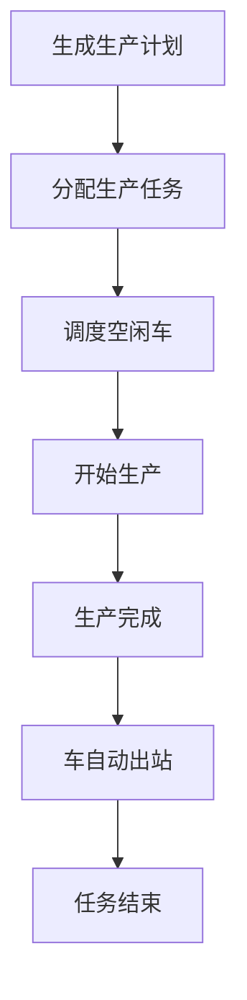
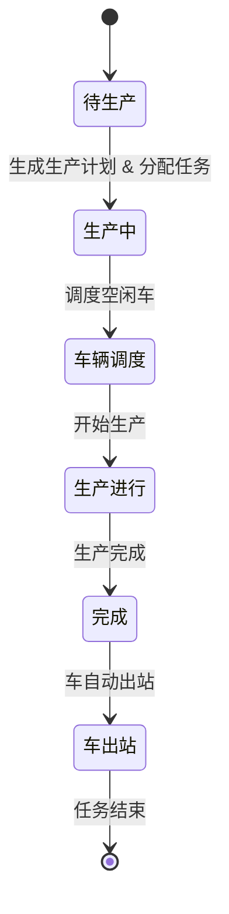

# 自我介绍

您好，我叫刘玉娟，目前做测试已有八年。在过去的工作中，主要负责有：业务测试、自动化测试、以及性能压测。
   - **业务测试方面：** 擅长拆解复杂需求，并从业务逻辑底层，去梳理数据流。确保测试用例的**完整性与高覆盖率**。同时能够高效完成从需求宣讲到上线发布的整个流程。

   - **自动化测试方面：** 通常使用 **Java 、 TestNG、 RestAssured** 从零搭建自动化测试框架。并完成自动化编码。之前的项目中通常把功能测试完成后，同步将核心链路实现接口自动化，提高回归效率。

   - **接口性能方面  ：** 使用 JMeter模拟真实负载场景，识别接口性能瓶颈，通过 SQL 查询分析和 系统资源监控工具，来定位潜在问题，并输出性能测试报告和优化建议。

   - 总的来说，从最开始的环境搭建、业务需求深度拆解，到中后期的自动化提效和性能调优，都能独立完成，以上就是我的个人经历，谢谢！

     

## 针对自我介绍相关面试题目

### **面试问题**：你提到擅长从底层梳理数据流，能结合具体项目说说你是如何确保复杂需求的测试覆盖率吗？

**回答思路**：面对复杂需求，我通过会从以下几个方面入手，

1. 首先：我会将大需求拆解为可测试模块，确保每个模块都得到清晰明确的定义。例如：tps生产管理系统中，生产任务的生成、分配、和状态更新是几个不同的功能模块，我会逐一分析每个模块的需求，确保每个模块的功能都通过测试覆盖。

2. 在需求拆解后，我会绘制业务流程图、状态迁移图、数据流转图。通过这些图表帮助我理清各模块之间的交互和数据流转。例如：在任务更新时，我会确保状态变更和数据同步是否正常，是否影响其他模块的数据一致性。

3. 然后，我会根据这些分析设计测试用例框架，确保覆盖正常场景、异常场景和跨模块场景。最后我使用判定表处理复杂的组合场景，利用边界值等价类验证数据输入的合法性，并通过错误推断法设计一些极端异常场景。

   总结：通过需求细化为可测功能点，结合用例框架设计和测试方法的应用，确保测试的高覆盖率和完整性，最大程度的发现潜在问题。


## 面试题

### **1. 业务功能测试（核心：逻辑与方法论）**

#### **高频题：** 给一个场景（如：微信发红包、电商购物车），你会怎么设计用例？

**回答思路**：

“针对微信发红包，我会采用 **‘界面-功能-异常-非功能’** 的思维模型来拆解：”

1. UI界面和易用性：红包样式是否符合规范，金额输入框是否有提示。
2. 正常功能流程：确保红包正常设置的金额、个数、留言可以成功发送，支持时，余额扣款成功，领取后金额入账，零钱明细更新。
3. 边界值与异常处理：测试最小金额和最大金额，余额不足时系统提示，红包过期自动退回。
4. 网络性：弱网或者断网，红包不重复发送，支付不失败，中断（比如接电话）后，红包可以正常发出，不重复扣款。
5. 性能与并发：高并发的场景下，群红包系统稳定，避免重复领取，确保多人抢红包不卡顿。
6. 安全性：支付需要密码等、确保发出和领取金额一致，退款金额正常退回。

#### **深度题：** 需求文档不完善或者没有文档时，你怎么保证测试的完整性？

**回答思路**：可以按照以下几点：

1. 与团队沟通：主动和产品经理、开发及相关人员沟通，了解核心需求和功能，确保对需求有清晰的理解。
2. 基于现有功能推导测试场景：通过现有功能和用户流程，推导出可测试的场景，特别是边界值和异常场景，同时绘制简单的业务流程图和状态图，帮助发现和补充测试遗漏。
3. 与开发合作：与开发一起确认关键功能，设计核心测试用例，确保主业务的逻辑。
4. 持续反馈和调整：在测试过程中不断发现需求和不明确的地方，及时反馈给团队，并调整测试内容。

####  面试题：如果你刚加入一个新项目，需求文档很不完善，且研发进度非常赶，你会如何制定测试计划？”

**回答思路**：

1. **需求梳理与对齐：** 需求文档不完善的情况下，根据现有的需求单，梳理出业务流程图，并与开发和产品进行对齐需求，确保测试覆盖面不遗漏。
2. **分解需求，评估时间：** 将大需 求拆分成可测试的小模块，针对每个子模块评估测试时间并制定测试计划。若每个小模块可以独立提测，可以帮助分摊测试工作量，减少整体测试压力。
3. **明确提测标准：** 即便时间紧迫，我也会确保有明确的提测标准，例如通过冒烟测试，确保基础功能的稳定性。这样可以提高提测效率，及时发现关键问题，减少后期的返工。      

#### **面试题：** 需求文档不完善或者没有文档时，如何制定测试计划？如何保证测试的完整性？

**回答思路：**

在需求文档不完善或者没有文档的情况下，制定测试计划并保证测试完整性需要灵活应对。以下是我会采取的步骤：

1. **与团队沟通与需求梳理：**

   - **主动沟通：** 与产品经理、开发团队及相关人员紧密沟通，确保对核心功能和需求有清晰的理解。通过讨论明确业务目标、功能优先级和系统需求，确保测试覆盖核心功能。
   - **梳理现有需求：** 即使文档不完善，也可以根据现有的需求单或口头说明，梳理出业务流程图和核心功能点，确保测试计划覆盖到最关键的部分，减少遗漏。

2. **分解需求，评估时间与制定计划：**

   - **拆分需求：** 将大需求拆分成可测试的小模块，每个小模块可以独立进行测试并提测，从而分摊工作量，减少整体测试压力。
   - **评估时间：** 根据每个小模块的复杂度和优先级，评估所需的测试时间，并合理安排测试资源和时间，确保重点模块和高风险功能优先测试。

3. **基于现有功能推导测试场景与设计用例：**

   - **推导测试场景：** 即使需求文档不完善，也可以通过现有功能和用户流程，推导出可测试的场景，特别关注边界值、异常场景和可能的错误路径。
   - **绘制业务图和状态图：** 利用业务流程图、状态迁移图等工具，帮助识别系统中关键的测试点和功能流转，确保没有漏掉任何关键场景。

4. **与开发评审并进行冒烟测试：**

   - **评审核心功能：** 与开发团队评审核心功能，确保主业务逻辑得到充分验证。通过与开发的沟通，明确哪些功能最为关键，哪些是高风险区域。
   - **冒烟测试：** 即使文档不完整，也会进行冒烟测试，确保基础功能的稳定性，及时发现问题，避免后期返工。

5. **持续反馈与灵活调整：**

   - **反馈与调整：** 在测试过程中，持续与团队沟通，及时发现需求中的不明确部分或遗漏点，并反馈给开发和产品。根据反馈及时调整测试计划，确保测试的完整性。
   - **根据项目进展调整优先级：** 随着需求进一步明确和项目进展，灵活调整测试的优先级和时间安排，确保最重要的功能和场景始终得到测试。

   **总结：**在需求文档不完善或没有文档的情况下，制定测试计划和保证测试的完整性需要依靠团队合作、需求梳理、场景推导和灵活调整测试策略。通过与开发团队的评审、明确核心功能、推导测试场景和持续反馈，可以确保在有限的时间内，全面覆盖关键业务逻辑和高风险功能。

#### **场景题：** 线上出现一个偶发性 Bug，你如何排查定位？

**回答思路：**

面对偶发性 Bug 的排查定位，我会采用以下步骤：

1. **确认 Bug 的复现步骤：**

   - 首先，通过获取详细的 Bug 描述和用户反馈，确认 Bug 的复现步骤。可能需要与用户或其他团队成员沟通，了解 Bug 发生的具体场景和条件。
   - 确保你了解触发 Bug 的准确步骤，包括操作顺序、输入数据、用户状态等，避免误解或遗漏关键条件。

2. **画业务流程图：**

   - 根据 Bug 出现的模块，绘制业务流程图，明确每个环节的输入、处理和输出流程。通过图示化来找出正常流程和异常流程的区别，理解问题发生的关键节点。

3. **绘制数据流图与状态迁移图：**

   - **数据流图：** 跟踪问题发生时的数据流，查看输入数据如何经过各个模块，最终影响输出。对比异常数据流和正常数据流，找出问题的根本原因。
   - **状态迁移图：** 绘制系统状态变化图，查看 Bug 发生时，系统状态是否发生异常。例如，登录状态、支付状态等，确保状态转换逻辑正确。

4. **对比正常与异常数据流：**

   - 分析 Bug 出现时的数据流和正常数据流的差异，识别导致问题的具体环节。通过日志、数据库记录等手段获取详细输入输出数据，进行对比。

5. **分析潜在的缺陷场景：**

   - 通过数据流和状态图，分析哪些操作、条件或输入会导致 Bug 的发生。特别是偶发性 Bug，通常受特定的操作顺序、外部环境或数据输入影响。
   - 通过复现步骤、条件验证和场景分析，逐步定位潜在问题的根源。

6. **通过日志和监控工具进一步排查：**

   - 检查相关日志，寻找异常记录或错误栈信息，帮助定位出现问题的代码行或模块。
   - 使用线上监控工具（如 APM、日志聚合工具）查看异常发生的具体时间和用户行为，进一步确认异常的根源。

7. **验证修复与回归测试：**

   - 在定位并修复问题后，进行修复验证，确保 Bug 已解决。同时进行回归测试，确保其他功能没有受影响。

   **总结：**

   面对偶发性 Bug 的排查，我会首先确认准确的复现步骤，然后通过业务流程图、数据流图和状态迁移图来分析问题。对比正常和异常数据流，分析差异并找出潜在的缺陷场景，最后通过日志和监控工具进一步验证。在定位问题的同时，也会进行修复验证和回归测试，确保问题彻底解决。

#### 面试题：以你做过的一个项目为例，拆解一下它的数据流？

**回答思路：**

- 在 TPS 系统里，最核心的数据流就是混凝土订单的生命周期，它不是简单的增删改查，而是涉及到销售、技术、生产、物资四个部门的联动。我当时梳理这段数据流，主要是为了解决跨模块数据不一致的问题。具体的方法上，我会借助思维导图进行‘纵横结合’的拆解：纵向梳理订单从下单到结算的全生命周期状态机，标注出每个节点底层的数据库变更和 HTTP 状态码；横向通过导图拉出接口间的依赖网，比如生产接口如何实时调用技术配比和物资库存。最后我还会逆向从结算账单往回推演，看数据在流转中是否存在精度丢失。通过这种方式，我把复杂的业务逻辑拆解成了清晰的测试维度，并据此设计了覆盖全链路的接口用例库。

#### 面试题：能不能分享一个你发现的‘最有成就感’或者‘隐藏极深’的 Bug？你是怎么抓到它的？

**回答思路：**

- 我负责的 **TPS 生产管理系统**中，有一个最核心点：**生产混凝土型号绝不能错。** 比如合同要求 C30 标号，如果下发了 C25，那就是严重的工程事故。模拟了技术部‘多次修改配方型号’的场景。我发现虽然前端显示的最新型号是对的，但当我通过 **SQL 关联查询**发现数据库还是旧的数据。后来我拉着开发复现发现，是因为系统用了 **异步写入和缓存机制**。前端为了快，直接读的是缓存，所以看着是对的；但后端在写数据库时遇到了并发冲突，发生了**‘后发先至’**的情况——最后一次更新因为网络波动慢了一点，结果被前一次的操作给覆盖掉了。这个 Bug 让我挺有成就感的，因为如果只看 UI 自动化或者肉眼点点点，根本发现不了。要是这数据下发到生产线，那就是严重的工程质量事故了。

  

### **2. 自动化测试（核心：框架与实战价值）**

#### 接口自动化流程怎么回答？（框架层面）

**面试回答标准版：**

> 我是基于 Java + TestNG + RestAssured 搭建的。
>  整体流程是：
>  首先用 YAML 文件管理测试用例，实现数据和代码分离；
>  通过 SnakeYAML 解析为 CaseInfo 对象；
>  再结合 TestNG 的 DataProvider 实现数据驱动和参数化；
>  使用 RestAssured 发送接口请求；
>  通过占位符机制和全局存储处理接口依赖，比如 token 传递；
>  然后做响应断言和数据库断言；
>  最后通过 Allure 生成报告，并接入 Jenkins 实现持续集成。
>
> 整体上是数据驱动 + 分层设计 + 动态参数流转的架构。

------

#### 接口自动化步骤怎么回答？（单接口执行层面）

**面试回答标准版：**

> 单条接口执行步骤是这样的：
>  第一步读取 YAML 测试数据；
>  第二步做参数化替换；
>  第三步做前置处理，比如前置 SQL 查询；
>  第四步使用 RestAssured 发起请求；
>  第五步做响应断言；
>  第六步做数据库断言；
>  第七步汇总断言结果，输出最终测试结果。
>
> 

30秒精简版本（高频快答）

> 接口自动化流程是：用 YAML 管理用例 → 数据驱动 → 发请求 → 断言 → 报告 → 持续集成。
>  单条接口步骤是：读取数据 → 参数替换    → 发请求 → 响应断言 → 数据库断言 → 最终校验。

#### 接口自动化的整体流程是怎样的？

**回答思路：**

我搭建的接口自动化框架基于 **Java + TestNG + RestAssured**，整体流程如下：

1. **用例管理：**
    测试用例通过 **YAML 文件** 管理，包含请求方式、URL、请求参数、期望结果、SQL 校验等信息，这样有助于集中管理和灵活扩展测试用例。

2. **数据驱动：**
    使用 **SnakeYAML** 解析 **YAML 文件**，将测试数据映射为 **CaseInfo** 对象，并通过 **TestNG 的 `@DataProvider`** 实现数据驱动，将不同的测试数据提供给 **`@Test`** 方法执行。

3. **请求发送与参数化：**
    使用 **RestAssured** 发送接口请求，接口参数（如请求头、请求体）从 **YAML 文件** 中获取，且通过 **占位符替换** 动态填充测试数据，确保测试的可复用性。

   **接口依赖：**
    通过 **全局存储** 处理接口间依赖（例如 token），确保上一个接口的响应数据能在后续请求中传递使用。

4. **断言：**

   - **响应断言：** 使用 **JsonPath** 校验接口返回的字段是否符合预期。
   - **数据库断言：** 通过 SQL 查询验证数据库中的数据变化，确保接口操作正确地影响数据库。
   - **业务逻辑断言：** 验证接口返回的数据是否符合业务逻辑需求。

5. **报告生成：**
    使用 **Allure** 生成测试报告，记录每个测试用例的执行结果，帮助团队快速定位问题。

6. **持续集成：**
    接入 **Jenkins**，实现接口自动化测试的定时构建和自动执行，确保每次代码提交都能触发自动化测试，并通过邮件通知相关人员。

**总结：**

整个流程通过 **数据驱动**、**分层设计** 和 **动态参数传递** 提高了框架的灵活性、可维护性与稳定性，确保了接口自动化测试的高效性，并且实现了自动化测试的持续集成，保证每次变更都能及时验证。

------

**简短回答：**

接口自动化框架通过 **YAML 文件** 管理测试用例，使用 **TestNG** 的 `@DataProvider` 实现数据驱动。利用 **RestAssured** 发送请求，动态替换接口参数，通过 **JsonPath** 校验响应内容和 SQL 校验数据库变化。通过 **Allure** 生成报告，**Jenkins** 定时执行，实现自动化测试的持续集成。

#### Testng参数化的方式？

1. testng.xml方式，通过在xml文件中配置parameter标签，定义参数名额和属性值，在Java代码中给测试方法通过@parameters注解传递进来，方法形参进行接收.
2. dataprovider方式，@DataProvider注解标记数据提供方法，返回Object[][]类型二维数组。在测试方法@test注解中增加dataProvider属性引用数据提供源方法

#### **你是怎么做断言设计的？**

**回答：**
 我在断言设计上遵循了 **响应断言**、**数据库断言** 和 **业务逻辑断言** 的分层设计。具体做法如下：

- **响应断言**：使用 **JsonPath** 校验接口返回的字段（如状态码、消息、返回数据等），确保接口响应的正确性。
- **数据库断言**：接口执行前后，通过 SQL 查询验证数据库数据的变化，确保接口操作正确影响数据库。
- **业务逻辑断言**：根据接口的业务需求，验证返回数据是否符合预期的业务规则。

此外，我还会封装常见的断言逻辑，保持代码的可复用性和可维护性。核心目标是避免“假通过”的自动化测试，保证接口成功 == 数据正确 == 业务正确。

#### **怎么解决接口依赖？**

**回答：**
 在接口之间存在依赖关系（例如，先登录才能下单）的情况下，我通过 **全局存储** 来解决。比如在登录后获取到的 **token**，会存储在 **ParamsData** 中，并通过动态传递的方式在后续接口调用中使用，保证接口间的顺畅数据流转。这样能避免硬编码和增强接口的可复用性。

#### 怎么处理异步问题？

**回答：**
 异步问题通常出现在接口执行后，数据库或响应数据需要一定时间才能完全更新的场景。为了避免断言时数据未完全同步的问题，我通常会：

- **使用延迟和重试机制**：通过设置适当的等待时间或者进行多次重试，确保数据同步后再进行断言。
- **异步检查**：（在一段时间内，反复检查数据库，直到满足断言条件。）例如，在接口请求完成后，通过间隔时间再次查询数据库，确认数据是否已更新，保证断言时数据的准确性。

#### **数据怎么驱动？**

**回答：**
 在我的框架中，数据驱动是通过 **YAML 文件** 完成的。测试用例和参数都存储在 **YAML 文件** 中，通过 **SnakeYAML** 解析，将每个测试用例的字段映射到 **CaseInfo** 对象，再通过 **TestNG 的 `@DataProvider`** 注解实现数据驱动。每次执行时，TestNG 会从 **YAML 文件** 读取不同的数据集并执行相同的测试逻辑，确保测试的高效性和灵活性。

#### **框架是分层的吗？**

**回答：**
 是的，我的框架采用了 **分层设计**，主要分为以下几层：

1. **用例管理层**：通过 **YAML 文件** 管理所有测试用例，确保可扩展性和可维护性。
2. **数据层**：通过 **ParamsData** 和 **ResponseData** 类来存储和传递动态的测试数据（如 token、用户信息等），确保接口间的依赖关系得以顺利处理。
3. **请求发送层**：使用 **RestAssured** 进行接口请求，并结合 **占位符替换** 和 **数据驱动** 的方式灵活传递参数。
4. **断言层**：响应断言、数据库断言和业务逻辑断言分别由不同的工具类（如 **ResponseAssert**、**DatabaseAssert**）封装，确保测试的准确性和高效性。
5. **报告层**：使用 **Allure** 插件生成测试报告，清晰展示测试结果和执行过程，帮助开发人员和测试人员快速定位问题。
6. **持续集成层**：通过 **Jenkins** 实现定时构建和自动化测试，保证测试过程的持续性和自动化。

#### **代码题：** Java 基础String、List、Map 的区别?

**回答思路：**

1. String：不可变的字符。一旦创建，内容不可更改。每次对 String 的修改（如拼接、替换）实际上都是在内存中创建了一个新的 String 对象。 适用于存储配置信息、URL等文本。

2. List：有序的可重复集合。 元素有先后顺序，允许存储重复值，可以通过索引（Index）直接访问。测试场景应用：存储接口返回的列表数据。比如你用 RestAssured 获取用户列表，通常会解析成一个 `List<User>`，方便遍历校验。

3. Map：存储 Key-Value 键值对的集合。 Key 不允许重复，Value 可以重复。通过 Key 快速查找 Value。**测试场景应用：** 用 **Map** 来封装请求头（Headers）因为 Key-Value 结构非常贴合 JSON。

#### **面试题：** **TestNG 中常用的注解有哪些？它们的作用是什么？**

**回答思路：**

1. **`@Test`** 用于标记测试方法。TestNG 会执行被 `@Test` 注解标记的方法。

2. **`@Before\*` 和 `@After\*`** 用于在测试前后执行初始化和清理工作，分别在不同的级别（如套件、标签、类方法）上生效。

   ```
   @Before注解 的顺序是：
   @BeforeSuite → @BeforeTest → @BeforeClass → @BeforeMethod
   @After 注解 的顺序是：
   @AfterMethod → @AfterClass → @AfterTest → @AfterSuite
   @Test 方法 执行在 @BeforeMethod 和 @AfterMethod 之间，每个测试方法都会触发一对 @BeforeMethod 和 @AfterMethod 执行。
   ```

3. `@Parameters` 用于 **从 `testng.xml` 配置文件** 中传递参数到测试方法。它适用于从外部传入数据，并将这些数据传递给测试方法进行执行。

4. `@DataProvider` 是 **TestNG 的数据驱动功能**，用于为测试方法提供多组数据。每次测试方法调用时，TestNG 会传递 **不同的数据集** 来执行该方法。

#### **框架题：** 你搭建的框架里，数据是怎么驱动的？（Excel、YAML ？）

**回答思路：**整个数据驱动过程包括以下几个步骤：

1. **数据来源**：我们使用 **YAML 文件** 作为数据源。YAML 文件存储了不同的测试用例，每个测试用例包括请求类型、接口路径、请求参数、期望结果、SQL 校验等信息。

2. **数据解析：**使用 **SnakeYAML** 解析 YAML 文件，将其转化为 `Map<String, Object>`。每个测试用例的字段会作为一个 `Map` 存储，这些 `Map` 数据代表了每个测试用例的信息。

   ```
   {
     testCases=[
       {
         caseId=1,
         interfaceName=Login API,
         caseDesc=Test login functionality,
         type=POST,
         url=/login,
         params={"username": "test", "password": "password"},
         expectedResult={"status": "success", "code": 200}
       },
       {
         caseId=2,
         interfaceName=Register API,
         caseDesc=Test user registration,
         type=POST,
         url=/register,
         params={"username": "newuser", "password": "newpassword"},
         expectedResult={"status": "success", "code": 201}
       }
     ]
   }
   ```

   

3. **数据映射**：将 `Map<String, Object>` 中的数据转换为 `CaseInfo` 对象。通过 get 和 set 方法将从 `Map` 中获取的值设置到 `CaseInfo` 对象的属性中。

4. **数据驱动测试**：使用 **TestNG** 的 **`@DataProvider`** 注解提供数据，供 **`@Test`** 方法使用。

#### **痛点题：** 自动化测试最难的是什么？

**回答思路：**

**我认为自动化测试最难的不是写脚本，而是保证它长期稳定且断言准确。**

·第一，断言设计最难。接口自动化不是简单校验状态码，而是要结合业务逻辑，比如下单成功不仅要返回200，还要校验数据库数据是否正确、库存是否扣减等。如果断言设计不严谨，很容易出现“假通过”。

第二，异常同步问题。很多系统是异步架构，请求成功后数据库或缓存可能延迟更新，如果立刻做断言就会失败，这会导致自动化不稳定。

所以我觉得，自动化真正的难点在于——**既要断言精准，又要保证执行稳定**。

#### **实战题：** 接口依赖（比如下单需要先登录）你在框架里是怎么处理的？

**回答思路：**对于接口依赖的问题，比如下单需要先登录，我在框架里主要通过“动态数据传递”来解决。

第一，登录接口执行后，我会把返回的 token 通过 JSONPath 提取出来，存储到一个全局数据存储类里（比如 Map 或 ThreadLocal）。

第二，后续接口在发送请求前，会从数据存储类中读取 token，自动加入到请求头中。这样接口之间就实现了数据流转，而不是强依赖执行顺序。

如果是强业务依赖场景（比如必须先创建用户再下单），我会把前置接口封装成公共方法，或者通过 @BeforeMethod 统一处理前置逻辑。

#### get、post这两种请求方法？

Get方式：(1)传递参数直接拼接在url上(2)数据拼接在url上,由于url的长度是有限制导致传递的参数数据量是有限的(3)安全性不如post强,但是执行效率要快于post

Post：(1)传递参数放在请求体，而不会拼接在url(2)提交的数据量不受限制(3)相对于get要安全，但是post的执行效率不如get。

### **3. 性能测试（核心：瓶颈定位与分析）**

#### **基础题：** 压测中的吞吐量（TPS）、并发用户数、响应时间（RT）是什么关系？

标准回答（30秒）

> TPS 是系统每秒处理的请求数，并发数是同时在线的请求数，RT 是单个请求的响应时间。
>  它们的关系是：
>  TPS ≈ 并发数 ÷ 平均响应时间。
>
> 在系统未达到瓶颈前，提高并发会提升 TPS，但当资源耗尽时，RT 会变长，TPS 会进入平台期甚至下降。
> 在性能测试中，我们通常通过逐步加压，观察 TPS 是否稳定增长，以及 RT 是否线性增长，从而判断系统容量和性能拐点。

#### **工具题：** JMeter 脚本怎么做参数化？怎么关联接口？

> JMeter 参数化一般使用 CSV Data Set Config，通过变量替换实现不同线程使用不同数据。
>  接口关联则通过 JSON Extractor 提取上一个接口的返回数据，在下一个接口中引用，实现数据传递。
>
> 参数化解决数据唯一性问题，关联解决接口依赖问题。

#### **深度题（你提到的）：** 发现 CPU 飙升或者 SQL 执行慢，你具体的排查步骤是什么？（看慢查询日志、分析执行计划等）。

> 我一般会先通过监控判断瓶颈层级，然后如果是数据库问题，会查看慢查询日志和执行计划，确认是否走索引或存在全表扫描；如果是应用层问题，会通过 jstack、jstat 分析线程和 GC 情况，最终定位到具体代码或 SQL 进行优化。
>
> 排查性能问题的核心思路是：定位瓶颈层级 → 分析资源占用 → 查找具体耗时点 → 验证优化效果。


### **4. 数据库/SQL（核心：复杂查询与优化）**

#### **操作题：** 多表联查（`JOIN`）、分组统计（`GROUP BY` + `HAVING`）？

#### 原理题：数据库索引是什么？为什么要用索引？（为了查得快）。

**答案：**
 数据库索引是为了加速查询的结构。通过索引，数据库能够快速地定位到需要的数据，从而避免了全表扫描，提高了查询效率。

1. **索引是什么？**
   - 索引是数据库表中的一种数据结构，它根据一定规则（如 B 树、哈希表等）对数据进行排序并存储。
   - 在执行查询时，数据库能够通过索引快速找到符合条件的记录，而不需要全表扫描。
2. **为什么要用索引？**
   - **加速查询**：当查询数据量较大时，使用索引可以大大提高查询速度。
   - **减少磁盘 I/O 操作**：索引减少了全表扫描的需要，从而减少了对磁盘的访问次数。
3. **注意事项**：
   - **索引会增加数据的插入、删除和更新的开销**：因为在插入、更新、删除数据时，索引也需要维护。
   - **不适合小表**：对于数据量较小的表，使用索引可能不会提高性能，反而会增加系统开销。

#### 场景题：性能压测发现数据库死锁了，你会怎么看？

**答案：**
 数据库死锁通常发生在两个或多个进程相互持有锁并等待对方释放锁时。死锁会导致系统性能下降，甚至崩溃。对于死锁的排查，通常会按照以下步骤进行：

1. **检查数据库死锁日志**：

   - MySQL 会记录死锁信息，可以使用以下命令查看死锁日志：

   ```
   SHOW ENGINE INNODB STATUS;
   ```

   该命令会返回当前 InnoDB 存储引擎的状态信息，其中包括死锁的详细信息。

2. **查看死锁的 SQL 语句**：

   - 死锁日志中会显示发生死锁的具体 SQL 语句及相关的事务。

3. **查看锁等待情况**：

   - 通过 `SHOW FULL PROCESSLIST;` 查看当前的查询进程，识别哪些查询可能在等待锁。

4. **优化数据库查询**：

   - 对于引起死锁的查询，考虑优化查询，减少长时间持有锁的情况。
   - 可以通过修改 SQL 语句的顺序、减少事务大小等方法来避免死锁。

5. **使用事务隔离级别**：

   - 可以调整事务的隔离级别，例如使用 `READ COMMITTED` 或 `READ UNCOMMITTED` 来减少死锁的可能性。

#### **多表联查？（JOIN）**

多表联查是数据库中常见的操作，主要用于连接不同的表来获取更加丰富的数据。`JOIN` 可以分为几种类型：

- **INNER JOIN**：返回两个表中匹配的记录。
- **LEFT JOIN**：返回左表的所有记录，以及右表中匹配的记录，如果右表没有匹配的记录，则结果中会显示为 `NULL`。
- **RIGHT JOIN**：返回右表的所有记录，以及左表中匹配的记录，如果左表没有匹配的记录，则结果中会显示为 `NULL`。

#### **分组统计?（GROUP BY + HAVING）**

`GROUP BY` 用于对查询结果进行分组，`HAVING` 用于过滤分组后的结果。常见的用法是对分组结果进行聚合操作（如求和、平均数等）。

#### jmeter支持最大并发量多少? 

JMeter 的最大并发量并没有硬性限制，受限于硬件资源、JVM 配置和目标服务器的能力。通常，单台机器支持的并发量在 **500-1000** 线程之间。通过分布式测试，JMeter 可以支持数万甚至更多的并发请求。

#### 在线用户数和并发用户数的区别?

举例：

- **在线用户数**：假设一个视频直播平台，实时观看直播的用户数是 2000 个。这表示目前有 2000 个用户正在观看视频并与平台交互。

- **并发用户数**：如果同一平台在一个时间点上有 500 个用户同时发起请求查看不同的视频，500 个就是并发用户数。这表示在同一时刻，系统需要处理 500 个用户的并发请求。

- **在线用户数** 强调的是用户是否处于系统中，并不要求同时进行请求。

  **并发用户数** 强调的是在同一时刻发起请求的用户数量，它直接影响系统的性能和负载测试。

------

### **5. 接口测试（新增：底层逻辑 & 安全）**

> **这是 8 年经验最常问的，因为它是自动化和性能的基础。**

#### **协议题：** HTTP 与 HTTPS 的区别？GET 和 POST 的区别？

> HTTP 是明文传输协议，而 HTTPS 是在 HTTP 基础上增加了 SSL/TLS 加密层，保证数据传输的安全性。
>
> HTTPS 多了一步：
>
>  1️⃣ 客户端请求服务器
>  2️⃣ 服务器返回数字证书
>  3️⃣ 客户端验证证书
>  4️⃣ 使用对称加密建立安全通道
>  5️⃣ 后续数据加密传输

#### **状态码（你记过的）：** $401$、$403$、$502$、$504$ 代表什么业务故障？

#### **安全题：** 接口如何防篡改？（签名 Sign、加密 Token）。

### **6. Linux & 环境运维（新增：独立解决问题能力）**

> **对应你说的“环境搭建”和“系统资源监控”。**

#### **命令题：** 如何查看实时日志？如何查某个进程？

```
tail -f tuling-admin-dev.log 
ps -ef | grep /var/www/html/tuling-admin-dev.jar
```

#### **资源题：** 在 Linux 里怎么看 CPU 和内存使用率？

> （`top` 或 `free -m`）。

#### 网络题： 怎么查看端口是否通畅？

> （`telnet` 或 `netstat`）。

#### 命令题：linux的常用命令？

> 常用 Linux 命令包括进程查看（ps）、端口排查（netstat/ss）、日志查看（tail/grep）、文件查找（find）、磁盘查看（df/du）、服务管理（systemctl）、进程终止（kill）等，主要用于系统排查和环境维护。

```
查看文件
cat file.txt
less file.txt
tail -f app.log
查找文件
find / -name "a.txt"
find /root -user lyj
查看目录大小
du -sh *
df -h
查看进程
ps -ef | grep java
ss -lntp
杀进程
kill -9 12345
日志排查
tail -n 100 app.log
tail -f app.log
grep "ERROR" app.log
tail -f app.log | grep ERROR
服务管理
systemctl start nginx
systemctl stop nginx
systemctl restart nginx
systemctl status nginx
网络排查
ping www.baidu.com
curl http://localhost:8080
telnet 127.0.0.1 3306
权限管理
chmod 755 file.sh
chown user:user file.txt
环境变量
vim /etc/profile
source /etc/profile
echo $JAVA_HOME
```


### **7. 测试管理与流程（新增：8 年经验的“段位”）**

- **流程题：** 整个测试生命周期（STLC）包括哪些阶段？
- **冲突题：** 开发不认为那是 Bug，你怎么办？
- **进度题：** 如果项目马上要上线了，但还有 20% 没测完，你如何决策？（风险评估、核心链路验证）。
- **复盘题：** 线上漏测了 Bug，你会从哪些维度去总结优化？

#### 接到需求到上线，你平时是怎么开展工作的？或者简单介绍一下测试流程？

#### **关于测试流程，分为以下六步：**

**第一步：需求宣讲与对齐** 需求宣讲的时候，我会用思维导图快速梳理业务逻辑。如果发现哪里逻辑不通或者有疑问，我会**当场提出来跟产品对齐**。确保在开发之前对需求的理解是完全一致。

**第二步：测试计划与评估** 需求定稿之后，我会根据拆解的功能点来**预估测试工作量**，然后结合项目的上线时间，输出合理的测试计划。

**第三步：用例设计与评审（这是最关键的一步）** 我会根据需求先画出**业务流程图**和**状态迁移图**；如果涉及跨模块的复杂逻辑，我还会加一张**数据流转图**，确保没有逻辑盲区。 有了图，我写用例时会分两步走：

- **先定框架：** 覆盖所有的正常路径、异常分支和跨模块的场景。
- **再填细节：** 用**判定表**去拆复杂组合逻辑，用**边界值/等价类**去定具体的输入值，最后用**错误推测法**补一些极端的坑。 **最后是评审：** 我会先给大家演示我画的图，让开发和产品在**大逻辑**上达成共识，再去过具体用例。这样评审效率最高，也能确保大家对业务边界的理解是一致的。

**第四步：提测与冒烟测试** 开发提测后，我会第一时间跑**核心主链路**。如果主流程都不通，我会**直接把版本打回去**，让开发修好再提。这样可以把大问题挡在前面，避免后面产生一堆没意义的 Bug，也能省下很多沟通成本。

**第五步：正式测试与回归（手动+自动）** 冒烟通过后，我会开始全量测用例。在执行的时候，我不仅看页面，还会**重点看接口状态码（200、4xx、5xx）和底层数据库是不是一致的**。

- **Bug：** 我会通过抓包精准定位问题，及时分级提交并跟踪，确保每个 Bug 都能**真正闭环**。
-  **回归：** 等逻辑稳了，我会用 **Java 写核心链路的自动化接口脚本**。这样回归的时候，主业务交给脚本跑，我手动去测**变动点周边的逻辑**，保证修了旧 Bug 不会带出新 Bug。

**第六步：测试报告与线上保障** Bug 全闭环、回归通过后，我会出一份测试报告。除了统计 Bug，我还会分析**哪些地方没测到（覆盖率）以及还有哪些小风险**，给上线提供参考。 上线后，我会配合检查环境配置和数据库脚本执行。我还会**重点追踪线上真实用户产生的第一批业务流水**，确保流转正常、没有脏数据。只有线上稳了，我的工作才算真正闭环。

**测试流程回答版本2：**

#### 1. 需求宣讲与对齐

通过思维导图梳理业务逻辑，与产品、开发对齐需求，确保理解一致。

#### 2. 测试计划与评估

根据需求拆解功能点，评估测试工作量，并制定合理的测试计划。

#### 3. 用例设计与评审

绘制业务流程图、状态迁移图、数据流转图；设计测试用例并进行评审，确保全员对业务理解一致。

#### 4. 提测与冒烟测试

开发提测后，先进行核心主链路的冒烟测试，确保主流程正常后再进行全量测试。

#### 5. 正式测试与回归（手动+自动）

全面执行测试用例，结合自动化接口脚本做回归，确保稳定性与质量。

#### 6. 测试报告与线上保障

Bug 闭环后，生成测试报告并分析覆盖率和风险；上线后持续追踪线上用户的流水，确保系统稳定。

### 示例解释：业务流程图、状态迁移图、数据流转图

**业务流程图**



​    


**状态迁移图**：



数据流转图


#   

### 8.零散面试题

#### 1.简单介绍一下最近做过的项目？ 

**回答示例：**

我最近参与的项目是一个 **生产管理系统**，该系统用于高效管理生产过程中的各个环节，包括销售、生产、物资和技术等模块.我的主要工作集中在 **接口自动化测试** 和 **性能测试** 上。

在接口自动化测试方面，我搭建了基于 **Java + TestNG + RestAssured** 的自动化测试框架，使用 **YAML 格式** 管理测试用例，并通过 **DataProvider** 实现数据驱动，使用 **JsonPath** 来校验接口返回的字段是否符合预期，并结合 **SQL断言** 确保接口操作对数据库的影响是准确的。

在性能测试方面，系统由于数据量较大，尤其是月度集中结算时会出现卡顿。我们通过慢查询日志和执行计划分析发现，结算过程涉及大表扫描和聚合计算。针对这种情况，我们配合开发优化了部分结算逻辑，包括引入分批处理和优化统计方式，避免一次性处理全部数据。同时，我们将结算操作改为后台执行，确保前端用户不受影响，页面不再卡死或等待，从而明显改善了系统的响应时间。
在接口自动化测试中，我们通过高效的框架提升了测试覆盖率和准确性，确保了接口在不同条件下的稳定性。在性能测试方面，优化了系统的结算流程和数据处理方式，有效避免了高并发下的性能瓶颈，提升了系统的响应速度和用户体验。


#### 性能调优：生产管理系统月度结算如何优化？

- **场景（Situation）**：系统在每月月初进行“资助提供商结算（Funding Provider Settlement）”时，由于需要聚合 `dm_t_bt_fnd_funding_provider` 等多张大表的数据，导致数据库 CPU 飙升至 90% 以上。

- **问题（Task）**：前端用户点击“结算”后，页面长时间转圈，最终返回 **HTTP 504 Gateway Timeout**。

- **目标**：通过慢查询定位和执行计划分析，彻底优化结算性能。

- **慢查询定位的思路?**

  慢查询是导致数据库性能瓶颈的主要原因之一。在本场景中，数据库的 **CPU 飙升至 90% 以上**，这表明查询处理时间可能过长。通过 **慢查询日志** 和 **执行计划分析** 来识别性能瓶颈是一个常见且有效的优化手段。

- **为什么使用慢查询日志定位问题？**

  慢查询日志可以帮助我们找到运行时间过长的查询，这些查询是性能瓶颈的直接来源。

  可以让我们聚焦于特定的查询，而不是系统中所有的操作。

  分析慢查询的执行计划，了解查询中的索引使用情况、扫描的数据量、排序方式等，从而得出优化方案。


##### 第一步：启用和查看慢查询日志

首先，确保数据库启用了慢查询日志，并设置合理的查询时间阈值。

```
-- 1. 查看当前配置
-- 注释：这是排查的第一步。如果结果不是 ON，说明系统根本没在记录慢 SQL，就像监控摄像头没开一样。
-- 在混凝土系统中，如果结算卡顿但这里是 OFF，必须先执行 SET GLOBAL slow_query_log = 'ON';
SHOW VARIABLES LIKE 'slow_query_log'; 

-- 2. 查看当前的慢查询时间阈值
-- 注释：这是最容易被忽视的“坑”。默认 10 秒意味着 9.9 秒的 SQL 都不会被记录。
-- 实际场景：混凝土结算时，一个 SQL 跑 5 秒就会导致前端 App 接口超时（HTTP 504），
-- 如果保持 10 秒的设置，日志里永远抓不到这条导致卡顿的“元凶”。
SHOW VARIABLES LIKE 'long_query_time'; 

-- 3. 获取慢查询日志的文件名
-- 注释：确认文件名（如 ATHENA-slow.log），稍后我们需要去服务器的数据目录（datadir）下找它。
SHOW VARIABLES LIKE 'slow_query_log_file';
-- 通过 datadir 锁定数据库的数据根目录,找到慢查询日志的文件名
SHOW VARIABLES LIKE 'datadir';
-- 4. 核心实操：临时调低记录阈值
-- 注释：将阈值从 10 秒调低至 1 秒。
-- 目的：为了让那些“虽不至于崩溃但严重影响体验”的 2-3 秒的结算 SQL 能够现形。
-- 注意：SET GLOBAL 修改的是全局变量，对当前已经建立的连接不生效。
-- 建议：修改后，新开一个查询窗口执行，或者同时执行 SET SESSION long_query_time = 1.0; 确保当前窗口也生效。
SET GLOBAL long_query_time = 1.0;

```

##### 第二步：模拟/执行慢业务

去你的系统前端或后台，手动执行一次那个“卡顿”的结算功能。

##### 第三步：分析执行计划

登录服务器 SSH，进入刚才查到的路径，执行：

```
# 看看最后几行，是不是刚刚跑的慢 SQL 已经进来了
tail -n 100 /你的路径/ATHENA-slow.log
比如：
# Time: 2026-03-02T10:00:00.000000Z
# User@Host: root[root] @ localhost [127.0.0.1]
# Query_time: 15.234567  Lock_time: 0.000123 Rows_sent: 10  Rows_examined: 1500000
SELECT funding_provider_name FROM dm_t_bt_fnd_funding_provider WHERE is_deleted = 0;
```

- **分析重点**：看到 `Query_time: 15.2`（跑了15秒）和 `Rows_examined: 1500000`（扫描了150万行）了吗？这就是把 CPU 跑满的“通缉犯”。

- **执行计划诊断 (EXPLAIN) —— 核心环节**

  拿到 SQL 后，回到你的 MySQL 管理工具（如 Navicat 或 MySQL Workbench），在 SQL 前加上 `EXPLAIN`。

  ```
  比如：
  EXPLAIN SELECT funding_provider_name FROM dm_t_bt_fnd_funding_provider WHERE is_deleted = 0;
  ```

执行计划输出：

| id   | select_type | table                        | type | possible_keys | key  | key_len | ref  | rows    | Extra       |
| ---- | ----------- | ---------------------------- | ---- | ------------- | ---- | ------- | ---- | ------- | ----------- |
| 1    | SIMPLE      | dm_t_bt_fnd_funding_provider | ALL  | NULL          | NULL | NULL    | NULL | 1000000 | Using where |

解释：

1. **id**: 查询的标识符，通常为 `1` 表示最外层查询。这里是一个简单查询（`SIMPLE`）。

2. **select_type**: 查询的类型，`SIMPLE` 表示一个简单查询，没有子查询或联合查询。

3. **table**: 参与查询的表，`dm_t_bt_fnd_funding_provider`。

4. **type**: 访问类型，`ALL` 表示全表扫描，意味着数据库遍历了整个表来查找匹配的记录。如果 `type` 为 `ALL`，可以推测该查询没有使用索引，这可能会导致性能问题，特别是对于较大的表。

   **面试要点**：如果查询显示 `type` 为 `ALL`，应立即指出：**"我发现它在做全表扫描！"**

5. **possible_keys**: 查询可能使用的索引。如果该字段为 `NULL`，说明没有可用的索引来优化查询。

6. **key**: 实际使用的索引。如果该字段为 `NULL`，则表明查询没有使用任何索引。

7. **key_len**: 使用的索引的长度。如果 `key` 为 `NULL`，则该字段值也为 `NULL`。

8. **ref**: 显示索引的引用。如果没有使用索引，这将为空。

9. **rows**: 估算要扫描的行数。这个字段显示 MySQL 预计需要扫描的行数。值越大，查询的时间和资源消耗可能越高。在这个例子中，MySQL 预计需要扫描大约 **1000000** 行，意味着查询的效率可能非常低。

   **面试要点**：如果 `rows` 数字很大（例如几百万），可以说明 MySQL 可能遍历了整个表。

10. **Extra**: 额外信息，显示额外的执行细节。在此示例中，`Using where` 表示查询正在应用 `WHERE` 条件过滤数据。

    **面试要点**：如果看到 `Using temporary` 或 `Using filesort`，这表明数据库可能在执行排序时使用了临时表或外部排序，这也会消耗额外的 CPU 资源。

##### **核心：执行计划诊断**

1. **全表扫描**：如果查询 `type` 字段为 `ALL`，立刻指出：“我发现它在做全表扫描！”
2. **大量行数**：如果 `rows` 字段数值非常大，说明数据库遍历了大量行，可能导致性能问题。
3. **额外计算**：如果 `Extra` 字段包含 `Using temporary` 或 `Using filesort`，说明 CPU 正在进行大量的计算和排序。

##### 第四步：优化策略

根据慢查询分析的结果，我们可以进行以下优化：

1. **添加适当的索引**：根据执行计划分析，如果查询没有使用索引，或者使用的索引不合适，应该考虑为查询字段添加索引。比如，可以在 `is_deleted` 字段和其他经常查询的字段上创建索引，减少全表扫描。

2. **优化复杂查询**：如果查询涉及到多张大表的连接（JOIN），可以考虑：

   **分区表（Partitioning）**：将大表分割成多个较小的分区，以提高查询效率。

   **索引覆盖查询（Covering Index）**：创建包含所有查询字段的索引，避免回表操作。

   **避免子查询**：子查询可能导致性能下降，可以考虑将其改写为连接（JOIN）操作。

3.  **分批次处理结算任务**：如果结算的操作涉及大量数据处理，考虑将大批量的数据处理任务拆分成多个小批次，减少单次操作的压力。例如，每次处理一个月的数据而不是所有月份的结算。可以使用后台任务调度（如定时任务或队列）来完成。

4. **使用查询缓存（Query Cache）**：如果查询结果是静态的或者变化不频繁，可以考虑启用查询缓存，避免重复计算。

5. **性能监控与优化验证**

   **查询执行时间**：通过 `SHOW PROFILES` 命令监控查询的执行时间，并确保查询时间降低。**

   **系统负载**：通过系统的监控工具（如 `top`, `htop`, `iostat`）监控 CPU 和 IO 使用情况，确保数据库负载得到有效控制。

##### **总结：定位和优化月度结算的性能问题**

1. 启用并分析 **慢查询日志**。
2. 使用分析执行计划，找出瓶颈。
3. 根据分析结果进行 **索引优化、查询优化和配置优化**。
4. **分批处理** 数据结算，减少单次操作的压力。
5. 使用 **监控工具** 验证优化效果。

#### 2.一个身份证号码输入框，怎么设计用例？

>   我会从以下几个方面来设计身份证输入框的测试用例：
>
> **UI/交互**：确认输入框的基本行为是否符合预期，比如是否限制最大长度、是否只能输入数字、最后一位是否支持 X、是否有清晰的提示信息、是否支持隐藏显示等。
>
> **正向测试**：验证合法的 18 位身份证是否可以正常通过校验，包括数字格式和校验位正确的情况。
>
> **反向测试**：验证非法输入，例如长度不足或超出、包含字母或特殊字符、格式错误等，系统是否能够正确拦截并给出明确提示。
>
> **边界条件**：重点关注 17 位、19 位、带空格、特殊字符等临界情况，确保系统处理正确。
>
> **安全性**：验证身份证是否加密传输，是否明文展示，以及是否存在注入风险。
>
> **性能与稳定性**：多次输入或连续提交是否会影响页面响应。

#### 3.好的测试用例共有那些特点？

>    一个好的测试用例应该覆盖全面、步骤清晰、预期明确，并且能够和需求对应，同时具备可维护性。

#### 4.你输入身份证号码提交的时候报错，你是怎么定位问题的，比如响应（400，500，502，404）？

> **回答**：首先，我会根据错误码来判断问题的来源：
>
> - 如果是 **400 (Bad Request)** 错误，我会检查请求的数据格式，确保身份证号码长度和格式符合预期。也会确认前端是否正确传递了所有必需的参数，并验证是否有特殊字符或空格。
> - 如果是 **500 (Internal Server Error)** 错误，我会查看服务器端的日志，检查是否有代码异常或数据库查询错误，确保服务器端的业务逻辑和数据库处理没有问题。
> - 对于 **502 (Bad Gateway)** 错误，我会检查网关和负载均衡配置，确认后端服务是否可用，并查看网关日志，确保没有网络问题。
> - 如果是 **404 (Not Found)** 错误，我会确认请求的接口路径是否正确，验证接口是否存在并正确部署。
>
> 在调试时，我会使用前端开发工具、API 调试工具如 Postman，以及后端日志，来获取更多信息。如果有需要，我也会与开发人员沟通，提供重现步骤和详细的错误信息，帮助快速定位问题并修复。

#### 5.常用的Linux命令，有没有在Linux下搭建过测试环境（搭建过程中遇到过什么问题）

**回答示例**：

> 在 Linux 系统中，我常用的一些命令包括：
>
> - **文件管理**：`ls`、`cd`、`cp`、`mv`、`rm`，用于列出、移动、复制、删除文件。
> - **查看文件内容**：`cat`、`less`、`head`、`tail`，用于查看文件内容，尤其是在调试时非常有用。
> - **进程管理**：`ps`、`top`、`kill`，用于查看和管理系统进程。
> - **网络调试**：`ping`、`netstat`、`ifconfig`，用于检查网络连接、查看端口和网络配置。
> - **权限管理**：`chmod`、`chown`，用于修改文件权限和所有者。
>
> 这些命令帮助我高效管理 Linux 系统、调试问题和进行日常运维。

**回答示例**：

> 我曾在 Linux 环境下搭建过多个测试环境，通常涉及以下步骤：
>
> - **安装所需软件**：如 Java、Python、数据库（MySQL/PostgreSQL）、Web 服务器（Nginx、Apache）等。我会使用包管理工具（如 `apt` 或 `yum`）安装必要的软件包。
> - **数据库配置**：设置数据库连接和数据表，确保测试环境与生产环境的兼容性。
> - **测试工具安装**：安装并配置如 JMeter、Maven常见测试工具，确保它们能够在 Linux 环境下运行。
> - **环境监控**：通过 `top`、`df`、`free` 等命令监控系统性能，确保测试环境在负载下正常运行。
>
> 在搭建过程中，常见的问题包括：
>
> - **权限问题**：有时权限不足导致无法安装软件或访问配置文件。我通过使用 `sudo` 提升权限，或者联系管理员进行权限调整解决。
> - **依赖冲突**：安装软件时遇到版本冲突或依赖问题，通常通过 `apt-get` 或 `yum` 调整版本，或使用 `virtualenv` 来隔离 Python 环境。
> - **防火墙/端口问题**：在搭建数据库或 Web 服务器时，可能会遇到端口被防火墙或其他服务占用的情况。我会使用 `ufw` 或 `firewalld` 修改防火墙规则，或者检查 `netstat` 查找端口占用情况。
> - **内存和磁盘问题**：有时环境配置时会遇到资源不足的情况，导致服务无法启动。通过 `df` 和 `free` 命令查看资源使用情况，并清理不必要的文件，或增加资源来解决。

**总结示例**：

> 总的来说，Linux 是我日常工作的常用平台，我能够熟练使用常见的 Linux 命令进行系统管理、故障排查和性能监控。在搭建测试环境时，我不仅能顺利完成环境的安装和配置，还能应对各种常见问题并快速定位解决方案。这些经验帮助我在测试工作中更加高效地处理各种问题。

#### 5.1平时接触的中间件都有哪些，redis的话，redis怎么验证key跟value，redis集群最少几个节点，要正常使用，节点数的比例要维持在多少?

**回答示例**：

> - **常用中间件**：我常接触的中间件包括 **Redis**（缓存），**RabbitMQ** 和 **Kafka**（消息队列），**ShardingSphere**（数据库中间件）等。
> - **Redis key 和 value 验证**：Redis 对 key 和 value 的验证是基于不同的数据类型，通过相应命令进行存储和校验。
> - **理论上最少配置**：Redis 集群 **最少只需要 1 个主节点 + 1 个从节点**，但这种配置无法提供数据分片和高可用性.但通常建议使用 **6 个节点**（3 个主节点 + 3 个从节点）来保证高可用性。
> - **节点比例**：Redis 集群中主从节点的比例要维持 **1:1**，确保主节点故障时有从节点接管，保持高可用性。

#### 5.2 mq的处理机制，消息堆积的话要怎么处理，Kafka集群最少几个节点（3个）

> **MQ的处理机制**：消息队列处理机制包括生产者、消费者、队列和消息确认等，常用的消息队列包括 RabbitMQ 和 Kafka。
>
> **消息堆积的处理方法**：
>
> - 增加消费者数量或优化消费者处理能力。
> - 使用消费者组（Consumer Group）来提高并行度。
> - 实现消息优先级、死信队列（DLQ）和重试机制。
> - 可以使用流控机制，限制生产者发送速度，避免消息堆积。
>
> **Kafka 集群最少需要 3 个节点**：为了确保高可用性和数据冗余，Kafka 集群通常需要至少 3 个 Broker 节点。

#### 6.平时使用的数据库都有哪些?用的最多的命令是哪些?

**回答示例**：

> 在工作中，我接触和使用的数据库包括 **MySQL**、**PostgreSQL**、**MongoDB** 和 **Redis** 等，以下是我常用的一些命令：
>
> - **MySQL**：`SELECT`、`INSERT`、`UPDATE`、`SHOW DATABASES`、`DESCRIBE` 等。
> - **PostgreSQL**：`SELECT`、`CREATE TABLE`、`\dt`、`\l` 等。
> - **MongoDB**：`find`、`insert`、`update`、`remove` 等。
> - **Redis**：`SET`、`GET`、`DEL`、`EXPIRE`、`HSET` 等。

#### 6.1如果使用mysql，什么是事务，事务有什么特点，事务的命令?

**回答示例**：

> **事务**：是一组数据库操作的集合，要么全部成功，要么全部失败，确保数据的一致性。
>
> **事务的特点**：包括原子性（Atomicity）、一致性（Consistency）、隔离性（Isolation）和持久性（Durability），简称 **ACID**。
>
> **事务的命令**：
>
> - `START TRANSACTION` 或 `BEGIN`：启动事务。
> - `COMMIT`：提交事务，保存所有更改。
> - `ROLLBACK`：回滚事务，撤销所有更改。
>
> **事务隔离级别**：控制事务之间的并发行为，常见的有 **READ UNCOMMITTED**、**READ COMMITTED**、**REPEATABLE READ** 和 **SERIALIZABLE**。

#### 6.2mysql的左连接跟内连接区别?

> **内连接（INNER JOIN）**：只返回 **两个表中有匹配的记录**，如果没有匹配的记录，查询结果为空。
>
> **左连接（LEFT JOIN）**：返回 **左表中的所有记录**，即使右表没有匹配的记录，右表部分会用 `NULL` 填充。

#### 7.如果测试中要造大量的数据，来模拟测试，你会怎么来处理（上亿的数据），都有哪些方式可以实现?

> **批量插入**：通过 `INSERT INTO` 或数据库工具（如 `LOAD DATA INFILE`）批量插入数据。
>
> **数据生成工具**：使用像 **Faker**、**Mockaroo** 等工具生成各种类型的数据。
>
> **编程语言脚本**：使用 Python、Java、Go 等语言编写脚本，生成数据并插入数据库。
>
> **分区策略**：对于超大数据量，使用数据库分区来提高性能和可扩展性。

#### 8.页面查询响应慢，该如何分析定位问题?

> **前端分析**：检查浏览器的 **Network** 和 **Performance** 面板，确认页面是否因前端资源加载慢而导致响应时间长。
>
> **后端分析**：检查 **数据库查询** 是否慢，使用 **EXPLAIN** 和 **慢查询日志** 定位慢查询，并优化查询。
>
> **服务器性能**：查看 **CPU**、**内存**、**磁盘 I/O** 和 **网络延迟**，确定是否存在硬件瓶颈。
>
> **数据库优化**：优化 **索引**、**查询语句**，使用 **缓存** 提升性能。

#### 9.有没有做过接口测试，接口测试用什么工具来进行，怎么设计接口用例?

> **工具**：我常用的接口测试工具包括 **Postman**、**SoapUI**、**JMeter** 和 **REST-assured**，它们可以帮助我进行手动测试、自动化测试和性能测试。
>
> **设计用例**：
>
> - 我会根据接口功能和业务需求，设计 **正常测试**、**异常测试**、**边界测试**、**性能测试** 和 **安全性测试** 等不同类型的用例，确保测试全面。
> - 我还会通过 **参数化** 和 **数据驱动测试** 提高测试的覆盖率和效率。

#### 9.1接口的请求方式都有哪些，他们有什么区别?

> **GET**：获取数据，幂等的，不改变服务器状态，适用于查询。
>
> **POST**：提交数据或创建资源，不幂等，适用于提交表单、上传文件等操作。
>
> **PUT**：更新资源，幂等，通常用于替换整个资源，适用于完整更新操作。
>
> **DELETE**：删除资源，幂等，适用于删除操作。
>
> **PATCH**：部分更新资源，不幂等，适用于只修改资源的一部分。

#### 10.接口测试中，要关注哪些点?

> **功能性验证**
>
> - 确保接口按照预期返回正确的结果，包括正常场景和异常场景的测试。
>
> **错误处理**
>
> - 验证接口是否能正确处理错误请求，并返回合适的 **HTTP 状态码** 和清晰的错误信息。
>
> **数据一致性**
>
> - 确保接口操作后的数据一致性，尤其是对于涉及数据库操作的接口。
>
> **幂等性**
>
> - 测试接口是否具备幂等性，确保相同的请求多次执行不产生不同的结果。
>
> **性能测试**
>
> - 确保接口在高并发、高负载情况下能保持合理的响应时间和稳定性。
>
> **安全性**
>
> - 验证接口的 **认证** 和 **授权** 是否正确，防止 **SQL 注入**、**XSS**、**CSRF** 等安全漏洞。
>
> **兼容性**
>
> - 确保接口在不同的版本之间保持兼容，且在接口更新时不影响现有的功能。
>
> **自动化测试**
>
> - 使用工具进行接口自动化测试，确保接口在各个阶段的稳定性，尤其是在 **持续集成** 环境中。

#### 11.两个接口有关联，jmeter具体怎么做?

> **提取关联数据**：使用 **后置处理器**（Post Processor）提取接口 A 的响应数据。
>
> **传递给下一个接口**：通过 **变量引用**（如 `${userId}`）将提取的数据传递给接口 B。
>
> **监听结果**：通过 **查看结果树** 或其他监听器检查接口的执行情况。

#### 12.接口的性能怎么评定有没有问题?

**响应时间**：接口是否在规定时间内返回结果。

**吞吐量**：接口每秒能处理多少请求。

**并发能力**：接口能否承受高并发请求。

**错误率**：接口的请求失败率是否过高。

**资源消耗**：接口是否过度消耗系统资源。

**稳定性和可用性**：接口是否能在持续负载下稳定运行。

**响应的完整性**：返回的数据是否完整、格式正确。

**缓存效应**：缓存是否合理使用，减少数据库访问。

#### 13.如果一个接口请求出去，没有响应内容，要怎么分析排查问题?

1. **检查网络连接**
    确保客户端和服务器之间的网络连接正常，没有中断。
2. **查看服务器状态与资源消耗**
    检查服务器是否正常运行，确认是否有资源瓶颈（如CPU、内存等）。
3. **检查日志**
    查看服务器日志和API请求日志，排查是否有错误信息或异常，定位应用层问题。
4. **确认请求有效性与排查超时设置**
    检查请求参数和请求头的正确性，确认是否存在超时设置问题，使用抓包工具或API测试工具进行进一步确认。

#### 14.有没有做过性能测试，怎么做的性能测试?

是的，我做过性能测试，主要使用 JMeter 和 LoadRunner 等工具。我通常会模拟高并发、高负载的场景，重点关注系统在压力下的响应时间、吞吐量、CPU 和内存占用情况。我的流程包括：

1. 需求分析，确认性能目标（例如响应时间、并发数等）。
2. 使用 JMeter 编写性能测试脚本，模拟用户操作。
3. 执行性能测试，监控系统资源（如数据库、API）。
4. 分析结果，找出性能瓶颈（如响应时间过长、数据库查询效率差等）。
5. 提出优化建议并与开发团队协作，验证优化效果。

#### 15.常见的性能测试指标有哪些，代表什么含义?

常见的性能测试指标包括：

1. **响应时间**：指从发送请求到接收到响应的时间，通常以毫秒(ms)为单位，越小越好。
2. **吞吐量**：单位时间内系统处理的请求数，通常以每秒请求数(RPS)表示，衡量系统的处理能力。
3. **并发用户数**：同时请求系统的用户数量，评估系统在高负载下的表现。
4. **错误率**：请求中发生错误的比例，过高的错误率表示系统存在问题。
5. **资源利用率**：如CPU、内存、磁盘、网络带宽等的使用情况，帮助评估系统资源是否充足。
6. **响应时间分布**：例如，P90、P95表示响应时间小于某个百分位的请求占比，有助于了解大多数用户的体验。

#### 16.tps上不去的原因？

TPS（Transaction Per Second）无法上升可能是以下原因：

1. **数据库瓶颈**：数据库查询、写入操作不够高效，或者索引设计不合理，导致响应时间过长。
2. **网络瓶颈**：网络延迟或带宽限制可能导致请求的传输效率低。
3. **代码性能问题**：业务逻辑处理慢，或者存在性能不佳的算法。
4. **硬件资源不足**：如CPU、内存不足，导致系统无法承载更多请求。
5. **并发数设置不当**：如果系统的并发处理能力设置较低，也会导致TPS无法提升。

#### 17.程序出现OOM，你要怎么定位分析问题?

当程序出现OOM（OutOfMemory）问题时，我通常采取以下步骤：

1. **查看日志**：通过分析错误日志，确认是否由于内存溢出导致的崩溃。
2. **使用JVM工具**：使用 `jmap`、`jstack` 等工具获取堆转储（heap dump）和线程栈信息，分析内存泄漏的来源。
3. **分析堆栈**：查看堆栈信息，找出占用大量内存的对象，定位内存泄漏点。
4. **分析GC日志**：查看GC日志，检查垃圾回收是否频繁，是否有大对象无法回收。
5. **代码审查**：检查是否存在不合理的内存使用，如无限制地创建对象、缓存不释放等。

#### 18.有没有做过性能调优，是怎么做的?

是的，我有做过性能调优，通常包括：

1. **数据库优化**：通过分析慢查询日志，优化SQL语句，建立合适的索引，减少全表扫描，提高查询效率。
2. **内存优化**：通过调节JVM参数，调整堆内存大小，减少频繁的垃圾回收。
3. **代码优化**：分析业务逻辑，优化计算复杂度高的部分，减少不必要的计算。
4. **网络优化**：通过使用缓存、压缩数据等手段减少网络请求的响应时间。
5. **负载均衡**：配置负载均衡器，合理分配请求到多台服务器，提升系统的吞吐量。

#### 19.自动化测试，怎么设计自动化用例?

自动化测试用例的设计通常包括：

1. **需求分析**：首先要明确测试需求和目标，分析哪些功能可以通过自动化来验证。
2. **模块划分**：将功能模块划分为小的测试单元，便于用例的编写和维护。
3. **优先级排序**：优先选择业务重要、变动频繁、回归测试频繁的功能进行自动化。
4. **数据驱动设计**：使用参数化或数据驱动的方式，提高用例的重用性。
5. **断言设计**：每个用例要有明确的预期结果和验证断言，确保测试结果的准确性。

#### 19.1自动化测试怎么实现，校验内容?

自动化测试的实现通常包括：

1. **框架搭建**：使用Java + TestNG + RestAssured 等工具搭建测试框架，管理测试用例和数据。
2. **自动化脚本编写**：编写测试脚本，模拟用户行为，发送API请求，获取响应并进行断言。
3. **数据校验**：使用断言校验返回结果和预期结果的匹配情况，确保接口逻辑的正确性。
4. **报告生成**：集成Allure等工具生成详细的测试报告，展示测试结果和执行日志。
5. **CI/CD集成**：将自动化测试与Jenkins等CI/CD工具结合，实现自动化测试的持续执行。

#### 20.自动化用例覆盖率有多少，怎么维护?

自动化用例覆盖率通常要达到70%以上，具体可根据项目需求而定。为了保持覆盖率：

1. **用例审查**：定期对自动化用例进行审查，删除冗余、无效的用例，增加新的覆盖点。
2. **自动化框架维护**：随着需求变化，持续优化自动化框架，确保框架与项目版本兼容。
3. **回归测试**：自动化回归测试时，确保覆盖系统所有核心功能，及时发现已知缺陷。

#### 21、安全测试，你都会测试哪些内容，是不是每个版本都设计安全测试，安全测试用例跟测试报告怎么编写?

在安全测试中，我会测试以下内容：

1. **身份认证和权限控制**：确保只有授权用户才能访问敏感数据。
2. **数据加密**：验证敏感数据在传输和存储过程中是否进行加密。
3. **SQL注入**：检查系统是否易受SQL注入攻击。
4. **XSS攻击**：确保页面中没有跨站脚本攻击漏洞。
5. **会话管理**：验证系统的会话管理机制是否安全，如Session ID的生成和失效。
6. **跨站请求伪造（CSRF）**：检查系统是否有防范CSRF攻击的机制。

每个版本的发布都需要设计相应的安全测试，确保新功能不引入安全风险。安全测试报告通常包括测试内容、漏洞发现、修复情况及验证测试。

#### 22.在一个版本中，bug数量非常多，尤其是出现多次重新激活的bug,你是怎么保障这样的版本的质量?

如果版本中存在大量的bug和多次重新激活的bug，我会采取以下措施：

1. **根本原因分析**：分析为什么bug会频繁复发，是否是测试覆盖不足，或者开发团队在修复过程中存在疏漏。
2. **回归测试**：加强回归测试，确保每次修复的bug都不再复发。
3. **稳定性测试**：对版本进行长期稳定性测试，特别是对已知问题进行重点监控。
4. **跨部门沟通**：加强与开发团队的沟通，确保修复的质量和版本的稳定性。

#### 23.五年内的个人目标和职业目标分别是什么？

我的五年个人目标是提升自己的技术水平和职业能力，完成更多复杂项目。职业目标是参与更大规模的项目管理与技术支持。

#### 24.Bug 优先级怎么划分？

Bug优先级的划分通常依据以下几个维度：

1. **影响范围**：是否影响大量用户、核心功能。
2. **业务影响**：是否阻止产品正常运行或业务流程。
3. **重现率**：是否容易重现，能否稳定复现。
4. **修复成本**：修复bug所需时间和资源。

#### 25.加班怎么看？

加班是工作的一部分，但我认为合理的工作和生活平衡非常重要。加班应为项目的紧急情况或无法避免的工作量增加时的必要措施，我会尽量在正常工作时间内高效完成任务。

#### 26.人力不足怎么办？

如果项目中人力不足，我会采取以下措施：

1. **合理分配任务**：确保每个人的任务清晰，避免重复工作和浪费时间。
2. **跨职能协作**：与其他团队进行沟通和协调，必要时暂时借调其他资源。
3. **自动化工具**：通过自动化测试框架减少手工工作量，提高效率。

#### 27.业务能力，技术能力，哪个比较重要?

业务能力和技术能力都非常重要。技术能力帮助我解决实际问题和优化流程，而业务能力让我更好地理解项目需求和业务目标，推动团队向正确方向发展。两者是互补的，不能偏废。

### 英语自我介绍：

**中文：**  
您好，我叫刘玉娟，目前做测试已有八年。  
**英文：**  
Hello, my name is Liu Yujun, and I have been working in software testing for eight years.

---

**中文：**  
在过去的工作中，主要负责有：业务测试、自动化测试、以及性能压测。  
**英文：**  
In my past roles, I have mainly focused on the following areas: function testing, automation testing, and performance testing.

---

**中文：**

- **业务测试方面：** 擅长拆解复杂需求，并从业务逻辑底层，去梳理数据流。确保测试用例的**完整性与高覆盖率**。同时能够高效完成从需求宣讲到上线发布的整个流程。  
    **英文：**
    
- **Business Testing:** I specialize in breaking down complex requirements and tracing data flows from the underlying business logic. I ensure the **completeness and high coverage** of test cases. Additionally, I am able to efficiently complete the entire process from requirement review to release.
  

---

**中文：**

- **自动化测试方面：** 通常使用 **Java 、 TestNG、 RestAssured** 从零搭建自动化测试框架。并完成自动化编码。之前的项目中通常把功能测试完成后，同步将核心链路实现接口自动化，提高回归效率。  
    **英文：**
    
- **Automation Testing:** I typically use **Java, TestNG, and RestAssured** to build automation testing frameworks from scratch, followed by automation coding. In previous projects, after completing functional testing, I synchronized core interfaces and implemented automated testing, which improved regression efficiency.
  

---

**中文：**

- **接口性能方面 ：** 使用 JMeter模拟真实负载场景，识别接口性能瓶颈，通过 SQL 查询分析和 系统资源监控工具，来定位潜在问题，并输出性能测试报告和优化建议。  
    **英文：**
    
- **API Performance Testing:** I use JMeter to simulate real-world load scenarios, identify performance bottlenecks, and leverage SQL query analysis and system resource monitoring tools to locate potential issues. I also generate performance test reports and provide optimization recommendations.
  

---

**中文：**

- 总的来说，从最开始的环境搭建、业务需求深度拆解，到中后期的自动化提效和性能调优，都能独立完成，以上就是我的个人经历，谢谢！  
    **英文：**
    
- Overall, from setting up the environment and deeply analyzing business requirements to improving automation efficiency and optimizing performance in later stages, I am capable of independently completing these tasks. That’s a brief overview of my personal experience. Thank you!