<center><h3>全面理解 JVM 虚拟机</h3>
	-- 楼兰  
</center>

​	JVM 虚拟机，这是一个Java 程序员一直以来熟悉但是又陌生的神秘东东。他是夹在 Java 代码与操作系统之间的一层神秘空间。这一次，楼兰就来带大家全面梳理一下这个神秘的 JVM 虚拟机，作为我们后续深入 JVM 细节的一个预热工作。

# 几个学习建议

​	首先：跟着进度体系化学习！如果你不是想从头开发一门语言，那么JVM部分的知识会很杂，很凌乱。而且从JDK9往后，Java的更新速度非常快。这其中，有些万变不离其宗的部分，我们会用老版本来介绍。有些随版本变化很大的部分，我们会及时带你更新JDK版本。这样，你才能跟得上Oracle的更新速度。

​	其次：尝试动手调优！动手实践很重要，这不用说，但是很多人会觉得JVM部分的知识太虚，不太好实战。我的建议是，动手分两个层面。一是拿你正在参与的项目多试试，多了解了解你的项目，即便不是你负责的内容。这些都是你简历上的资本。另外，后续学RocketMQ、Nacos、ShardingProxy这些产品时，他们也是Java项目，也要进行调优。跟着这些开源产品，尝试去了解他们的调优方法，会有意想不到的惊喜。

​	然后：保持好奇心！不要放过任何一个天马行空的问题！大胆猜想，小心求证。作为程序员，这是职业成行的根本所在。一个架构师，躺平半年，就足够他下岗。但是如果你真的有心，现在有资料，有AI，还有我们团队的指导，你的努力最终会在某个时刻体现出来的。

​	总之，现在注定是一个内卷的时代。抱怨、躺平，除了能给网络博主带来一些关注之外，带不来任何的好处。

# 一、Java代码的执行过程WS

​	Java发展至今，已经远不是一种语言，而是一个标准。只要能够写出满足JVM规范的class文件，就可以丢到JVM虚拟机执行。通过JVM虚拟机，屏蔽了上层各种开发语言的差距，同时也屏蔽了下层各种操作系统的区别。一次编写，多次执行。

> 你有没有试过在一个项目里同时用Java和Scala进行开发？

​	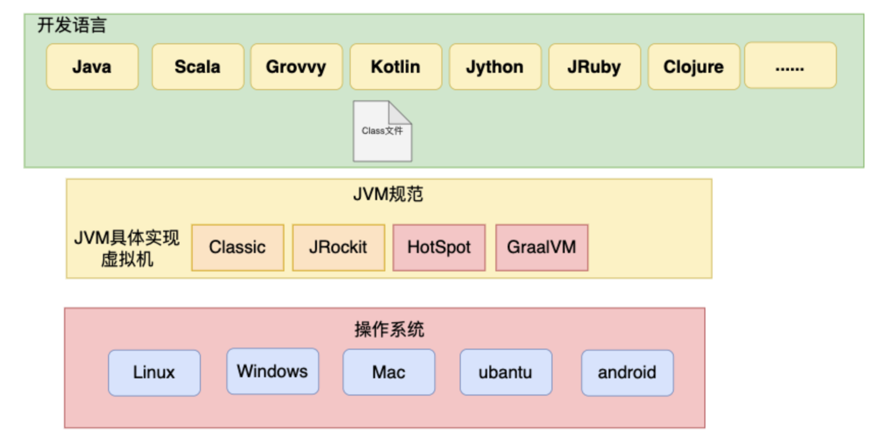

Java 定制了一套统一的语言规范，但是 JVM 有不同的 实现版本。目前主流是：

- HotSpot JVM（Oracle JDK、OpenJDK 默认用的实现）
- GraalVM（Oracle 提供的另一种 JVM 实现，支持 AOT、跨语言互操作等）

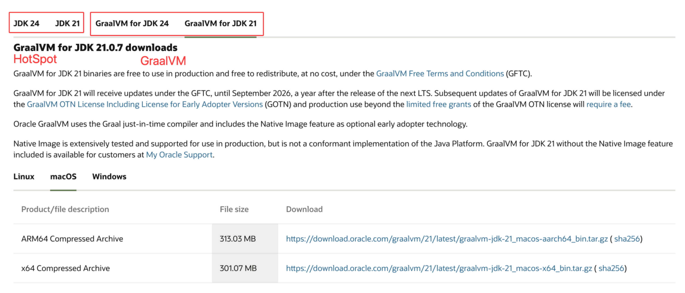

​	后面的课程，以企业用得最多的HotSpot虚拟机为主。在HotSpot虚拟机中，一个Java文件的执行过程，可以整体划分为几个不同的模块
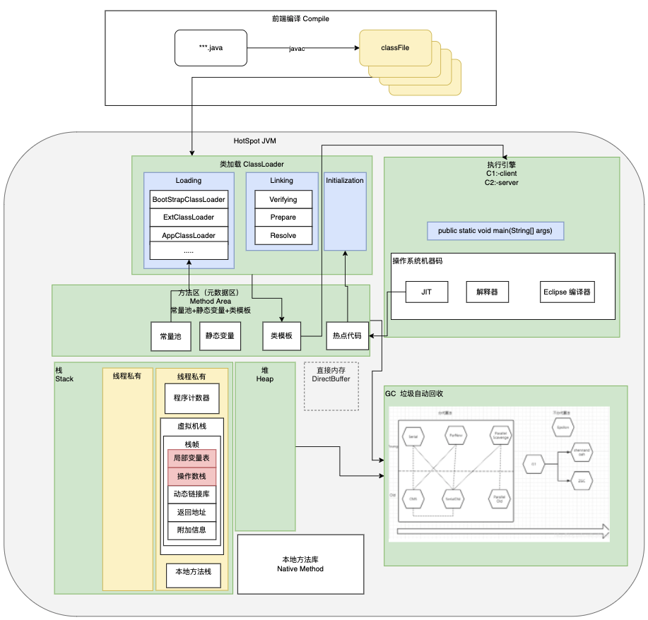
​	其中细节非常多，也很容易让人学得枯燥。今天主要是以实战的方式整体理解一下这些核心模块。在后续的课程中，会详细介绍每个部分的细节。

# 二、Class 文件规范

## 1、Class文件结构

​	实际上，我们需要了解的是，Java 官方实际上只定义了JVM的一种执行规范，也就是class文件的组织规范。理论上，只要你能够写出一个符合标准的class文件，就可以丢到 JVM 中执行。至于这个class文件是怎么来的，JVM 虚拟机是不管的。这也是 JVM 支持多语言的基础。

​	这个规范到底是什么样子呢？当然，你可以直接去看 Oracle 的官方文档。JDK8 的文档地址：<https://docs.oracle.com/javase/specs/jvms/se8/html/index.html> 。后面也会有课程带你详细分析每一个字节。这里，我们只抽取主体内容。

​	 首先，我们要知道，class文件本质是一个二进制文件，虽然不能直接用文本的方式阅读，但是我们是可以用一些文本工具打开看看的。比如，对于一个ByteCodeInterView\.class文件，可以用 UltraEdit 工具打开一个class文件，看到的内容部分是这样的：

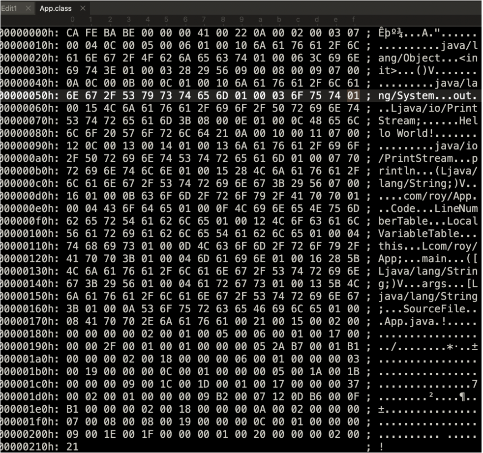

​	中间这一部分就是他的二进制内容。当然这是[16进制](什么是16进制.md)的表达。空格隔开的部分代表了 8 个bit，而每一位代表的是 4 个 bit字节，也就是一个十六进制的数字。例如 第一个字母 C 就表示十六进制的 12，二进制是 1100。而所有的class文件，都必须以十六进制的 CAFEBABE (咖啡宝贝)开头，这就是 JVM 规范的一部分。Sun 公司起名字的时候，也特意选了 Java（咖啡） 来作为语言名，象征活力、易用。

​	后面的部分就比较复杂了，没法直接看。这时我们就需要用一些工具来看了。这样的工具很多。 JDK 自己就提供了一个 javap 指令可以直接来看一些class文件。例如可以用 javap -v ByteCodeInterView\.class 查看到这个class文件的详细信息。

​	当然，这样还是不够直观。我们可以在 IDEA 里添加一个 ` jclasslib bytecode viewer` 插件来更直观的查看一个 ClassFile 的内容。看到的大概内容是这样的：

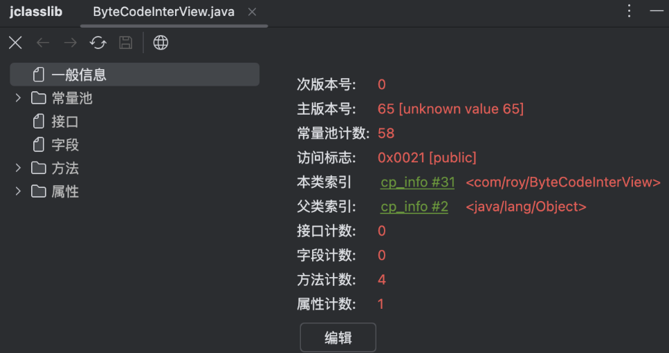

​	这里可以看到，在Class文件当中记录了当前Class文件编译的JDK版本。65就是分配给JDK21的版本号。有了这个版本号，后续就只能由JDK21及以后版本的JDK才能执行当前Class文件。否则就会报版本冲突的错误。

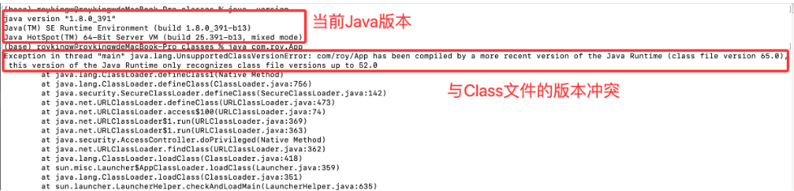

JDK的版本不能低于Class文件记录的编译JDK版本，这就是Java的版本兼容机制。现在主流的Spring 6和SpringBoot 3以上的版本，就已经将JDK的版本升级到了17。根本原因就是因为Spring 6和SpringBoot 3发布出来的class文件，是用JDK17编译的，版本号是61。

然后再结合官方的文档，或许能够让你开始对class文件有一个大致的感觉。

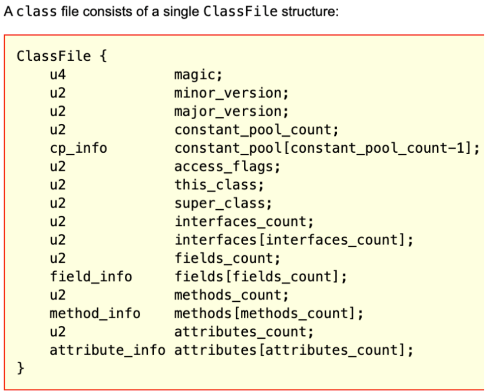

​	例如，前面u4表示四个字节是magic魔数，而这个魔数就是不讲道理的 CAFEBABE 。

​	而后面的两个u2，表示两个字节的版本号。例如我们用 JDK21 看我们之前的class文件，minor\_version就是 00 00，major\_version就是 00 41。换成二进制就是 65。65.0 这就是 JVM 给 JDK21 分配的版本号。这两个版本号就表示当前这个class文件是由JDK21编译出来的。后续就只能用21以后版本的JVM执行。这就是JDK版本向前兼容的基础。

> Java曾经是有两个版本号的，但是小版本号只在最初的几个版本用过。

​	接下来，class文件的整体布局就比较明显了。其中常量池是最复杂的部分，包含了表示这个class文件所需要的几乎所有常量。比如接口名字，方法名字等等。而后面的几个部分，比如方法，接口等都是引用常量池中的各种变量。

> 详细细节，后面VIP课程会带你全程手撕。一个一个字节解读。
>
> 在这里，你可能会注意到一个不太起眼的小细节，常量池中的索引结构是从 1 开始的，而不是像 Java 中其他地方一样，从 0 开始。这样做的目的在于，如果后面某些指向常量池的索引值的数据在特定情况下需要表达“不引用任何一个常量池项目”的含义，就可以把索引值设定为 0 表示。

​	尽管 Java 发展了很多年，JDK 版本也不断更新，但是 Class 文件的结构几乎没有发生过变动，所有对 Class 文件格式的改进，都集中在方法标志、属性表这些设计上原本就是可扩展的数据结构中添加新内容。

## 2 、理解字节码指令

​	而这其中，我们重点关注的是方法，也就是class文件是如何记录我们写的这些关键代码的。例如在ByteCodeInterView中的typeTest这个方法，在class文件中就是这样记录的：
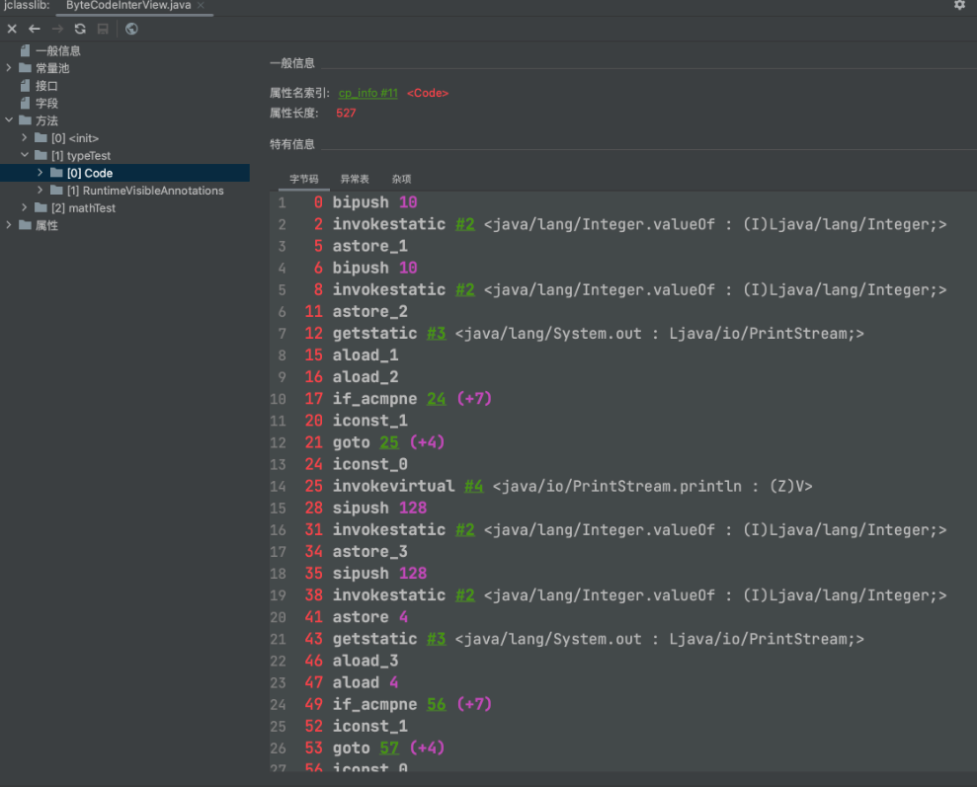

 ​	JVM 的每条字节码指令由一个字节的操作码（opcode）和可选的零至多个操作数（operand）组成。操作数可以是立即数、常量池索引或跳转偏移等。例如，`bipush 10` 的操作码是 `bipush`（0x10），操作数是常量 `10`（0x0A），整条指令占 2 个字节，下一个指令的偏移量从 2 开始。而像 `astore_1` 这样的指令只含操作码，不需要额外操作数。

​	Java 虚拟机中的操作码的长度只有一个字节(能表示的数据是0～255)，这意味着 JVM 指令集的操作码总数不超过 256 条。这些指令相比于庞大的操作系统来说，已经是非常小的了。另外其中还有很多差不多的。 比如aload\_1，aload\_2 这些，明显就是同一类的指令。


解释：它们其实是同一类指令的不同变体。  例如 `iload_1`、`iload_2`、`iload_3` 只是把操作数“写死”在操作码里，方便节省字节


​	这些字节码指令，在不同JDK 版本中会稍有不同。具体可以参考 Oracle 官方文档。JDK 文档地址： <https://docs.oracle.com/javase/specs/jvms/se8/html/index.html>

​	如果不考虑异常的话，那么 JVM 虚拟机执行代码的逻辑就应该是这样：

```java
do{
  从程序计数器中读取 PC 寄存器的值 + 1；
  根据 PC 寄存器指示的位置，从字节码流中读取一个字节的操作码；
  if(字节码存在操作数) 从字节码流中读取对应字节的操作数；
  执行操作码所定义的操作；
}while(字节码流长度>0)
```

​	这些字节码指令你看不懂？没关系，至少现在，你可以知道你写的代码在 Class 文件当中是怎么记录的了。另外，如果你还想更仔细一点的分辨你的每一样代码都对应哪些指令，那么在这个工具中还提供了一个LineNumberTable，会告诉你这些指令与代码的对应关系。

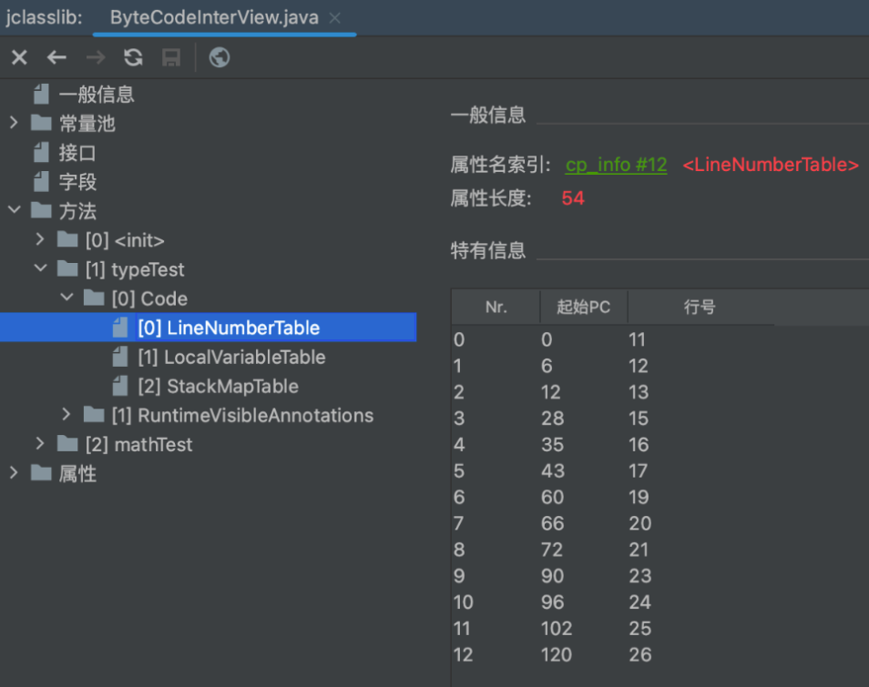

> 起始 PC 就是这些指令的字节码指令的行数，行号则对应 Java 代码中的行数。
>
> 实际上，Java 程序在遇到异常时给出的堆栈信息，就是通过这些数据来反馈报错行数的。

## 4 、字节码指令解读案例

​	这些字节码指令，我们后面有VIP课带你详细解读。但是，在这之前，你可能会有一个困惑。这些字节码指令是给机器看的，我要去学习这些字节码指令有什么用？接下来我们就来详细分析一个小案例，来看看了解字节码指令的必要性。

​	在ByteCodeInterView中，我们写了一个typeTest方法。我们重点来分析其中最容易让人产生困惑的几行代码。

```java
		Integer i1 = 10;
        Integer i2 = 10;
        System.out.println(i1 == i2);//true

        Integer i3 = 128;
        Integer i4 = 128;
        System.out.println(i3 == i4);//false

```

​	执行结果注释在了后面。这些莫名其妙的true和false是怎么蹦出来的？如果你之前恰巧刷到过这样的面试题，或许你会记得这是因为JAVA的基础类型装箱机制引起的小误会。但是如果你没背过呢？或者JAVA中还有很多类似的让人抓狂的面试题，你也一个一个去背吗？那要怎么彻底了解这一类问题呢？你最终还是要学会自己看懂这些字节码指令。


​	首先，我们可以从LineNumberTable 中获取到这几行代码对应的字节码指令：

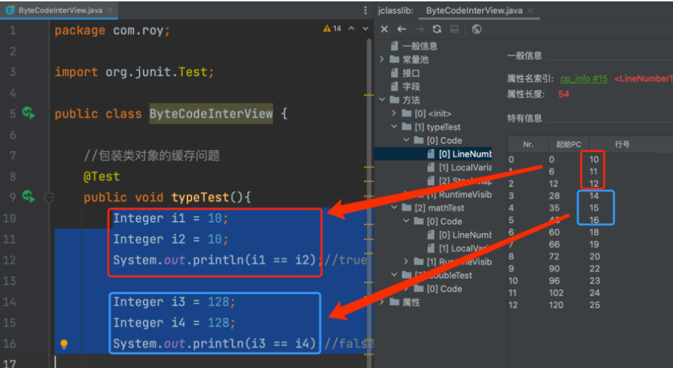

​	以前面三行为例，三行代码对应的 PC 指令就是从 0 到 12 号这几条指令。把指令摘抄下来是这样的：

```java'
0:  bipush        10
2:  invokestatic  #2  <java/lang/Integer.valueOf : (I)Ljava/lang/Integer;>
5:  astore_1
6:  bipush        10
8:  invokestatic  #2  <java/lang/Integer.valueOf : (I)Ljava/lang/Integer;>
11: astore_2
12: getstatic     #3  <java/lang/System.out : Ljava/io/PrintStream;>

```
### 说明：

| 偏移量（PC） | 指令                | 操作数     | 含义                              |
| ------- | ----------------- | ------- | ------------------------------- |
| `0`     | `bipush 10`       | 10      | 将常量 10 压入操作数栈                   |
| `2`     | `invokestatic #2` | 常量池项 #2 | 调用 `Integer.valueOf(int)`       |
| `5`     | `astore_1`        | -       | 将返回的 `Integer` 对象保存到局部变量表索引 1   |
| `6`     | `bipush 10`       | 10      | 再次压入常量 10                       |
| `8`     | `invokestatic #2` | 常量池项 #2 | 再次调用 `Integer.valueOf(int)`     |
| `11`    | `astore_2`        | -       | 将结果存入局部变量表索引 2                  |
| `12`    | `getstatic #3`    | 常量池项 #3 | 获取 `System.out` 对象（PrintStream） |


​	可以看到，在执行astore指令往局部变量表中设置值之前，都调用了一次Integer.valueOf方法。

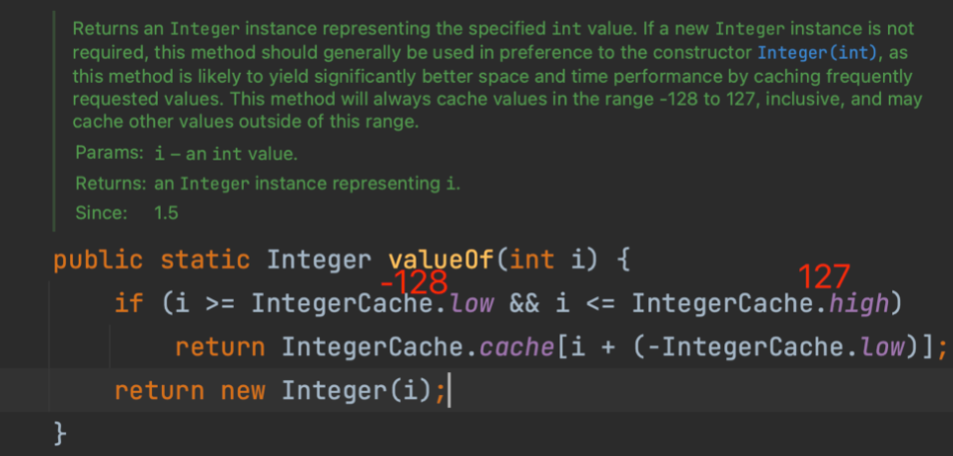

​	而在这个方法中，对于\[-128,127]范围内常用的数字，实际上是构建了缓存的。每次都从缓存中获取一个相同的值，他们的内存地址当然就是相等的了。这些童年梦魇，是不是在这个过程中找到了终极答案？

即
```java
Integer i1 = 10;   // 调用 Integer.valueOf(10)
Integer i2 = 10;   // 再次调用 Integer.valueOf(10),JVM 不是直接 new Integer
System.out.println(i1 == i2);  // true ,两次都命中了缓存，得到的是同一个对象引用

Integer i3 = 128;  // 调用 Integer.valueOf(128)
Integer i4 = 128;  // 再次调用 Integer.valueOf(128)
System.out.println(i3 == i4);  // false ,超出缓存范围，valueOf 会 new 出两个不同的对象

```

如果你要判断值是否相等（而不是是否是同一个对象），  应该使用 `.equals()`：

```java
System.out.println(i1.equals(i2)); // true
System.out.println(i3.equals(i4)); // true

```

因为 `Integer.equals()` 内部比较的是包装的 `int` 值。

`Integer.equals()` 源码其实非常简单：

```java
public boolean equals(Object obj) {
    if (obj instanceof Integer) {
        return value == ((Integer)obj).intValue();
    }
    return false;
}

```


实际上，你甚至可以使用反射来修改这个内部的 IntegerCache 缓存，从而让 Integer 的值发生紊乱。你有试过这样的骚操作吗？

比如（请勿在生产环境尝试）：
```java
import java.lang.reflect.Field;

public class HackIntegerCache {
    public static void main(String[] args) throws Exception {
        // 获取 IntegerCache 类
        Class<?> cacheClass = Class.forName("java.lang.Integer$IntegerCache");
        Field cacheField = cacheClass.getDeclaredField("cache");
        cacheField.setAccessible(true);

        // 获取缓存数组对象
        Integer[] cache = (Integer[]) cacheField.get(cacheClass);

        // 改掉缓存中 128 的映射
        cache[128 + 128] = cache[129 + 128];  // 把 128 的缓存替换为 129

        // 测试
        Integer a = 128;
        Integer b = 128;
        System.out.println(a == b);  // true ——因为现在它们指向同一个“被篡改的对象”
        System.out.println(a);        // 输出 129
    }
}

```
反射可以突破访问限制，直接修改这个数组；因为 `Integer.valueOf()` 调用的就是这个数组里的对象；一旦缓存被改，所有命中缓存的装箱操作都会受影响。


​另外，在这个过程中，我们也看到了在JVM中，是通过一个invokestatic指令调用一个静态方法。实际上JDK中还有以下几个跟方法调用相关的字节码指令:

| 指令                | 适用场景      | 说明                                                                                            |
| ----------------- | --------- | --------------------------------------------------------------------------------------------- |
| `invokevirtual`   | 调用对象的实例方法 | 最常见的调用方式；根据对象的实际类型确定要执行的方法。示例：`Animal a = new Dog();a.run(); `  调用 Dog.run()，而不是 Animal.run() |
| `invokeinterface` | 调用接口方法    | 在运行时搜索一个实现了该接口的对象，找到合适的方法执行。 示例：`Runnable r = new Thread(); r.run();`                         |
| `invokespecial`   | 调用特殊实例方法  | 用于构造方法(`\<init>`)、私有方法(`private`)、父类方法(`super.xxx()`)，这些方法不具备多态性。                             |
| `invokestatic`    | 调用静态方法    | 用于调用类方法（`static` 方法）；方法属于类而非对象。示例：`Math.abs(-5)`                                              |
| `invokedynamic`   | 调用动态方法    | 从 JDK 7 引入；通过“引导方法（Bootstrap Method）”在运行时动态解析调用点。用于支持 Lambda、动态语言等特性。                         |

​方法调用完后，JVM 还需要根据**返回值的类型**使用不同的“返回指令”：

|指令|说明|
|---|---|
|`ireturn`|返回 `int`、`boolean`、`byte`、`char`、`short` 类型的值|
|`lreturn`|返回 `long` 类型|
|`freturn`|返回 `float` 类型|
|`dreturn`|返回 `double` 类型|
|`areturn`|返回引用类型（对象）|
|`return`|用于 `void` 方法（无返回值）|
此外，构造方法（`<init>`）和类初始化方法（`<clinit>`）也使用 `return` 指令来结束执行。


面试题：Java 当中的静态方法可以被子类重写吗？

普通答案：不能。静态方法是属于类本身的，不是属于某个对象的。  重写（override）是“对象行为”的多态特性，只有对象的方法才能被重写。  而静态方法在编译时就已经确定属于哪个类了，它不会随着对象类型变化而变化。
举个例子：
```java
class Parent {
    static void hello() {
        System.out.println("我是父类");
    }
}

class Child extends Parent {
    static void hello() {
        System.out.println("我是子类");
    }
}

public class Demo {
    public static void main(String[] args) {
        Parent p = new Child();
        p.hello(); // 输出什么？
    }
}

```
输出结果是：我是父类


稍微深入一点：在 JVM 中，方法调用有几种不同的方式（对应不同的指令）：

| 指令                | 说明               |
| ----------------- | ---------------- |
| `invokevirtual`   | 调用对象的虚方法（会发生多态）  |
| `invokespecial`   | 调用构造方法、私有方法或父类方法 |
| `invokestatic`    | 调用静态方法（不会发生多态）   |
| `invokeinterface` | 调用接口方法           |

当编译器看到你调用静态方法时，它生成的是 `invokestatic` 指令，  这种调用方式在编译期就已经决定“要调哪个类的方法”了，不会在运行时再去动态分派。
这就是为什么“静态方法不能被重写”，  因为它根本不走多态机制。


那为什么看起来“好像能写同名的静态方法”？

你可以在子类里再写一个同名的静态方法，例如：

```java
Child.hello();   // 输出：我是子类
Parent.hello();  // 输出：我是父类

```
这其实叫：方法隐藏（Method Hiding）  不是重写（Override）。
也就是说，子类定义了一个新的静态方法，  它隐藏了父类的同名静态方法。  两个方法各自属于自己的类，互不影响。

## 5 、深入字节码理解try-cache-finally的执行流程

​	try-catch-finally语法，这是大家初学Java就会接触到的语法。从刚开始接触Java，就会告诉你，在try-catch-finally语法块中，不管有没有异常，finally代码块都一定会执行。但是你有没有好奇过Java是如何实现这种保证的呢？

&#x9;有了前面的字节码工具，我们就可以拿下面的案例来做下分析：

```java
    @Test
    public void inc(){
        int x;
        try{
            x=1;
        }catch (Exception e){
            x = 2;
        }finally {
            x = 3;
        }
        System.out.println(x);
    }
```

​	这个方法编译出的字节码是这样的：

 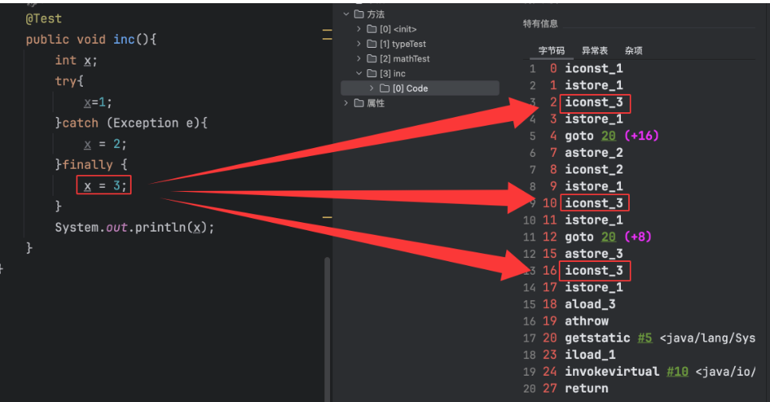

 字节码中是把finally代码块拼凑到了try代码块和catch代码块的后面，这样，不管是执行try代码块，还是执行catch代码块，后面都会跟着执行finally代码块了。​

另外，try代码块如果发生异常，要跳到catch代码块中执行，这又是如何控制的呢？ 这里就需要用到另外的异常表了：

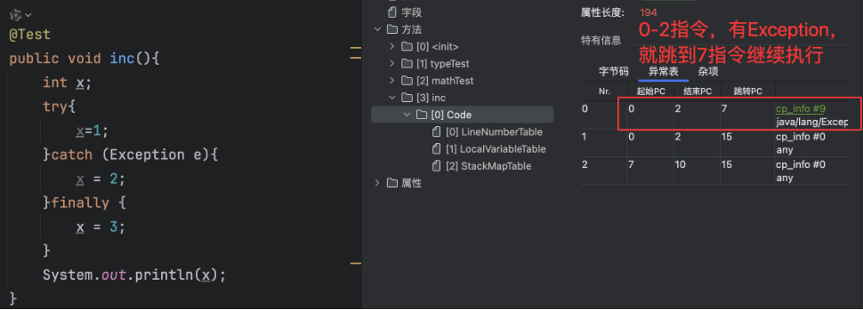

可以看到，这里定义了三条明显的执行路径，分别是：

*   如果try语句块中出现了属于 Exception 或者其子类的异常，转到catch语句块处理。
*   如果try语句块中出现了不属于 Exception 或其子类的异常，转到finally语句块处理。
*   如果catch语句块中出现了任何异常，转到finally语句块处理。

## 6、this关键字到底是哪里来的？

Java当中，有个神秘的this关键字，通过this关键字，可以访问到当前类，这个你应该很熟悉。但是，你有没有想过this关键字是怎么来的？为什么在不同的类中，使用相同的this关键字，但是this的作用却是不同的呢？这就需要了解字节码的工作方式了。

在 JVM 虚拟机中，会为每个线程构建一个线程私有的内存区域。其中包含的最重要的数据就是程序计数器和虚拟机栈。其中程序计数器主要是记录各个指令的执行进度，用于在 CPU 进行切换时可以还原计算结果。虚拟机栈中则包含了这个线程运行所需要的重要数据。

 虚拟机栈是一个先进后出的栈结构，其中会为线程中每一个方法构建一个栈帧。而栈帧先进后出的特性也就对应了我们程序中每个方法的执行顺序。每个栈帧中包含四个部分，局部变量表，操作数栈，动态链接库、返回地址。

*   操作数栈是一个先进后出的栈结构，主要负责存储计算过程中的中间变量。操作数栈中的每一个元素都可以是包括 long 型和 double 在内的任意 Java 数据类型。
*   局部变量表可以认为是一个数组结构，主要负责存储计算结果。存放方法参数和方法内部定义的局部变量。以 slot 为最小单位。一个 slot 存放 Java 虚拟机的基本数据类型，对象引用类型和`returnAddress`类型
*   动态链接库主要存储一些指向运行时常量池的方法引用。每个栈帧中都会包含一个指向运行时常量池中该栈帧所属方法的应用，持有这个引用是为了支持方法动态调用过程中的动态链接。
*   返回地址存放调用当前方法的指令地址。一个方法有两种退出方式，一种是正常退出，一种是抛异常退出。如果方法正常退出，这个返回地址就记录下一条指令的地址。如果是抛出异常退出，返回地址就会通过异常表来确定。
*   附加信息主要存放一些 HotSpot 虚拟机实现时需要填入的一些补充信息。这部分信息不在 JVM 规范要求之内，由各种虚拟机实现自行决定。

以初学者最为头疼的++操作为例，我们从下面的mathTest方法详细分析字节码指令的执行过程：

```java
    public int mathTest(){
        int i = 1 ;
        int j = i++;
        return j;
    }
```

我们可以很容易的知道返回的j是1。但是，这个过程，在JVM内存当中是怎么执行的呢？

```java
0 iconst_1  //往操作数栈中压入一个常量1
1 istore_1 // 将 int 类型值从操作数栈中移出到局部变量表1 位置
2 iload_1 // 从局部变量表1 位置装载int 类型的值到操作数栈中
3 iinc 1 by 1 // 将局部变量表1 位置的数字增加 1
6 istore_2 // 将int 类型值从操作数栈中移出到局部变量表2 位置
7 iload_2 // 从局部变量表2 位置装载int 类型的值到操作数栈中
8 ireturn // 从操作数栈顶，返回int 类型的值
```

这个过程，你不妨自己画个图，逐步演示下这个过程。这里，我们重点关注下在这个过程中，需要的局部变量表和操作数栈需要多少个slot呢？这很关键，因为这影响到JVM要给这个线程申请多大的内存空间。

实际上，在 class 字节码中，也确实记录了局部变量表和操作数栈所需的空间大小。

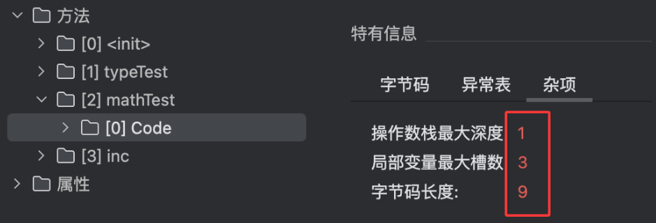


把这些大小提前计算出来，并记录到Class字节码当中，这样JVM就可以在方法执行前，提前申请适当大小的内存。

但是，如果你经过详细分析，就会发现这里记录的局部变量最大槽数会有点问题。如果你自己推演过刚才的计算过程，会发现，在这个方法中，局部变量表最多只引用到索引为 2 的槽位，也就是说，局部变量表最多只需要两个槽位就够了，但是为什么 class 文件中记录的局部变量表的最大槽数是 3 ？难道JVM自己还会计算错误吗？

其实，局部变量表是一个数组结构，数据的索引是从 0 开始的。而对于非静态方法，JVM 默认都会在局部变量表的 0 号索引位置放入 this 变量，指向对象自身。所以我们可以在代码中用this访问自己的属性。

# 三、类是如何加载到JVM内存的？

​	Class文件写好了，那么接下来自然是要加载到JVM的内存当中。但是，这里也会有很多问题。比如，我们可不可以自己写一个java.lang.Object呢？	如果可以，那Java面向对象就全部被改写了，整个Java体系也就崩了。如果不可以，那我们自己写的java.lang.Object类又会要如何处理呢？直接报错吗？那JDK内部成千上万个类，岂不是我们在自己写一个类时，还要先去查下JDK内部类字典，防止冲突吗？

再加上，类中是有static静态变量甚至是static静态代码块的，这些代码块需要在类加载的过程中执行，这个时候，还没有线程，也就没有我们上面介绍的那些栈结构。这个时候，这些静态代码块又应该怎么执行呢？

所以，类加载模块看似简单，其实也是一个很复杂的体系。就算是在JDK内部，类加载机制也是在不断更新。尤其在JDK8前后，类加载机制更是发生了很大的变化。

> 类加载模块也是JVM底层中被面试问到最频繁的部分。因为字节码，执行引擎，GC垃圾回收等这些内容，完全封装在JVM内部，应用几乎接触不到。但是类加载却是应用开发过程中可以实实在在接触到的。例如Tomcat，需要动态加载程序员写的各种乱七八糟的代码。Drools框架，可以在程序运行过程中，实时加载外部的规则文件。开发复杂应用时，很多人希望改完java代码后，就直接生效，而不用重新启动整个java应用。这些场景，都需要对类的加载机制进行定制。
>
> 这里有一个早期经常会被问到的问题，为什么在Tomcat中修改一个JSP页面，可以即时生效。但是修改一个jar包，却需要重新启动tomcat。为什么会这样呢？ 你也可以考虑一下。

## 1 、JDK8的类加载体系

​	关于类加载模块，最为重要的内容我总结为三点：

*   每个类加载器对加载过的类保持一个缓存。
*   双亲委派机制，即向上委托查找，向下委托加载。
*   沙箱保护机制。

至于JDK具体如何执行的，不同JDK版本的实现方式是不同的。以下以大家最为熟悉的JDK8进行分析。

## 2、双亲委派机制

双亲委派，可能是大家被面试题，已经被得滚瓜烂熟的问题了。 但是，其实双亲委派，并不是面试题中那么简单。

​JDK8中的类加载器都继承于一个统一的抽象类 ClassLoader，类加载的核心也在这个父类中。其中，加载类的核心方法如下：

```java
 	//类加载器的核心方法
	public Class<?> loadClass(String name) throws ClassNotFoundException {
        return loadClass(name, false);
    }


    protected Class<?> loadClass(String name, boolean resolve)
        throws ClassNotFoundException
    {
        synchronized (getClassLoadingLock(name)) {
            // First, check if the class has already been loaded
            Class<?> c = findLoadedClass(name);
            if (c == null) {
                long t0 = System.nanoTime();
                try {
                    if (parent != null) {
                        c = parent.loadClass(name, false);
                    } else {
                        c = findBootstrapClassOrNull(name);
                    }
                } catch (ClassNotFoundException e) {
                    // ClassNotFoundException thrown if class not found
                    // from the non-null parent class loader
                }

                if (c == null) {
                    // If still not found, then invoke findClass in order
                    // to find the class.
                    long t1 = System.nanoTime();
                    c = findClass(name);

                    // this is the defining class loader; record the stats
                    PerfCounter.getParentDelegationTime().addTime(t1 - t0);
                    PerfCounter.getFindClassTime().addElapsedTimeFrom(t1);
                    PerfCounter.getFindClasses().increment();
                }
            }
            if (resolve) {
                resolveClass(c);
            }
            return c;
        }
    }
```

​这个方法里，就是最为核心的双亲委派机制。虽然从JDK8往后，类加载机制有了很多的调整，但是这段双亲委派的经典代码却没有发生变化。

这里有趣的是，这个loadClass方法是用protected声明的。这意味着，是可以被子类覆盖的。为什么一个如此重要的方法，却允许程序员们自己创建一个子类，然后写一些乱七八糟的代码去修改呢？

另外，还一个有趣的地方，这个loadClass方法中有一个resolve参数，但是，设置这个参数，却只有一个public方法中写死了。

也就是说，在调用类加载器时，程序员是没有办法给这个resolve方法主动传入一个false的。那这个resolve参数设置不是多此一举吗？

这些问题，希望在后面学完具体课程之后，你可以有个自己的想法。

## 3、沙箱保护机制

​	双亲委派机制有一个最大的作用就是要保护JDK内部的核心类不会被应用覆盖。而为了保护JDK内部的核心类，JAVA在双亲委派的基础上，还加了一层保险。就是ClassLoader中的下面这个方法。

```java
private ProtectionDomain preDefineClass(String name,
                                            ProtectionDomain pd)
    {
        if (!checkName(name))
            throw new NoClassDefFoundError("IllegalName: " + name);
        // 不允许加载核心类
        if ((name != null) && name.startsWith("java.")) {
            throw new SecurityException
                ("Prohibited package name: " +
                 name.substring(0, name.lastIndexOf('.')));
        }
        if (pd == null) {
            pd = defaultDomain;
        }
        if (name != null) checkCerts(name, pd.getCodeSource());
        return pd;
    }
```

​这个方法会用在JAVA在内部定义一个类之前。这种简单粗暴的处理方式，当然是有很多时代的因素。也因此在JDK中，你可以看到很多javax开头的包。这个奇怪的包名也是跟这个沙箱保护机制有关系的。

## 4、类和对象有什么关系

​	通过类加载模块，我们写的class文件就可以加载到JVM当中。但是类加载模块针对的都是类，而我们写的java程序都是基于对象来执行。类只是创建对象的模板。那么类和对象到底是什么关系呢？

​	首先：类 Class 在 JVM 中的作用其实就是一个创建对象的模板。也就是说他的作用更多的体现在创建对象的过程当中。而在程序具体执行的过程中，主要是围绕对象在进行，这时候类的作用就不大了。因此，在 JVM 中，类并不直接保存在最宝贵最核心的堆内存当中，而是挪到了堆内存以外的一部分内存中。这部分内存，在 JDK8 以前被成为永久带 PermSpace，而在 JDK8 之后被改为了元空间 MetaSpace。

> ​	堆空间可以理解为JVM的客厅，所有重要的事情都在客厅处理。元空间可以理解为 JVM 的库房，东西扔进去基本上就很少管了。
>
> ​	这个元空间逻辑上可以认为是堆空间的一部分，但是他跟堆空间有不同的配置参数，不同的管理方式。因此也可以看成是单独的一块内存。这一块内存就相当于家里的工具间或者地下室，都是放一些用得比较少的东西。最主要就是类的一些相关信息，比如类的元数据、版本信息、注解信息、依赖关系等等。
>
> ​	元空间可以通过 -XX\:MetaspaceSize 和 -XX\:MaxMetaspaceSize参数设置大小。但是大部分情况下，你是不需要管理元空间大小的，JVM 会动态进行分配。
>
> ​	另外，这个元空间也是会进行 GC 垃圾回收的。如果一个类不再使用了，JVM 就会将这个类信息从元空间中删除。但是，显然，对类的回收效率是很低的。大部分情况下，类是不会被回收的。所以堆元空间的垃圾回收基本上是很少有效果的。大部分情况下，我们是不需要管元空间的。除非你的JVM 内存确实非常紧张，这时可以设定 -XX\:MaxMetaspaceSize 参数，严格控制元空间大小。

​	然后：在我们创建的每一个对象中，JVM也会保存对应的类信息。

​	在堆中，每一个对象的头部，还会保存这个对象的类指针(classpoint)，指向元空间中的类。这样我们就可以通过一个对象的 getClass 方法获取到对象所属的类了。这个类指针，我们也是可以通过一个小工具观察到的。

​	例如，下面这个 Maven依赖就可以帮我们分析一个对象在堆中保存的信息。

```xml
   <dependency>
      <groupId>org.openjdk.jol</groupId>
      <artifactId>jol-core</artifactId>
      <version>0.17</version>
    </dependency>
```

​	然后可以用以下方法简单查看一下对象的内存信息。

```java
public class JOLDemo {
    private String id;
    private String name;
    public static void main(String[] args) {
        JOLDemo o = new JOLDemo();
        System.out.println(ClassLayout.parseInstance(o).toPrintable());

        synchronized (o){
            System.out.println(ClassLayout.parseInstance(o).toPrintable());
        }
    }
}
```

​	看到的结果大概是这样：

 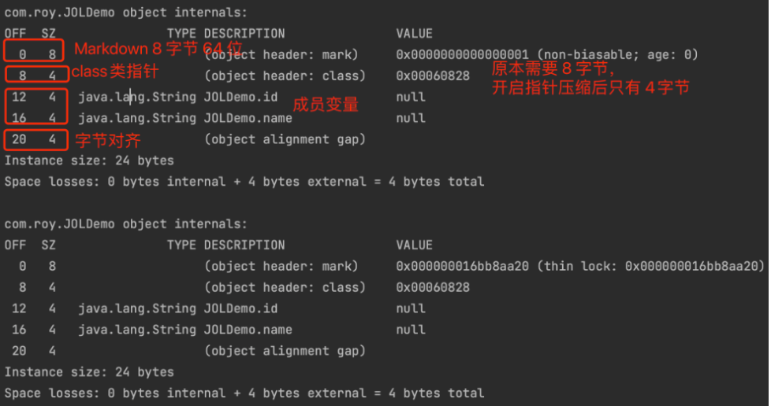

   这里ClassPoint 实际上就是一个指向元空间对应类的一个指针。当然，具体结果是被压缩过的。

​   另外Markdown标志位就是对象的一些状态信息。包括对象的 HashCode，锁状态，GC分代年龄等等。

> 这里面锁机制是面试最喜欢问的地方。无锁、偏向锁(新版本 JDK 中已经废除)、轻量级锁、重量级锁这些东西，都是在Markdown中记录的。

# 四、执行引擎

​之前已经看到过，在 Class 文件当中，已经明确的定义清楚了程序的完整执行逻辑。而执行引擎就是将这些字节指令转为机器指令去执行了。

但是，Java在执行时，是不是简单的把这些指令一个个拿过去执行就完了呢？显然不可能那么简单。相反，这可能是JDK中，最复杂，同时又最纠结的一部分。

因为Java的虚拟机机制，决定了他会比C/C++这些直接和操作系统打交道的语言要慢一些。但是，对于企业级应用来说，慢，就是一种原罪。我们天天在说三高，但是如果在语言层面，就比别人慢一拍，那还谈什么三高呢？

## 1、解释执行与编译执行

​	JVM 中有两种执行的方式：

*   解释执行就相当于是同声传译。JVM 接收一条指令，就将这条指令翻译成机器指令执行。
*   编译执行就相当于是提前翻译。好比领导发言前就将讲话稿提前翻译成对应的文本，上台讲话时就可以照着念了。编译执行也就是传说中的 JIT 。

​	大部分情况下，使用编译执行的方式显然比解释执行更快，减少了翻译机器指令的性能消耗。而我们常用的 HotSpot 虚拟机，最为核心的实现机制就是这个 HotSpot 热点。他会搜集用户代码中执行最频繁的热点代码，形成 CodeCache，放到元空间中，后续再执行就不用编译，直接执行就可以了。

​	但是编译执行起始也有一个问题，那就是程序预热会比较慢。毕竟作为虚拟机，你不可能提前预知到程序员要写一些什么稀奇古怪的代码，也就不可能把所有代码都提前编译成模板。而将执行频率并不高的代码也编译保存下来，也是得不偿失的。所以，现在JDK 默认采用的就是一种混合执行的方式。他会自己检测采用那种方式执行更快。虽然你可以干预 JDK 的执行方式，但是在绝大部分情况下，都是不需要进行干预的。

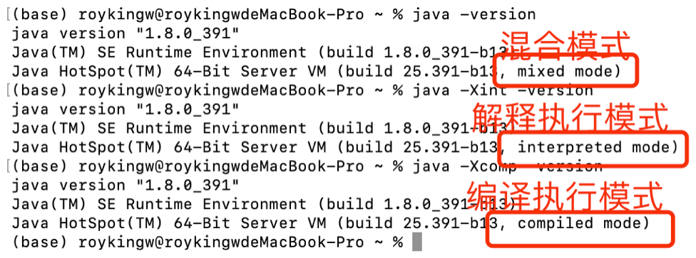

HotSpot 的命名，其实重点就是发现热点代码，尽量通过 JIT 实时编译，提升执行性能。但是，如何发现哪些是热点代码呢？对于热点代码要如何尽最大努力提升性能呢？这都是需要不断研究优化的问题。

## 2、JIT实时编译

​	热点代码会触发 JIT 实时编译，而JIT 编译运用了一些经典的编译优化技术来实现代码的优化，可以智能地编译出运行时的最优性能代码。

​	HotSpot 虚拟机中内置了两个（或三个）即时编译器，其中有两个编译器存在已久，分别被称为“客户端编译器”（Client Compiler）和“服务端编译器”（Server Compiler），或者简称为C1编译器和C2编译器（部分资料和JDK源码中C2也叫Opto编译器），第三个是在JDK 10时才出现的、长期目标是代替C2的 Graal 编译器。Graal编译器采用 Java 语言编写，因此生态的活力更强。并由此衍生出了 GraalVM 这样的支持实时编译的产品。也就是绕过 Class 文件，直接将 Java 代码编译成可在操作系统本地执行的应用程序。这也就是 AOT 技术 Ahead Of Time。

​	C1 会对字节码进行简单和可靠的优化，耗时短，以达到更快的编译速度。启动快，占用内存小，执行效率没有 server 快。默认情况下不进行动态编译，适用于桌面应用程序。

​	C2 进行耗时较长的优化，以及激进优化，但优化的代码执行效率更高。启动慢，占用内存多，执行效率高，适用于服务器端应用。 默认情况下就是使用的 C2 编译器。并且，绝大部分情况下也不建议特意去使用 C1。

​    由于即时编译器编译本地代码需要占用程序运行时间，通常要编译出优化程度越高的代码，所花费的时间便会越长；而且想要编译出优化程度更高的代码，解释器可能还要替编译器收集性能监控信息，这对解释执行阶段的速度也有所影响。为了在程序启动响应速度与运行效率之间达到最佳平衡，HotSpot虚拟机在编译子系统中加入了分层编译的功能，分层编译根据编译器编译、优化的规模与耗时，划分出不同的编译层次，其中包括：

*   第0层。程序纯解释执行，并且解释器不开启性能监控功能（Profiling）。

*   第1层。使用C1编译器将字节码编译为本地代码来运行，进行简单可靠的稳定优化，不开启性能监控功能。

*   第2层。仍然使用C1编译器执行，仅开启方法及回边次数统计等有限的性能监控功能。

*   第3层。仍然使用C1编译器执行，开启全部性能监控，除了第2层的统计信息外，还会收集如分支跳转、虚方法调用版本等全部的统计信息。

*   第4层。使用C2编译器将字节码编译为本地代码，相比起C1编译器，C2编译器会启用更多编译耗时更长的优化，还会根据性能监控信息进行一些不可靠的激进优化。

​	JDK8 中提供了参数 -XX\:TieredStopAtLevel=1 可以指定使用哪一层编译模型。但是，除非你是JVM 的开发者，否则不建议干预 JVM 的编译过程。

关于Graal编译器，也催生了现在Java另外一种效率更快的执行方式，AOT。就是绕过虚拟机，直接将Java程序编译成机器码。这样就彻底不需要JVM做中间的翻译工作了。这种实现方式就是依靠一种新的编译工具，GraalVM。而且，现在GraalVM也已经独立出了新的JDK版本。

关于AOT，虽然执行速度通常更快，但是少了JVM这个中间商来做那些跨平台的活，也必然导致在跨平台的安全性方面要付出一些代价。所以，GraalVM和JDK8往后的各种新版本一样，目前还没有成为业界的主流。不过，确实是一个可以关注的方向。

另外，GraalVM还有另外一个逆天的特性，就是他提供个一个框架，Truffle Language。可以用来自行开发高级语言。也就是说，理论上，你可以很轻松的写出你自己版本的Java语言，也能同样拥有Java的顶尖性能。

# 五、GC 垃圾回收

​	执行引擎会将class文件扔到JVM的内存当中运行。在运行过程中，需要不断的在内存当中创建并销毁对象。在传统C/C++语言中，这些销毁的对象需要手动进行内存回收，防止内存泄漏。而在Java当中，实现了影响深远的 GC 垃圾回收机制。

​	GC 垃圾自动回收，这个可以说是 JVM 最为标志性的功能。不管是做性能调优，还是工作面试，GC 都是 JVM 部分的重中之重。而对于 JVM 本身，GC 也是不断进行设计以及优化的核心。几乎 Java 提出的每个版本都对 GC 有或大或小的改动。这里，就先带大家快速梳理一下 GC 部分的主线。

## 1 、垃圾回收器是干什么的

​	在了解 JVM之前，给大家推荐一个工具，阿里开源的 Arthas 。官网地址：<https://arthas.aliyun.com/>  。 这个工具功能非常强大，是对 Java进程进行性能调优的一个非常重要的工具，对于了解 JVM 底层帮助也非常大。

> 具体使用方式参照官方文档。

​	我们先运行一个简单的 Java 程序：

```java
public class GCTest {
    public static void main(String[] args) throws InterruptedException {
        List l = new ArrayList<>();
        for(int i = 0 ; i < 100_0000 ; i ++){
            l.add(new String("dddddddddddd"));
            Thread.sleep(100);
        }
    }
}
```

​	运行后，使用 Arthas 的 dashboard 指令，可以查看到这个 Java 程序的运行情况。

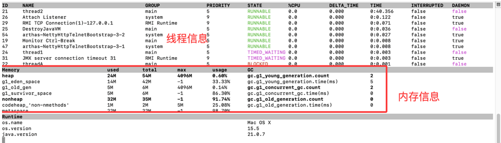

重点关注中间的 Memory 部分，这一部分就是记录的 JVM 的内存使用情况。在JVM内部，如何管理内存？如何对GC进行优化？如何防止OOM异常？这些之前或许你只在面试题中接触的内容，通过这个工具，都可以一览无余。而如何保证Java程序运行稳定，提前预防可能出现的崩溃问题(不靠烧香拜佛)，这就看你的能力了。

例如现在如果问你，JDK21默认的垃圾回收器是哪种？如何排查CPU占用过高的问题？你有一些基础的想法了吗？

## 2、JVM中有哪些垃圾回收器？​

java 从诞生到现在最新的 JDK24 版本，总共就产生了以下十个垃圾回收器

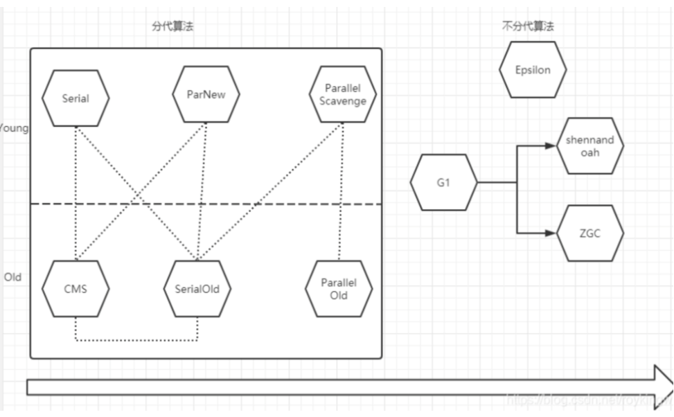

不同的垃圾回收算法对内存的管理方式是不一样的。左侧框框内的都是分代算法，会把内存划分为年轻代和老年代管理。右侧的是不分代算法。也就是不再将内存严格划分位年轻代和老年代。分代管理的GC垃圾回收器已经基本上被淘汰了，CMS 和 Serial、SerialOld，在后续版本都已经被直接废除了。从JDK9以后，Java就采用G1作为默认的垃圾回收器。而G1则是一个物理上分代，但是逻辑上不分代的垃圾回收器。G1 也成为了 Java 的 GC 垃圾回收器从分代管理向不分代管理过渡的一个重要的算法。

后续的 ZGC 和 `shennandoah` 则是现在Java最具竞争力的两大产品。其中，ZGC 属于 Oracle 官方根正苗红的最先进垃圾回收器，理论上可以管理高达 16TB 的内存，并且 STW 停顿时间理论上可以达到和 C/C++ 等产品相同的量级。`shennandoah` 则是OpenJDK 中引入的新一代垃圾回收器，与 ZGC 是竞品关系。不过这些GC算法也都在不断发展过程当中。例如在最新发布的JDK24版本中，又在尝试给 `shennandoah` 增加分代模式，优化垃圾回收效率，减少停顿时间，甚至未来有计划将其设置为默认的垃圾回收器。

Epsilon是一个测试用的垃圾回收器，根本不干活。

> 关于垃圾回收器的细节，后续的VIP课程会详细分析。

# 六、 GC 情况分析实例

​	关于各个垃圾回收器的细节，后面的课程会做更深入的分享。这里我们只关心GC和开发工作的关系。GC可以说是决定JAVA程序运行效率的关键。因此我们一定要学会定制 GC 参数，以及分析 GC 日志。

## 1、如何定制GC运行参数

​	在现阶段，各种GC垃圾回收器都只适合一个特定的场景，因此，我们也需要根据业务场景，定制合理的GC运行参数。

​	另外，JAVA程序在运行过程中要处理的问题是层出不穷的。项目运行期间会面临各种各样稀奇古怪的问题。比如 CPU 超高，FullGC 过于频繁，时不时的 OOM 异常等等。这些问题大部分情况下都只能凭经验进行深入分析，才能做出针对性的解决。

​	如何定制JVM运行参数呢？首先我们要知道有哪些参数可以供我们选择。

​	关于 JVM 的参数，JVM 提供了三类参数。

​	一类是标准参数，以-开头，所有 HotSpot 都支持。例如java -version。这类参数可以使用java -help 或者java -? 全部打印出来

​	二类是非标准参数，以-X 开头，是特定 HotSpot版本支持的指令。例如java -Xms200M  -Xmx200M。这类指令可以用java -X 全部打印出来。

​	最后一类，不稳定参数，这也是 JVM调优的噩梦。以-XX 开头，这些参数是跟特定 HotSpot 版本对应的，很有可能换个版本就没有了。详细的文档资料也特别少。JDK8 中的以下几个指令可以帮助开发者了解 JDK8 中的这一类不稳定参数。

    java -XX:+PrintFlagsFinal:所有最终生效的不稳定指令。
    java -XX:+PrintFlagsInitial:默认的不稳定指令
    java -XX:+PrintCommandLineFlags:当前命令的不稳定指令 --这里可以看到是用的哪种GC。 JDK1.8默认用的ParallelGC

## 2、打印GC日志

​	有了手段之后，我们最主要的就是要能快速发现问题。

​	对 JVM 虚拟机来说，绝大多数的问题往往都跟堆内存的 GC 回收有关。因此下面几个跟 GC 相关的日志打印参数是必须了解的。这通常也是进行 JVM 调优的基础。

​	-XX:+PrintGC: 打印GC信息 类似于-verbose\:gc

​	-XX:+PrintGCDetails: 打印GC详细信息，这里主要是用来观察FGC的频率以及内存清理效率。

​	-XX:+PrintGCTimeStamps 配合 -XX:+PrintGC使用。在 GC 中打印时间戳。

​	-XX\:PrintHeapAtGC: 打印GC前后的堆栈信息

​	-Xloggc\:filename : GC日志打印文件。

> 不同 JDK 版本会有不同的参数。 比如 JDK9 中，就不用分这么多参数了，可以统一使用-Xlog\:gc\* 通配符打印所有的 GC 日志。

​	例如下面一个简单的示例代码：

```java
public class GcLogTest {
    public static void main(String[] args) {
        ArrayList<byte[]> list = new ArrayList<>();

        for (int i = 0; i < 500; i++) {
            byte[] arr = new byte[1024 * 100];//100KB
            list.add(arr);
            try {
                Thread.sleep(10);
            } catch (InterruptedException e) {
                e.printStackTrace();
            }
        }
    }
}
```

​	然后在执行这个方法时，添加以下 JVM 参数：

    -Xms60m -Xmx60m -XX:SurvivorRatio=8 -XX:+PrintGCDetails

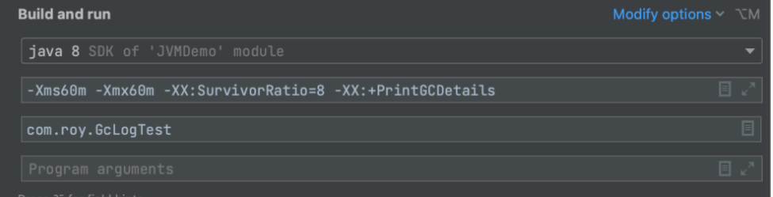


执行后，可以看到类似这样的输出信息。

 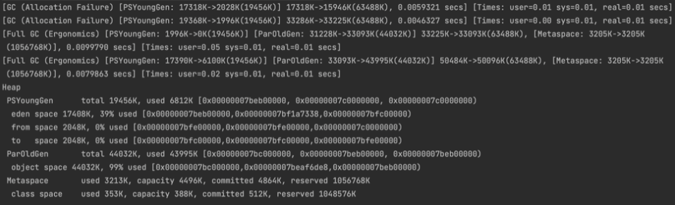

 这里面就记录了两次 MinorGC 和两次 FullGC 的执行效果。另外，在程序执行完成后，也会打印出 Heap 堆区的内存使用情况。

​	当然，目前这些日志信息只是打印在控制台，你只能凭经验自己强行去看。接下来，就可以添加-Xloggc参数，将日志打印到文件里。然后拿日志文件进行整体分析。

## 3、GC日志分析

这些GC日志隐藏了项目运行非常多隐蔽的问题，要如何发现其中的这些潜在的问题呢？

​这里推荐一个开源网站 <https://www.gceasy.io/> 这是国外一个开源的GC 日志分析网站。你可以把 GC 日志文件直接上传到这个网站上，他就会分析出日志文件中的详细情况。。


这是个收费网站，但是有免费使用的额度。

​例如，在我们之前的示例中，添加一个参数 -Xloggc:./gc.log ，就可以将GC日志打印到文件当中。接下来就可以将日志文件直接上传到这个网站上。网站就会帮我们对GC情况进行分析。示例文件得到的报告是这样的：


 通过这个报告，可以及时发现项目运行可能出现的一些隐藏问题。并且这个报告也提供了一些具体的修改意见。当然，如果你觉得这些建议还不够满意，那么报告中还提供了非常详细的指标分析，通过这些指标，你可以进一步的分析问题，寻找新的改进方向。

​如果是你们自己开发的项目，那么接下来，根据这些建议和数据，做进一步的分析，调整参数，优化配置。到这里，恭喜你，架构师的绝活-JVM调优，你就算是正式入门了。

# 章节总结

​	这一章节，只是带大家把JVM中的主要模块简单过了一遍。后面章节会有更详细的拆解。但是，通过总结之前很多学员的学习情况，这里有必要给出大家几个很重要的建议。

1、逻辑自洽，是程序员一个非常重要的特质。程序员的职业发展过程就是发现问题，解决问题，再发现问题，再解决问题的过程。不过，现在很多人却走偏了。因为前人发现的问题，很多都已经通过封装成各种各样的框架、中间件产品等，解决了。所以，现在很多人想当然的觉得，学java的过程就是学各种框架、各种产品。新手阶段这没问题。但是如果你工作很多年，也还是这个想法，而无法去发现并发问题、事务完整性问题、数据一致性问题等更深层次的问题，那么，你的职业竞争力只会随着年龄下降，体力下降每况愈下，成为一个随时可能被替代的螺丝钉。而如果你还保持有足够的技术好奇心，那么作为整个Java根基的JDK，有多重要，就不需要我再过多强调了把。

2、业务问题五花八门，但是很多解决问题的思想是相通的。很多之后在 MySQL、MQ 等更多领域，也同样会遇到很多和JDK相似的问题。而JDK从一个进程中解决问题的思路，又会经常和微服务等跨进程的业务场景遇到的问题相似。平常多做思维体操，多思考思考问题，这些努力，最终都会在你的职业生涯中体现出他的价值。

不要抱怨面试造飞机，工作拧螺丝。其实真要做好一个螺丝，不比造飞机容易！如果你造不好一颗耐高温的螺丝，就别想造一台超音速的飞机。

> 【有道云笔记】第八期一、全面理解 JVM 虚拟机.md <https://share.note.youdao.com/s/kJD9Tjt>

