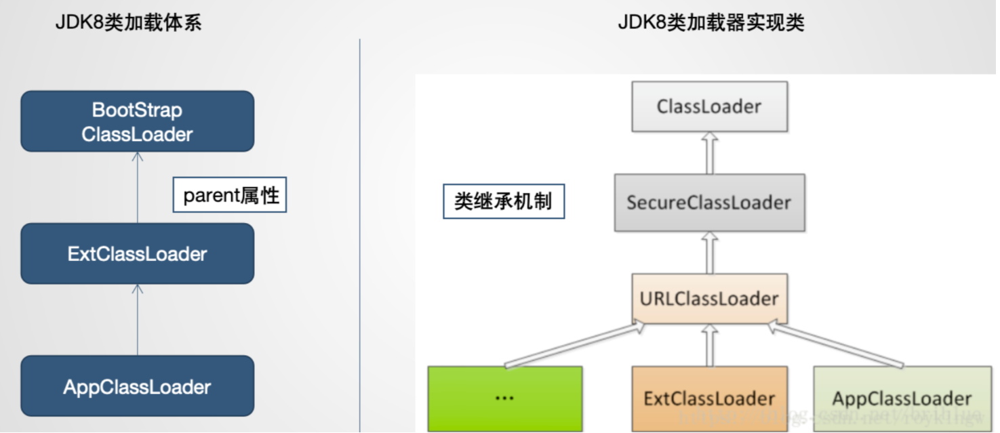
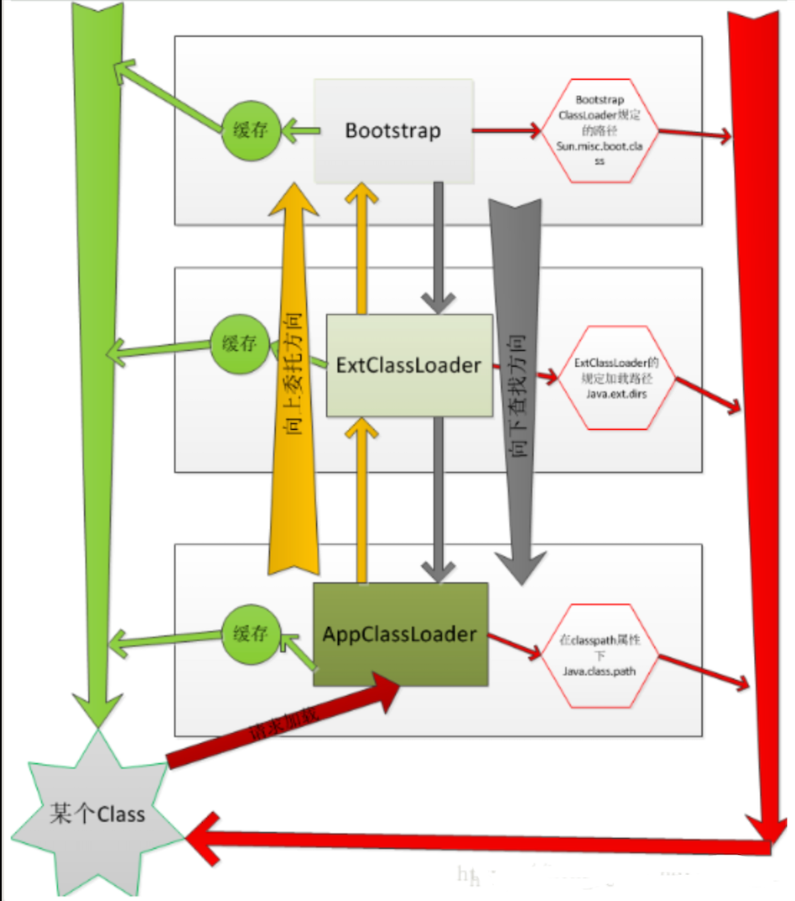
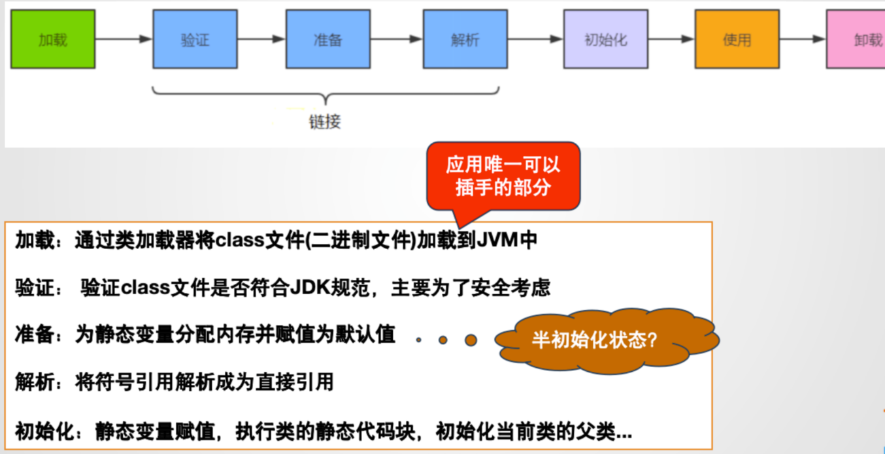
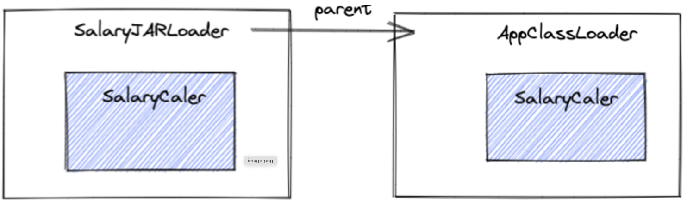
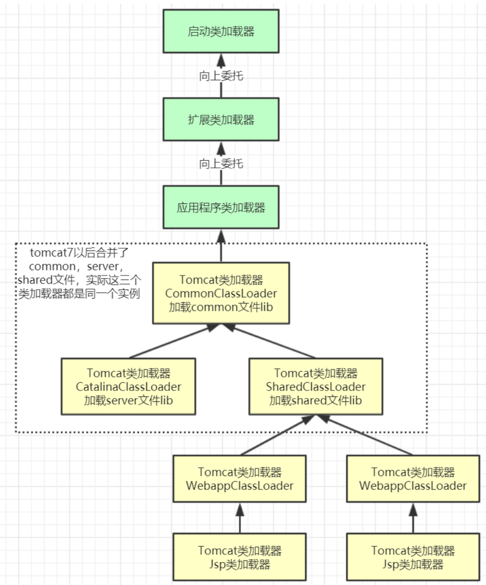
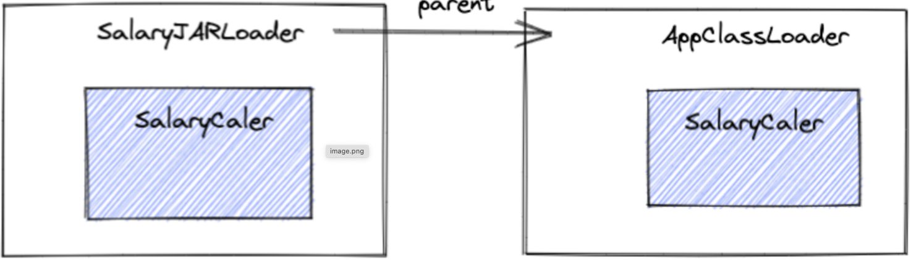

<center><h3>JAVA类加载机制升职加薪之旅</h3>
	-- 楼兰  
</center>


JAVA类加载机制是JVM的门户，我们编写的Class文件都需要经过JDK提供的类加载器加载到JVM中，才能执行。今天就跟大家一起全面梳理类加载机制能够给我们的业务编码带来哪些帮助。

# 一、快速梳理JAVA类加载机制

三句话总结JDK8的类加载机制：
1.类缓存：每个类加载器对他加载过的类都有一个缓存。
2.双亲委派：向上委托查找，向下委托加载。
3.沙箱保护机制：不允许应用程序加载JDK内部的系统类。  

## 1、JDK8的类加载体系

 先来一个简单的Demo，看下JDK8的类加载体系：

```java
public class LoaderDemo {
    public static String a ="aaa";
    public static void main(String[] args) throws ClassNotFoundException {
        /*********************一、类加载器的层级关系*************************************************/
        //获取 AppClassLoader，负责加载应用自己的类（classpath 下的内容）。
        ClassLoader cl1 = LoaderDemo.class.getClassLoader(); 
        System.out.println("cl1 > " + cl1);
        
        //获取 ExtClassLoader，负责加载 JRE 扩展目录下的类（jre/lib/ext 等目录）
        System.out.println("parent of cl1 > " + cl1.getParent());
       
        //理论上是 Bootstrap ClassLoader，但是它是用 C++ 实现的，不是 Java 类，所以返回 null
        System.out.println("grant parent of cl1 > " + cl1.getParent().getParent());
        
        /*********************二、Bootstrap 加载基础类*************************************************/
        // String 属于 Java 核心库（rt.jar），由 Bootstrap ClassLoader 加载，所以结果是 null
        ClassLoader cl2 = String.class.getClassLoader();
        System.out.println("cl2 > " + cl2);
        
        // java.util.List 也是 JDK 核心类，由 Bootstrap ClassLoader 加载，所以输出 null
        System.out.println(cl1.loadClass("java.util.List").getClass().getClassLoader());

  
        System.out.println("BootStrap ClassLoader加载目录：" + System.getProperty("sun.boot.class.path"));
 
        System.out.println("Extention ClassLoader加载目录：" + System.getProperty("java.ext.dirs"));
        
        System.out.println("AppClassLoader加载目录：" + System.getProperty("java.class.path"));
    }
}
```

 可以看到JDK8中的两个类加载体系：



 左侧是 JDK 中实现的类加载器，通过 parent 属性形成父子关系。应用中自定义的类加载器的 parent 都是 AppClassLoader

 右侧是JDK中的类加载器实现类。通过类继承的机制形成体系。未来我们就可以通过继承相关的类实现自定义类加载器。

> 简而言之，左侧是对象，右侧是类。

 JDK8中的类加载器都继承于一个统一的抽象类ClassLoader，类加载的核心也在这个父类中。其中，加载类的核心方法如下：


```java
//类加载器的核心方法
protected Class<?> loadClass(String name, boolean resolve)
        throws ClassNotFoundException
    {
        // 每个类名对应一把锁，保证同一个类只会被一个线程加载，避免并发重复加载问题。
        synchronized (getClassLoadingLock(name)) {
            // 每个类加载起对他加载过的类都有一个缓存，先去缓存中查看有没有加载过
            Class<?> c = findLoadedClass(name);
            if (c == null) {】
              	//没有加载过，就走双亲委派，找父类加载器进行加载。
                long t0 = System.nanoTime();
                try {
                    if (parent != null) {
                        // 如果类没加载过，就交给 父类加载器 去尝试加载；
                        c = parent.loadClass(name, false);
                    } else {
                        // 如果没有父加载器（顶层 BootStrap ClassLoader），则调用 findBootstrapClassOrNull 由启动类加载器尝试加载
                        c = findBootstrapClassOrNull(name);
                    }
                } catch (ClassNotFoundException e) {}

                if (c == null) {
                    long t1 = System.nanoTime();
                  	// 父类加载起没有加载过，就自行解析class文件加载。
                    c = findClass(name);
                  
                    sun.misc.PerfCounter.getParentDelegationTime().addTime(t1 - t0);
                    sun.misc.PerfCounter.getFindClassTime().addElapsedTimeFrom(t1);
                    sun.misc.PerfCounter.getFindClasses().increment();
                }
            }
          	//这一段就是加载过程中的链接Linking部分，分为验证、准备，解析三个部分。
          	// 运行时加载类，默认是无法进行链接步骤的。
            if (resolve) {
                resolveClass(c);
            }
            return c;
        }
    }
```

 这个方法就是最为核心的双亲委派机制。并且这个方法是protected声明的，这意味着，这个方法是可以被子类覆盖的。所以，双亲委派机制也是可以被打破的。

 当一个类加载器要加载一个类时，整体的过程就是通过双亲委派机制向上委托查找，如果没有查找到，就向下委托加载。整个过程整理如下图：



## 2、沙箱保护机制

双亲委派机制有一个最大的作用就是要保护JDK内部的核心类不会被应用覆盖。而为了保护JDK内部的核心类，JAVA在双亲委派的基础上，还加了一层保险。就是ClassLoader中的下面这个方法。

```java
private ProtectionDomain preDefineClass(String name, ProtectionDomain pd)
    {
        if (!checkName(name)) throw new NoClassDefFoundError("IllegalName: " + name);
       
        // 不允许加载核心类
        if ((name != null) && name.startsWith("java.")) {
            throw new SecurityException("Prohibited package name: " +name.substring(0, name.lastIndexOf('.')));
        }
        
        if (pd == null) {
            pd = defaultDomain;
        }
        
        // 如果类名不为空，就调用 `checkCerts` 检查证书（Certificates）。
        if (name != null) checkCerts(name, pd.getCodeSource());
        return pd;
    }
```

这个方法会用在JAVA在内部定义一个类之前。这种简单粗暴的处理方式，当然是有很多时代的因素。也因此在JDK中，你可以看到很多javax开头的包。这个奇怪的包名也是跟这个沙箱保护机制有关系的。

## 2、Linking链接过程

在 ClassLoader 的 loadClass 方法中，还有一个不起眼的步骤，resolveClass。这是一个 native 方法。而其实现的过程称为 linking-链接。链接过程的实现功能如下图：



其中关于半初始化状态就是JDK在处理一个类的 static 静态属性时，会先给这个属性分配一个默认值，作用是占住内存。然后等连接过程完成后，在后面的初始化阶段，再将静态属性从默认值修改为指定的初始值。

> 这里注意，static静态的属性，是属于类的，他是在类初始化过程中维护的。而普通的属性是属于对象的，他是在创建对象的过程中维护的。这两个不要搞混了。
> 
> 对应到class文件当中，一个是`<init>`方法，一个是`<cinit>`方法。

 例如参照一下下面这个案例：
```java
class Apple{
    static Apple apple = new Apple(10); // 第一步：初始化静态成员 apple
    static double price = 20.00;        // 第二步：初始化静态成员 price
    double totalpay;

    public Apple (double discount) {
        System.out.println("===="+price);
        totalpay = price - discount;
    }
}
public class PriceTest01 {
    public static void main(String[] args) {
        System.out.println(Apple.apple.totalpay);
    }
}
```

为什么结果是 **-10** 而不是 **10**？
1. 类加载与初始化过程  
    当第一次访问 `Apple.apple` 时，JVM 会对 `Apple` 类执行 初始化流程：
    - 加载（Loading）：字节码加载进 JVM。
    - 链接（Linking）：包括验证、准备、解析。此时 `static` 变量会被赋予 **默认值**。 
        - `apple = null`
        - `price = 0.0`（默认值）
    - 初始化（Initialization）：按代码的书写顺序执行静态变量的初始化。 
2. 静态变量按顺序初始化
    - 首先执行 `static Apple apple = new Apple(10);`
    - 这会调用构造函数 `new Apple(10)`。
    - 注意：这时 `price` 还没有执行 `= 20.00`，它仍处于准备阶段的默认值 `0.0`。
    - 因此构造函数中打印的 `price` 是 `0.0`，并且 `totalpay = 0.0 - 10 = -10.0`。
3. 后续静态变量初始化
    - 执行完 `apple` 的初始化后，才轮到 `static double price = 20.00;`，将 `price` 赋值为 20.0。
    - 但是此时 `Apple.apple` 已经创建完成了，它的 `totalpay` 值已经是 `-10.0`，不会再随着 `price` 的赋值而改变。
4. main 方法执行
    - `System.out.println(Apple.apple.totalpay);`
    - 打印的就是 `-10.0`。


> 思考问题： [[如何让结果打印出正常的10呢)?

 后面解析的过程有两个核心的概念：符号引用和直接引用。这两个概念了解即可。

如果 A 类中有一个静态属性，引用了另一个 B 类。那么在对类进行初始化的过程中，因为 A 和 B 这两个类都没有初始化，JVM 并不知道 A 和 B 这两个类的具体地址。所以这时，在 A 类中，只能创建一个不知道具体地址的引用，指向 B 类。这个引用就称为符号引用。而当 A 类和 B 类都完成初始化后，JVM 自然就需要将这个符号引用转而指向 B 类具体的内存地址，这个引用就称为直接引用。

> 思考问题：为什么在 ClassLoader 的这个 loadClass 方法中，`reslove` 参数只能传个 false，而不让传 true？

# 二、一个用类加载机制加薪的故事

 故事背景：模拟一个OA系统，每个月需要定时计算大家的工资。

```java
public class OADemo1 {
    public static void main(String[] args) throws InterruptedException {
        Double salary = 15000.00;
        Double money = 0.00;
        //模拟不停机状态
        while (true) {
            try {
                money = calSalary(salary);
                System.out.println("实际到手Money:" + money);
            }catch(Exception e) {
                System.out.println("加载出现异常 ："+e.getMessage());
            }
            Thread.sleep(5000);
        }
    }

    private static Double calSalary(Double salary) {
			SalaryCaler caler = new SalaryCaler();
			return caler.cal(salary);
    }
}
```

 而具体计算工资的方法，根据面向对象的设计思想，会交由一个单独的SalaryCaler类来处理。

```java
public class SalaryCaler {
    public Double cal(Double salary) {
        return salary;
    }
}
```

 这时，一个程序员老王，想要给大家都偷偷加一点工资，于是他想到的方法是直接修改OA系统中计算工资的方法，给大家都加点工资。
```java
public class SalaryCaler {
    public Double cal(Double salary) {
        return salary*1.4;
    }
}
```

 老王偷偷给大家加了工资，但是，经理肯定是不会同意的。于是，程序员与资本家的一个斗智斗勇的故事，拉开了序幕。

# 三、通过类加载器引入外部Jar包

计算工资的方法都在OA系统里，经理直接在代码仓库就能看到。于是老王就要开始思考，如何让经理看不到OA系统中计算工资的源码。

基础的思路是将计算工资的方法，从 OA 系统中抽出来，放到另外一个 jar 包中。然后，就希望 OA 系统能够从这个 jar 包中读取 SalaryCaler 类，这样就可以绕开经理的视线了。


 于是，就可以基于JDK提供的URLClassLoader，从jar包当中加载计算类

```java
public class OADemo2 {
    public static void main(String[] args) throws Exception {
        Double salary = 15000.00;
        Double money = 0.00;

        URL jarPath = 
        new URL("file:/Users/roykingw/DevCode/ClassLoadDemo/out/artifacts/SalaryCaler_jar/SalaryCaler.jar");
        
        URLClassLoader urlClassLoader = new URLClassLoader(new URL[] {jarPath});

        //模拟不停机状态
        while (true) {
            try {
                money = calSalary(salary,urlClassLoader);
                System.out.println("实际到手Money:" + money);
            }catch(Exception e) {
                e.printStackTrace();
                System.out.println("加载出现异常 ："+e.getMessage());
            }
            Thread.sleep(5000);
        }
    }

    private static Double calSalary(Double salary,ClassLoader classloader) throws Exception {
        Class<?> clazz = classloader.loadClass("com.roy.oa.SalaryCaler");
        if(null != clazz) {
            Object object = clazz.newInstance();
            return (Double)clazz.getMethod("cal", Double.class).invoke(object, salary);
        }
        return -1.00;
    }
}
```

拓展思考： `在真实项目中，这个思路有什么用呢？`

1、哪些 jar 包适合放到外部加载？

 那些流程比较统一，但是具体实现规则容易经常产生变化的场景。例如：规则引擎、统一审批规则、订单状态规则.....

2、外部 jar 包可以放到哪些地方？

 URLClassLoader 可以定义 URL 从远程 Web 服务器加载 Jar 包。

 drools 规则引擎实现了从 maven 仓库远程加载核心规则文件。

# 四、自定义类加载器实现class代码混淆

虽然经理在 OA 系统里看不到 SalaryCaler 类的源码了，但是通过 OA 系统的源码最终还是可以找到这个 jar 包。那么就可以对 jar 包进行反编译，查看到 jar 包对应的源码了。所以，老王还需要考虑如何对 class 文件进行代码混淆，让经理无法反编译出源码。

解决的思路有两个：

1. 简单一点的，将 class 文件的后缀改一下，从.class转为.myclass。就像大家把游戏软件改成.txt结尾一样。
2. 只是修改后缀，那么经理还可以把后缀改回来再反编译。所以稳妥一点的方法，是要改一改 class 文件当中的二进制内容。

JDK 只能加载标准的 class 文件，所以，这一类反常规的思路，JDK 就没办法提供帮助了，这时，就需要用自定义的类加载器来解决了。

> 关于如何实现自定义类加载器，可以查看 ClassLoader 类开头的注释。里面介绍了如何实现一个 NetWorkClassLoader。

 于是，老王就可以先定义一个自定义类加载器，实现从 .myclass 文件中加载类。

```java
public class SalaryClassLoader extends SecureClassLoader {
	private String classPath;
	public SalaryClassLoader(String classPath) {
		this.classPath = classPath;
	}

	@Override
	protected Class<?> findClass(String fullClassName) throws ClassNotFoundException {
        //查找.myclass文件
		String filePath = this.classPath + fullClassName.replace(".", "/").concat(".myclass");
		int code;
		try {
			FileInputStream fis = new FileInputStream(filePath);
			// fis.read();
			ByteArrayOutputStream bos = new ByteArrayOutputStream();
			try {
				while ((code = fis.read()) != -1) {
					bos.write(code);
				}
			} catch (IOException e) {
				e.printStackTrace();
			}
            //将.myclass文件的二进制内容读到内存
			byte[] data = bos.toByteArray();
			bos.close();
            //调用defineClass方法，将二进制数组转化成一个JVM中的类。
			return defineClass(fullClassName, data, 0, data.length);
		} catch (Exception e) {
			e.printStackTrace();
		}
		return null;
	}
}
```

 然后，在 OA 系统中通过这个自定义类加载器加载计算工资的 SalaryCaler 类。

```java
public class OADemo3 {
    public static void main(String[] args) throws Exception {
        Double salary = 15000.00;
        Double money = 0.00;
        SalaryClassLoader salaryClassLoader = 
        new SalaryClassLoader("/Users/roykingw/DevCode/ClassLoadDemo/out/production/SalaryCaler/");

        //模拟不停机状态
        while (true) {
            try {
                money = calSalary(salary,salaryClassLoader);
                System.out.println("实际到手Money:" + money);
            }catch(Exception e) {
                System.out.println("加载出现异常 ："+e.getMessage());
                System.exit(-1);
            }
            Thread.sleep(5000);
        }
    }

    private static Double calSalary(Double salary,ClassLoader classloader) throws Exception {
        Class<?> clazz = classloader.loadClass("com.roy.oa.SalaryCaler");
        if(null != clazz) {
            Object object = clazz.newInstance();
            return (Double)clazz.getMethod("cal", Double.class).invoke(object, salary);
        }
        return -1.00;
    }
}
```

> 这个简单的示例并没有修改 class 文件的内容，所以,myclass文件，可以通过修改.class文件生成。

 这个.myclass 文件并没有修改文件的内容。如果要修改内容呢？二进制文件不太好直接编辑，可以使用流的方式做一点修改。
```java
public class FileTransferTest {
    public static void main(String[] args) throws Exception {
        FileInputStream fis = 
        new FileInputStream
        ("/Users/roykingw/DevCode/ClassLoadDemo/out/production/SalaryCaler/com/roy/oa/SalaryCaler.class");

        File targetFile = 
        new File("/Users/roykingw/DevCode/ClassLoadDemo/out/production/SalaryCaler/com/roy/oa/SalaryCaler.myclass");
        
        if(targetFile.exists()) {
            targetFile.delete();
        }
        FileOutputStream fos = new FileOutputStream(targetFile);

        int code = 0;
      	//在读文件之前，先写一个没有意义的1
        fos.write(1);
        while((code = fis.read())!= -1 ) {
            fos.write(code);
        }
        fis.close();
        fos.close();
        System.out.println("文件转换完成");
    }
}
```

这样就能生成一个简单加密后的.myclass 文件了。在 class 文件的标准内容前面加了一个没用的 1。对应的类加载器只需要把这个 1 忽略掉就可以了。

**拓展思考**

1、如何进一步提升关键代码的安全性？

我们这个算法太简单了，经理看看类加载器的源码就知道，只要把.myclass 文件前面的 1 去掉，就能拿到原来的 class 文件内容，从而进行反编译。有没有什么算法，可以让经理推导不出原始的 class 文件内容呢？

常用的加密算法就派上用场了。MD5、对称加密、非对称加密...

或者是不是能够有更多奇怪的思路，比如将类加载器的 class 文件也加密呢？通过自定义类加载器 A，从一个加密 class 文件当中加载出一个类加载器 B，再用后面这个类加载器 B，加载加密过的核心代码。


2、如何在真实项目中用上这种机制？

真实项目当中不会拿 class 文件直接部署，都是拿 jar 包进行部署。所以，我们要做的是，在自定义类加载器中，将从硬盘上读取 class 文件的实现方式，改为从 jar 包当中读取 class 文件。这个通过文件流照样很容易实现。


```java
public class SalaryJARLoader extends SecureClassLoader {
	private String jarFile;

	public SalaryJARLoader(String jarFile) {
		this.jarFile = jarFile;
	}

	@Override
	protected Class<?> findClass(String fullClassName) throws ClassNotFoundException {
		String classFilepath = fullClassName.replace('.', '/').concat(".class");
		System.out.println("重新加载类："+classFilepath);
		int code;
		try {
			// 访问jar包的url
			URL jarURL = new URL("jar:file:" + jarFile + "!/" + classFilepath);
//			InputStream is = jarURL.openStream();
			URLConnection urlConnection = jarURL.openConnection();
			// 不使用缓存 不然有些操作系统下会出现jar包无法更新的情况
			urlConnection.setUseCaches(false);
			InputStream is = urlConnection.getInputStream();
			ByteArrayOutputStream bos = new ByteArrayOutputStream();
			while ((code = is.read()) != -1) {
				bos.write(code);
			}
			byte[] data = bos.toByteArray();
			is.close();
			bos.close();
			return defineClass(fullClassName, data, 0, data.length);
		} catch (Exception e) {
			e.printStackTrace();
			System.out.println("加载出现异常 ："+e.getMessage());
			throw new ClassNotFoundException(e.getMessage());
//			return null;
		}
	}
}
```

 那么，对jar包中的class文件如何进行类似的加密操作呢？其实同样的用文件流就可以实现。这个留给大家自行尝试。

# 五、自定义类加载器实现热加载

老王通过重重考验，终于瞒过了经理。但是这时又遇到一个头疼的情况。总公司需要时不时的核算工资，老王自然想要在总公司核算工资之前将计算工资的方式改回去，避免露馅。然后等总公司核算完成了再改回来。

既然 SalaryCaler 类都是从 jar 包当中修改的，那么是不是直接修改 jar 包就可以了呢？很可惜，老王经过测试后，结果并不是那么令人满意。每次修改 jar 包后，都需要重启 OA 系统才能生效。总公司每次来核查工资就要重启一次 OA 系统，这样岂不是此地无银三百两了？

其实深入分析就很容易找到原因。SalaryCaler 类无法及时更新的根本原因就在于 SalaryJARLoader 对他加载过的类都保存了一个缓存。只要这个缓存存在，SalaryClassLoader 就不会去 jar 包中加载，而是从缓存当中加载。而这个缓存是在 JVM 层面实现的，JAVA 代码接触不到这个缓存，所以解决的思路自然就只能简单粗暴的连这个 SalaryJARLoader 也一起重新创建一个了。

```java
public class OADemo5 {
    public static void main(String[] args) throws Exception {
        Double salary = 15000.00;
        Double money = 0.00;

        //模拟不停机状态
        while (true) {
            try {
                money = calSalary(salary);
                System.out.println("实际到手Money:" + money);
            }catch(Exception e) {
                System.out.println("加载出现异常 ："+e.getMessage());
            }
            Thread.sleep(5000);
        }
    }

    private static Double calSalary(Double salary) throws Exception {
        SalaryJARLoader salaryClassLoader = new SalaryJARLoader("/Users/roykingw/lib/SalaryCaler.jar");
        System.out.println(salaryClassLoader.getParent());
        Class<?> clazz = salaryClassLoader.loadClass("com.roy.oa.SalaryCaler");
        if(null != clazz) {
            Object object = clazz.newInstance();
            return (Double)clazz.getMethod("cal", Double.class).invoke(object, salary);
        }
        return -1.00;
    }
}
```

通过这种方式，每次都是创建出一个新的 SalaryJARLoader 对象，那么他的缓存肯定是空的。那么他自然就只能每次都从 jar 包当中加载类了。于是，老王可以愉快的随时切换 jar 包，实现热更新了。

**拓展思考**

1、这个热加载机制看似很好用，为什么在开源项目中没有见过这种用法？

很显然，这种热加载机制需要创建出非常多的 ClassLoader对象。而这些不用的 ClassLoader 对象加载过的缓存对象也会随之成为垃圾。这会让 JVM 中本来就不大的元数据区带来很大的压力，极大的增加 GC 线程的压力。

但是在项目开发时，其实是有一些办法可以实现这种类似的热更新机制。例如IDEA中的 `JRebel` 插件，还有之前介绍过的Arthas。

2、加载 SalaryCaler 的时候真的只加载一个类吗？

把 SalaryJARLoader 加载过的类打印出来，你会发现，在加载 SalaryCaler 时，其实不光加载了这个类，同时还加载了 Double 和 Object 两个类。这两个类哪里来的？这就是 JVM 实现的懒加载机制。

JVM为了提高类加载的速度，并不是在启动时直接把进程当中所有的类一次加载完成，而是在用到的时候才去加载。也就是懒加载。

# 六、打破双亲委派，实现同类多版本共存

就在老王跟资本家们斗得不亦乐乎的时候，另一个新手程序员小王突然给老王来了个背刺。不知道什么原因，小王突然在 OA 系统当中也提交了个 SalaryCaler 类。这时老王突然发现，这个看似没用的 SalaryCaler 类却突然导致刚刚还挺得意的热加载机制失效了。不管 jar 包如何更新，OA 系统总是只加载小王提交的那个 SalaryCaler 类。

为什么会出现这种情况呢？这就是因为JDK的双亲委派机制。

自定的 SalaryJARLoader 的 parent 属性指向的是 JDK 内的 AppClassLoader。而 AppClassLoader 会加载 OA 系统当中的所有代码，当然就包括小王提交的 `SalaryCaler` 类。这时，SalaryJARLoader 去加载 `SalaryCaler` 类时，通过双亲委派，自然加载出来的就是 `APPClassloader` 中的 `SalayrCaler` 了。



 所以，要保持热加载机制不失效，那就只能对这个双亲委派机制下手了。

 下手的逻辑也很简单，我们只需要让这个 SalaryCaler 类优先从jar包中加载就可以了。

```java
public class SalaryJARLoader6 extends SecureClassLoader {
	private String jarFile;

	public SalaryJARLoader6(String jarFile) {
		this.jarFile = jarFile;
	}

	@Override
	public Class<?> loadClass(String name,boolean resolve) throws ClassNotFoundException {
		//MAC 下会不断加载 Object 类，出现栈溢出的问题.Windows下测试是没有问题的。
//		if(name.startsWith("com.roy")) {
//			return this.findClass(name);
//		}else {
//			return super.loadClass(name);
//		}

		// 把双亲委派机制反过来，先到子类加载器中加载，加载不到再去父类加载器中加载。
		Class<?> c = null;
		synchronized (getClassLoadingLock(name)) {
			c = findLoadedClass(name);
			if(c == null){
				c = findClass(name);
				if(c == null){
					c = super.loadClass(name,resolve);
				}
			}
		}
		return c;
	}

	@Override
	protected Class<?> findClass(String fullClassName) throws ClassNotFoundException {
		String classFilepath = fullClassName.replace('.', '/').concat(".class");
		System.out.println("重新加载类："+classFilepath);
		int code;
		try {
			// 访问jar包的url
			URL jarURL = new URL("jar:file:" + jarFile + "!/" + classFilepath);
			URLConnection urlConnection = jarURL.openConnection();
			urlConnection.setUseCaches(false);
			InputStream is = urlConnection.getInputStream();
//			InputStream is = jarURL.openStream();
			ByteArrayOutputStream bos = new ByteArrayOutputStream();
			while ((code = is.read()) != -1) {
				bos.write(code);
			}
			byte[] data = bos.toByteArray();
			is.close();
			bos.close();
			return defineClass(fullClassName, data, 0, data.length);
		} catch (Exception e) {
//			e.printStackTrace();
			//当前类加载器出现异常，就会通过双亲委派，交由父加载器去加载
//			System.out.println("加载出现异常 ："+e.getMessage());
//			throw new ClassNotFoundException(e.getMessage());
			return null;
		}
	}
}
```

拓展思考

1、我们可以通过打破双亲委派绕过JDK的沙箱保护机制吗？

显然不能。因为JDK内部的三个类加载器示例的实现是改不了的。只要这三个类加载器的加载改不了，那么JDK中那些核心的类就还是安全的。

其实，这个问题也可以延伸到JDK8往后的版本当中。从JDK9开始，JDK中引入了模块化机制，而内部的类加载器实现也随之做了翻天覆地的改变。每个类加载器不再是单独负责一个工作目录，而是改为分工负责一部分的模块。但是，对于自定义类加载器，JDK还是保留了原有的双亲委派机制。在之后带大家分析JDK17的类加载机制时会看到，虽然JDK17内部的加载机制发生了变化，但是我们这些案例，几乎都可以平滑的转移过去。

> 还是要注意：是几乎，而不是完全。因为模块化影响的是整个方方面面。但是核心的加载流程，是没有问题的。

2、在真实项目中，有什么样的业务场景需要打破双亲委派呢？

 双亲委派机制是非常基础的一个底层体系，很多重要框架都需要进行定制。

 例如 Tomcat 的类加载体系如下：



tomcat的几个主要类加载器：

- commonLoader：Tomcat最基本的类加载器，加载路径中的class可以被Tomcat容器本身以及各个Webapp访问；
- catalinaLoader：Tomcat容器私有的类加载器，加载路径中的class对于Webapp不可见；
- sharedLoader：各个Webapp共享的类加载器，加载路径中的class对于所有Webapp可见，但是对于Tomcat容器不可见；
- WebappClassLoader：各个Webapp私有的类加载器，加载路径中的class只对当前Webapp可见，比如加载war包里相关的类，每个war包应用都有自己的WebappClassLoader，实现相互隔离，比如不同war包应用引入了不同的spring版本，这样实现就能加载各自的spring版本；
- Jsp类加载器：针对每个JSP页面创建一个加载器。这个加载器比较轻量级，所以Tomcat还实现了热加载，也就是JSP只要修改了，就创建一个新的加载器，从而实现了JSP页面的热更新。

现在，你可以理解 Tomcat 为什么要这样设计类加载体系了吗？

另外，如果大家对 SpringBoot 比较熟悉，那么应该知道 SpringBoot 实现了一套自己的 SPI 服务注入机制，例如以下的代码就可以加载出应用当中 ApplicationContextInitializer 接口下的所有实现类，包括 SpringBoot 框架内部实现的，以及应用自己实现的。

```java
public class SPITest {
    public static void main(String[] args) {
        List<String> names = SpringFactoriesLoader.loadFactoryNames(ApplicationContextInitializer.class, null);
        names.forEach(System.out::println);
        System.out.println("==============");
        List<ApplicationContextInitializer> applicationContextInitializers = SpringFactoriesLoader.loadFactories(ApplicationContextInitializer.class, null);
        applicationContextInitializers.forEach(System.out::println);
    }
}
```

这个简单的 API 里有个很奇怪的地方，loadFacotries 方法第二个参数就是要传一个 ClassLoader 对象。但是明明传个 null 进去，他也能处理，但是为什么一定要传一个 ClassLoader 对象呢？直接在 API 层面去掉这个参数不是更好吗？为什么搞这么麻烦？那么下面的案例或许能够给你一点点启示。

> 强调！！如果你对 SpringBoot 暂时还不熟悉，那么请忽略这部分内容。但是请保留这个疑问，留待后面学习 SpringBoot 框架时验证。

# 七、使用类加载器能不能不用反射？

 对于一般程序员，故事到这也就结束了。接下来的部分，就属于有追求的程序员，继续打磨技术追求真理的过程了。`没事找事的无聊时间`

> 如果你觉得接下来的部分有点跟不上，那就不要强行去烧脑了。

 老王分析了热加载器失效的原因，其实就是因为在OA应用的多个类加载器中，同时存在了 SalaryCaler 类的多个版本。

  
​ 
AppClassLoader 中的 `SalaryCaler` 对象，可以直接 new 出来，但是 SalaryJARLoader 中的那个 `SalaryCaler` 对象，在之前的例子当中，都只能通过很别扭的反射来使用。同样都是 `SalaryCaler`，就不能让他也像一个正常的类那样使用吗？

于是，老王想到了一个简单粗暴的方式，明明都是 SalaryCaler 对象，那是不是可以直接做类型转换呢？像这样

```java
public class OADemo7 {
    public static void main(String[] args) throws Exception {
        Double salary = 15000.00;
        Double money = 0.00;

        //模拟不停机状态
        while (true) {
            SalaryCaler caler = new SalaryCaler();
            System.out.println("应该到手Money:" + caler.cal(salary));

            SalaryJARLoader6 salaryJARLoader = new SalaryJARLoader6("/Users/roykingw/lib/SalaryCaler.jar");
            Class<?> clazz = salaryJARLoader.loadClass("com.roy.oa.SalaryCaler");
            Object obj = clazz.newInstance();
//					通过反射进行操作，是没有问题的。
            money=(Double)clazz.getMethod("cal", Double.class).invoke(obj, salary);
            System.out.println("实际到手Money:" + money);
//          反射太麻烦，能不能进行类型强转？
            SalaryCaler caler2 = (SalaryCaler)obj;
            money = caler2.cal(salary);
          
            System.out.println("============");
            Thread.sleep(5000);
        }
    }

    private static Double calSalary(Double salary) throws Exception {
        SalaryJARLoader6 salaryClassLoader = new SalaryJARLoader6("/Users/roykingw/lib/SalaryCaler.jar");
        Class<?> clazz = salaryClassLoader.loadClass("com.roy.oa.SalaryCaler");
//        System.out.println(clazz.getClassLoader());
//        System.out.println(clazz.getClassLoader().getParent());
        if(null != clazz) {
            Object object = clazz.newInstance();
            return (Double)clazz.getMethod("cal", Double.class).invoke(object, salary);
        }
        return -1.00;
    }
}
```

 理想很美好，现实很骨感。这样强行的类型转换，只会得到一个让人怀疑人生的异常：

```
Exception in thread "main" java.lang.ClassCastException: com.roy.oa.SalaryCaler cannot be cast to com.roy.oa.SalaryCaler
```

 是的。我不能转换成我。那我到底是谁？

 有什么办法能够摆脱这个别扭的反射机制呢？这时，JDK提供的SPI扩展机制就开始重新引入眼帘了。

 JDK提供了一种SPI扩展机制，其核心是通过这个神奇的API ServiceLoader.load(SalaryCalService.class) 就可以查找到某一个接口的全部实现类。应用所需要的，是提供一个配置文件。 这个配置文件需要放在 ${classpath}/META-INF/services这个固定的目录下。然后文件名是传入接口的全类名。而文件的内容则是一行表示一个实现类的全类名。

> ${classpath} 表示 JAVA 项目的依赖路径，可以放在依赖的 jar 包当中，也可以放到当前项目下，所以 SPI 机制是一种非常好的扩展机制。很多开源框架都大量运用 SPI 机制来保留功能扩展点。最典型的就是大家以后会学习的 ShardingSphere。而 SpringBoot 也是围绕 SPI 机制提供功能扩展，只不过 SpringBoot 的 SPI 机制是自己实现的，而没有用 JDK 提供的。
> 
> 如果这些框架你还都不懂。还是那句话，保留这些疑问，在后面学习这些框架时去验证。

 而这个大家司空见惯的SPI机制，其实在他具体实现时，也是传入了 ClassLoader 的。


```java
public static <S> ServiceLoader<S> load(Class<S> service) {
        ClassLoader cl = Thread.currentThread().getContextClassLoader();
        return ServiceLoader.load(service, cl);
    }
```

 所以，我们就可以用这样的方式，定义一个统一的接口，而将这些不同的实现类都作为接口的不同实现去加载。这样，虽然多定义了一个接口，但是至少摆脱了那些别扭的反射代码不是吗？


```java
public class OADemo8 {
    public static void main(String[] args) throws Exception {
        Double salary = 15000.00;

        //使用 SalaryJARLoader6，就需要在 OADemo 中添加 SPI 的配置文件
        while (true) {
            SalaryJARLoader6 salaryJARLoader = new SalaryJARLoader6("/Users/roykingw/lib/SalaryCaler.jar");
            SalaryCalService salaryService = getSalaryService(salaryJARLoader);
            System.out.println("应该到手Money:" + salaryService.cal(salary));

            SalaryJARLoader6 salaryJARLoader2 = new SalaryJARLoader6("/Users/roykingw/lib2/SalaryCaler.jar");
            SalaryCalService salaryService2 = getSalaryService(salaryJARLoader2);
            System.out.println("实际到手Money:" + salaryService2.cal(salary));

            SalaryCalService salaryService3 = getSalaryService(null);
            System.out.println("OA系统计算的Money:" + salaryService3.cal(salary));

            Thread.sleep(5000);
        }
    }
    private static SalaryCalService getSalaryService(ClassLoader classloader){
        ServiceLoader<SalaryCalService> services;
        if(null == classloader){
            services = ServiceLoader.load(SalaryCalService.class);
        }else{
            ClassLoader c1 = Thread.currentThread().getContextClassLoader();
            Thread.currentThread().setContextClassLoader(classloader);
            services = ServiceLoader.load(SalaryCalService.class);
            Thread.currentThread().setContextClassLoader(c1);

        }
        SalaryCalService service = null;
        if(null != services){
            //这里只需要拿SPI加载到的第一个实现类
            Iterator<SalaryCalService> iterator = services.iterator();
            if(iterator.hasNext()){
                service = iterator.next();
            }
        }
        return service;
    }
}
```

> 配合课程案例理解

**拓展思考**

1、在示例当中，为什么那个 SPI 配置文件不能放到jar包里面？如果想要在 jar 包当中自己定义 SalaryCalService 的实现类，要怎么办？

> 配套示例中的OADemo9就是一种思路。除此之外，还有其他办法吗？

2、后续你们学习 SpringBoot 框架的时候，可以尝试一下从这个 SPI 扩展机制的角度来理解下 SpringBoot 到底在 Spring 基础上做了哪些封装，提供了哪些扩展点。其实 SpringBoot 框架的秘密，都在他的 SPI 配置文件当中。

# 章节总结

 这一章节，通过一个假得不能再假得故事，带大家串起了类加载的各种套路，你们玩会了吗？希望通过这个故事，让你觉得技术也可以很精彩。接下来，尝试下在你们的项目当中设计几个场景来玩一玩吧。另外，这不是终点。JAVA中还有更多好玩的东西，等待你发掘。

 强调一下，课程中有一些对其他技术框架的扩展思考。这是预设大家都不是小白，是过来深造的，而不是入门的。而且，越是底层的机制，他的影响范围自然也越广。如果你对这些框架还不是很了解，不要过多的纠结，保留疑问，留待后续验证。

 最后，不管环境如何，作为技术人员，技术永远是大家最核心的竞争力。闲时好好打磨技术，机会一到，自然升职加薪没问题，你做好准备了吗？

> 有道云笔记链接：[https://note.youdao.com/s/UUPAflAR](https://note.youdao.com/s/UUPAflAR)