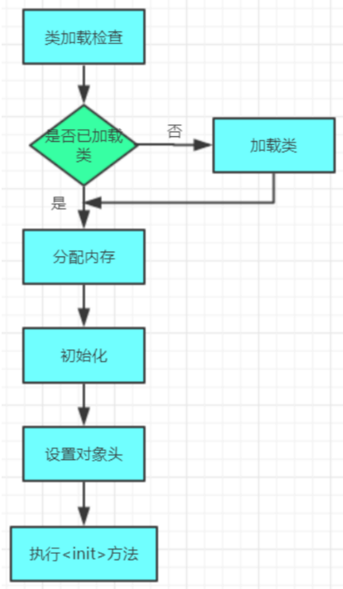
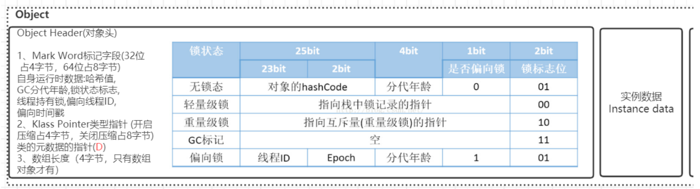
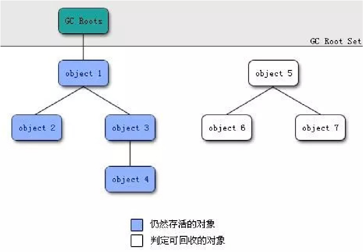

# 一、对象的创建

对象创建的主要流程:



## 1、类加载检查

当虚拟机遇到 `new` 指令时，会先确认它在常量池中指向的类是否已经加载、解析并初始化过。如果没有，就要先完成类的加载过程。
在 Java 语言层面，`new` 指令对应的场景包括：使用 `new` 关键字创建对象、对象克隆、对象反序列化等。

## 2、分配内存

类加载检查通过后，虚拟机会为新对象分配内存。对象需要的内存大小在类加载完成时就能确定，接下来就是从 Java 堆中划出一块固定大小的空间给这个对象。

内存分配面临的两个问题

1. 怎么划分内存虚拟机需要决定对象应该占用多大的一块堆内存，以及如何从堆中找到并划出这块空间。
2. 并发冲突在多线程环境下，可能出现这样的情况：

   - 线程 A 正在给对象分配内存，但分配指针还没更新；
   - 线程 B 同时也来分配，结果用到了旧的指针位置，造成冲突。

划分内存的方法

1. 指针碰撞（Bump the Pointer）

   - 适用场景：堆内存是规整的（已用的在一边，空闲的在另一边）。
   - 做法：用一个指针作为分界线，给对象分配内存时，只需要把指针向空闲方向移动一段对象大小的距离即可。
   - 特点：速度快，简单高效。
2. 空闲列表（Free List）

   - 适用场景：堆内存不规整，已用和空闲的空间交错存在。
   - 做法：虚拟机维护一个“可用内存块列表”，分配时从中找一块足够大的空间给对象，并更新列表。
   - 特点：适应性强，但分配效率比指针碰撞低。

解决并发问题的方法

- CAS（Compare And Swap）

  - 原理：利用 CAS 指令配合“失败重试”机制，保证多个线程同时更新指针时的原子性。
  - 效果：避免多个线程同时分配到同一块内存。
- 本地线程分配缓冲（TLAB, Thread Local Allocation Buffer）

  - 原理：把堆内存切分成很多小块，每个线程预先分到一块，分配对象时只在自己的小块里操作。
  - 特点：减少线程之间的竞争，分配更快。
  - 相关参数：

    - `-XX:+UseTLAB` → 是否启用（默认开启）
    - `-XX:TLABSize` → 设置每个线程的缓冲区大小

## 3.初始化

当内存分配完成后，虚拟机会把这块空间清零（对象头除外）。

- 如果使用了 TLAB，清零操作可以提前在分配 TLAB 时完成。
- 这样保证了对象的所有实例字段，即使在 Java 代码里没有显式赋值，也能默认使用对应类型的“零值”（例如 `0`、`false`、`null` 等）。

## 4.设置对象头

在完成内存清零后，虚拟机会给对象做一些必要的设置，比如：

- 这个对象属于哪个类；
- 如何找到类的元数据信息；
- 对象的哈希码；
- GC 分代年龄等。

这些信息都存放在 对象头（Object Header） 里。

在 HotSpot 虚拟机中，对象在内存的布局分为三部分：

1. 对象头（Header）
   - 运行时数据：哈希码、GC 年龄、锁状态、线程 ID、偏向时间戳等。
   - 类型指针：指向对象所属类的元数据，虚拟机通过它判断对象是哪个类的实例。
2. 实例数据（Instance Data）
   - 用来存放类的字段内容（成员变量）。
3. 对齐填充（Padding）
   - 占位用的，确保对象大小是 8 字节的整数倍（HotSpot 的要求）。



对象头在hotspot的C++源码里的注释如下：

 32-bit 对象头格式

```
hash:25         | age:4 biased_lock:1 lock:2                (normal object)
JavaThread*:23  | epoch:2 age:4 biased_lock:1 lock:2        (biased object)
size:32 --------------------------------------------------> (CMS free block)
PromotedObject*:29 ---------> | promo_bits:3 ----->        (CMS promoted object)

```

- 普通对象
  - `hash:25` → 对象哈希码
  - `age:4` → GC 分代年龄
  - `biased_lock:1` → 是否偏向锁
  - `lock:2` → 锁标志位
- 偏向锁对象
  - `JavaThread*:23` → 线程指针
  - `epoch:2` → 偏向时间戳
  - `age:4`、`biased_lock:1`、`lock:2` 同上
- GC 相关 (CMS)
  - `size:32` → 空闲块大小
  - `PromotedObject*:29 | promo_bits:3` → 晋升对象信息

64-bit 对象头格式

```
unused:25 hash:31  | unused:1 age:4 biased_lock:1 lock:2    (normal object)
JavaThread*:54     | epoch:2 unused:1 age:4 biased_lock:1 lock:2   (biased object)
PromotedObject*:61 --------------------------------------> | promo_bits:3 ---> (CMS promoted object)
size:64 --------------------------------------------------> (CMS free block)

```

- 普通对象
  - `hash:31`（比 32 位多 6 位存储空间）
  - `age:4`、`biased_lock:1`、`lock:2`
- 偏向锁对象
  - `JavaThread*:54` → 更大的线程指针
  - `epoch:2`、`age:4`、`biased_lock:1`、`lock:2`
- GC 相关 (CMS)
  - `PromotedObject*:61 | promo_bits:3`
  - `size:64`

64-bit + 指针压缩COOPs (Compressed OOPs) 对象头格式

```
unused:25 hash:31  | cms_free:1 age:4 biased_lock:1 lock:2        (COOPs && normal object)
JavaThread*:54     | epoch:2 cms_free:1 age:4 biased_lock:1 lock:2 (COOPs && biased object)
narrowOop:32 unused:24 cms_free:1 unused:4 promo_bits:3 ----->    (COOPs && CMS promoted object)
unused:21 size:35  | cms_free:1 unused:7 --------------------->   (COOPs && CMS free block)
```

- 普通对象
  - `hash:31`
  - `cms_free:1` → CMS 空闲标志
  - `age:4`、`biased_lock:1`、`lock:2`
- 偏向锁对象
  - `JavaThread*:54`
  - `epoch:2`、`cms_free:1`、`age:4`、`biased_lock:1`、`lock:2`
- GC 相关 (CMS)
  - `narrowOop:32`（压缩后的对象指针）
  - `promo_bits:3`、`size:35`

总结，对象头里主要存放：

- 运行时数据（hash、GC 年龄、锁状态、偏向锁信息）
- 线程指针 / 类指针（根据锁和 COOPs 状态不同而变化）
- GC 相关信息（CMS 空闲块、晋升对象信息）

## 5.执行 `<init>`方法

最后一步是调用 `<init>` 方法，也就是我们平常写的 构造函数。

- 在这一步，对象的字段会按照程序员的设定来赋值（区别于前面自动填充的零值）。
- 同时执行构造方法里的逻辑，让对象真正按预期完成初始化。
  对象大小与指针压缩
- 对象的大小可以用 `jol-core` 工具来查看。
- 引入 Maven 依赖：

```xml
    <dependency>
        <groupId>org.openjdk.jol</groupId>
        <artifactId>jol-core</artifactId>
        <version>0.9</version>
    </dependency>
```

- 在 64 位虚拟机里，默认会开启 指针压缩（Compressed Oops），把 64 位指针压缩成 32 位，从而节省内存并提升效率。

 示例代码

```java
import org.openjdk.jol.info.ClassLayout;

/*
 * 计算对象大小
 */
public class JOLSample {

    public static void main(String[] args) {
        ClassLayout layout = ClassLayout.parseInstance(new Object());
        System.out.println(layout.toPrintable());

        System.out.println();
        ClassLayout layout1 = ClassLayout.parseInstance(new int[]{});
        System.out.println(layout1.toPrintable());

        System.out.println();
        ClassLayout layout2 = ClassLayout.parseInstance(new A());
        System.out.println(layout2.toPrintable());
    }

    // -XX:+UseCompressedOops 默认开启的压缩所有指针
    // -XX:+UseCompressedClassPointers 默认开启的压缩对象头里的类型指针 Klass Pointer
    // Oops : Ordinary Object Pointers
    public static class A {
        // 8B mark word
        // 4B Klass Pointer，如果关闭压缩 (-XX:-UseCompressedClassPointers 或 -XX:-UseCompressedOops)，则占用 8B
        int id;      // 4B
        String name; // 4B，如果关闭压缩 (-XX:-UseCompressedOops)，则占用 8B
        byte b;      // 1B
        Object o;    // 4B，如果关闭压缩 (-XX:-UseCompressedOops)，则占用 8B
    }
}

```

JOL 运行结果

```
java.lang.Object object internals:
OFF  SZ   TYPE DESCRIPTION               VALUE
  0   8        (object header: mark)     0x0000000000000001 (non-biasable; age: 0)
  8   4        (object header: class)    0x00000e70
 12   4        (object alignment gap)  
Instance size: 16 bytes
Space losses: 0 bytes internal + 4 bytes external = 4 bytes total


[I object internals:
OFF  SZ   TYPE DESCRIPTION               VALUE
  0   8        (object header: mark)     0x0000000000000001 (non-biasable; age: 0)
  8   4        (object header: class)    0x00002638
 12   4        (array length)            0
 16   0    int [I.<elements>             N/A
Instance size: 16 bytes
Space losses: 0 bytes internal + 0 bytes external = 0 bytes total


org.example.Main$A object internals:
OFF  SZ               TYPE DESCRIPTION               VALUE
  0   8                    (object header: mark)     0x0000000000000001 (non-biasable; age: 0)
  8   4                    (object header: class)    0x0101bdf0
 12   4                int A.id                      0
 16   1               byte A.b                       0
 17   3                    (alignment/padding gap)   
 20   4   java.lang.String A.name                    null
 24   4   java.lang.Object A.o                       null
 28   4                    (object alignment gap)  
Instance size: 32 bytes
Space losses: 3 bytes internal + 4 bytes external = 7 bytes total
```

### 什么是指针压缩？

- 从 JDK 1.6 update14 开始，64 位 JVM 支持 指针压缩（Compressed Oops，Ordinary Object Pointer）。
- 配置参数：
  - 启用：`-XX:+UseCompressedOops`（默认开启）
  - 关闭：`-XX:-UseCompressedOops`

它的原理是：在 64 位 JVM 下，把原本 64 位的对象指针压缩成 32 位存储，通过编码/解码的方式仍然能访问更大的堆内存。

---

### 为什么需要指针压缩？

1. 减少内存占用

   - 在 64 位环境中，如果不压缩，指针大小会从 4 字节变成 8 字节，导致对象整体大小增加，内存使用量可能提升 约 1.5 倍。
   - 更大的指针会增加内存带宽占用，GC 的扫描和复制成本也更高。
2. 优化性能

   - 通过压缩为 32 位指针，减少对象头和引用的空间占用，缓存命中率更高，性能更好。
3. 突破 4G 限制

   - 普通 32 位指针最大只能寻址 4G（2³²）。
   - JVM 通过指针压缩编码方式，可以在 32 位指针下支持 ≤32G 堆内存。

### 使用场景说明

- 堆内存 ≤ 4G：不需要压缩，直接用低地址空间。
- 堆内存 4G ~ 32G：默认启用指针压缩（最佳范围）。
- 堆内存 > 32G：指针压缩失效，必须用 64 位指针（8 字节），这时内存占用和 GC 压力都会变大，因此通常建议 Java 堆不要超过 32G。

# 二、对象内存分配

对象内存分配流程图

```
 Start
  │
  ▼
逃逸分析 ──> 可标量替换? ──> 是 → 消除对象（不分配）
  │否
  ▼
栈上分配可行? ──> 是 → 栈上分配
  │否
  ▼
TLAB 可用? ──> 是 → TLAB 分配
  │否
  ▼
对象是否大对象? ──> 是 → 老年代分配
  │否
  ▼
Eden 空间是否足够? ──> 是 → Eden 分配
  │否
  ▼
触发 Minor GC
  │
  ├─> Survivor 足够? ──> 是 → Survivor 分配
  │                         │
  │                         └─ 动态年龄/MaxTenuringThreshold → 老年代
  │
  └─> 晋升到老年代
         │
         ├─ 老年代空间足够 → 老年代分配
         │
         └─ 不足 → HandlePromotionFailure?
                     │
                     ├─ 是 → Full GC
                     │        │
                     │        ├─ 老年代足够 → 分配成功
                     │        └─ 老年代不足 → OOM
                     │
                     └─ 否 → Full GC → OOM（若空间仍不足）

```

## 对象栈上分配

在 Java 中，大部分对象都是在 堆内存 上分配的。当对象不再被引用时，就需要依靠 垃圾回收器（GC） 来回收它们占用的空间。
问题在于：如果临时对象数量非常多，就会频繁触发 GC，不仅增加系统开销，还会降低应用的性能。

为了解决这个问题，JVM 引入了 逃逸分析（Escape Analysis）。它的作用是：在编译阶段分析对象的“作用范围”，判断一个对象是否可能在当前方法之外被引用。

- 如果对象 会逃逸（比如作为返回值、参数传递给其他方法），那么它的作用域就不确定，必须分配在堆上。
- 如果对象 不会逃逸，只在当前方法内使用，那么就没必要分配到堆里，可以直接分配在 栈内存 上。这样，当方法结束、栈帧销毁时，对象也会自动销毁，不需要 GC 介入，从而减轻 GC 的压力。

### 示例：逃逸与非逃逸

```java
public User test1() {
    User user = new User();
    user.setId(1);
    user.setName("zhuge");
    return user; // user 被返回，可能被外部使用 → 必须堆分配
}

public void test2() {
    User user = new User();
    user.setId(1);
    user.setName("zhuge");
    // user 仅在方法内部使用 → 可以栈上分配
}

```

### JVM 优化方式

1、逃逸分析参数

- 开启：`-XX:+DoEscapeAnalysis`（JDK7 之后默认开启）
- 关闭：`-XX:-DoEscapeAnalysis`

2、 标量替换（Scalar Replacement）

逃逸分析还能带来进一步的优化：

- 如果一个对象不会逃逸，并且对象还可以被“拆开”，那么 JVM 可以不真正创建这个对象。
- JVM 会把对象的成员变量分解成若干个 标量（基本数据类型或引用），直接分配在栈帧或寄存器中。
- 这样避免了在堆上分配大块连续空间，也就不会因为堆内存不足而频繁 GC。

参数：

- 开启：`-XX:+EliminateAllocations`（JDK7 之后默认开启）

3、标量与聚合量

- 标量：不可再分解的量，比如 `int`、`long`、引用类型。
- 聚合量：可以分解的量，比如对象（对象由多个字段组成，可以拆开）。
- 对象就是聚合量，经过标量替换后会被分解成多个标量。

### 栈上分配的实验

```java
/*
 * 调用 alloc() 方法 1 亿次：
 * 如果分配在堆上 → 需要 >1GB 堆内存，否则频繁 GC。
 * 如果分配在栈上 → 内存占用极小，几乎不会触发 GC。
 *
 * 以下参数不会触发 GC：
 *   -Xmx15m -Xms15m -XX:+DoEscapeAnalysis -XX:+EliminateAllocations -XX:+PrintGC
 *
 * 以下参数会频繁触发 GC：
 *   -Xmx15m -Xms15m -XX:-DoEscapeAnalysis -XX:+EliminateAllocations -XX:+PrintGC
 *   -Xmx15m -Xms15m -XX:+DoEscapeAnalysis -XX:-EliminateAllocations -XX:+PrintGC
 */
public class AllotOnStack {
    public static void main(String[] args) {
        long start = System.currentTimeMillis();
        for (int i = 0; i < 100000000; i++) {
            alloc();
        }
        long end = System.currentTimeMillis();
        System.out.println(end - start);
    }
    private static void alloc() {
        User user = new User(); // 可被优化为栈上分配
        user.setId(1);
        user.setName("zhuge");
    }
}

```

运行结果表明：

- 如果开启逃逸分析和标量替换，`User` 对象会被优化成栈上分配或直接拆成标量变量 → 几乎没有 GC。
- 如果关闭这些优化，`User` 会被分配在堆上 → 频繁 GC。

### 结论

- 栈上分配 能显著减少堆内存的压力，从而降低 GC 频率。
- 它的实现依赖于：
  1. 逃逸分析（判断对象是否会逃出方法作用域）；
  2. 标量替换（把对象拆分成多个标量变量）。

## 对象在Eden区分配

### 1. 对象默认分配位置

在 Java 中，大多数新创建的对象都会被放入 新生代（Young Generation） 的 Eden 区。
但是，当 Eden 区空间不足时，JVM 就会触发一次 Minor GC（年轻代垃圾回收）来清理 Eden 区中的无效对象。

### 2. Minor GC 与 Full GC 的区别

在继续测试之前，我们先区分一下两种常见的 GC：

- Minor GC（又叫 Young GC）
  - 发生在 新生代（Eden 区 + Survivor 区）。
  - 执行非常频繁，但速度很快。
- Major GC / Full GC
  - 一般会同时回收 老年代（Old Generation）、新生代 和 方法区（Metaspace）。
  - 执行速度明显更慢，通常比 Minor GC 慢 10 倍以上。

### 3. 新生代的内存比例

新生代会按照默认的 8:1:1 比例划分为：

- Eden 区：80%
- Survivor 0 区：10%
- Survivor 1 区：10%

运行逻辑如下：

1. 大多数对象会先进入 Eden 区。
2. 当 Eden 区满了 → 触发一次 Minor GC。
3. GC 清理掉大部分短命对象（通常 99% 都会被回收）。
4. 仍然存活的对象会被移动到空闲的 Survivor 区。
5. 下一次 GC，再把 Eden 区和另一个 Survivor 区的存活对象，一次性挪到另一块 Survivor 区。

这种机制保证了 Eden 区空间最大化，而 Survivor 区只需保证能容纳少量“幸存者”。这也符合现实情况：绝大多数对象生命周期很短，所谓“朝生夕死”。

另外，JVM 默认开启了参数 `-XX:+UseAdaptiveSizePolicy`（自适应大小策略），它会动态调整 Eden 和 Survivor 的比例。

- 如果想保持 8:1:1 不变，可以关闭这个功能：
  `-XX:-UseAdaptiveSizePolicy`

### 4. 实验一：只分配一个大对象

```java
// JVM 参数：-XX:+PrintGCDetails
public class GCTest {
    public static void main(String[] args) {
        byte[] allocation1;
        allocation1 = new byte[60000 * 1024]; // 分配 ~60MB
    }
}

```

运行结果显示：

- Eden 区的空间（65536K）几乎被完全占满。
- 即使程序什么都不做，新生代也会先消耗掉几 MB 内存。

### 5. 实验二：继续分配，触发 Minor GC

```java
public class GCTest {
    public static void main(String[] args) {
        byte[] allocation1, allocation2;
        allocation1 = new byte[60000 * 1024]; // 约 60MB
        allocation2 = new byte[8000 * 1024];  // 再分配 8MB
    }
}

```

运行结果（摘取关键部分）：

`[GC (Allocation Failure) [PSYoungGen: 65253K->936K(76288K)] 65253K->60944K(251392K), 0.0279083 secs] `

解释：

- 当 `allocation2` 申请内存时，Eden 区已经被 `allocation1` 填满 → 触发 Minor GC。
- JVM 尝试把 `allocation1` 移动到 Survivor 区，但 Survivor 区放不下。
- 所以，`allocation1` 被直接晋升到 老年代（Old Gen）。
- 老年代的空间足够，因此没有触发 Full GC。
- GC 之后，新对象仍然会优先放入 Eden 区。

### 6. 实验三：继续分配更多对象

```java
public class GCTest {
    public static void main(String[] args) {
        byte[] allocation1, allocation2, allocation3, allocation4, allocation5, allocation6;
        allocation1 = new byte[60000 * 1024]; // ~60MB
        allocation2 = new byte[8000 * 1024];  // ~8MB
        allocation3 = new byte[1000 * 1024];
        allocation4 = new byte[1000 * 1024];
        allocation5 = new byte[1000 * 1024];
        allocation6 = new byte[1000 * 1024];
    }
}

```

运行结果显示：

`[GC (Allocation Failure) [PSYoungGen: 65253K->952K(76288K)] 65253K->60960K(251392K), 0.0311467 secs]`

解释：

- Eden 区再次被填满 → 触发 Minor GC。
- GC 清理掉 Eden 区中的垃圾对象，把少量存活对象移到 Survivor 区。
- `allocation1` 太大，依然被放在老年代。
- 其余较小的对象继续放在 Eden 区。

### 总结

1. 新对象默认进入 Eden 区。
2. Eden 区满了 → Minor GC：清理垃圾对象，幸存者进入 Survivor 区。
3. 大对象/长期存活对象 → 老年代。
4. Minor GC 频繁但速度快；Full GC 范围大，速度慢很多。
5. 新生代的 8:1:1 比例合理，能让 Eden 区尽可能大，减少 GC 触发次数。

## 大对象直接进入老年代

所谓 大对象，就是需要 大量连续内存空间 的对象，比如 长字符串 或 大数组。

- JVM 提供了参数 `-XX:PretenureSizeThreshold` 来指定大对象的大小阈值（单位：字节）。
- 如果对象大小超过了这个阈值，就会 直接分配到老年代，而不是放在新生代。
- 不过，这个参数只在 Serial 和 ParNew 两种收集器下有效。

示例：

`-XX:PretenureSizeThreshold=1000000 -XX:+UseSerialGC`

当分配超过 1MB 的对象时，它会直接进入老年代。

为什么要这样？

- 因为大对象如果先分配到新生代，在 GC 时需要复制到 Survivor 或老年代。
- 复制大块内存的开销很高，所以 JVM 干脆让大对象直接进入老年代，避免多余的复制操作。

## 长期存活的对象进入老年代

JVM 采用了 分代收集 的思路：

- 短期对象 → 放在新生代
- 长期存活对象 → 晋升到老年代

为了区分对象的“寿命”，虚拟机为每个对象维护了一个 年龄（Age）计数器。

- 对象在 Eden 区创建。
- 经过一次 Minor GC 仍然存活 → 进入 Survivor 区，年龄设为 1。
- 每经过一次 Minor GC 并存活 → 年龄 +1。
- 当年龄达到阈值时，就会晋升到老年代。
  - 默认阈值是 15。
  - CMS 收集器中默认阈值是 6。
  - 阈值可通过参数调整：
    `-XX:MaxTenuringThreshold`

## 对象的动态年龄判断

除了固定的“年龄阈值”规则外，JVM 还有一个 动态年龄判断机制：

- 当某个 Survivor 区（S 区）里一批对象的总大小超过了该 Survivor 区容量的 50%（默认，可通过 `-XX:TargetSurvivorRatio` 指定），
- 那么，这些对象中 大于等于某个年龄的对象 会被直接晋升到老年代。

举个例子：

- 当前 Survivor 区里有很多对象，年龄分别是 1、2、3、4…
- 假设年龄 3 及以上的对象总大小超过了 Survivor 区的 50%。
- 那么，所有 年龄 ≥ 3 的对象，都会被直接放入老年代。

这样做的目的：
让一些“看起来可能会长期存活”的对象更早进入老年代，从而减轻新生代的压力。

## 老年代的空间分配担保机制

在每次 Minor GC 之前，JVM 都会做一次“空间检查”：

1. 先计算：老年代的可用空间，是否足够容纳 Minor GC 后可能晋升的对象。
   - 如果 不够，JVM 可能会直接触发一次 Full GC（同时回收新生代和老年代）。
2. JVM 有一个参数：
   `-XX:-HandlePromotionFailure`
   - 在 JDK 1.8 中，默认已经关闭。
   - 如果开启，它会检查：老年代的剩余空间是否 大于历史上每次 Minor GC 晋升到老年代对象的平均大小。
   - 如果大于，就尝试先做一次 Minor GC，看是否能成功。
   - 如果小于，或者参数没开，就直接触发 Full GC。
3. 两种情况一定会触发 Full GC：
   - Minor GC 后，需要晋升的对象 大于老年代剩余空间。
   - Full GC 后，老年代依然放不下这些对象 → 直接抛出 OOM（OutOfMemoryError）。

```
[开始：Minor GC 之前]
            │
            ▼
[判断：老年代剩余可用空间 < 年轻代中所有对象大小？]
        ┌───────────────┬───────────────┐
        │ 否                            │ 是
        ▼                              ▼
 [执行 Minor GC]        [判断：是否配置 -XX:-HandlePromotionFailure？]
                                   ┌─────────────┬─────────────┐
                                   │ 已配置                    │ 未配置
                                   ▼                          ▼
             [判断：老年代剩余空间 < 历史每次 Minor GC 后晋升对象的平均大小？]   
                         ┌───────────────┬───────────────┐
                         │ 是                            │ 否
                         ▼                              ▼
                 [执行 Full GC]                 [执行 Minor GC]

```

# 三、对象内存回收

堆中几乎放着所有的对象实例，对堆垃圾回收前的第一步就是要判断哪些对象已经死亡（即不能再被任何途径使用的对

象）。

### 引用计数法

给对象中添加一个引用计数器，每当有一个地方引用它，计数器就加1；当引用失效，计数器就减1；任何时候计数器为0

的对象就是不可能再被使用的。

这个方法实现简单，效率高，但是目前主流的虚拟机中并没有选择这个算法来管理内存，其最主要的原因是它很难解决

对象之间相互循环引用的问题。 所谓对象之间的相互引用问题，如下面代码所示：除了对象objA 和 objB 相互引用着对

方之外，这两个对象之间再无任何引用。但是他们因为互相引用对方，导致它们的引用计数器都不为0，于是引用计数算

法无法通知 GC 回收器回收他们。

```java
public class ReferenceCountingGc {
    Object instance = null;

    public static void main(String[] args) {
        ReferenceCountingGc objA = new ReferenceCountingGc();
        ReferenceCountingGc objB = new ReferenceCountingGc();
        objA.instance = objB;
        objB.instance = objA;
        objA = null;
        objB = null;
    }
}

```

### 可达性分析算法

将“GC Roots” 对象作为起点，从这些节点开始向下搜索引用的对象，找到的对象都标记为非垃圾对象，其余未标记的

对象都是垃圾对象

GC Roots根节点：线程栈的本地变量、静态变量、本地方法栈的变量等等



### 常见引用类型

java的引用类型一般分为四种：强引用、软引用、弱引用、虚引用

强引用：普通的变量引用

1 public static User user = new User();

软引用：将对象用SoftReference软引用类型的对象包裹，正常情况不会被回收，但是GC做完后发现释放不出空间存放

新的对象，则会把这些软引用的对象回收掉。软引用可用来实现内存敏感的高速缓存。

```java
public static SoftReference<User> user = new SoftReference<User>(new User());
```

软引用在实际中有重要的应用，例如浏览器的后退按钮。按后退时，这个后退时显示的网页内容是重新进行请求还是从

缓存中取出呢？这就要看具体的实现策略了。

（1）如果一个网页在浏览结束时就进行内容的回收，则按后退查看前面浏览过的页面时，需要重新构建

（2）如果将浏览过的网页存储到内存中会造成内存的大量浪费，甚至会造成内存溢出

弱引用：将对象用WeakReference软引用类型的对象包裹，弱引用跟没引用差不多，GC会直接回收掉，很少用

```
public static WeakReference<User> user = new WeakReference<User>(new User());
```

虚引用：虚引用也称为幽灵引用或者幻影引用，它是最弱的一种引用关系，几乎不用

### finalize()方法最终判定对象是否存活

即使在可达性分析算法中不可达的对象，也并非是“非死不可”的，这时候它们暂时处于“缓刑”阶段，要真正宣告一

个对象死亡，至少要经历再次标记过程。

标记的前提是对象在进行可达性分析后发现没有与GC Roots相连接的引用链。

#### 1. 第一次标记并进行一次筛选。

筛选的条件是此对象是否有必要执行finalize()方法。

当对象没有覆盖finalize方法，对象将直接被回收。

#### 2. 第二次标记

如果这个对象覆盖了finalize方法，finalize方法是对象脱逃死亡命运的最后一次机会，如果对象要在finalize()中成功拯救

自己，只要重新与引用链上的任何的一个对象建立关联即可，譬如把自己赋值给某个类变量或对象的成员变量，那在第

二次标记时它将移除出“即将回收”的集合。如果对象这时候还没逃脱，那基本上它就真的被回收了。

注意：一个对象的finalize()方法只会被执行一次，也就是说通过调用finalize方法自我救命的机会就一次。

示例代码：

```java
public class OOMTest {

    public static void main(String[] args) {
        List<Object> list = new ArrayList<>();
        int i = 0;
        int j = 0;
        while (true) {
            list.add(new User(i++, UUID.randomUUID().toString()));
            new User(j--, UUID.randomUUID().toString());
        }
    }
}

```

### 如何判断一个类是无用的类

方法区主要回收的是无用的类，那么如何判断一个类是无用的类的呢？

类需要同时满足下面3个条件才能算是 “无用的类” ：

该类所有的实例都已经被回收，也就是 Java 堆中不存在该类的任何实例。

加载该类的 ClassLoader 已经被回收。

该类对应的 java.lang.Class 对象没有在任何地方被引用，无法在任何地方通过反射访问该类的方法。
