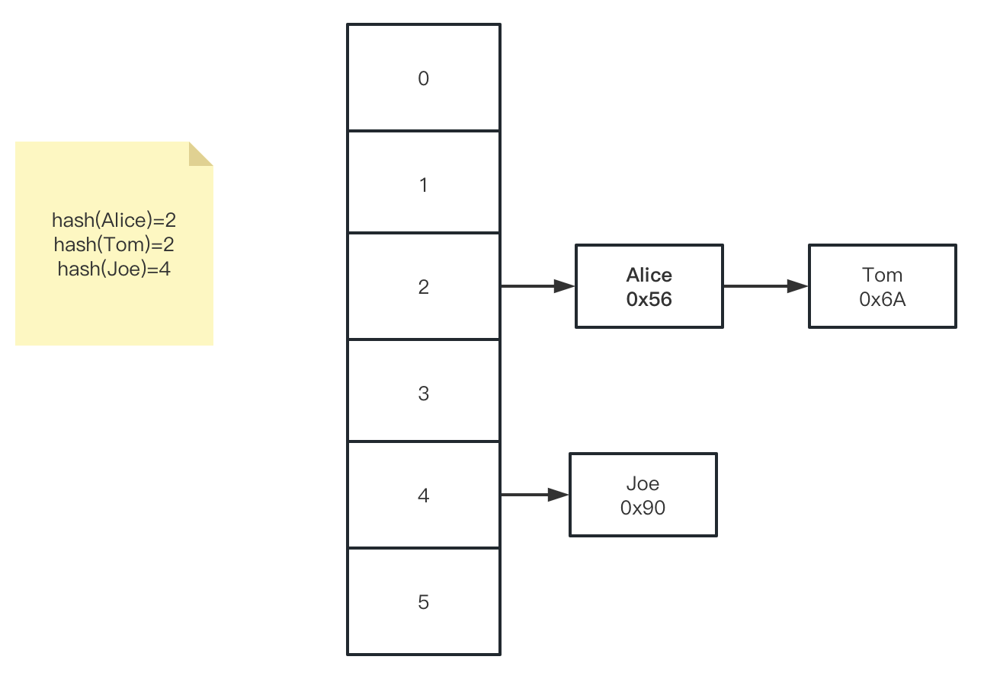
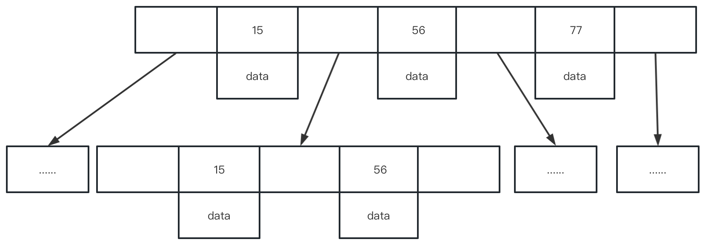
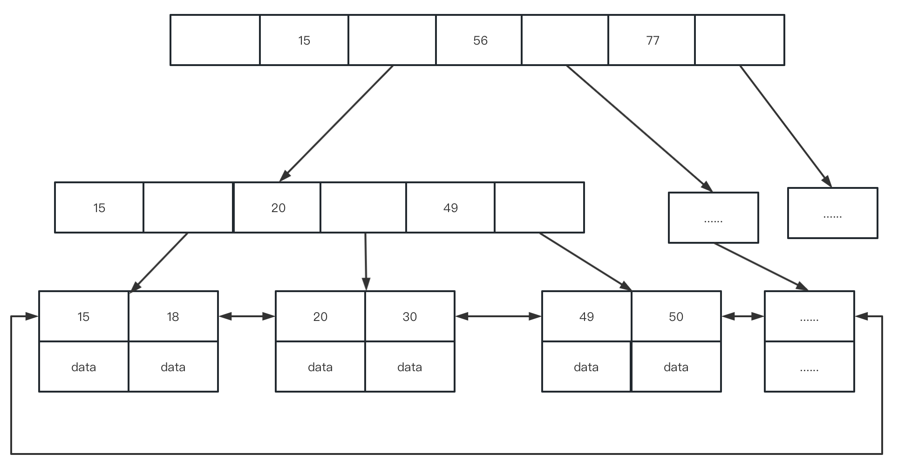
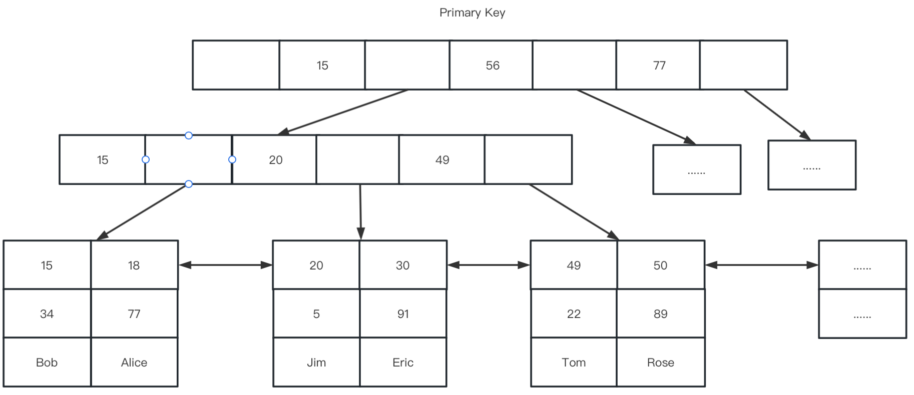
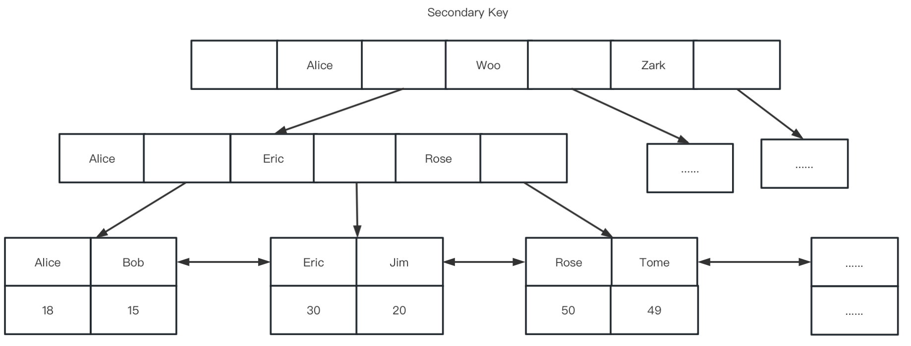
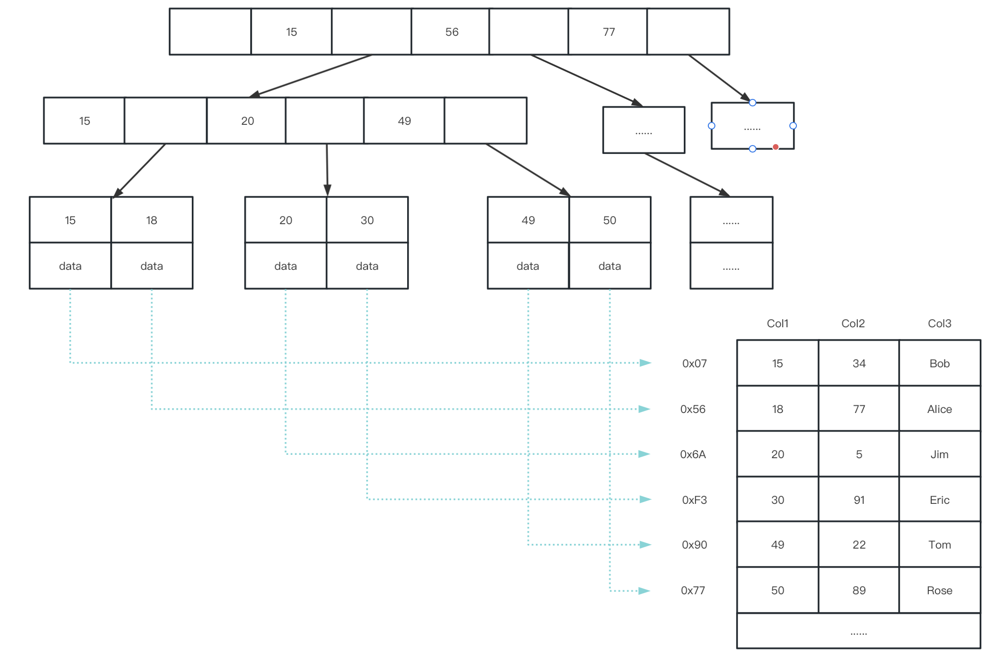
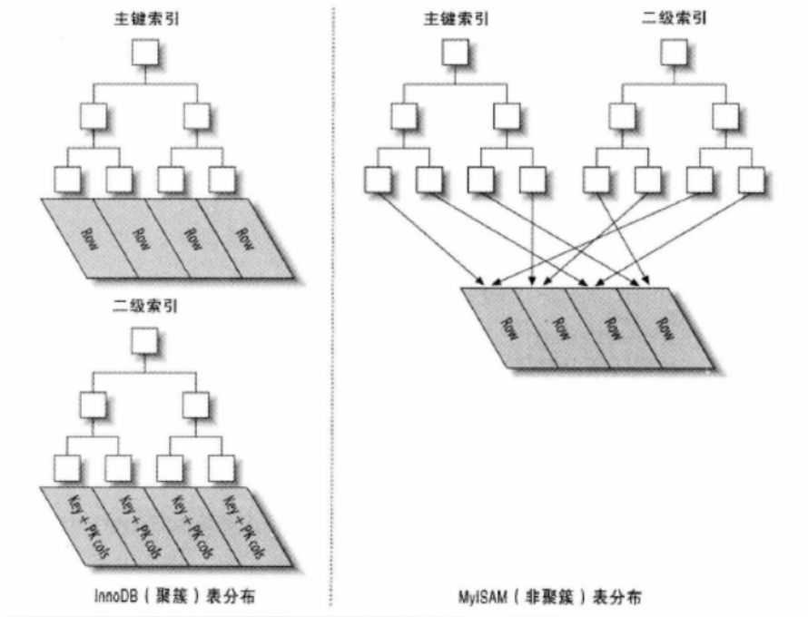

索引是帮助MySQL高效获取数据的排好序的数据结构。

# 一、索引数据结构

问题：MySQL为什么不用数组、哈希表、二叉树等数据结构作为索引 ？

- 数组是内存中一块连续的内存空间，插入效率比较低。


- 哈希表是一种 key-value 形式的数据结构，底层采用数组+链表结构来实现。
  - 对索引的key进行一次hash计算就可以定位出数据存储的位置。
  - 很多时候Hash索引要比B+ 树索引更高效。
  - 仅能满足 “=”，“IN”，不支持范围查询。
  - hash冲突问题：这时候就意味着同一个数组下标处要存放两个元素了，所以这个时候将数组中的元素变为一个链表，通过链表将这两个元素串联起来。

  - 
- 二叉树是每个节点最多有两个子结点的树，比较特殊且常用的二叉树有二叉搜索树、AVL 树（平衡树）、红黑树等。
  - 无论是二叉搜索树，还是 AVL 树，亦或是红黑树，它们都是二叉树的一种，特点都是每个结点最多只有两个子结点，如果存储大量数据的话，那么树的高度会非常高。
  - 而 MySQL 存储的数据最终是要落地到磁盘的，MySQL 应用程序读取数据时，需要将数据从磁盘先加载到内存后才能继续操作，所以这中间会发生磁盘 IO，而如果树太高，每遍历一层结点时，就需要从磁盘读取一次数据，也就是发生一次 IO，如果数据在树高为 20 的地方，那查找一次数据就得发生 20 次 IO，这对应用程序简直就是灾难性的，耗时太长了。
  - 因此二叉树在 MySQL 这种需要存储大量数据的场景下，是不适合当做索引的数据结构的，因为树太高，操作数据时会发生多次磁盘 IO，性能太差。

既然二叉树因为每个结点最多只有两个子结点，最终在存储大量数据时导致树高太高，因此不适合当做 MySQL 的索引，那么让树的每个结点尽可能多的拥有多个子结点，也就是多叉树，那这样在大量储存数据时，树高就低很多了，那这样总应该可以了吧！而多叉树中典型的例子有 B-Tree 和 B+Tree。

- B-Tree 

  - 特点是无论叶子结点和非叶子结点，它都存有索引值和数据。节点中的数据索引从左到右递增排列。

    

- B+Tree 

  - 特点是只有叶子结点才会存放索引值和数据，非叶子结点只会存放索引值本身。叶子节点用指针连接，提高区间访问的性能。

    

在B树和B+树中，每个节点都有一个固定的大小限制，无法无限扩展。因此对于非叶子结点，一个结点中，B+Tree 存放的索引值数量会远远大于 B-Tree（B-Tree 要存放索引+数据，而 B+Tree 只需要存放索引），这样就导致了每个结点中，B+Tree 能向下分出更多的叉，子结点数更多。

```sql
-- 根节点存储索引大小（16kb）
show global status like 'Innodb_page_size'

--  Variable_name	    Value
--  Innodb_page_size	16384
```

那么在要存储同样大小的数据文件的场景下，用 B+Tree 存储，最终树的高度会远远小于用 B-Tree 存储的高度，所以使用 B+Tree 作为 MySQL 索引的数据结构，将来在读取数据时，发生的磁盘 IO 次数会更少，性能更优，因此最终 MySQL 索引的数据结构使用的是 B+Tree。


# 二、B+tree索引实现原理

MySQL 的 `InnoDB`、`MyISAM` 存储引擎 B+tree 索引实现原理

| 存储引擎 | 索引类型 | 主键叶子节点 | 非主键叶子节点 |
| :------- | :------- | :----------- | :------------- |
| `MyISAM` | 非聚簇   | 数据地址     | 数据地址       |
| `InnoDB` | 聚簇     | 全部数据     | 主键值         |
| key重复  |          | 不能         | 能             |

## 2.1、`InnoDB`索引实现(聚集)

聚集索引并不是一种单独的索引类型，而是一种数据存储方式。`InnoDB`的聚集索引实际上在同一个结构中保存了B-Tree索引和数据行。

主键索引实现原理图：



非主键索引（辅助索引）原理图：

`InnoDB`的辅索引`data`域存储相应记录主键的值而非地址。即`InnoDB`的所有辅助索引都引用主键作为`data`域。



聚集的数据有一些重要的优点：

- 可用把相关的数据保存在一起。例如实现电子邮箱时，可用根据用户ID来聚集数据，这样只需要从磁盘读取少量的数据页就能获取某个用户的全部邮件。如果没有使用聚集索引，则每封邮件都可能导致一次磁盘I/O。
- 数据访问更快。聚集索引将索引和数据保存在同一B-Tree 中，因此聚集索引获取数据通常比非聚集索引中查找更快
- 使用覆盖索引扫描的查询可用直接使用页节点中的主键值


聚集索引也有一些缺点：

- 聚集数据最大限度地提高了I/O密集型应用的性能，但如果数据全部放在内存中，则访问的顺序就没有那么重要了，聚集索引也就没什么优势了
- 插入速度严重依赖插入顺序。按照主键的顺序插入是加载数据到 `InnoDB` 表中速度最快的方式。但是如果不是按照主键顺序加载数据，那么在加载完成后最好使用 OPTIMIZE TABLE 命令重新组织一下表
- 更新聚集索引的代价很高，因为会强制 `InnoDB` 将每个更新的行移动到新的位置
- 基于聚集索引的表在插入新行，或者主键被更新导致需要移动行的时候，可能面临“页分裂”的问题。当行的主键要求必须将这一行插入到某个已满的页中时，存储引擎会将该页分裂成两个页面来容纳该行，这就是一次页分裂操作。页分裂会导致表占用更多的磁盘空间。
- 二级索引（非聚集索引）可能比想象的要更大，因为二级索引的叶子几点包含了引用行的主键列。
- 二级索引访问需要两次索引查找，而不是一次。

最后一点可能让人有些疑惑，为什么二级索引需要两次索引查找？答案在于二级索引中保存的“行指针”的实质。要记住，二级索引叶子节点保存的不是指向行的物理位置的指针，而是行的主键值。

这意味着通过二级索引查找行，存储引擎需要找到二级索引的叶子节点获取对应的主键值，然后根据这个值去聚集索引中查找对应的行。这里做了重复的工资：两次B-Tree 查找而不是一次。对应`InnoDB`，自适应哈希索引能够减少这样的重复工作。


### 2.1.1、`InnoDB`表必须创主键

>  为什么建议`InnoDB`表必须建主键，并且推荐使用自增主键？

- 如果设置了主键，那么`InnoDB`会选择主键作为聚集索引、如果没有显式定义主键，则`InnoDB`会选择第一个不包含有NULL值的唯一索引作为主键索引、如果也没有这样的唯一索引，则`InnoDB`会选择内置6字节长的`ROWID`作为隐含的聚集索引(`ROWID`随着行记录的写入而逐渐递增)。

- 如果表使用自增主键，那么每次插入新的记录，记录就会顺序添加到当前索引节点的后续位置，主键的顺序按照数据记录的插入顺序排列，自动有序。当一页写满，就会自动开辟一个新的页。

- 如果使用非自增主键（如果身份证号或学号等），由于每次插入主键的值近似于随机，因此每次新记录都要被插到现有索引页得中间某个位置，此时MySQL不得不为了将新记录插到合适位置而移动数据，甚至目标页面可能已经被回写到磁盘上而从缓存中清掉，此时又要从磁盘上读回来，这增加了很多开销，同时频繁的移动、分页操作造成了大量的碎片，得到了不够紧凑的索引结构，后续不得不通过OPTIMIZE TABLE来重建表并优化填充页面。


### 2.1.2、非主键索引结构叶子结点存储的是主键值

> 为什么辅助索引的叶子节点data域存储的是主键值？

- 已经维护了一套主键索引+数据的B+Tree结构，如果再有其他的非主键索引的话，索引的叶子节点存储的是主键，这是为了节省空间，因为继续存数据的话，那就会导致一份数据存了多份，空间占用就会翻倍。
- 另一方面也是一致性的考虑，都通过主键索引来找到最终的数据，避免维护多份数据导致不一致的情况。


## 2.2、`MyISAM`索引实现(非聚集)

- `MyISAM`索引文件和数据文件是分离的(非聚集)

- 使用B+Tree作为索引结构，叶节点data域存放数据记录的地址。

`MyISAM`存储引擎索引实现原理图：




从下图中，很容易看出`InnoDB`和`MyISAM`保存数据和索引的区别




# 三、关于最左前缀的补充
MySQL一定是遵循最左前缀匹配的，这句话在mysql8以前是正确的，没有任何毛病。但是在MySQL8.0中，就不一定了。

索引跳跃扫描（Index Skip Scan）

参考：https://dev.mysql.com/doc/refman/8.0/en/range-optimization.html#range-access-skip-scan

官网示例
```sql
CREATE TABLE t1 (f1 INT NOT NULL, f2 INT NOT NULL, PRIMARY KEY(f1, f2)); 

INSERT INTO t1 VALUES (1,1), (1,2), (1,3), (1,4), (1,5), (2,1), (2,2), (2,3), (2,4), (2,5); 

INSERT INTO t1 SELECT f1, f2 + 5 FROM t1; 
INSERT INTO t1 SELECT f1, f2 + 10 FROM t1; 
INSERT INTO t1 SELECT f1, f2 + 20 FROM t1; 
INSERT INTO t1 SELECT f1, f2 + 40 FROM t1; 

ANALYZE TABLE t1; EXPLAIN SELECT f1, f2 FROM t1 WHERE f2 > 40;
```

执行计划：
```sql
Using where; Using index for skip scan
```
虽然我们的SQL中，没有遵循最左前缀原则，只使用了f2作为查询条件，但是经过MySQL 8.0的优化以后，还是通过索引跳跃扫描的方式用到了索引了。


索引跳跃扫描优化原理

mysql8.013 后通过优化器帮我们加了联合索引，SQL执行过程如下：
1. 获取 f1 字段第一个唯一值，也就是 f1 = 1
2. 构造 f1 = 1 and f2 > 40，进行范围查询
3. 获取 f1 字段第二个唯一值，也就是 f1 = 2
4. 构造 f1 = 2 and f2 > 40，进行范围查询
```sql
SELECT f1, f2 FROM t1 WHERE f2 > 40;

执行的最终SQL:

SELECT f1, f2 FROM t1 WHERE f1 =1 and f2 > 40
UNION
SELECT f1, f2 FROM t1 WHERE f1 =2 and f2 > 40;
```

所以对于f1值很少，区分度不高的情况索引跳跃扫描会快一些；反之查询效率慢些。我们不能依赖这个优化，建立索引的时候，还是优先把区分度高的，查询频繁的字段放到联合索引的左边。


# 四、面试问题

索引底层数据结构红黑树、B+树详解

B树与B+树的区别是什么

索引在B+树上如何快速定位

千万级数据表如何用B+树索引快速查找

`MylSAM`与`Innodb`存储引擎底层索引实现区别

聚集索引、非聚集索引区别是什么

为什么推荐使用自增整型的主键而不是UUID

很少使用的索引底层结构Hash是怎样的

联合索引底层数据存储结构又是怎样的

索引最左前缀原则底层实现原理
