使用EXPLAIN关键字可以模拟优化器执行SQL语句，分析你的查询语句或是结构的性能瓶颈 。参考 [官方文档](./pics/https://dev.mysql.com/doc/refman/5.7/en/explain-output.html)。

在 select 语句之前增加 explain 关键字，MySQL 会在查询上设置一个标记，执行查询会返回执行计划的信息，而不是执行这条SQL

注意：如果 from 中包含子查询，仍会执行该子查询，将结果放入临时表中。


# 一、示例表

```sql
-- 学科表
create table subject(
id int(10) auto_increment,
name varchar(20),
teacher_id int(10),
primary key (id),
index idx_teacher_id (teacher_id));

-- 教师表
create table teacher(
id int(10) auto_increment,
name varchar(20),
teacher_no varchar(20),
primary key (id),
unique index unx_teacher_no (teacher_no(20)));

-- 学生表
 create table student(
id int(10) auto_increment,
name varchar(20),
student_no varchar(20),
primary key (id),
unique index unx_student_no (student_no(20)));

-- 学生成绩表
 create table student_score(
id int(10) auto_increment,
student_id int(10),
subject_id int(10),
score int(10),
primary key (id),
index idx_student_id (student_id),
index idx_subject_id (subject_id));

-- 教师表增加名字普通索引
 alter table teacher add index idx_name(name(20));

 -- 数据填充：
 insert into student(name,student_no) values 
 ('zhangsan','20200001'),
 ('lisi','20200002'),
 ('yan','20200003'),
 ('dede','20200004');

 insert into teacher(name,teacher_no) values
 ('wangsi','T2010001'),
 ('sunsi','T2010002'),
 ('jiangsi','T2010003'),
 ('zhousi','T2010004');

 insert into subject(name,teacher_id) values
 ('math',1),
 ('Chinese',2),
 ('English',3),
 ('history',4);

insert into student_score(student_id,subject_id,score) values
(1,1,90),(1,2,60),(1,3,80),(1,4,100),(2,4,60),
(2,3,50),(2,2,80),(2,1,90),(3,1,90),(3,4,100),
(4,1,40),(4,2,80),(4,3,80),(4,5,100);
```

```mysql
explain select * from teacher; 
```

# 二、explain中的列

```java
1. id //select查询的序列号，包含一组数字，表示查询中执行select子句或操作表的顺序
2. select_type //查询类型
3. table //正在访问哪个表
4. partitions //匹配的分区
5. type //访问的类型
6. possible_keys //显示可能应用在这张表中的索引，一个或多个，但不一定实际使用到
7. key //实际使用到的索引，如果为NULL，则没有使用索引
8. key_len //表示索引中使用的字节数，可通过该列计算查询中使用的索引的长度
9. ref //显示索引的哪一列被使用了，如果可能的话，是一个常数，哪些列或常量被用于查找索引列上的值
10. rows //根据表统计信息及索引选用情况，大致估算出找到所需的记录所需读取的行数
11. filtered //查询的表行占表的百分比
12. Extra //包含不适合在其它列中显示但十分重要的额外信息
```


## 2.1、type 字段

在 MySQL 中，`type` 字段表示查询使用的访问方法。

```
NULL>system>const>eq_ref>ref>fulltext>ref_or_null>index_merge>unique_subquery>index_subquery>range>index>ALL //最好到最差
```

备注：掌握以下10种常见的即可

- NULL

- system

- `const`

- `eq_ref`

- ref

- ref_or_null

- index_merge

- range

- index

- ALL

  

### 2.1.1、NULL

当 `type` 为 `NULL` 时，表示没有使用任何访问方法，这通常是由于查询涉及的表非常小，或者查询使用了特殊的优化技术，使得 MySQL 在执行查询时不需要进行实际的访问操作。


### 2.1.2、system

单表中最多只有一条匹配行，查询起来非常迅速，所以这个匹配行中的其他列中的值可以被优化器在当前查询中当做常量来处理，是`const`类型的特列，平时不大会出现，可以忽略


### 2.1.3、`const`

表最多有一个匹配行，`const` 用于比较 `primary key` 或者 `unique` 索引。因为只匹配一行数据，所以一定是用到 `primary key` 或者 `unique` 情况下才会是 `const`。所以说可以理解为 `const` 是最优化的。

例如：

```sql
explain SELECT * FROM student WHERE id = 2;
explain SELECT * FROM teacher WHERE teacher_no = 'T2010002';
```


### 2.1.4、`eq_ref`

`eq_ref` 表示对于每个索引键值，只有一条匹配的记录。通常用于连接操作，其中连接字段是主键或唯一索引。这是最有效的连接类型之一，因为它只需要进行一次查找就能定位到匹配的记录。

例子：

```sql
EXPLAIN SELECT subject.*
FROM subject
	LEFT JOIN teacher ON subject.teacher_id = teacher.id;
```

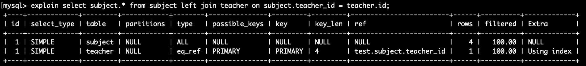


### 2.1.5、ref

`ref` 表示对于每个索引键值，可能会存在多条匹配的记录。通常用于连接操作，其中连接字段是普通索引而不是唯一索引或主键。

例子：

```sql
explain
SELECT
	student.name AS student_name,
	subject.name AS subject_name,
	score.score
FROM
	student_score score
JOIN student student ON
	score.student_id = student.id  -- student_score.student_id 普通索引
JOIN subject subject ON
	score.subject_id = subject.id; -- student_score.subject_id 普通索引
```


### 2.1.6、ref_or_null

`ref_or_null` 表示对于每个索引键值，可能会存在多条匹配的记录，包括匹配 NULL 值的记录。通常用于连接操作，其中连接字段是普通索引而不是唯一索引或主键。
例子：

```sql
explain select * from teacher where name = 'wangsi' or name is null;
```

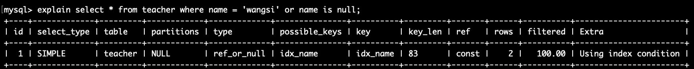


### 2.1.7、index_merge

- 当查询中的条件涉及多个列，并且这些列上都有适当的索引时，MySQL 可能会选择使用 `index_merge` 访问方法。
- `index_merge` 将通过多个索引的扫描和合并来获取满足查询条件的记录。

例子：

```sql
explain select * from teacher where id = 1 or teacher_no = 'T2010001';
```

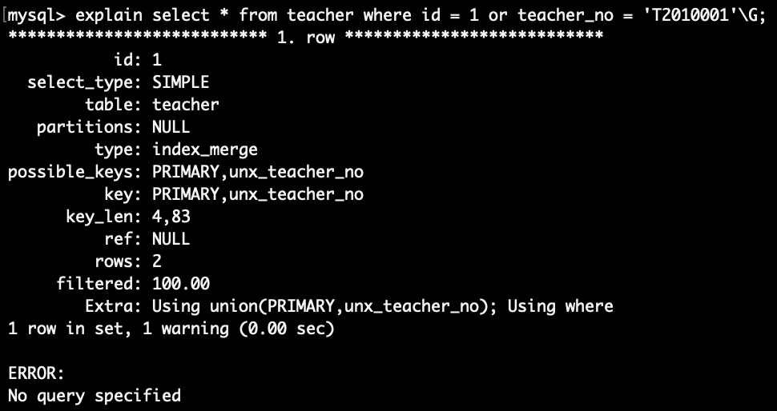

在 teacher 表中， id 和 teacher_no 上面都创建了索引。

MySQL 可能会选择使用 `index_merge` 访问方法。它将会扫描 `id` 索引、`teacher_no ` 索引，并将它们的结果进行合并，以找到满足所有条件的记录。


### 2.1.8、range

- 当查询中的条件包含范围条件（如 `<`, `>`, `BETWEEN` 等），并且适当的索引可用时，MySQL 可能会选择使用 `range` 访问方法。
- `range` 允许在索引上进行范围扫描，以获取满足查询条件的记录。

例子：

```sql
explain select * from subject where id between 1 and 3;
```

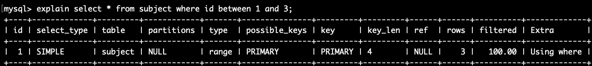


### 2.1.9、index

- `type` 列为 "index" 表示查询使用了索引访问方法。
- 索引访问方法表示 MySQL 可以使用某个索引来直接定位和检索满足查询条件的数据行，而不需要进行全表扫描。
- 使用索引访问方法通常比全表扫描更有效，因为它可以根据索引的排序顺序快速定位所需的数据。


例子：

```sql
explain select id from subject;
```

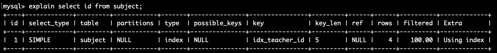

### 2.1.10、ALL

当 `type` 列的值为 "all" 时，表示查询执行了全表扫描。全表扫描是指 MySQL 需要遍历整个表的每一行来匹配查询条件，而没有使用索引来加速查询。

全表扫描通常在以下情况下发生：

1. 当没有适用于查询条件的索引时，MySQL无法利用索引来加速查询，只能进行全表扫描。
2. 查询条件使用了不支持索引的操作符，例如使用了模糊匹配的 `%` 符号开头的 LIKE 查询。
3. 表的数据量较小，全表扫描的性能影响较小。

例子：

```sql
explain select * from subject;
```

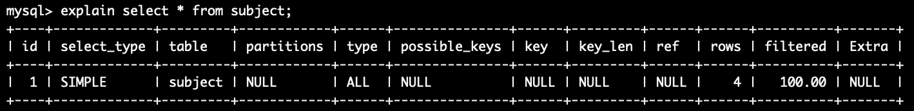


## 2.2、key

`key`列显示了查询实际使用的索引的名称。如果该列的值为NULL，表示查询没有使用索引；如果有具体的索引名称，表示查询使用了相应的索引进行优化。

## 2.3、key_len 

`key_len`列显示了索引的字节数量，用于衡量索引的大小。它用于确定MySQL选择使用哪个索引来执行查询。

key_len 计算规则 :

- 可以为NULL的列的key长度比非NULL列的key长度大1

- 如果索引列是字符型字段，则索引列数据类型本身占用空间跟字符集有关。

  ```
  字符集           1个字符占用的字节数（Maxlen）
  GBK             2
  UTF8            3
  UTF8mb4         4
  latin1          1                             注：latin1字符集编码下，不支持插入中文字符。
  
  所以CHAR(M)类型占用空间为M * Maxlen 。
  ```

- 如果索引列是变长的(比如varchar)，则在索引列数据类型本身占用空间的基础上再加2。

  ```sql
  explain select * from student where student_no ='20200004'  
  
  -- key_leng:83 
  -- student_no列被定义为varchar(20)类型，并且有一个名为unx_student_no的唯一索引
  -- 20 *4 +1（可能为null） + 2（长度可变） = 83
  ```

  


## 2.4、ref

当使用索引来过滤数据时，`ref` 列通常会反映出用于限定索引扫描范围的条件。这些条件可能是单个列的值，也可能是多个列的组合条件。


## 2.5、rows

`rows` 列表示执行查询所估计的检索行数。它代表了 MySQL 估计需要读取的行数。

较小的 `rows` 值表示查询的效率较高，`rows` 列对于分析查询性能和优化查询非常有用，可以通过观察该值来判断查询是否需要进一步优化或调整索引以提高性能。


## 2.6、filtered

`filtered` 列表示查询结果中行通过过滤条件的概率加权比例，值介于 0 和 1 之间。

较高的值表示过滤条件有效，较低的值表示效果不好。它用于评估查询的过滤效果和优化查询性能。

它的值是根据统计信息和索引选择进行估算的，并不是实际执行查询时的确切过滤比例。


## 2.7、Extra

`Extra` 列提供了一些额外的信息，用于解释查询执行计划的细节和特殊情况。


##### 1、Using filesort

表示查询需要对结果集进行文件排序操作。通常是由于查询包含 `ORDER BY` 子句，而无法使用已经存在的索引进行优化。

例：

```sql
explain select * from subject order by name;
```

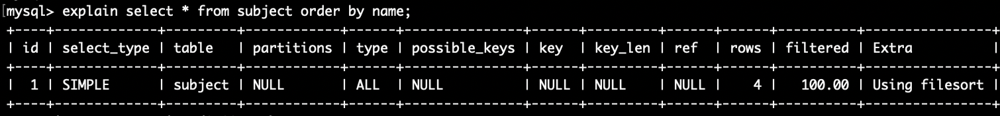


##### 2、Using temporary

表示查询需要使用临时表来处理结果集。通常是由于查询包含分组或排序操作，而无法使用已经存在的索引进行优化。

例子：

```sql
EXPLAIN SELECT subject.*
FROM subject
	LEFT JOIN teacher ON subject.teacher_id = teacher.id
UNION
SELECT subject.*
FROM subject
	RIGHT JOIN teacher ON subject.teacher_id = teacher.id;
```

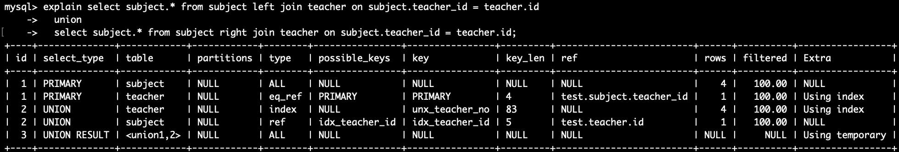

#####  3、Using index

表示相应的select操作中使用了覆盖索引（Covering Index）即索引可以满足查询的所有要求，而不需要访问表的数据行，效率不错！

- 如果同时出现 using where，表明索引被用来执行索引键值的查找
- 如果没有同时出现 using where，表明索引用来读取数据而非执行查找动作

例子：

```sql
EXPLAIN SELECT subject.*
FROM subject, student_score, teacher
WHERE subject.id = student_id
	AND subject.teacher_id = teacher.id;
```

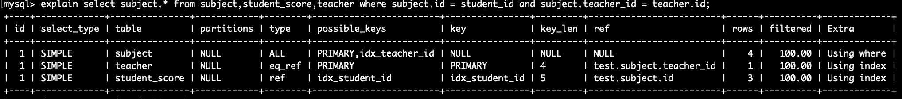

##### 4、Using where

表示查询使用了 WHERE 子句进行过滤。


##### 5、Using join buffer

表示查询使用了块嵌套循环连接算法（Block Nested-Loop Join）来处理连接查询。

例：

```sql
EXPLAIN SELECT student.*, teacher.*, subject.*
FROM student, teacher, subject;
```

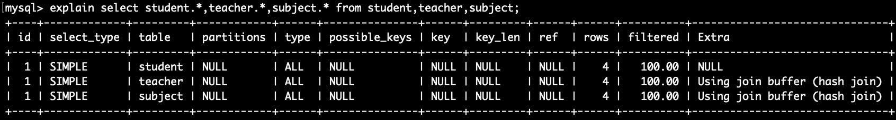


join的原理就是嵌套循环连接，驱动表作为第一层，被驱动表作为第二层，情况基本如下： 

```
for 驱动表的每行记录 in 驱动表的记录
	for 被驱动表每行记录 in 被驱动表的记录
		if (on条件（驱动表的每行记录，被驱动表的每行记录）？return true : false
```

时间复杂度为 count(驱动表的记录) x count(被驱动表)。

这样一条一条的查就像双重循环，效率低下，被驱动表如果数据量大会出现性能瓶颈。

缓存驱动表可以提高连接查询的效率，化器一般会优先选择小表做驱动表。所以使用 inner join 时，排在前面的表并不一定就是驱动表。对于被驱动表的每一条记录，都会从中取出查询字段与 join buffer 中的多条驱动表记录进行匹配。这个过程有效地减少了遍历全表的次数，提高了连接查询的效率。

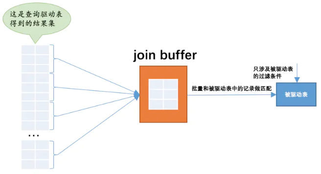

 复杂度也从O(n^2) 变成了 O(n)

 


#####  6、impossible where

表示查询的 WHERE 子句是不可能成立的，即它将返回一个空结果集。
例子：

```sql
explain select * from teacher where name = 'wangsi' and name = 'lisi';
```

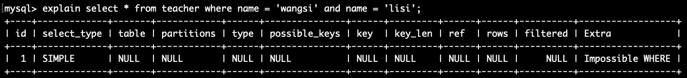

##### 7、distinct

Extra 列为 `Using Index; Using Distinct"` 表示查询使用了覆盖索引和去重操作。覆盖索引可以避免回表操作，提高查询效率；去重可以消除结果集中的重复记录，减少查询开销。


需要注意的是，使用 DISTINCT 会增加查询的开销，因为 MySQL 必须在内存或磁盘上对所有查询结果进行排序或分组，以找出唯一的记录。因此，在使用 DISTINCT 时需要权衡查询效率和结果准确性之间的关系。


例子：

```sql
EXPLAIN SELECT DISTINCT teacher.name
FROM teacher
	LEFT JOIN subject ON teacher.id = subject.teacher_id;
```

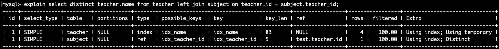


##### 8、Select tables optimized away

SELECT操作已经优化到不能再优化了（MySQL根本没有遍历表或索引就返回数据了）
例子：

```sql
explain select min(id) from subject;
```

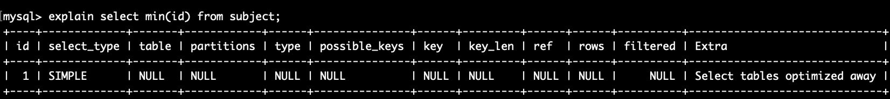


# 三、索引最佳实践

## 实例表

```sql
 create table employees ( 
   id int(11) not null auto_increment, 
   name varchar(24) not null default '' comment '姓名', 
   age int(11) not null default '0' comment '年龄',
   position varchar(20) not null default '' comment '职位',
   hire_time timestamp not null default current_timestamp comment '入职时间',
   primary key (id), 
     
   key idx_name_age_position (name,age,position) using btree ) 
   engine=innodb auto_increment=4 
   default charset=utf8 comment='员工记录表'; 
```

```sql
   INSERT INTO employees(name,age,position,hire_time) VALUES
   ('LiLei',22,'manager',NOW()); 
   
   INSERT INTO employees(name,age,position,hire_time) VALUES
   ('HanMeimei', 23,'dev',NOW()); 
   
   INSERT INTO employees(name,age,position,hire_time) 
   VALUES('Lucy',23,'dev',NOW()); 
```

插入10万条测试数据

```sql
CREATE DEFINER=`root`@`%` PROCEDURE `InsertTestData`()
BEGIN
    DECLARE counter INT DEFAULT 1;
    
    -- 循环插入一万条测试数据
    WHILE counter <= 100000 DO
        INSERT INTO employees (name, age, position, hire_time)
        VALUES 
            (CONCAT('Employee', counter),
             FLOOR(RAND() * 50) + 20,  -- 随机生成年龄在20到69之间
             CASE FLOOR(RAND() * 3)     -- 随机生成职位
                WHEN 0 THEN 'Manager'
                WHEN 1 THEN 'Developer'
                ELSE 'Designer'
             END,
             CURRENT_TIMESTAMP - INTERVAL FLOOR(RAND() * 365) DAY);  -- 随机生成入职时间在过去一年内

        SET counter = counter + 1;
    END WHILE;
END
```


## 3.1 全值匹配

全值匹配是指查询中的条件与索引的全部列完全匹配。例如，如果你有一个复合索引（Composite Index），查询条件必须包括这个索引中的所有列才能进行全值匹配。

```mysql
EXPLAIN SELECT * FROM employees WHERE name= 'LiLei';   								  --  -- type: ref									  
 
EXPLAIN SELECT * FROM employees WHERE name= 'LiLei' AND age = 22;   
-- type: ref 

EXPLAIN SELECT * FROM employees WHERE name= 'LiLei' AND age = 22 AND position ='manager';  -- type: ref 
```


## 3.2 最左前缀法则

 如果索引了多列，要遵守最左前缀法则。即查询从索引的最左前列开始并且不跳过索引中的列。

```mysql
 EXPLAIN SELECT * FROM employees WHERE name = 'Bill' and age = 31;		  
 -- type: ref
 
 EXPLAIN SELECT * FROM employees WHERE age = 30 AND position = 'dev';  
 -- type: all

 EXPLAIN SELECT * FROM employees WHERE position = 'manager'; 						
 -- type: all
```


## 3.3 不在索引列上做任何操作

对索引列进行操作（计算、函数、自动或手动的类型转换）、函数操作或类型转换会导致索引失效，MySQL只能执行全表扫描。

为避免这种情况，应避免在索引列上进行操作，而是在查询条件中使用常量进行操作。这样可以保持索引的有效性，提高查询性能。

例1：

```mysql
 EXPLAIN SELECT * FROM employees WHERE name = 'LiLei';            
 -- type: ref
 
 EXPLAIN SELECT * FROM employees WHERE left(name,3) = 'LiLei';  	
 -- type: all
```

例2：

给hire_time增加一个普通索引：

```mysql
-- ALTER TABLE employees ADD INDEX idx_hire_time (hire_time) USING BTREE ; 

EXPLAIN select * from employees where date(hire_time) ='2018-09-30';     
-- type: all ，因为做了类型转换，索引失效
 
-- ALTER TABLE employees DROP INDEX idx_hire_time; 
```


## 3.4 在组合索引中，范围条件右侧的列无法使用索引

在组合索引中，范围条件右侧的列不会使用索引，而范围条件本身仍然有效。因此，设计索引时应将经常用于过滤和排序的列放在索引的最左侧。

```mysql
EXPLAIN SELECT *
FROM employees
WHERE name = 'Employee6'
	AND age = 22
	AND position = 'manager';   -- type: ref
```

```sql
EXPLAIN SELECT *
FROM employees
WHERE name > 'Employee6'
	AND age = 22
	AND position = 'manager';   -- type:all
```

[为什么范围后索引会失效呢？](https://blog.csdn.net/qq_33589510/article/details/123038988)

通过覆盖索引进行优化：

```sql
EXPLAIN SELECT name,age,position
FROM employees
WHERE name > 'Employee6'
	AND age = 22
	AND position = 'manager';   -- type: range
```


## 3.5 尽量使用覆盖索引

只访问索引的查询（索引列包含查询列），减少 select * 语句。

当一个查询需要返回大量的数据列时，使用覆盖索引可以避免不必要的回表操作。回表操作是指查询过程中，数据库需要通过索引查找到对应的行，并根据行的指针再次去访问表中的数据页获取完整的数据。这个过程会增加IO开销和访问时间。

通过使用覆盖索引，查询可以直接从索引中获取所需的数据列，而无需进行额外的回表操作。这样可以大大减少IO开销，提高查询性能。尤其在大数据量、高并发的情况下，使用覆盖索引可以显著减少数据库的负载。


## 3.6 !=,<>,not in,not exists 可能索引失效

索引的设计原则是按照某种顺序进行匹配和过滤，例如等值匹配或范围匹配。但是对于不等于、NOT IN、NOT EXISTS等条件，需要对整个表进行逐行比较，无法使用索引来加速查询。因此，MySQL通常会选择执行全表扫描来满足这些条件。

而对于 < 、 > 、 <=、>= 这些，mysql内部优化器会根据检索比例、表大小等多个因素整体评估是否使用索引

```mysql
EXPLAIN SELECT * FROM employees WHERE name != 'LiLei';   -- type:range
```


## 3.7 is null,is not null 常会索引失效

```mysql
EXPLAIN SELECT * FROM employees WHERE name is not null ;   -- type:all
```


## 3.8 like以通配符开头会索引失效

在进行模糊查询的时候，如果把 % 放在了前面，最左的 n 个字母便是模糊不定的，无法根据索引的有序性准确的定位到某一个索引，只能进行全表扫描，找出符合条件的数据。

例：

```mysql
EXPLAIN SELECT * FROM employees WHERE name like '%Lei' ;  -- type: all
```

>  如何解决like'%字符串%'索引不被使用的方法？

- 使用覆盖索引，查询字段必须是建立覆盖索引字段


```mysql
explain select name, age, position from employees where name like '%lei%'; -- type:index
```


而 like KK%  一般情况都会走索引：

```sql
EXPLAIN SELECT * FROM employees WHERE name like 'Employee6%';  -- type:range
```

这里其实用到索引下推。

索引下推是MySQL5.6引入的优化特性，用于加速查询操作。

在之前版本中，当使用非主键索引进行查询时，存储引擎返回数据给MySQL服务器层，然后由服务器层判断是否符合条件。而在MySQL5.6及以上版本，索引下推允许存储引擎在过滤索引条件时，将一部分判断条件传递给存储引擎，使得存储引擎能够在过滤索引时剔除不符合条件的索引项，从而减少回表查询的次数。这种优化特性在联合索引中尤其有用，例如在匹配名字以'LiLei'开头的索引后，还能在存储引擎层对age和position进行过滤，减少回表查询的开销。


索引下推会减少回表次数，对于innodb引擎的表索引下推只能用于二级索引，innodb的主键索引（聚簇索引）树叶子节点上保存的是全行数据，所以这个时候索引下推并不会起到减少查询全行数据的效果。


对于范围查找，MySQL一般不采用索引下推优化。这可能是因为MySQL认为范围查找过滤结果集较大，例如使用类似`like 'KK%'`的查询，而通常这种情况下过滤后的结果集较小。不过，并非绝对规律，有时即便是`like 'KK%'`也未必会采用索引下推。


## 3.9 字符串不加单引号索引失效

当进行字符串比较时，如果字符串没有加单引号，MySQL可能会将其解释为字段名而不是字符串值，从而导致索引失效。

```mysql
EXPLAIN SELECT * FROM employees WHERE name = '1000';  -- type: ref
EXPLAIN SELECT * FROM employees WHERE name = 1000;    -- type: all
```


## 3.10 in或or在数据量大时走索引

in和or在表数据量比较大的情况会走索引，在表记录不多的情况下会选择全表扫描。

```mysql
EXPLAIN SELECT *
FROM employees
WHERE name = 'LiLei'
	OR name = 'HanMeimei';  -- type:range
```

 

## 3.11 order by 优化

- mysql 支持两种排序方式：filesort 和 index。"Using index"表示 mysql 可以通过扫描索引本身完成排序，效率较高；而"Using filesort"表示 mysql 需要使用临时文件进行排序，效率较低。

- 使用 order by  语句时，有两种情况下可以使用"Using index"：

  1. order by 子句中使用了索引的最左前列。
  2. where 子 句与 order by 子句的条件列组合满足索引的最左前列。

- 尽量在索引列上完成排序，遵循最左前缀法则。

- 如果 order by 的条件列不在索引中，将会产生 "Using filesort"。

- 尽可能使用覆盖索引，即查询的列都在索引中，避免回表操作，提高查询性能。

-  group by 与 order by 类似，实质上是先排序后分组。对于 group by 的优化，如果不需要排序结果，可以使用 `order by null` 来禁用排序操作。注意，where 子句的条件比 having 子句更优，如果可以在 where 中完成限定条件，就不要放到 having 中。

  ```SQL
  -- 使用 ORDER BY NULL 禁用排序
  -- 找出每个产品的销售总额大于1000的产品，但并不需要对结果进行排序
  SELECT product_id, SUM(quantity * price) AS total_sales
  FROM sales
  GROUP BY product_id
  HAVING total_sales > 1000
  ORDER BY NULL;
  
  -- 使用 WHERE 子句在数据处理前进行过滤
  SELECT product_id, SUM(quantity * price) AS total_sales
  FROM sales
  WHERE price > 10  -- 进行额外的条件过滤
  GROUP BY product_id
  HAVING total_sales > 1000;
  
  -- 在 HAVING 子句中完成过滤条件，但尽量避免
  SELECT product_id, SUM(quantity * price) AS total_sales
  FROM sales
  GROUP BY product_id
  HAVING total_sales > 1000 AND price > 10;  -- 尽量将条件放到 WHERE 子句中
  ```

  


# 四、索引设计原则

## 4.1、代码先行，索引后上

一般情况下，建立索引不应该在表创建时立即进行，而是应在主体业务功能开发完毕后，通过分析涉及该表的SQL语句来决定索引的建立。


## 4.2、联合索引尽量覆盖条件

可以设计少数联合索引，确保每个索引包含SQL语句中的`WHERE`、`ORDER BY`、`GROUP BY`字段，且字段顺序满足最左前缀原则。避免过多单值索引的建立。


## 4.3、不要在小基数字段上建立索引

建立索引时，通常选择基数较大的字段，即具有多个不同值的字段，以充分发挥B+树快速二分查找的优势。对于基数很小的字段，如性别等，建立索引可能不划算，因为索引树中只包含极少的不同值，无法实现快速的二分查找。


## 4.4、长字符串我们可以采用前缀索引

尽量对字段类型较小的列设计索引，如 tinyint，以减少磁盘空间占用并提高性能。对于大字段如 varchar(255)，可以考虑优化，例如使用前缀索引，只对前几个字符建立索引，以平衡性能和空间占用。需要注意，前缀索引在搜索时可提高效率，但在排序（order by）和分组（group by）操作中可能会受限。


## 4.5、where与order by冲突时优先where

通常情况下，应该优先设计索引以满足`WHERE`条件，使得在筛选数据时能够快速使用索引。这是因为基于索引的`WHERE`条件筛选通常能够迅速减少要处理的数据量，从而降低排序的成本。


## 4.6、in和exsits优化

优化原则上，使用小表驱动大表，即小的数据集驱动大的数据集。

当A表的数据集大于B表的数据集时，in优于exists

```mysql
select * from A where id in (select id from B)
```

```java
//等价于：
 for(select id from B){
     select * from A where A.id = B.id
 }
```

当A表的数据集小于B表的数据集时，exists 优于 in

```mysql
select * from A where exists (select 1 from B where B.id = A.id)
```

```java
//将主查询A的数据，放到子查询B中做条件验证，根据验证结果（true或false）来决定主查询的数据是否保留
//等价于
for(select * from A){
 select * from B where B.id = A.id
}
```


## 4.7、索引设计场景举例

在社交APP中，用户搜索涉及多条件筛选，如地区、性别、年龄、身高、爱好等。对于大数据量的用户表，设计合理的索引是关键。常见的策略包括使用联合索引，如`(province, city, sex)`，以优化同城、性别筛选。对于年龄范围的查询，将范围条件放在最后，并考虑优化SQL写法，如`(province, city, sex, hobby, age)`。

又比如针对最近一周登录的用户，考虑引入辅助字段`is_login_in_latest_7_days`，并设计索引`(province, city, sex, hobby, is_login_in_latest_7_days, age)`。这样的多字段索引能够过滤掉大部分数据，提高性能。对于一些特殊查询，如按受欢迎度和性别排序，可以设计辅助索引，如`(sex, score)`。

核心思想是利用一两个复杂的多字段联合索引应对大多数查询，再用一两个辅助索引处理非典型查询，以确保表的查询性能。


# 五、常见的分页场景优化技巧

## 5.1、非主键字段排序的分页查询优化

```mysql
explain select * from employees ORDER BY name limit 90000,5;  

-- type ： All
-- Extra: Using filesort
```

原始查询使用 `ORDER BY name` 并没有利用到 `name` 字段的索引，因此导致了全表扫描，且 `EXTRA` 中标记为 "Using filesort"，表示使用了文件排序。

优化思路是通过两步查询，首先仅在排序字段上进行排序并限制结果集，然后再通过主键关联获取完整的记录。关键是让排序时返回的字段尽可能少。优化后的SQL如下：

```mysql
select * from employees e 
   inner join  
   (select id from employees order by name limit 90000,5) ed
on e.id = ed.id;
```

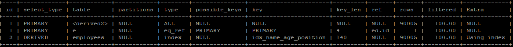

原 SQL 使用的是 filesort 排序，而优化后的 SQL 使用的是索引排序。

对比两条sql执行的时间消耗：

```
Query_time: 0.115218  Lock_time: 0.000004 Rows_sent: 5  Rows_examined: 190005

Query_time: 0.025084  Lock_time: 0.000005 Rows_sent: 5  Rows_examined: 10
```

可见优化后的sql 执行时间和扫描的行数都少了很多。
