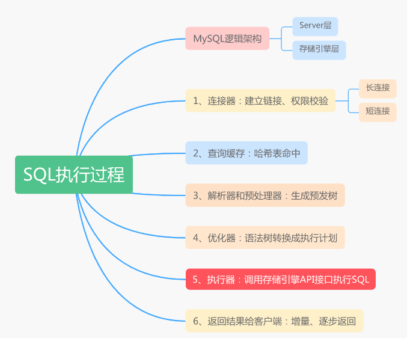
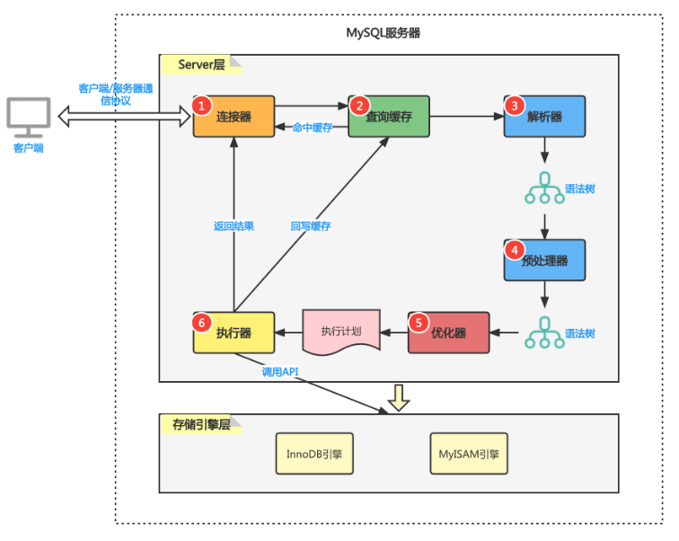
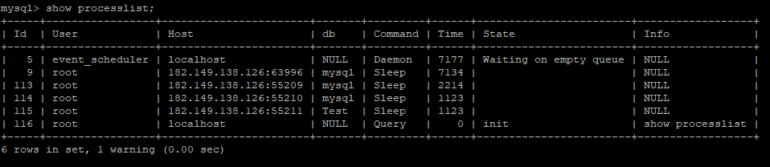

思维导图看SQL执行过程



MySQL的逻辑架构图看SQL执行过程

```sql
select * from user where id=101；
```

通过MySQL的逻辑架构图，看一条SQL查询语句在MySQL 内部的执行过程。



MySQL服务器的逻辑架构分为两层: Server层和存储引擎层。

1. Server 层包括连接器、查询缓存、解析器、预处理器、优化器、执行器等，涵盖 MySQL 的大多数核心服务功能，以及所有的内置函数（如日期、时间、数学和加密函数等），所有跨存储引擎的功能都在这一层实现，比如存储过程、触发器、视图等。
2. 存储引擎层负责数据的存储和提取。其架构模式是插件式的，支持 `InnoDB`、`MyISAM`、`Memory` 等多个存储引擎。现在最常用的存储引擎是 `InnoDB`，它从 MySQL 5.5.5 版本开始成为了默认存储引擎。
   

### 第一步：连接器

首先，通过连接器连接MySQL服务器，连接器负责跟客户端建立连接、获取权限、维持和管理连接。连接命令一般这么写：

```sql
mysql -h$ip -P$port -u$user -p
```

连接过程在完成TCP三次握手后，连接器会验证你得身份（用户名、密码），如果用户名密码认证通过，连接器会到权限表里面查出你拥有的权限并暂时保存。当前连接中的所有权限校验都以当前权限为准。即使管理员对这个用户的权限做了修改，不会影响已经建立好连接的权限，只会影响新建连接的权限。

通过 `show processlist` 命令可以查询客户端连接。



连接完成后，如果没有后续动作，连接将处于空闲状态，上图中 Command 列显示为 Sleep 的这一行，表示现在系统里面有一个空闲连接。

空闲连接并不会一直占用！客户端如果太长时间没动静，连接器就会自动将它断开。这个时间是由参数`wait_timeout` 控制的，默认值是 8 小时(28800秒)。

通过 `show variables like 'wait_timeout` 可以查看空闲连接配置。

```
mysql> show variables like 'wait_timeout';
+---------------+-------+
| Variable_name | Value |
+---------------+-------+
| wait_timeout  | 28800 |
+---------------+-------+
1 row in set (0.01 sec)
```

#### 短连接和长连接

连接器的连接又分短连接和长连接

- 短连接：比如连接完，执行一个查询，就断开，这是短连接；
- 长连接：执行一个查询，不断开，下次查询还用这个连接，持续使用，就是长链接

建立连接的过程通常是比较复杂的，所以要尽量减少建立连接的动作，尽量使用长连接。业务开发中通常使用数据库连接池（DBCP、Druid等）来管理连接；

> 长连接就一定好吗？

MySQL 在执行过程中临时使用的内存是管理在连接对象里面的。这些资源会在连接断开的时候才释放。所以如果长连接累积下来，可能导致内存占用太大，被系统强行杀掉（OOM），从现象看就是 MySQL 异常重启了。

> 如何解决长连接占用内存问题?

1. 定期断开长连接。使用一段时间，或者程序里面判断执行过一个占用内存的大查询后，断开连接，之后要查询再重连。
2. 重置连接。如果你用的是 MySQL 5.7 或更高版本，可以在每次执行一个比较大的操作后，通过执行 `mysql_reset_connection` 来重新初始化连接资源。这个过程不需要重连和重新做权限验证，但是会将连接恢复到刚刚创建完时的状态。

注：业务开发中，我们通常使用数据库连接池（`Dbcp`、`Druid`等）连接MySQL服务器，连接的管理交给连接池来完成，我们不需要关心连接的细节问题。

### 第二步：查询缓存

#### 查询缓存的命中过程

在解析一个查询语句之前，如果查询缓存是打开的，MySQL会优先检查这个查询是否命中查询缓存中的数据。

如果没有命中缓存，就会继续执行后面的执行阶段，并且执行完成后，会将查询结果再放入的缓存中。

如果命中了缓存，在返回查询结果之前，MySQL会检查一次用户权限，如果用户没有权限，会返回没有权限的错误信息；如果权限OK，MySQL会跳过后面的处理阶段，直接从缓存中拿到结果并返回给客户端；


#### 查询缓存以什么形式存在？

之前执行过的语句和结果以哈希表的形式缓存到了内存中，key就是 `sql` 语句，value是语句的结果。所以SQL语句必须完全一样才能够命中缓存。

可以通过`show global variables like 'query_cache%'`查看服务器缓存相关参数

```sql
mysql> show global variables like 'query_cache%';
+------------------------------+----------+
| Variable_name                | Value    |
+------------------------------+----------+
| query_cache_type             | OFF      |
+------------------------------+----------+
```

```
query_cache_type：ON为打开查询缓存，OFF为关闭查询缓存
```

查询缓存真的这么有用吗？
大多数情况下不建议使用查询缓存，因为查询缓存往往弊大于利。

查询缓存的失效非常频繁，只要有对一个表的更新，这个表上所有的查询缓存都会被清空。所以查询缓存的命中率非常低。除非你的业务就是有一张静态表，很长时间才会更新一次。

需要注意的是，MySQL 8.0 版本直接将查询缓存的整块功能删掉了，也就是说 8.0 开始彻底没有这个功能了。


### 第三步：解析器和预处理器

#### 解析器

解析器通过 词法分析 和 语法分析 验证SQL是否合法。

1、词法分析 通过关键字将SQL语句进行解析，并生成一颗对应的“解析树”。

```sql
mysql> select * from user where id=101；
```

例如：一条 SQL 语句，MySQL 需要识别出里面的字符串分别是什么，代表什么。需要识别出来 `select` 是一条查询语句，并且要查询的表是哪个user，列是id。

2、语法分析：解析器通过MySQL的语法规则判断SQL语句是否合法，如果SQL语句不合法，会提示错误信息：“You have an error in your SQL syntax”。语法规则的验证包括：关键字是否正确、关键字的顺序是否正确、引号是否前后正确匹配等；

#### 预处理器

预处理器处理的是解析器生成的“解析树”。它根据一些MySQL的规则进一步检查解析树是否合法。这里会检查数据表和数据列是否存在，还会解析名字和别名，看看它们是否有歧义等。

预处理器还会再校验用户权限。


### 第四步：优化器

通过解析器和预处理器，现在语法树被认为是合法的了，优化器负责将语法树转化成执行计划。执行计划决定了执行器会选择存储引擎的哪个方法去获取数据。

一条查询SQL语句可以有很多种执行方式，并且都返回相同的结果。优化器的作用就是找到其中最优的执行计划。

比如优化器是在表里面有多个索引的时候，决定使用哪个索引；或者在一个语句有多表关联（join）的时候，决定各个表的连接顺序。

MySQL使用基于成本的优化器，它会尝试预测一个查询使用某种执行计划时的成本，并选择其中成本最小的一个。

MySQL的查询优化器是一个非常复杂的部件，它使用了很多优化策略来生成一个最优的执行计划。并且，它不是万能的，它也有可能会选择错误的执行计划！关于优化器的内容，后面再单独谈论。


### 第五步：执行器

通过解析器和优化器阶段，MySQL生成了查询对应的执行计划**，**执行器负责根据这个执行计划调用存储引擎的API接口来完成整个查询工作。

```sql
mysql> select * from user where id=101；
```

比如我们这个例子中的表 user 中，ID 字段没有索引，那么执行器的执行流程是这样的：（没有索引，就是全表扫描，而且执行全表扫描这个动作是由执行器来做的。）

1. 调用 `InnoDB` 引擎API接口取这个表的第一行，判断 ID 值是不是 10，如果不是则跳过，如果是则将这行存在结果集中；(这里需要注意的是，`InnoDB` 引擎是按页读取数据并放到内存中，MySQL的执行器是按照行读取的数据。)
2. 调用引擎接口取“下一行”，重复相同的判断逻辑，直到取到这个表的最后一行。
3. 执行器将上述遍历过程中所有满足条件的行组成的记录集作为结果集返回给客户端。
   

对于有索引的表，执行的逻辑也差不多。第一次调用的是“取满足条件的第一行”这个接口，之后循环取“满足条件的下一行”这个接口，这些接口都是引擎中已经定义好的。


### 第六步：返回结果给客户端

查询执行的最后一个阶段是将结果返回给客户端。

如果开启了查询缓存，MySQL在这个阶段会将结果放到查询缓存中。

MySQL将结果集返回给客户端是一个增量、逐步返回的过程。例如关联表操作，当服务器处理完最后一个关联表，开始生成第一条结果时，MySQL服务器就可以向客户端逐步返回结果集了。

这样处理有两个好处：

1. 服务端减少内存消耗：服务器端无需存储太多的结果，也就不会因为要返回太多结果而消耗过多的内存。
2. 客户端及时得到响应：客户端可以第一时间获得返回的结果。