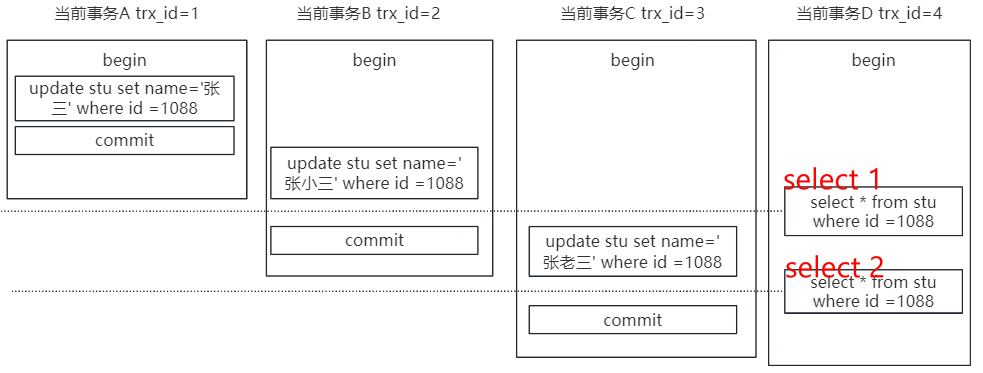
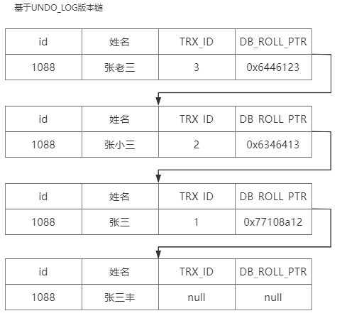
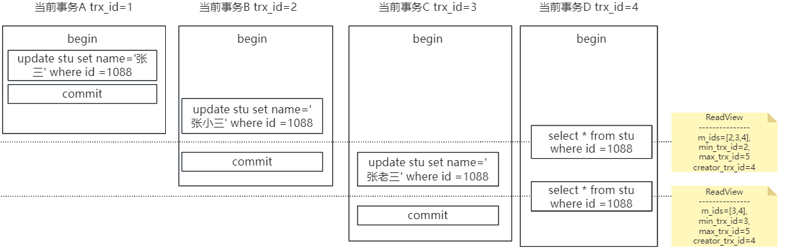
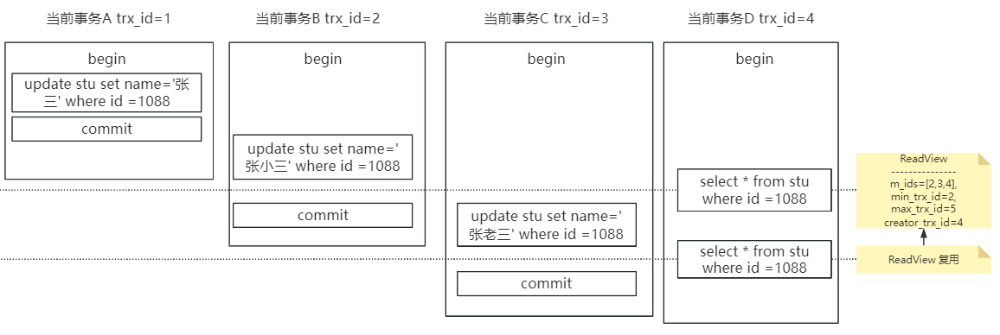
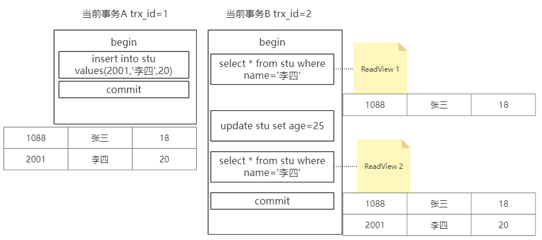
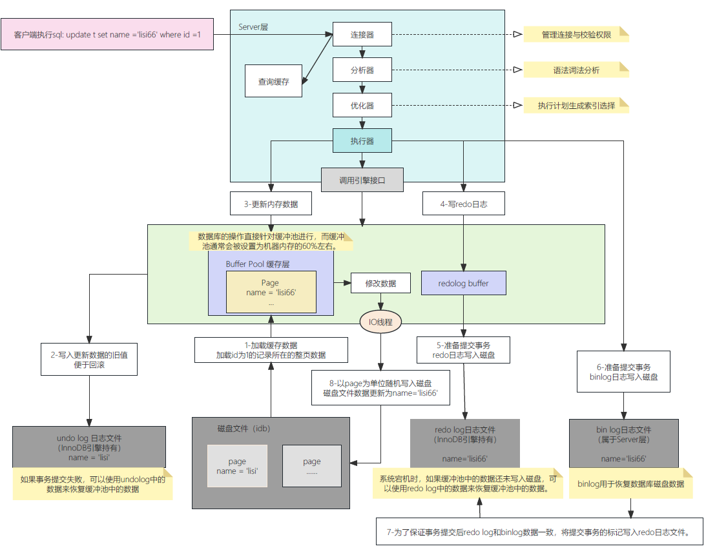

# 一、MVCC多版本并发控制机制

大家都知道 `mysql` 有四大特性，原子性，一致性，隔离性，持久性，其中隔离性又有四个级别，分别是读未提交，读已提交，可重复读 ，串行化，然后 `mysql` 的隔离性是如何解决掉的呢，带着疑问，大家一起来找答案。

## 1、什么是MVCC

在 `mysql` `InnoDB` 存储引擎下，读已提交，可重复读是基于 MVCC 进行并发事务控制的，MVCC 是基于数据版本对并发事务进行访问。

## 2、实例展现

> 注意：begin/start transaction 命令并不是一个事务的起点，在执行到它们之后的第一个修改操作 `InnoDB` 表的语句，事务才真正启动，才会向 `mysql` 申请事务 `id`，`mysql` 内部是严格按照事务的启动顺序来分配事务 id 的。

当事务隔离级别为 可重复读时：select 1 查询结果为张三，select 2 查询结果为张三

读已提交：select 1 查询结果为张三，select 2 查询结果为张小三

那么RR是怎么保证可重复读的呢，下面说。

## 3、MVCC基于UNDO_LOG版本链

undo_log（回滚日志） 版本链的数据不在引用后才会被删除，不用担心数据丢失问题
以上四个事务会有如下的版本链，通过链的方式保存数据的版本变化

可以看到多出两个字段：TRX_ID(事务ID) 和DB_ROLL_PTR(回滚指针，指向上一个版本变化的数据)

## 4、`ReadView`

### 4.1 快照读与当前读

- 快照读就是最普通的Select查询`sql`语句

- 当前读 指代码执行下面语句时进行读取的方式

  > Insert、Update、Delete、Select…for update(有锁)、Select…lock in share mode（锁）,会通过行锁和间隙锁来实现。

### 4.2 什么是`ReadView`

当事务开启，执行任何查询SQL时会生成当前事务的一致性视图`ReadView`。

- 读已提，在每次执行查询语句时都会重新生成`ReadView`
- 可重复读，该视图在事务结束之前都不会变化

`ReadView `是"快照读"SQL 执行时 MVCC 提取数据的依据 。在快照读的时候才会使用到 MVCC

`ReadView `是一个数据结构,包含四个字段：

- `m_ids`：当前活跃的事务编号集合。
- `min_trx_id`：最小活跃事务编号。
- `max_trx_id`：预分配事务编号，当前最大事务编号+1。
- `creator_trx_id`：创建者的事务编号

### 4.3 实例解析读已提交（RC）

如下图，在进行第一个select查询的时候，对应一个`ReadView`

如下是一个普通查询在 MVCC 下查找数据的过程，我们先看 RC 级别下是如何处理的

#### 4.3.1 第一次查询

第一次查询时，m_ids数组中的内容为[2,3,4]。

基于UNDO_LOG版本链，按照指针顺序从上往下判断，当前执行查询是否可访问数据的规则为：

- 当前事务的 `id`  =`creator_trx_id(4)`吗？是则说明就是当前这个事务的修改，可访问

- `trx_id` <`min_trx_id(2)` ? 是说明版本链上的这条数据的事务已提交，可访问

- `trx_id` >`max_trx_id(5)` ? 是说明版本链上的这条数据的事务在查询事务的Read_view生成后产生，不可访问

因此，根据指针顺序，版本链上的不同版本数据判断下来，仅TRX_ID=2 的数据可用访问，查询结果即为张三。

> MVCC 机制的实现就是通过 read-view 视图与 undo 版本链事务ID比对，通过比对，不同的事务可以根据数据版本链的规则读取同一条数据的不同版本。

#### 4.3.1 第二次查询

第二次查询时，m_ids数组中的内容为[3,4]。

基于UNDO_LOG版本链，按照指针顺序从上往下判断，当前执行查询是否可访问数据的规则为：

- 当前事务的 `id`  =`creator_trx_id(4)`吗？是则说明就是当前这个事务的修改，可访问

- `trx_id` <`min_trx_id(3)` ? 是说明版本链上的这条数据的事务已提交，可访问

- `trx_id` >`max_trx_id(5)` ? 是说明版本链上的这条数据的事务在查询事务的Read_view生成后产生，不可访问

因此，根据指针顺序，版本链上的不同版本数据判断下来，`ReadView` 可用读取好`TRX_ID=2`的数据。

### 4.4 实例解析可重复读（RR）

可重复读，仅在第一次执行快照读时生成 `ReadView`，后续快照读复用

因为ReadView进行了复用，并且原始的版本链也没有变化，两次的数据读取的肯定是一样的，都是张三

### 4.5 RR级别下使用MVCC能避免幻读吗

能，但不完全能，MVCC不是通过锁的方式去让事务完全的隔离，当连续多次快照读，`ReadView`会产生复用，没有幻读问题，但是当两次快照读之间存在当前读，`ReadView` 会重新生成，导致产生幻读

幻读：同一个事务中，同一条SQL第一次查询到的数据，和第二次查询不一致，多了数据或者少了数据，称为幻读
 

# 二、`BufferPool`缓存机制

`Innodb` 引擎 SQL 执行的 `BufferPool` 缓存机制

`InnoDB` SQL执行执行流程
执行一条update的修改SQL，需要经过Server层，再调用具体的执行引擎。

1、加载数据页，把需要修改数据所在的数据页，缓存到Buffer Pool

2、修改前记录，写undo日志，记录更改前数据，如果事务执行失败，使用undo日志进行数据回滚

3、更新Buffer Pool中的数据

4、准备提交事务，写redo日志，保存操作记录。redo日志用来恢复已提交事务的Buffer Pool

5、准备提交事务，写bin-log日志，保存操作记录。bin-log日志用来恢复磁盘数据

6、事务提交完成，此时bin-log日志写入成功，且在redo日志中记录commit标记。事务提交完成后bin-log日志和redo日志数据保持一致

7、数据持久化，IO线程不定期把Buffer Pool中的数据随机写入到磁盘，完成持久化

为什么 `mysql`不直接更新磁盘上数据？

磁盘随机读写的性能通常都非常的差。

MySQL不直接更新磁盘上的数据，而是利用Buffer Pool缓存机制将数据加载到内存中进行操作。这样可以提高性能和并发能力，并保证数据一致性。更新操作首先在内存中进行，然后顺序写入磁盘日志文件。这种方式使得MySQL能够处理大量读写请求，并保持高性能和高并发能力。