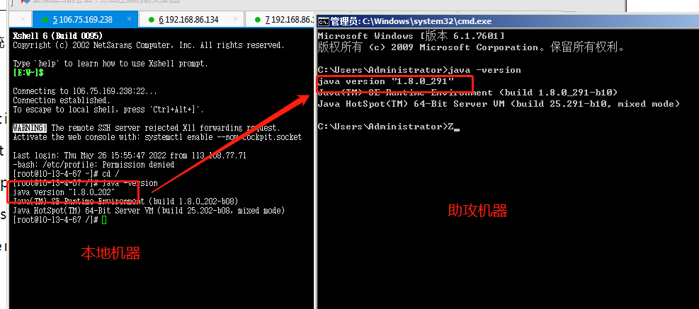
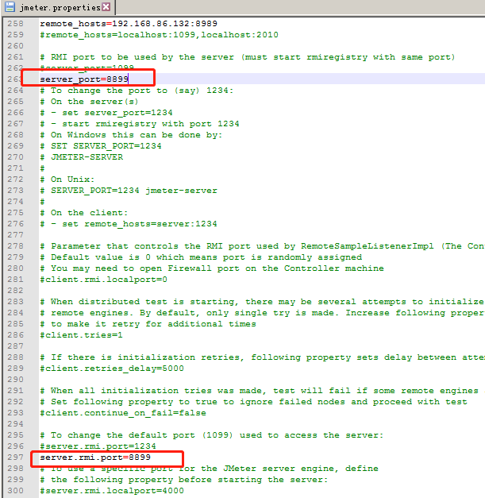
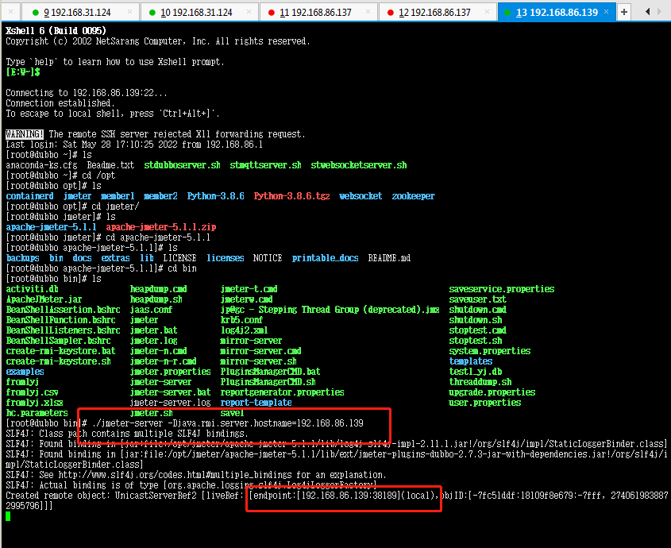
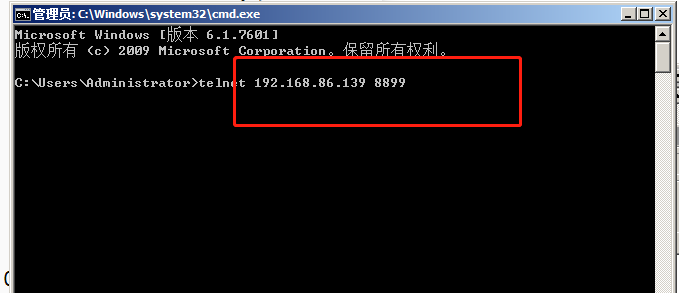
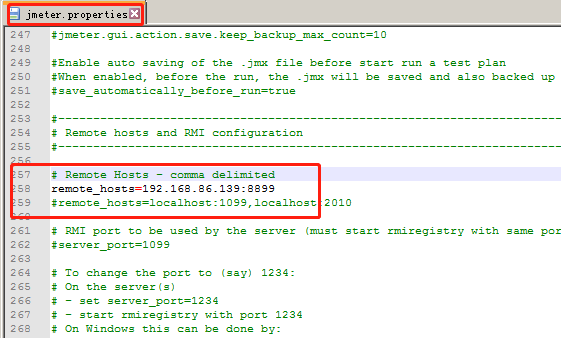
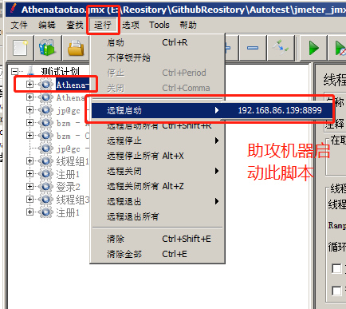
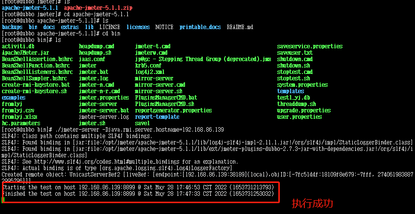

# JMeter 分布式压测部署手册

本手册适用于培育成员在团队内部搭建 JMeter 分布式压测环境，支持一台控制机 + N 台运行节点 (Slave)同时发起压测请求。

------

## 一、环境要求

| 项目        | 要求                                    |
| ----------- | --------------------------------------- |
| JDK 版本    | 全部节点必须使用 **相同版本 JDK**       |
| JMeter 版本 | 全部节点必须使用 **相同版本 JMeter**    |
| 网络        | 控制机需要能 ping 通所有 slave IP       |
| 端口        | 打开 TCP 1099 和 2000~4000 (JMeter RMI) |

------

## 二、节点角色解释

- **Master (192.168.1.12)**：JMeter 控制端
- **Slave (192.168.1.13)**：JMeter 运行节点

处于同一网段，必须可以通信

------

## 三、安装 & 配置

### 1. JMeter 安装

在所有节点（包括 Master 和 Slaves）安装 JMeter

> 推荐直接解压 apache-jmeter-5.5.zip 到同一目录结构，方便统一管理

### 2. 配置 jmeter.properties

#### Master

打开 `apache-jmeter-5.5\bin\jmeter.properties`

查找并配置：尾部追加一下信息

```properties
remote_hosts=192.168.1.12,192.168.1.13
server_port=1099
client.rmi.localport=50000
```


#### Slave

打开 `apache-jmeter-5.5\bin\jmeter.properties`

配置 RMI 端口：同样，在 192.168.1.13 上也要配置:

```
server_port=1099
client.rmi.localport=50000
```

192.168.1.13 机器的配置文件：remote_hosts=192.168.1.12,192.168.1.13❌ **不需要**


### 3. 配置提醒

- **如使用 Stepping Thread Group** （jp@gc plugins），必须确保 slave 节点也安装了相同版本 jar

  文件位置： `lib\ext\jmeter-plugins-casutg.jar`

- 如有 CSV 配置，必须把 .csv 同步到所有节点

------

## 四、运行步骤

### 每个 slave 节点

```cmd
cd apache-jmeter-5.5\bin
jmeter-server.bat
```

### 控制机运行

打开第二个 CMD 窗口：

```cmd
jmeter -n -t D:\repository\ProductionPerfMall\ProductionPerfMall.jmx \
  -R192.168.1.12,192.168.1.13 \
  -l D:\repository\ProductionPerfMall\result\result.jtl \
  -e -o D:\repository\ProductionPerfMall\result\report
```

### 或只让 slave 发压：

```cmd
jmeter -n -t D:\repository\ProductionPerfMall\ProductionPerfMall.jmx \
  -R192.168.1.13 \
  -l D:\repository\ProductionPerfMall\result\result.jtl \
  -e -o D:\repository\ProductionPerfMall\result\report
```

------

## 五、常见问题排查

| 环节        | 常见问题                         | 解决方法                                 |
| ----------- | -------------------------------- | ---------------------------------------- |
| 控制机      | Connection refused to host: self | IP 写错，本机 IP 实际为 192.168.1.12     |
| slave 节点  | jmeter-server.bat 未启动         | 手动打开 CMD 运行 jmeter-server.bat      |
| plugin 问题 | Stepping Thread Group 没有执行   | 确保 slave 节点 lib\ext 里有 plugins jar |
| CSV         | CSV 路径不符                     | 组织 .jmx 相对路径，统一文件结构         |

------

## 六、附录

### Windows 下运行 jmeter-server.bat 后查看是否启动成功

```cmd
netstat -ano | findstr :1099
```

### Windows 下开放端口方法：

```powershell
New-NetFirewallRule -DisplayName "JMeter RMI" -Direction Inbound -Protocol TCP -LocalPort 1099,2000-4000 -Action Allow
```

------

笔记人：【Athena】
更新时间：2025年4月21日

## jmeter分布式环境部署

1. 集群： 多台机器一起向外提供服务能力
2. 分布式： 分摊发起方的压力，产生更大的压力向服务器发起请求
3. 分布式环境部署:是分摊我们发起方的压力，要消耗发起方的资源的，助攻机器不能是被测项目机器

#### 1.jmeter分布式配置

##### 1.多台机器部署jmeter满足条件:

+ jdk 大版本要一致   `java -version`  大版本号要相同，小版本号可以不相同

+ jmeter版本要一致,jmeter的插件要一致(压缩使用同个包上传助攻机器)

+ 没有要求操作系统,可以使用不同操作系统(本地window,助攻机linux)

+ 不要用wifi网络

  <div align="left">  </div><br>

##### 2.配置助攻机器：

+ 修改配置文件jmeter.properties

  + server_port=自定义一个端口

  + server.rmi.port= 与上面相同的端口

  + server.rmi.ssl.disable=true 不开启加密认证传输

    <div align="left">  </div><br>

##### 3.启动服务

- 如果助攻机器是linux机器： 给jmeter的bin文件夹中的文件赋予执行权限

- 更新bin文件权限 chmod +x *

+ 启动命令:  ./jmeter-server -Djava.rmi.server.hostname=192.168.86.139

  (192.168.86.139 助攻机器IP)

  主控机器上执行  telnet 助攻机器ip 端口  -----检查主控机器和助攻机器网络是否通畅

  启动后控制机验证: cmd命令: telnet 192.168.86.139 8899
  8899 助攻机器的更新的端口

  <div align="left">  </div><br>

  <div align="left">  </div><br>

##### 4.控制机配置

+ 配置jmeter.properties
  + remote_hosts 添加助攻机器ip:端口，多个时，用英文逗号分开
  + server.rmi.ssl.disable=true  
  + mode=Standard  ---使用标准模式，开启之后，才能实时看到助攻机器的数据

<div align="left">  </div><br>

5.助攻机器启动jmeter脚本

- 助攻机器已上传运行的jmeter脚本

  <div align="left">  </div><br>

  <div align="left">  </div><br>

5.主控&助控机器说明

1. 只要助攻机器是启动的，主控和助攻之间的网络是通畅，那么我们主控是可以给助攻发任何指令
2. 主控机器上的脚本发生变化，助攻机器没有变，远程启动助攻机器执行脚本时，时按照最新的主控机器脚本来执行
3. 助攻机器一切行为，都是安装主控机器的指令执行
4. 有多台机器作为助攻机器时，活跃线程数，多条； 响应时间曲线，是不做任何处理，原样展示；tps曲线，原样展示
5. CLI命令行模式 -r参数

