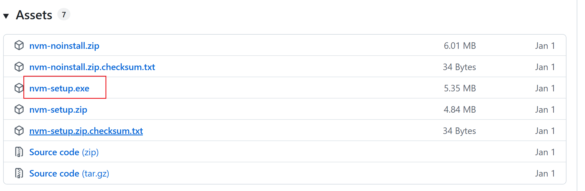

在 Windows 环境下管理 Node.js 版本，推荐使用 **nvm-windows**（Node Version Manager for Windows）。它允许你轻松地安装、切换和管理多个版本的 Node.js。

以下是如何在 Windows 上安装和使用 **nvm-windows** 的步骤：

### 1. 下载 nvm-windows 安装包

- 访问 [nvm-windows GitHub 仓库](https://github.com/coreybutler/nvm-windows/releases)。

  

- 下载最新的 `.zip` 文件（如 `nvm-setup.zip`）。

### 2. 安装 nvm-windows

- 解压并运行安装程序。
- 按照提示完成安装，默认安装路径通常是 `C:\Program Files\nodejs`。
- 安装过程中，可以选择是否将 `nvm` 添加到环境变量中，通常选择默认即可。

### 3. 安装 Node.js 版本

- 安装完成后，打开命令提示符（CMD）或 PowerShell。

- 使用 `nvm` 命令安装所需的 Node.js 版本。例如：

  ```
  nvm install 18.20.2 
  ```

  这样会安装 Node.js 14.17.0 版本。

### 4. 切换 Node.js 版本

- 使用以下命令切换 Node.js 版本：

  ```
  nvm use 18.20.2
  ```

  这将会切换到 Node.js 14.17.0 版本。

### 5. 查看当前安装的 Node.js 版本

- 可以使用以下命令查看当前安装的 Node.js 版本：

  ```
  node -v
  ```

### 6. 列出所有安装的 Node.js 版本

- 使用以下命令列出所有已安装的版本：

  ```
  nvm list
  ```

### 7. 卸载 Node.js 版本

- 如果不再需要某个版本的 Node.js，可以使用以下命令卸载它：

  ```
  nvm uninstall 14.17.0
  ```

使用 `nvm-windows` 可以轻松管理和切换多个 Node.js 版本，避免不同项目之间的版本冲突。