# 环境准备

## 1、检查jdk和maven版本

```
java -version
mvn -version	
```

本地javajdk ：21 maven版本：3.9.11

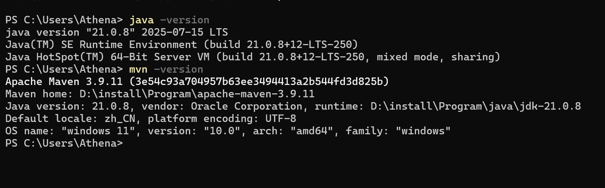

## 2、检查nodejs版本

```
node -v
```

本地nodejs：v18.20.2 
切换nodejs版本参考：[[Windows 上安装和使用 nvm]]]

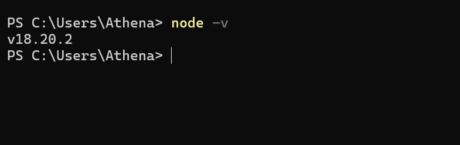


## 3、需要安装nginx

- [[Nginx安装(Windows)]]

## 4、准备数据库导入sql

- 查询数据库版本：

  ```
  SELECT VERSION();
  ```

  由于：由于 MySQL 5.7 不支持 utf8mb4_0900_ai_ci 排序规则，执行报错。[[MySQL 8.0 安装(windows)]]

- 创建数据库：lhub_dev

  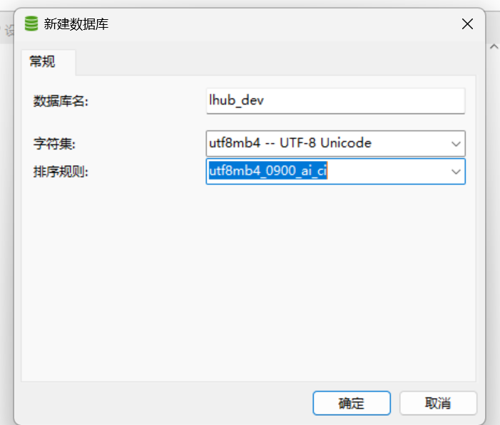

- 运行sql文件：lhub_dev_20250804.0310.sql

- 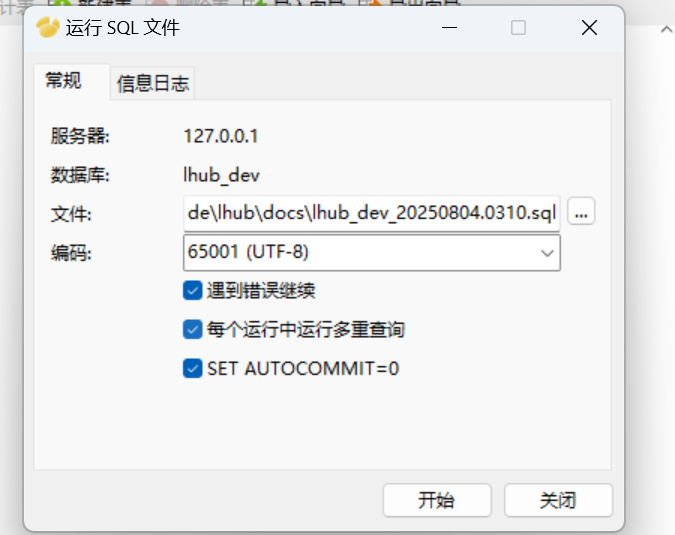

- 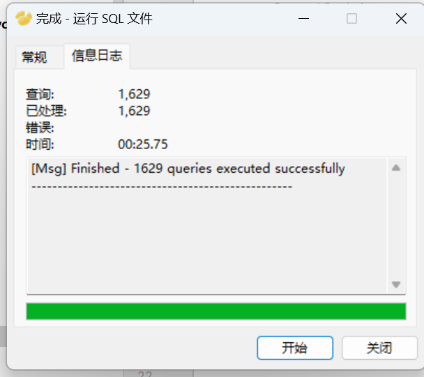

# 启动后端：cct-lhubdt

## 1、解压后打开cct-lhubdt

- [[IDEA中设置项目结构]]

  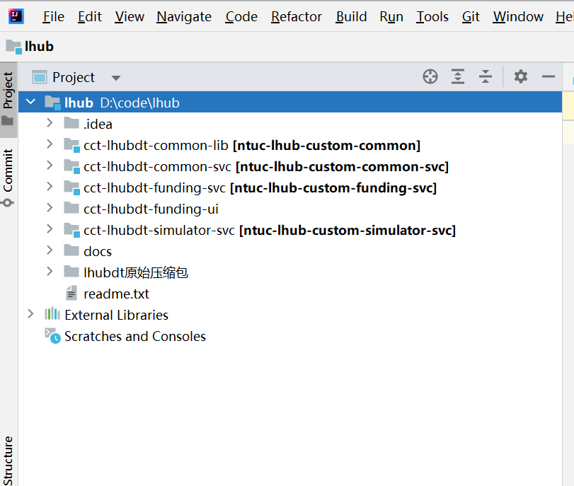


## 2、添加Application


```
common-svc
com.ntuc.lhub.custom.common.web.handler.SpringBootWebApplication
```

```
funding-svc
com.ntuc.lhub.custom.common.web.handler.SpringBootWebApplication
```

```
simulator-svc
com.ntuc.lhub.custom.common.web.handler.SpringBootWebApplicationNonSecure
```

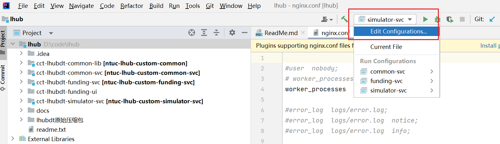

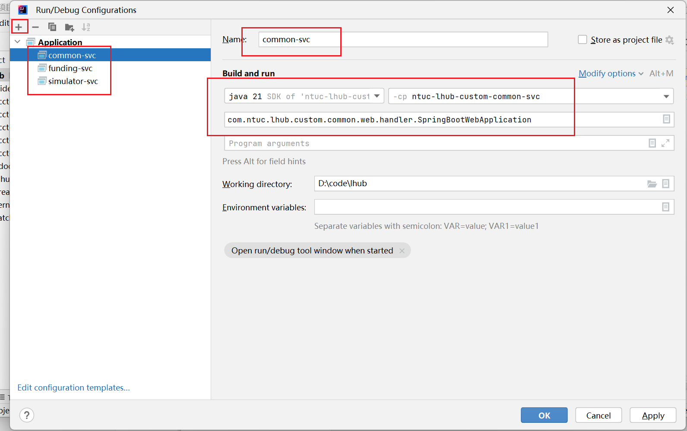

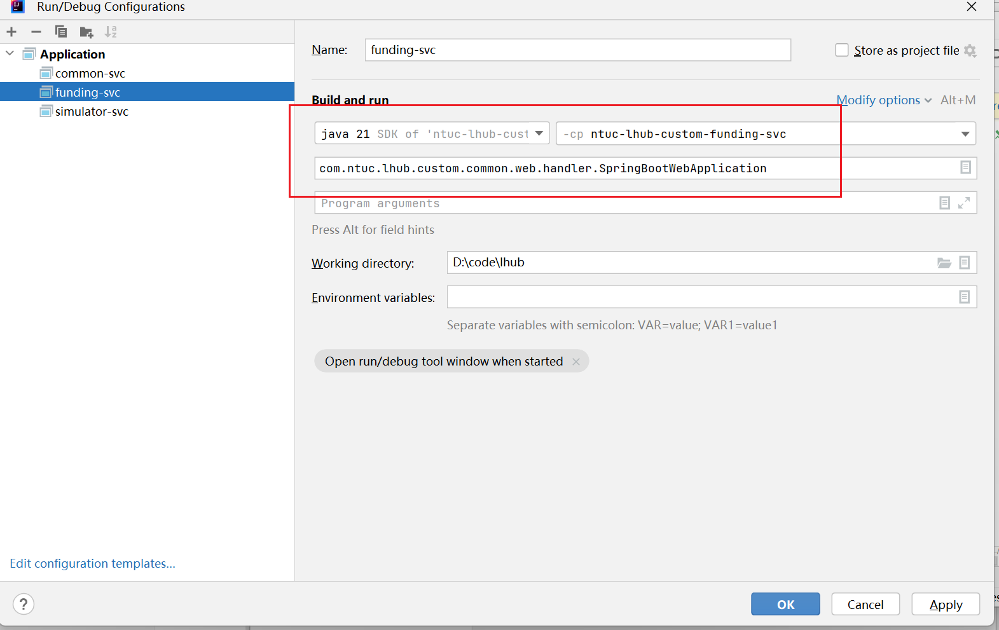

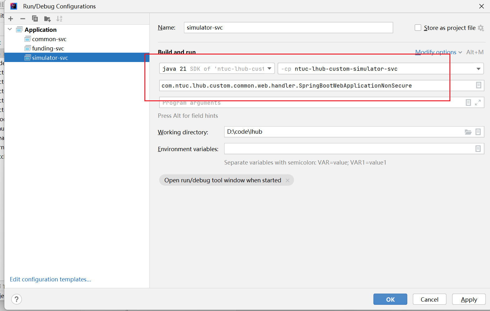

## 3、更改数据库ip、用户、密码

```
common-svc
funding-svc
simulator-svc
```


可以设置数据库密码同：

```
ALTER USER 'root'@'localhost' IDENTIFIED WITH mysql_native_password BY 'welcome1';
FLUSH PRIVILEGES;
```

- common-svc
- 改application-loc.properties文件 数据库连接ip和端口，用户和密码和测试环境设置一致不需要改

```
原来的：
spring.datasource.url=jdbc:mysql://10.176.56.125:3308/lhub_dev?autoReconnect=true&&useJDBCCompliantTimezoneShift=true&useLegacyDatetimeCode=false&serverTimezone=Asia/Singapore
spring.datasource.username=root
spring.datasource.password=welcome1
```

```
调整后：
spring.datasource.url=jdbc:mysql://127.0.0.1:3306/lhub_dev?autoReconnect=true&&useJDBCCompliantTimezoneShift=true&useLegacyDatetimeCode=false&serverTimezone=Asia/Singapore
spring.datasource.username=root
spring.datasource.password=welcome1
```

- funding-svc
- 改application-loc.properties

```
调整后：
spring.datasource.url=jdbc:mysql://127.0.0.1:3306/lhub_dev?autoReconnect=true&&useJDBCCompliantTimezoneShift=true&useLegacyDatetimeCode=false&serverTimezone=Asia/Singapore

```

- simulator-svc
- 改application-loc.properties

```
原来的：
spring.datasource.url=jdbc:mysql://cls.cd.lhubsg.com:3308/lhub_dev?autoReconnect=true&useSSL=false&useJDBCCompliantTimezoneShift=true&useLegacyDatetimeCode=false&serverTimezone=Asia/Singapore
spring.datasource.username=lhub_owner
spring.datasource.password=welcome1
```

```
调整后：
spring.datasource.url=jdbc:mysql://127.0.0.1:3306/lhub_dev?autoReconnect=true&&useJDBCCompliantTimezoneShift=true&useLegacyDatetimeCode=false&serverTimezone=Asia/Singapore
spring.datasource.username=root
spring.datasource.password=welcome1
```

## 4、检查maven仓库

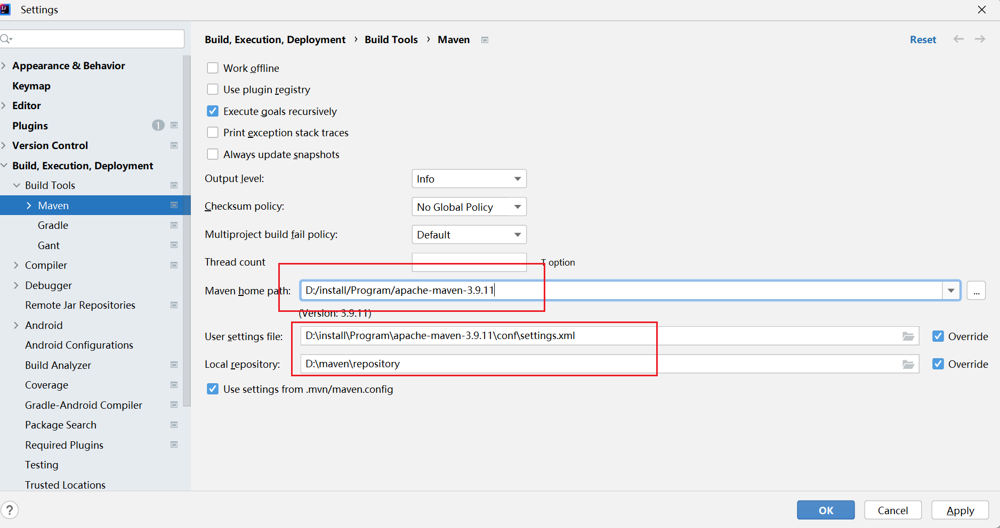

## 5、检查JDK版本

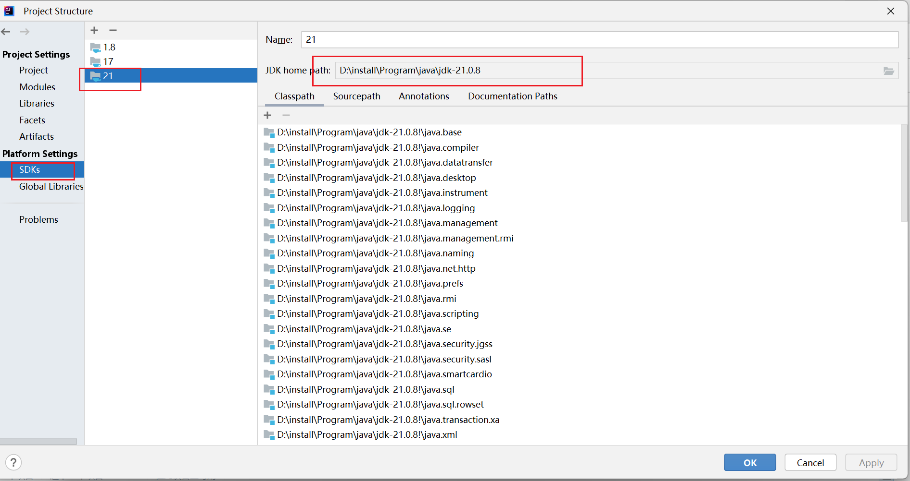
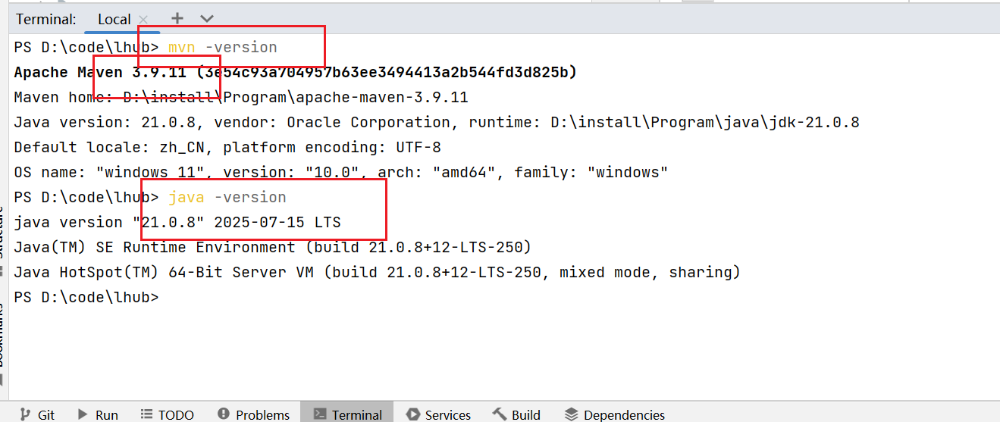
## 5、启动项目

- 首先的下载公共依赖cct-lhubdt-common-lib

```
cd .\cct-lhubdt-common-lib\
mvn clean install
```

- 再依次启动cct-lhubdt-common-svc、cct-lhubdt-funding-svc、cct-lhubdt-simulator-svc
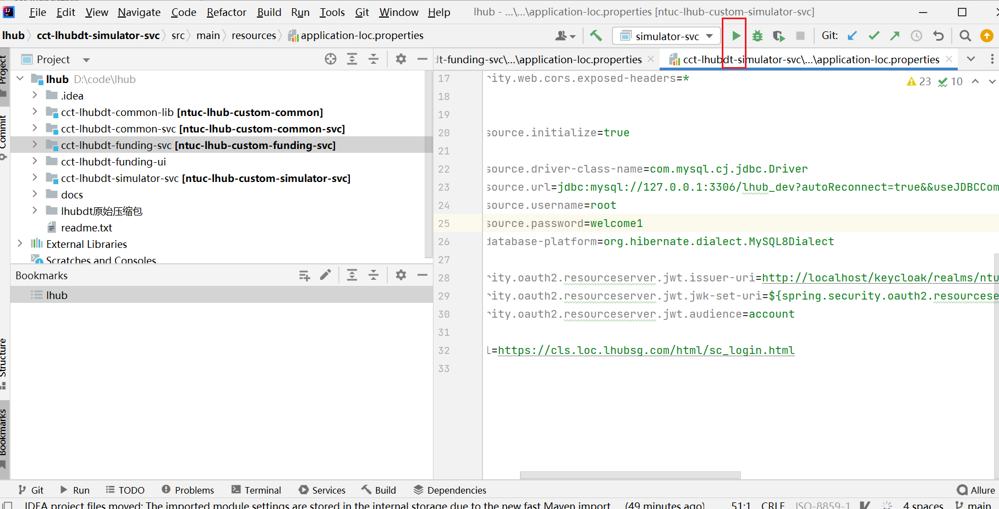
### Application启动
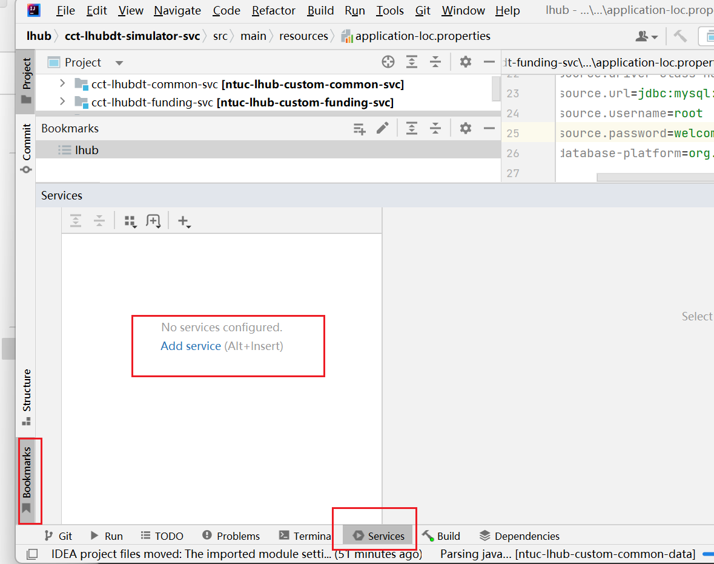

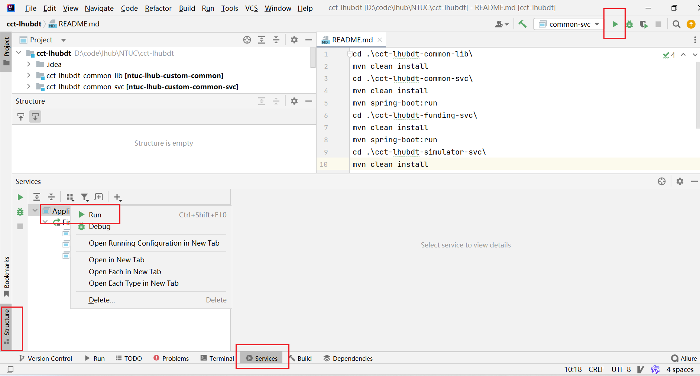


### maven命令启动：
[[IDEA-Maven和命令行中使用版本是不同]]

```
cd .\cct-lhubdt-common-svc\
mvn clean install
mvn spring-boot:run
cd .\cct-lhubdt-funding-svc\
mvn clean install
mvn spring-boot:run
cd .\cct-lhubdt-simulator-svc\
mvn clean install
mvn spring-boot:run
```


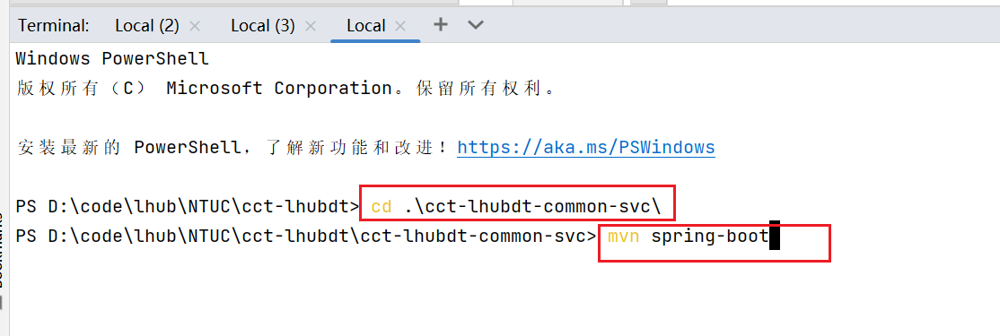

# 启动前端：cct-lhubdt-funding-ui

## 1、解压后打开cct-lhubdt-funding-ui

## 2、下载依赖


```
cd .\cct-lhubdt-funding-ui\ 
node-v
npm -v 
npm install
```

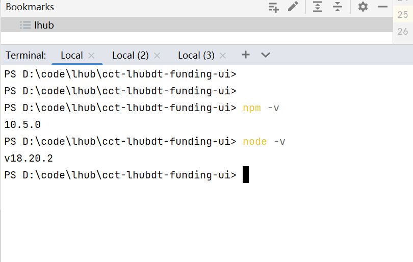

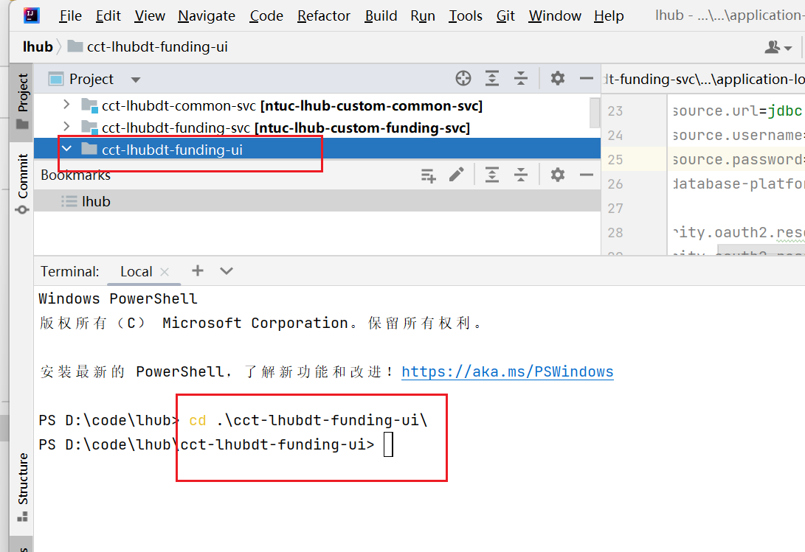

## 3、调整路径

全局搜索：cls.loc.lhubsg.com-key.pem

定位到文件：vite.config.ts 更改路径：

```
原来的
key: fs.readFileSync('etc/ssl/private/cls.loc.lhubsg.com-key.pem'),
cert: fs.readFileSync('etc/ssl/certs/cls.loc.lhubsg.com.pem'),
            
```

```
更新后
key: fs.readFileSync('/opt/homebrew/etc/nginx/ssl/cls.loc.lhubsg.com/cls.loc.lhubsg.com-key.pem'),
cert: fs.readFileSync('/opt/homebrew/etc/nginx/ssl/cls.loc.lhubsg.com/cls.loc.lhubsg.com.pem'),
```

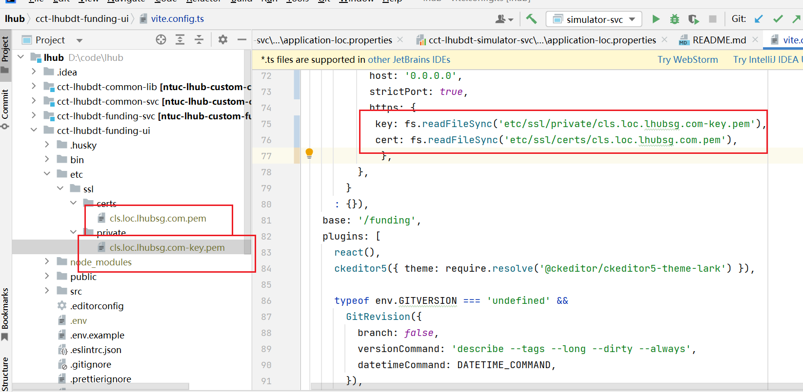

## 4、执行npm run dev报错

**执行npm run dev： 报错：是没有调整步骤三的路径**

```

failed to load config from D:\code\lhub\cct-lhubdt-funding-ui\vite.config.ts
error when starting dev server:
Error: ENOENT: no such file or directory, open '/opt/homebrew/etc/nginx/ssl/cls.loc.lhubsg.com/cls.loc.lhubsg.com-key.pem'
    at Object.openSync (node:fs:596:3)
    at Object.readFileSync (node:fs:464:35)
    at file:///D:/code/lhub/cct-lhubdt-funding-ui/vite.config.ts.timestamp-1763972517021-43863ea65c7fb.mjs:102:19
    at loadConfigFromFile (file:///D:/code/lhub/cct-lhubdt-funding-ui/node_modules/vite/dist/node/chunks/dep-52909643.js:66184:15)
    at async resolveConfig (file:///D:/code/lhub/cct-lhubdt-funding-ui/node_modules/vite/dist/node/chunks/dep-52909643.js:65777:28)
    at async _createServer (file:///D:/code/lhub/cct-lhubdt-funding-ui/node_modules/vite/dist/node/chunks/dep-52909643.js:65051:20)
    at async CAC.<anonymous> (file:///D:/code/lhub/cct-lhubdt-funding-ui/node_modules/vite/dist/node/cli.js:763:24)
PS D:\code\lhub\cct-lhubdt-funding-ui> 

```

执行npm run dev： 报错：没有进入到ui路径下执行 **cd .\cct-lhubdt-funding-ui\** 

```
PS D:\code\lhub> npm run dev
npm ERR! code ENOENT
npm ERR! syscall open
npm ERR! path D:\code\lhub\package.json
npm ERR! errno -4058
npm ERR! enoent Could not read package.json: Error: ENOENT: no such file or directory, open 'D:\code\lhub\package.json'
npm ERR! enoent This is related to npm not being able to find a file.
npm ERR! enoent

npm ERR! A complete log of this run can be found in: C:\Users\Athena\AppData\Local\npm-cache\_logs\2025-11-24T08_41_01_234Z-debug-0.log
PS D:\code\lhub> 

```

执行npm run dev： 报错：解决：手动添加这写文件

```
X [ERROR] Could not resolve "../../theme/icons/dropdown-arrow.svg" node_modules/@ckeditor/ckeditor5-ui/src/collapsible/collapsibleview.js:7:30: 7 │ import dropdownArrowIcon from '../../theme/icons/dropdown-arrow.svg'; ╵ ~~~~~~~~~~~~~~~~~~~~~~~~~~~~~~~~~~~~~~ X [ERROR] Could not resolve "../../../theme/icons/dropdown-arrow.svg" node_modules/@ckeditor/ckeditor5-ui/src/dropdown/button/dropdownbuttonview.js:10:30: 10 │ import dropdownArrowIcon from '../../../theme/icons/dropdown-arrow.svg';
```

这些错误提示表明 CKEditor 组件在尝试从相对路径导入 `.svg` 图标文件（如 `dropdown-arrow.svg`、`color-tile-check.svg`、`accessibility.svg` 等）时找不到对应的文件。CKEditor 项目中图标的文件夹结构：

```
node_modules/
  └── @ckeditor/
      └── ckeditor5-ui/
          └── theme/
              └── icons/
                  ├── dropdown-arrow.svg
                  ├── color-tile-check.svg
                  ├── accessibility.svg
                  ├── project-logo.svg
                  └── (其他图标文件)
```

## 5、启动项目

```
npm run dev
```

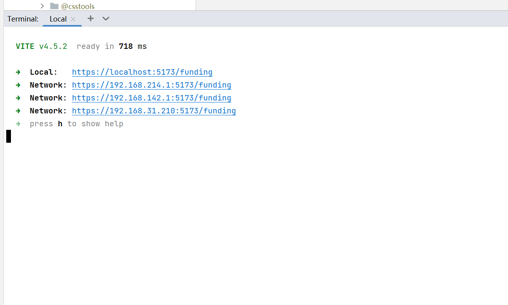

## 

# 配置nginx进行前后端联调

## 1、添加ssl文件（解压后的doc文件中有ssl）

复制到nginx安装路径：D:\install\Program\nginx-1.26.3

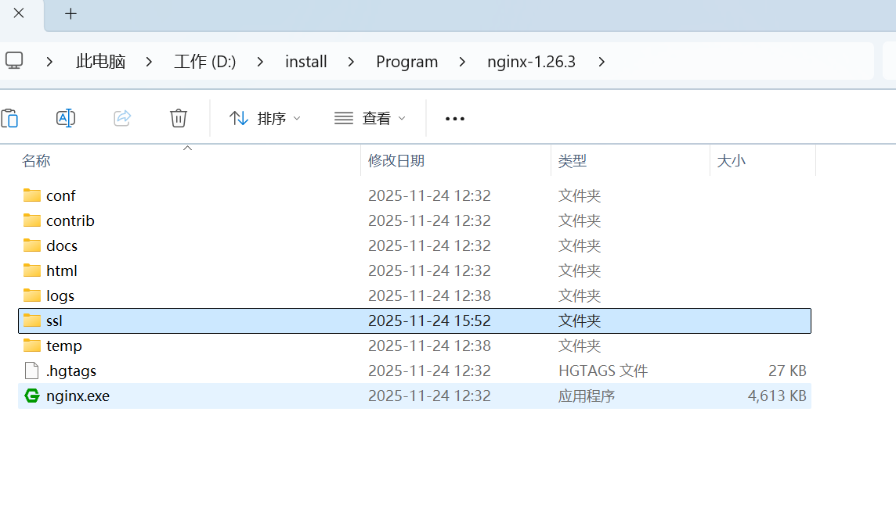

## 2、添加本地域名

用管理员打开编辑软件。再次打开 `C:\Windows\System32\drivers\etc/hosts` 添加下面内容：

```
127.0.0.1       cls.loc.lhubsg.com
127.0.0.1       lxp.loc.lhubsg.com
```

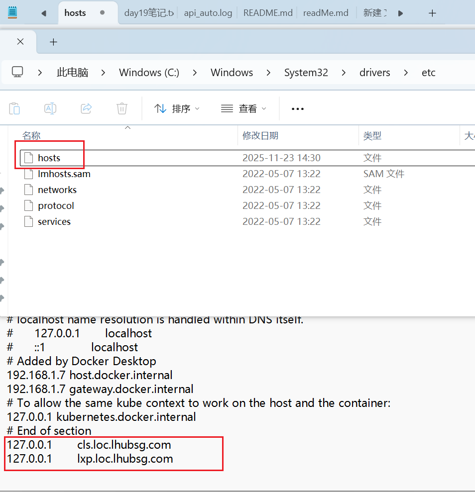


## 3、更改nginx配置文件：nginx.conf  

全部替换为以下文件内容

```
# 全局配置部分
#user  nobody;  # 设置 Nginx 运行的用户，默认是 nobody
# worker_processes  1;  # 设置 Nginx 的工作进程数，通常建议设置为 CPU 核心数
worker_processes 1;  # 当前设置为 1 个工作进程

#error_log  logs/error.log;  # 设置错误日志文件的路径
#error_log  logs/error.log  notice;  # 设置错误日志的级别，这里是 notice
#error_log  logs/error.log  info;  # 设置错误日志的级别，这里是 info

#pid        logs/nginx.pid;  # 设置 Nginx 进程 ID 存储路径

# 事件配置部分，主要是处理 Nginx 事件的相关配置
events {
    worker_connections  1024;  # 每个工作进程最大能打开的连接数
}

# HTTP 配置部分，配置 Nginx 如何处理 HTTP 请求
http {
    include       mime.types;  # 导入 MIME 类型文件，帮助 Nginx 根据文件扩展名确定内容类型
    default_type  application/octet-stream;  # 默认的 MIME 类型

    # 日志格式和访问日志配置被注释掉
    # log_format  main  '$remote_addr - $remote_user [$time_local] "$request" '
    #                   '$status $body_bytes_sent "$http_referer" '
    #                   '"$http_user_agent" "$http_x_forwarded_for"';
    # access_log  logs/access.log  main;  # 设置访问日志文件路径

    sendfile        on;  # 启用 sendfile 来优化大文件传输
    # tcp_nopush     on;  # 该选项可以禁用 TCP 延迟传输，未启用
    # keepalive_timeout  0;  # 设置连接保持活动的超时时间，已注释掉
    keepalive_timeout  65;  # 设置连接保持活动的超时时间为 65 秒

    # gzip  on;  # 启用 GZIP 压缩，未启用

    # HTTP 服务器配置部分
    server {
        listen       80;  # 监听 80 端口，处理 HTTP 请求
        server_name  cls.loc.lhubsg.com;  # 配置服务器的域名
        return 301 https://$host$request_uri;  # 将所有 HTTP 请求重定向到 HTTPS

        #charset koi8-r;  # 设定字符集，未启用

        # access_log  logs/host.access.log  main;  # 设置访问日志路径，已注释掉

        location / {
            root   html;  # 配置根目录路径
            index  index.html index.htm;  # 配置默认的首页文件
        }

        # 错误页面配置，当发生 500, 502, 503, 504 错误时，显示 /50x.html 页面
        error_page   500 502 503 504  /50x.html;
        location = /50x.html {
            root   html;  # 错误页面的路径
        }

        # PHP 脚本代理配置，已注释掉
        # location ~ \.php$ {
        #     proxy_pass   http://127.0.0.1;
        # }

        # FastCGI 配置，已注释掉
        # location ~ \.php$ {
        #     root           html;
        #     fastcgi_pass   127.0.0.1:9000;
        #     fastcgi_index  index.php;
        #     fastcgi_param  SCRIPT_FILENAME  /scripts$fastcgi_script_name;
        #     include        fastcgi_params;
        # }

        # 禁止访问 .htaccess 文件
        # location ~ /\.ht {
        #     deny  all;
        # }
    }

    # HTTPS 服务器配置部分
    server {
       listen       8443 ssl;  # 监听 443 端口并启用 SSL
       server_name  cls.loc.lhubsg.com;  # 配置服务器的域名

       # 配置 SSL 证书和私钥路径
       ssl_certificate ./ssl/cls.loc.lhubsg.com/cls.loc.lhubsg.com.pem;
       ssl_certificate_key ./ssl/cls.loc.lhubsg.com/private-key.pem;
       ssl_password_file  ./ssl/cls.loc.lhubsg.com/cert_password.txt;  # 配置证书的密码

       ssl_session_cache    shared:SSL:1m;  # 配置 SSL 会话缓存
       ssl_session_timeout  5m;  # 设置 SSL 会话超时时间为 5 分钟
       ssl_ciphers  HIGH:!aNULL:!MD5;  # 配置支持的 SSL 加密套件
       ssl_prefer_server_ciphers  on;  # 使服务器的加密套件优先

        # Keycloak 配置，代理到 Keycloak 服务
        location ^~ /keycloak/{
            proxy_pass http://cls.loc.lhubsg.com:8000;  # 将请求转发到 8000 端口的 Keycloak 服务
        }

        # UI 配置，代理到前端应用
        location / {
            proxy_pass http://localhost:5173;  # 将请求转发到本地 5173 端口（前端开发服务器）
            # 以下是代理请求头配置，用于保持原始请求信息
            proxy_set_header Host $host;
            proxy_set_header X-Real-IP $remote_addr;
            proxy_set_header X-Forwarded-For $proxy_add_x_forwarded_for;
            proxy_set_header X-Forwarded-Proto $scheme;
            proxy_set_header Upgrade $http_upgrade;
            proxy_set_header Connection "upgrade";
        }

        # 特定路径的代理设置，例如 /fnd/int/v1/ 路径
        location /fnd/int/v1/ {
            proxy_set_header X-Forwarded-For $proxy_add_x_forwarded_for;
            proxy_set_header Host $host;
            proxy_http_version 1.1;
            proxy_set_header Upgrade $http_upgrade;
            proxy_set_header Connection "upgrade";
            proxy_set_header x-amzn-requestid $request_id;

            # 根据请求 URI 转发到不同的服务
            if ($request_uri ~ "^/fnd/int/v1/common/") {
                proxy_pass https://cls.loc.lhubsg.com:8080;  # 转发到 8080 端口（common 服务）
            }
            if ($request_uri ~ "^/fnd/int/v1/funding/") {
                proxy_pass https://cls.loc.lhubsg.com:8083;  # 转发到 8083 端口（funding 服务）
            }
            if ($request_uri ~ "^/fnd/int/v1/simulator/") {
                proxy_pass https://cls.loc.lhubsg.com:8086;  # 转发到 8086 端口（simulator 服务）
            }
        }

        # 其他路径配置和服务的代理，结构与上面类似
        location /fnd/ext/v1/ {
            proxy_set_header X-Forwarded-For $proxy_add_x_forwarded_for;
            proxy_set_header Host $host;
            proxy_http_version 1.1;
            proxy_set_header Upgrade $http_upgrade;
            proxy_set_header Connection "upgrade";
            proxy_set_header x-amzn-requestid $request_id;

            # 根据请求 URI 转发到不同的服务
            if ($request_uri ~ "^/fnd/ext/v1/common/") {
                proxy_pass https://cls.loc.lhubsg.com:8080;
            }
            if ($request_uri ~ "^/fnd/ext/v1/funding/") {
                proxy_pass https://cls.loc.lhubsg.com:8083;
            }
            if ($request_uri ~ "^/fnd/ext/v1/simulator/") {
                proxy_pass https://cls.loc.lhubsg.com:8086;
            }
        }

        # Simulator 服务的代理配置
        location ^~ /sc/ {
            proxy_pass https://cls.loc.lhubsg.com:8086;  # 转发到 8086 端口（simulator 服务）
        }

        # 特定页面的代理配置
        location = /html/sc_login.html {
            proxy_pass https://cls.loc.lhubsg.com:8086;  # 转发到 8086 端口（simulator 服务）
        }
    }
}

```

## 4、启动nginx

看日志启动报错：

```
2025/11/24 12:39:27 [error] 23688#4772: *2 CreateFile() "D:\install\Program\nginx-1.26.3/html/favicon.ico" failed (2: The system cannot find the file specified), client: 127.0.0.1, server: localhost, request: "GET /favicon.ico HTTP/1.1", host: "localhost", referrer: "http://localhost/"
2025/11/24 17:07:01 [emerg] 17612#10324: bind() to 0.0.0.0:443 failed (10013: An attempt was made to access a socket in a way forbidden by its access permissions)
2025/11/24 17:08:19 [emerg] 1992#14744: bind() to 0.0.0.0:443 failed (10013: An attempt was made to access a socket in a way forbidden by its access permissions)

```

有两个错误导致 Nginx 没有成功启动。

### 错误 1: favicon.ico 文件缺失

```
CreateFile() "D:\install\Program\nginx-1.26.3/html/favicon.ico" failed (2: The system cannot find the file specified)
```

这是一个警告，表示 Nginx 尝试加载 `favicon.ico` 图标文件，但该文件在指定路径下没有找到。这通常不会导致 Nginx 启动失败，可以忽略。如果需要，你可以将一个 `favicon.ico` 文件放到 `html` 目录中来避免这个警告。

### 错误 2: 端口 443 被拒绝访问

```
bind() to 0.0.0.0:443 failed (10013: An attempt was made to access a socket in a way forbidden by its access permissions)
```

这个错误是导致 Nginx 启动失败的根本原因。它表示 Nginx 尝试绑定到 443 端口（通常用于 HTTPS），但由于权限问题失败了。通常这个错误可能有以下几个原因：

1. **端口权限问题**：

   - 在 Windows 系统中，使用低于 1024 的端口（如 443）通常需要管理员权限。尝试以管理员身份运行 Nginx，右键点击 `nginx.exe` 文件并选择“以管理员身份运行”。

2. **端口被占用**：

   - 端口 443 可能已被其他应用占用（如 Apache、IIS、其他 Nginx 实例等）。你可以运行以下命令检查 443 端口的占用情况：

     ```
     netstat -ano | findstr :443
     ```

     

更改nginx配置文件的监听端口：

```
server {
    listen 8443 ssl;  # 使用8443端口
    # ...
}

```

访问方式变化
原访问地址：https://localhost
新访问地址：https://localhost:8443
选择建议
推荐使用 8443 端口，因为：
符合HTTPS端口命名规范（443 + 8000）
是业界广泛认可的SSL/TLS备用端口
不会与其他常见服务冲突

## 5、重新启动nginx

```
管理员运行cmd
进入路径：
D:
cd "D:\install\Program\nginx-1.26.3"
start nginx
```

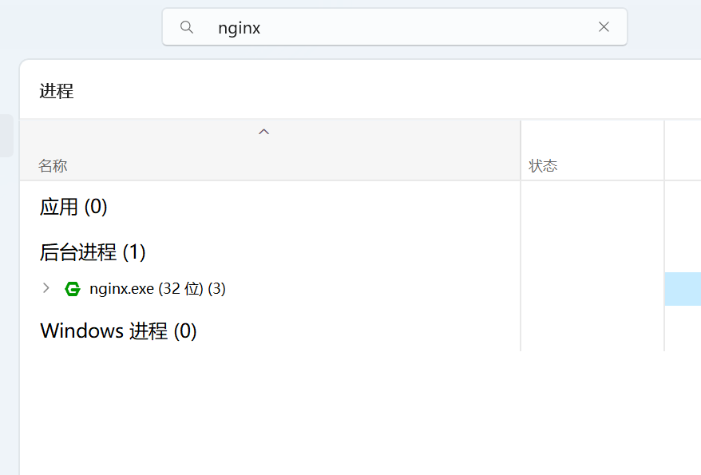


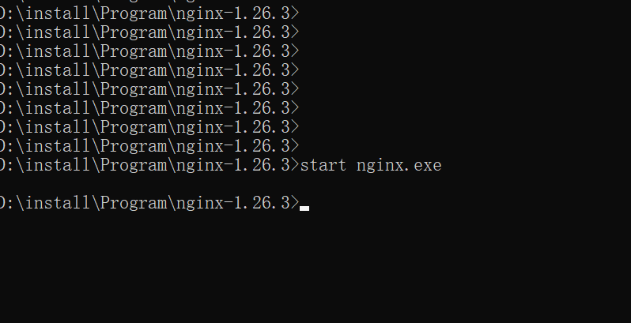


# 报错

## 后端启动端口被占用

管理员cmd运行检查：

```
netstat -ano | findstr :8080
tasklist | findstr 1234
tasklist | findstr 11216

```


## Nginx 配置问题

修改nginx配置文件中的：

```

        # UI 配置，代理到前端应用
        location / {
            proxy_pass https://localhost:5173;  
			# 修改为 https
```

#  **确保 Nginx 配置中的 SSL 证书路径正确**

```
server {
    listen       8443 ssl;  # 配置为 8443 端口，支持 SSL
    server_name  cls.loc.lhubsg.com;

    ssl_certificate C:/nginx/ssl/cls.loc.lhubsg.com/cls.loc.lhubsg.com.pem;
    ssl_certificate_key C:/nginx/ssl/cls.loc.lhubsg.com/private-key.pem;
    ssl_password_file  C:/nginx/ssl/cls.loc.lhubsg.com/cert_password.txt;

    location / {
        proxy_pass https://localhost:5173;  # 确保前端服务使用 https
        proxy_set_header Host $host;
        proxy_set_header X-Real-IP $remote_addr;
        proxy_set_header X-Forwarded-For $proxy_add_x_forwarded_for;
        proxy_set_header X-Forwarded-Proto $scheme;
        proxy_set_header Upgrade $http_upgrade;
        proxy_set_header Connection "upgrade";
    }
}

```

```
server {
    listen       80;
    server_name  cls.loc.lhubsg.com;
    return 301 https://$host$request_uri;  # 将 HTTP 请求重定向到 HTTPS
}
```

改以下

```
 原来
 # UI 配置，代理到前端应用
        location / {
```

```
现在
```

访问报错：

```
https://cls.loc.lhubsg.com/fnd/int/v1/common/oidc/login?originated=/funding
HTTP ERROR 404
```

看后端日志redis未启动报错。更新配置再次启动后，重新运行

```
https://cls.loc.lhubsg.com:8443/fnd/int/v1/common/oidc/login?originated=/funding

```

现在可以访问的版本：

```
# 全局配置部分
#user  nobody;  # 设置 Nginx 运行的用户，默认是 nobody
# worker_processes  1;  # 设置 Nginx 的工作进程数，通常建议设置为 CPU 核心数
worker_processes 1;  # 当前设置为 1 个工作进程

#error_log  logs/error.log;  # 设置错误日志文件的路径
#error_log  logs/error.log  notice;  # 设置错误日志的级别，这里是 notice
#error_log  logs/error.log  info;  # 设置错误日志的级别，这里是 info

#pid        logs/nginx.pid;  # 设置 Nginx 进程 ID 存储路径

# 事件配置部分，主要是处理 Nginx 事件的相关配置
events {
    worker_connections  1024;  # 每个工作进程最大能打开的连接数
}

# HTTP 配置部分，配置 Nginx 如何处理 HTTP 请求
http {
    include       mime.types;  # 导入 MIME 类型文件，帮助 Nginx 根据文件扩展名确定内容类型
    default_type  application/octet-stream;  # 默认的 MIME 类型

    # 日志格式和访问日志配置被注释掉
    # log_format  main  '$remote_addr - $remote_user [$time_local] "$request" '
    #                   '$status $body_bytes_sent "$http_referer" '
    #                   '"$http_user_agent" "$http_x_forwarded_for"';
    # access_log  logs/access.log  main;  # 设置访问日志文件路径

    sendfile        on;  # 启用 sendfile 来优化大文件传输
    # tcp_nopush     on;  # 该选项可以禁用 TCP 延迟传输，未启用
    # keepalive_timeout  0;  # 设置连接保持活动的超时时间，已注释掉
    keepalive_timeout  65;  # 设置连接保持活动的超时时间为 65 秒

    # gzip  on;  # 启用 GZIP 压缩，未启用

    # HTTP 服务器配置部分
    server {
        listen       80;  # 监听 80 端口，处理 HTTP 请求
        server_name  cls.loc.lhubsg.com;  # 配置服务器的域名
        return 301 https://$host$request_uri;  # 将所有 HTTP 请求重定向到 HTTPS

        #charset koi8-r;  # 设定字符集，未启用

        # access_log  logs/host.access.log  main;  # 设置访问日志路径，已注释掉

        location / {
            root   html;  # 配置根目录路径
            index  index.html index.htm;  # 配置默认的首页文件
        }

        # 错误页面配置，当发生 500, 502, 503, 504 错误时，显示 /50x.html 页面
        error_page   500 502 503 504  /50x.html;
        location = /50x.html {
            root   html;  # 错误页面的路径
        }

        # PHP 脚本代理配置，已注释掉
        # location ~ \.php$ {
        #     proxy_pass   http://127.0.0.1;
        # }

        # FastCGI 配置，已注释掉
        # location ~ \.php$ {
        #     root           html;
        #     fastcgi_pass   127.0.0.1:9000;
        #     fastcgi_index  index.php;
        #     fastcgi_param  SCRIPT_FILENAME  /scripts$fastcgi_script_name;
        #     include        fastcgi_params;
        # }

        # 禁止访问 .htaccess 文件
        # location ~ /\.ht {
        #     deny  all;
        # }
    }

    # HTTPS 服务器配置部分
    server {
       listen       443 ssl;  # 监听 443 端口并启用 SSL
       server_name  cls.loc.lhubsg.com;  # 配置服务器的域名

       # 配置 SSL 证书和私钥路径
    ssl_certificate D:/install/Program/nginx-1.26.3/ssl/cls.loc.lhubsg.com/cls.loc.lhubsg.com.pem;  # 证书文件的绝对路径
    ssl_certificate_key D:/install/Program/nginx-1.26.3/ssl/cls.loc.lhubsg.com/private-key.pem;  # 私钥文件的绝对路径
    ssl_password_file  D:/install/Program/nginx-1.26.3/ssl/cls.loc.lhubsg.com/cert_password.txt;  # 证书密码文件的路径

       ssl_session_cache    shared:SSL:1m;  # 配置 SSL 会话缓存
       ssl_session_timeout  5m;  # 设置 SSL 会话超时时间为 5 分钟
       ssl_ciphers  HIGH:!aNULL:!MD5;  # 配置支持的 SSL 加密套件
       ssl_prefer_server_ciphers  on;  # 使服务器的加密套件优先

        # Keycloak 配置，代理到 Keycloak 服务
        location ^~ /keycloak/{
            proxy_pass http://cls.loc.lhubsg.com:8000;  # 将请求转发到 8000 端口的 Keycloak 服务
        }

        # UI 配置，代理到前端应用
        location /funding/ {
            proxy_pass http://127.0.0.1:5173/;  
			# 修改为 https

			# 将请求转发到本地 5173 端口（前端开发服务器）
            # 以下是代理请求头配置，用于保持原始请求信息
            proxy_set_header Host $host;
            proxy_set_header X-Real-IP $remote_addr;
            proxy_set_header X-Forwarded-For $proxy_add_x_forwarded_for;
            proxy_set_header X-Forwarded-Proto $scheme;
            proxy_set_header Upgrade $http_upgrade;
            proxy_set_header Connection "upgrade";
        }

        # 特定路径的代理设置，例如 /fnd/int/v1/ 路径
        location /fnd/int/v1/ {
            proxy_set_header X-Forwarded-For $proxy_add_x_forwarded_for;
            proxy_set_header Host $host;
            proxy_http_version 1.1;
            proxy_set_header Upgrade $http_upgrade;
            proxy_set_header Connection "upgrade";
            proxy_set_header x-amzn-requestid $request_id;

            # 根据请求 URI 转发到不同的服务
            if ($request_uri ~ "^/fnd/int/v1/common/") {
                proxy_pass https://localhost:8080;  # 转发到 8080 端口（common 服务）
            }
            if ($request_uri ~ "^/fnd/int/v1/funding/") {
                proxy_pass https://localhost:8083;  # 转发到 8083 端口（funding 服务）
            }
            if ($request_uri ~ "^/fnd/int/v1/simulator/") {
                proxy_pass https://localhost:8086;  # 转发到 8086 端口（simulator 服务）
            }
        }

        # 其他路径配置和服务的代理，结构与上面类似
        location /fnd/ext/v1/ {
            proxy_set_header X-Forwarded-For $proxy_add_x_forwarded_for;
            proxy_set_header Host $host;
            proxy_http_version 1.1;
            proxy_set_header Upgrade $http_upgrade;
            proxy_set_header Connection "upgrade";
            proxy_set_header x-amzn-requestid $request_id;

            # 根据请求 URI 转发到不同的服务
            if ($request_uri ~ "^/fnd/ext/v1/common/") {
                proxy_pass https://localhost:8080;
            }
            if ($request_uri ~ "^/fnd/ext/v1/funding/") {
                proxy_pass https://localhost:8083;
            }
            if ($request_uri ~ "^/fnd/ext/v1/simulator/") {
                proxy_pass https://localhost:8086;
            }
        }

        # Simulator 服务的代理配置
        location ^~ /sc/ {
            proxy_pass https://cls.loc.lhubsg.com:8086;  # 转发到 8086 端口（simulator 服务）
        }

        # 特定页面的代理配置
        location = /html/sc_login.html {
            proxy_pass https://cls.loc.lhubsg.com:8086;  # 转发到 8086 端口（simulator 服务）
        }
    }
}

```


# Redis需要设置集群

## 1、更改配置文件

```
\# spring redis cache

spring.data.redis.host=127.0.0.1
spring.data.redis.port=6379
spring.data.redis.password=
spring.data.redis.database=1
spring.data.redis.prefixName=
spring.data.redis.cluster.nodes=127.0.0.1:6379,127.0.0.1:6380,127.0.0.1:6381
```

