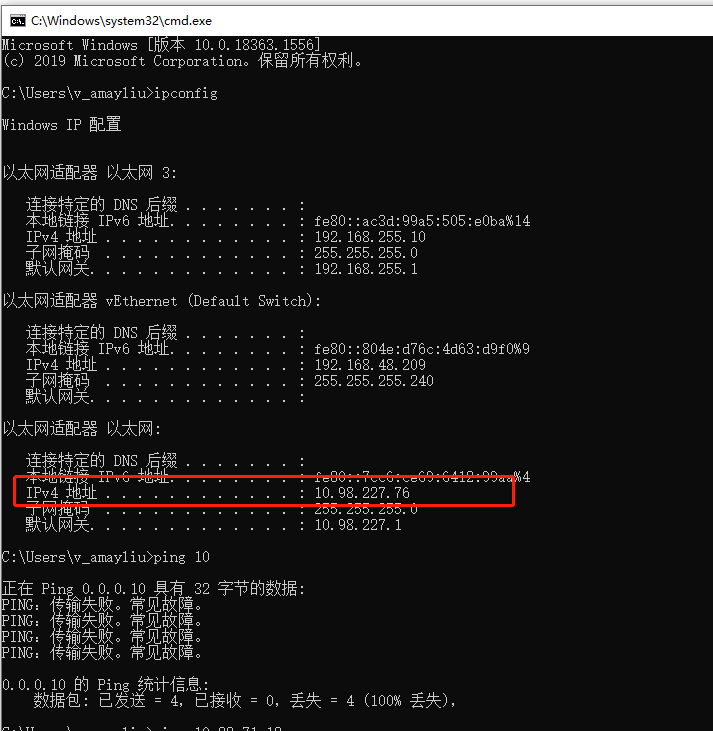
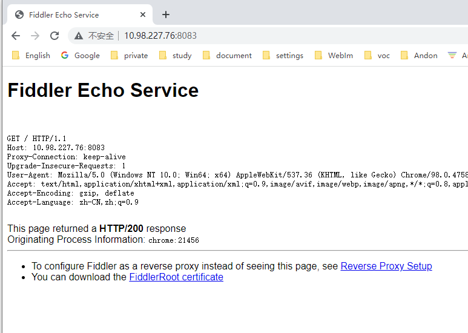
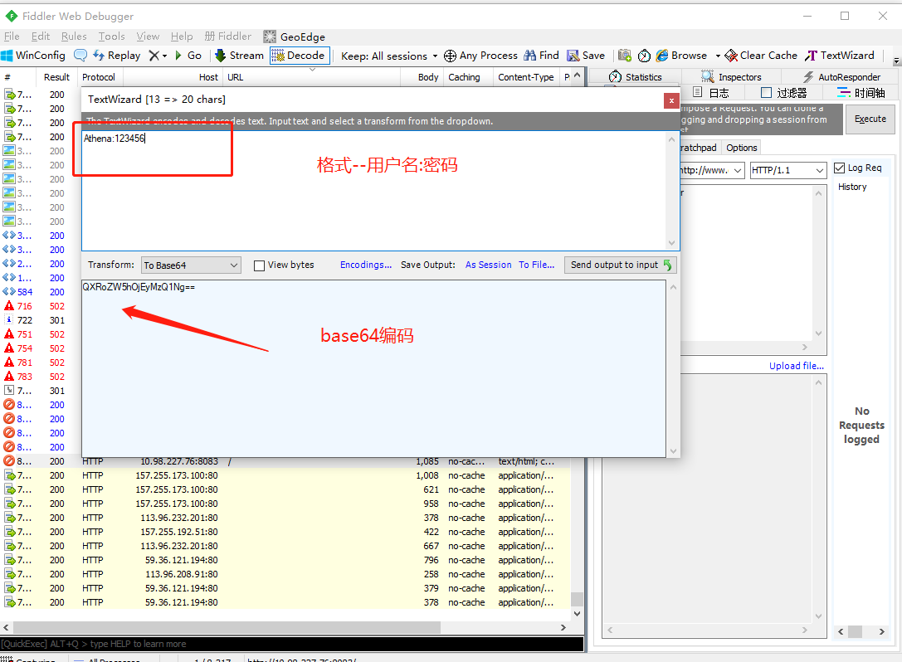
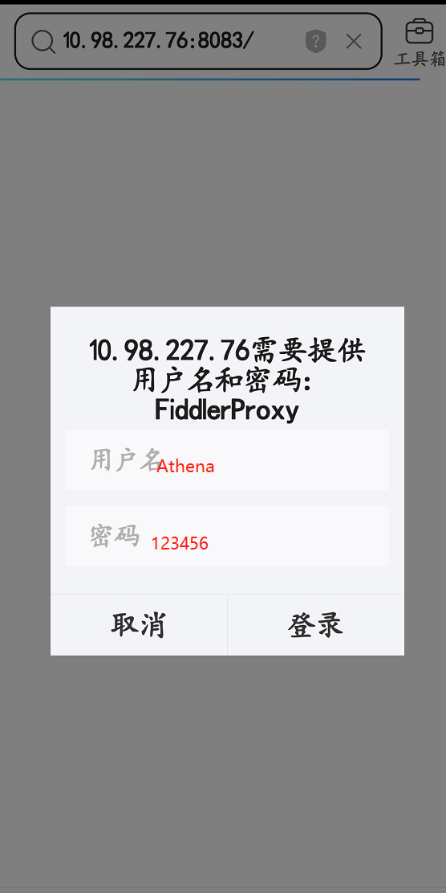

### 手机通过Fiddler作为代理服务器访问内网地址

#### 步骤如下：

##### 1.下载并安装[Fiddler](https://www.telerik.com/fiddler)

##### 2.设置Fiddler作为代理服务器

- Tool-Options-Connection

  
  
 

- 注意这里的端口需要在8000-8100之间 eg:8083

- 配置好端口号，可以在个人电脑上访问，127.0.0.1:8080，如图所示代表成功:

  
  
 

- HTTPS流量可以不捕获，不然可能有证书安装相关的问题

  
  
 

##### 3.查看本机的IP地址

- windows系统打开命令行，执行`ipconfig`:

  
  
 

##### 4.手机配置代理服务器

- 打开所连接的Wifi,无线局域网->Tencent-Wifi->配置代理

  
  
 

- 在pc浏览器打开:http://10.98.227.76:8083/

  
  
 

- 在手机浏览器打开：http://10.98.227.76:8083/

  
  
 

- 电脑能抓到手机的包

  
  
 

##### 5.开启身份验证 （可不用设置）

- 为了提高安全性，可以要求连接的手机输入用户密码，这样可以指定用户访问

- 首先需要获取用户名:密码的base64编码，可以借助fiddler自带的TextWizard工具

  
  
 

- 在Fiddler左下角的QuickExec输入prefs set fiddler.proxy.creds 跟 “账号密码的base64”后Enter以设置用户名密码

  
  
 

- 勾选Rules-Require Proxy Authentication选项已开启身份验证

  
  
 

- 手机连接输入账号密码即可:

  
  
 

