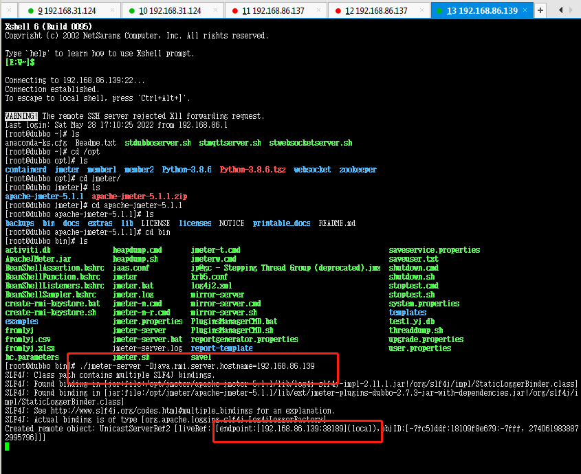
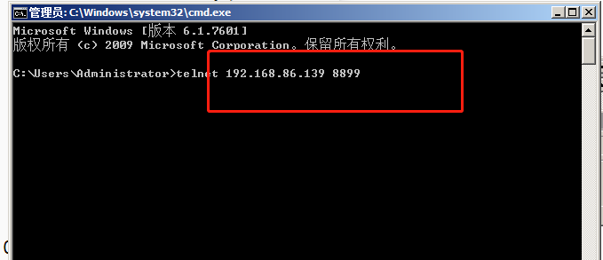
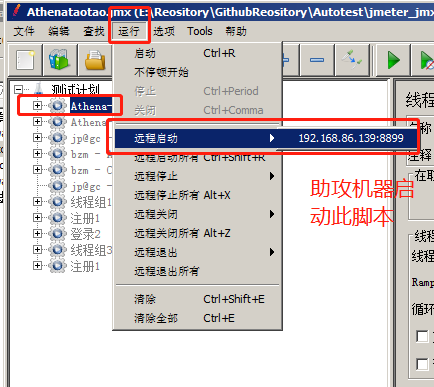
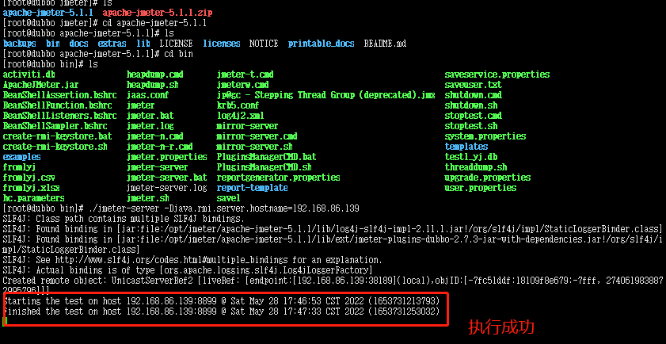

### jmeter分布式环境部署

1. 集群： 多台机器一起向外提供服务能力
2. 分布式： 分摊发起方的压力，产生更大的压力向服务器发起请求
3. 分布式环境部署:是分摊我们发起方的压力，要消耗发起方的资源的，助攻机器不能是被测项目机器

#### 1.jmeter分布式配置

##### 1.多台机器部署jmeter满足条件:

+ jdk 大版本要一致   `java -version`  大版本号要相同，小版本号可以不相同

+ jmeter版本要一致,jmeter的插件要一致(压缩使用同个包上传助攻机器)

+ 没有要求操作系统,可以使用不同操作系统(本地window,助攻机linux)

+ 不要用wifi网络

  
  
 

##### 2.配置助攻机器：

+ 修改配置文件jmeter.properties

  + server_port=自定义一个端口

  + server.rmi.port= 与上面相同的端口

  + server.rmi.ssl.disable=true 不开启加密认证传输

    
  
 

##### 3.启动服务

- 如果助攻机器是linux机器： 给jmeter的bin文件夹中的文件赋予执行权限

- 更新bin文件权限 chmod +x *

+ 启动命令:  ./jmeter-server -Djava.rmi.server.hostname=192.168.86.139

  (192.168.86.139 助攻机器IP)

  主控机器上执行  telnet 助攻机器ip 端口  -----检查主控机器和助攻机器网络是否通畅

  启动后控制机验证: cmd命令: telnet 192.168.86.139 8899
  8899 助攻机器的更新的端口

  
  
 

  
  
 

##### 4.控制机配置

+ 配置jmeter.properties
  + remote_hosts 添加助攻机器ip:端口，多个时，用英文逗号分开
  + server.rmi.ssl.disable=true  
  + mode=Standard  ---使用标准模式，开启之后，才能实时看到助攻机器的数据

  
 

5.助攻机器启动jmeter脚本

- 助攻机器已上传运行的jmeter脚本

  
  
 

  
  
 

5.主控&助控机器说明

1. 只要助攻机器是启动的，主控和助攻之间的网络是通畅，那么我们主控是可以给助攻发任何指令
2. 主控机器上的脚本发生变化，助攻机器没有变，远程启动助攻机器执行脚本时，时按照最新的主控机器脚本来执行
3. 助攻机器一切行为，都是安装主控机器的指令执行
4. 有多台机器作为助攻机器时，活跃线程数，多条； 响应时间曲线，是不做任何处理，原样展示；tps曲线，原样展示
5. CLI命令行模式 -r参数

