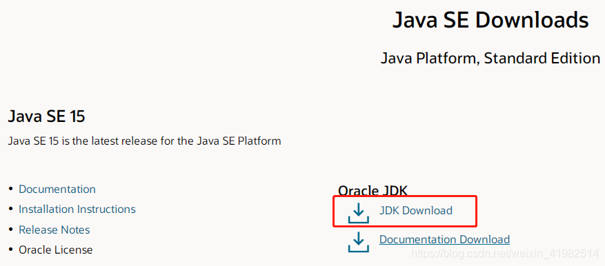
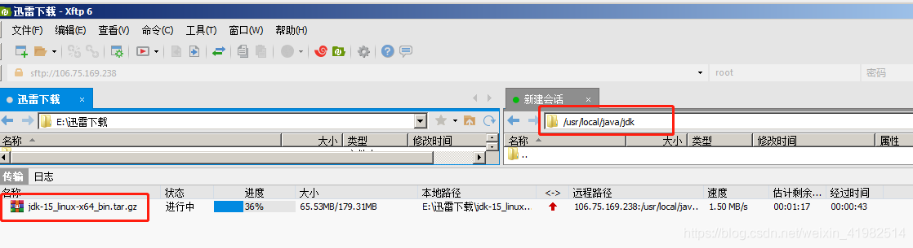

### Linux系统中jdk环境配置

**如下操作步骤为linux系统中部署jdk环境**

#### 1.下载jdk安装包 。

- [jdk官网下载地址](https://www.oracle.com/java/technologies/javase-downloads.html)

  <div align="left">  </div><br>

  <div align="left">  </div><br>

#### 2.新建安装jdk文件夹(/usr/local/java/jdk)

```java
cd /usr/local                
mkdir /usr/local/java        local目录下新建java目录
cd /usr/local/java           
mkdir /usr/local/java/jdk    新建jdk目录
cd /usr/local/java/jdk
```
#### 3.上传jdk安装包到linux

<div align="left">  </div><br>

```java
解压格式：tar zxvf 压缩包名称
后面的名称可以只输入一个首字母，然后使用 Tab 按键自动补全文件全名
eg: tar zxvf j 
```
```java
 tar zxvf jdk-15_linux-x64_bin.tar.gz   解压
```
```java
 rm -f jdk-15_linux-x64_bin.tar.gz    删除压缩包
```
#### 5.开始配置环境变量

- 5.1定位到配置文件

  ```java
  cd /usr/local/etc  
  find -name profile  搜索文件名为“profile”的文件
  vim /etc/profile    进去profile文件
  ```

- 5.2输入 I 键，切换成可输入模式。

  <div align="left">  </div><br>

- 5.3请复制下面的代码内容，粘贴到如图profile文件中（在 unset i 的前面输入）

  ```java
  export JAVA_HOME=/usr/local/java/jdk/jdk-15  ------ 自己安装jdk的路径
  export CLASSPATH=.:$JAVA_HOME/jre/lib/rt.jar:$JAVA_HOME/lib/dt.jar:$JAVA_HOME/lib/tools.jar
  export PATH=$PATH:$JAVA_HOME/bin
  ```

- <div align="left">  </div><br>

- 5.4 保存profile并退出。

- 按 Esc 退出insert模式，输入 :wq 保存并退出

- ```java
  :q! 不管编辑或未编辑都不保存退出
  :wq 保存，退出
  ```

- <div align="left">  </div><br>

- 5.5 文件修改生效命令

- ```java
  source /etc/profile
  ```

- 6.验证是否配置jdk成功

- ```java
  java -version
  ```

  <div align="left">  </div><br>


