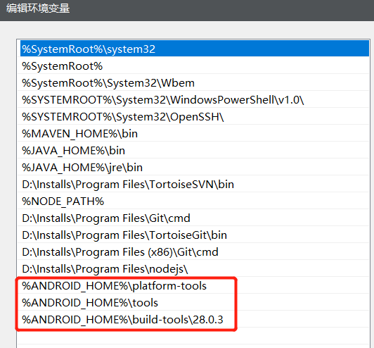
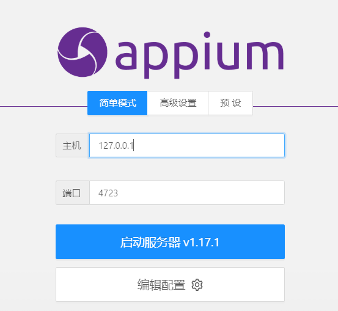
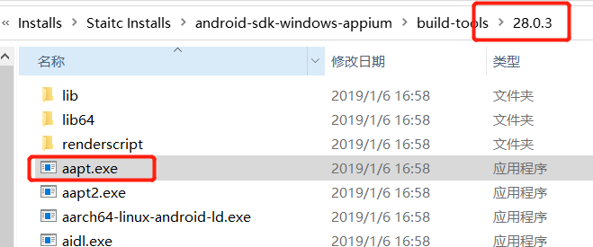
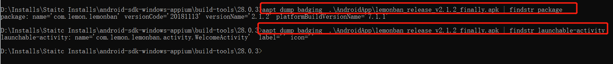
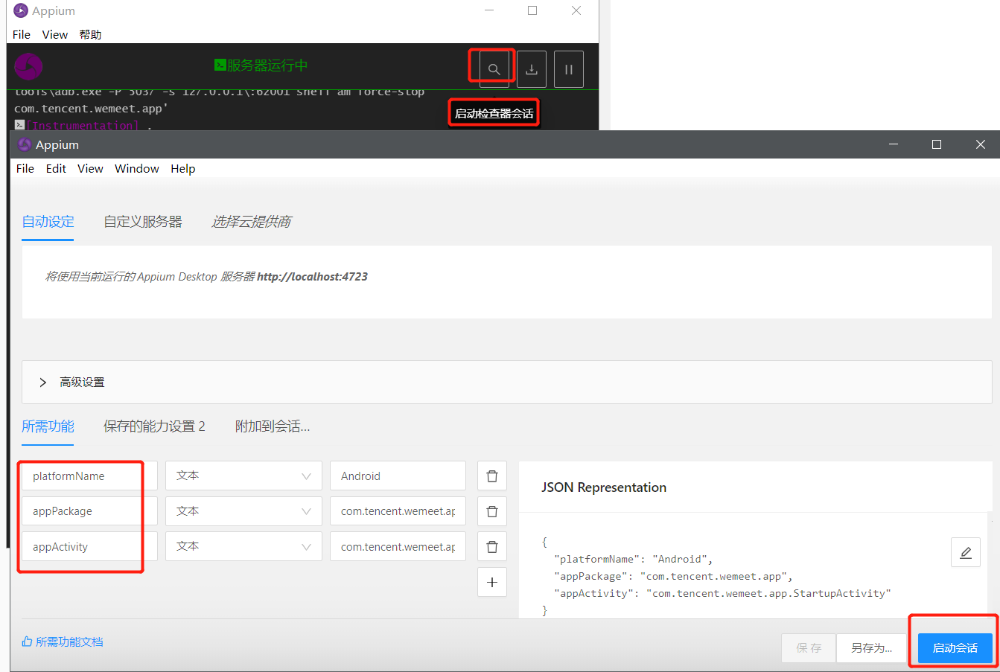
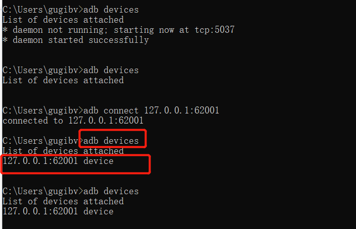
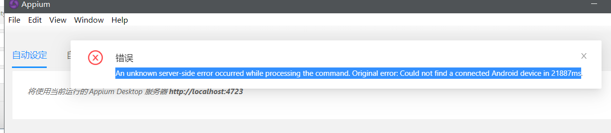
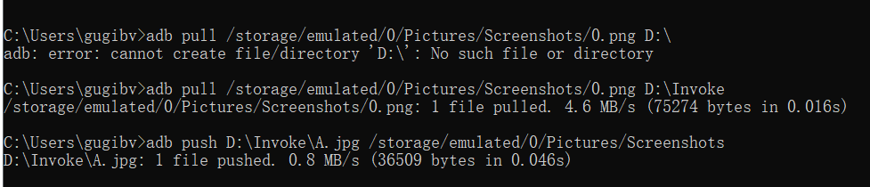
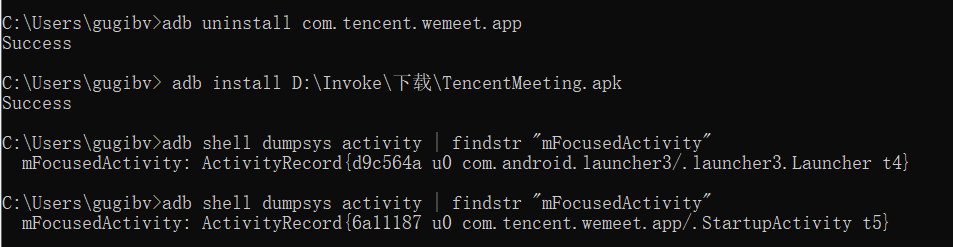

# app自动化

- appium是一个开源的、跨平台的自动化测试工具，可用于app的自动化测试（支持android\ios等操作系统下的app自动化测试）
- 官网地址：http://appium.io/  
- Github地址https://github.com/appium/appium  

## 一、App自动化测试环境搭建  

### 1.配置Android sdk环境  

- [下载Android sdk](https://pan.baidu.com/s/135fHa-NNx5tqrXrcXECC7g)

- 解压后配置环境变量

- 在系统变量中，新建ANDROID_HOME变量名，变量值：Android SDK软件包所在的路径
  在系统变量中，找到Path，追加：
  %ANDROID_HOME%\platform-tools
  %ANDROID_HOME%\tools
  %ANDROID_HOME%\build-tools\28.0.3

- cmd输入adb version去验证  

  <div align="left">  </div><br>

### 2.安装模拟器

- 安装夜神模拟器https://www.yeshen.com/

### 3.安装AppiumDesktop

- 简介:Appium Desktop是一款用于Mac、Windows和Linux的开源应用。它是Appium更为优化的图形界面和appium相关的工具的组合:Appium-Server的图形界面。可以设置选项、启动/停止服务器、查看日志等功能；可以使用AppiumDesktop自带的Inspector来查看应用程序的元素，并进行基本的交互.
- 下载地址：https://github.com/appium/appium-desktop/releases

<div align="left">  </div><br>

### 3.启动检查器会话

- 检查器会话三个配置：

  1. platformName 值为Android or IOS

  2. appPackage 值为App包名 值通过aapt工具来查询

     ```sh
     aapt dump badging D:\Installs\AndroidApp\TencentMeeting.apk | findstr package
     ```

  3. appActivity App启动入口 值通过aapt工具来查询

     ```sh
     aapt dump badging D:\Installs\AndroidApp\TencentMeeting.apk | findstr launchable-activity
     ```

  4. 如何通过aapt工具来查询获取app包名？---cmd进入android-sdk的aapt路径下，执行命令获取

     <div align="left">  </div><br>

     <div align="left">  </div><br>

  5. 问题：aapt dump badging  后面跟app包路径，由于路径有空格可能会出现错误：ERROR: dump failed because assets could not be loaded，即可用相对路径。

<div align="left">  </div><br>

### 4.测试App安装到设备中

1. Android SDK/platform-tools文件中的adb.exe文件===》替换到夜神模拟器bin目录下的adb.exe和nox_adb.exe，

   夜神模拟器bin目录下adb.exe 以及nox_adb.exe名字需要同原来的保持一致。做了替换之后每一次夜神模拟器启动之后设备自动连上

- 在启动会话之前，模拟器中安装app及启动，确保你的设备是能够检测到，执行命令：adb devices

  <div align="left">  </div><br>

- 启动Appium报错：无法连接到app,可能没有安装或者开启app

<div align="left">  </div><br>

## 二、adb常用命令

- adb（Android Debug Bridge）是android sdk的一个工具
  adb是用来连接安卓手机和PC端的桥梁，用户可以通过adb在电脑上对手机进行一系列操作。
  adb可以协助开发/测试人员更快更好的调试app，具有安装卸载apk、拷贝推送文件、查看设备硬件信息、查看应用程序占用资源、在设备执行shell命令等功能。

```
#查看帮助手册
$adb help
#检测连接到电脑的安卓设备
$adb devices
#从手机中拉取信息放到本地电脑上
$adb pull <拉取文件所在的手机路径> <本机路径>
#从本地推送信息到手机上去
$adb push <本机路径> <手机路径>
#登录设备shell模式（支持linux命令）
$adb shell
#安装应用
$adb install xxx.apk
#卸载应用
$adb uninstall App包名
#查看前台应用包名（前提：App运行在前台）
$adb shell dumpsys activity | findstr "mFocusedActivity"
#终止adb服务
$adb kill-server
#启动adb服务，通常在adb出现问题时，结合kill server命令一起使用
$adb start-server
#启动App
$adb shell am start -n 包名/启动入口
#清除应用的数据和缓存
$adb shell pm clear 包名
#坐标点击
$adb shell input tap x轴坐标 y轴坐标
#列出所有包名
-s 列出系统apk路径及包名
-3 列出用户apk路径以及包名
$adb shell pm list packages
打印日志-->获取Android系统里面所有的日志（所有的应用）
$adb logcat
$adb logcat > 本地PC端文件路径
adb logcat > D:\Invoke\log
```

1. adb pull /storage/emulated/0/Pictures/Screenshots/0.png D:\Invoke

2. adb push D:\Invoke\A.jpg /storage/emulated/0/Pictures/Screenshots

   <div align="left">  </div><br>

3. adb install D:\Invoke\下载\TencentMeeting.apk

4. adb uninstall com.tencent.wemeet.app

5. adb shell am start -n com.tencent.wemeet.app/.StartupActivity

6. adb logcat > D:\Invoke\log

   <div align="left">  </div><br>

### 1.adb如何连接到手机

1. usb连接到电脑
2. 手机打开开发模式：/设置/关于手机-点击5次版本号
3. 进入到开发者选项中，打开USB调试模式
4. adb devices

## 三、Appium运行原理解析

### 1.Appium初始化流程分析

（主要的工作通过adb来完成的）
1、找到连接的Android设备
2、获取设备的信息：设备的版本，等待设备连接，ping设备的连通状态...
3、推送Appium Settings应用到设备中（Appium辅助的程序，定位、蓝牙功能设置），并且启动，给
Appium Settingns应用授权
4、端口转发（映射）通过Appium服务端的8200端口和设备端的6790端口建立通讯，后续的脚本的执
行通过此通道发送到手机去执行
5、安装io.appium.uiautomator2.server，设备端工作的服务（接收Appium发送过来的指令并且执
行）
6、安装io.appium.uiautomator2.server.test，作为uiautomator2.server辅助程序，帮助启动
uiautomator2.server服务的
7、启动被测的App

## 四、元素定位

### 1.id属性定位

1. 若Id就是一个元素的唯一身份标识，对应的resource-id，一个页面会有多个相同的resource-id值

   ```java
   WebElement element=driver.findElement(MobileBy.id("XX"));
   ```

### 2.text属性定位

```java
driver.findElement(MobileBy.AndroidUIAutomator("new UiSelector().text(" ")")).click();
```

### 3.className定位

```java
List<WebElement> list = driver.findElements(By.className("android.widget.TextView"));
System.out.println(list.size());
```

### 4.accessibility id定位

- 在UIAutomatorViewer并没有此属性，对应是content-desc属性

```java
driver.findElementByAccessibilityId("xx").click();
```

### 5.xpath定位

- xpath绝对定位:从根开始找 / (根目录)

  一旦页面结构发生变化（比如重新设计时，路径少了两节），该路径也随之失效，必须重新写

- xpath相对定位:只要不是/开始的，就是相对路径

  相对路径以//开头，表示让xpath引擎从文档的任意符合的元素节点开始进行解析

- 路径解释：

  ```java
  - // 匹配指定节点，不考虑它们位置（/则表示绝对路径，从根下开始）
  - * 通配符，匹配任意元素节点（标签名）。
  - @选取属性
  - [] 属性判断条件表达式
  ```

```java
   driver.findElement(MobileBy.xpath("//android.widget.FrameLayout[@content-desc=\"定位\"]")).click();
   driver.findElement(MobileBy.xpath("//*[@content-desc=\"定位\"]")).click();
   driver.findElement(MobileBy.xpath("//*[@resource-id=\"XXXX\"]")).click();
```


6.xpath轴定位

| 轴名称            | 释义                           |
| ----------------- | ------------------------------ |
| parent            | 选取当前节点的父节点           |
| preceding-sibling | 选取当前节点之前的所有兄弟节点 |
| following-sibling | 选取当前节点之后的所有兄弟节点 |

当某个元素的各个属性及其组合都不足以定位时，那么可以利用其兄弟节点或者父节点等各种可以定位
的元素进行定位。
使用语法：
/轴名称::节点名称[@属性=值]

```java
driver.findElement(MobileBy.xpath("//*[@content-desc='XXX']/preceding-sibling::android.widget.FrameLayout[1]")).click();
```


## 五、元素API

```java
     //元素API
        //1. 触发当前元素的点击事件
        WebElement el1=driver.findElement(MobileBy.id("com.lemon.lemonban:id/navigation_tiku"));
        el1.click();
        MobileElement el2 = (MobileElement) driver.findElementById("com.lemon.lemonban:id/button_go_login");
        el2.click();
        Thread.sleep(3000);
        WebElement el3 = driver.findElementById("com.lemon.lemonban:id/et_mobile");
        //2. 输入数据
        el3.sendKeys("13246565527");
        MobileElement el4 = (MobileElement) driver.findElementById("com.lemon.lemonban:id/et_password");
        el4.sendKeys("565527");
        Thread.sleep(3000);
        //3. 清楚输入框数据
        el4.clear();
        WebElement webElement = driver.findElement(MobileBy.id("com.lemon.lemonban:id/navigation_tiku"));
        //4.字符串类型属性(用于断言)
        System.out.println("获取resource-id属性值1:"+webElement.getAttribute("resourceId"));
        System.out.println("获取resource-id属性值2:"+webElement.getAttribute("resource-id"));
        System.out.println("获取class属性值1:"+webElement.getAttribute("className"));
        System.out.println("获取class属性值2:"+webElement.getAttribute("class"));
        System.out.println("获取content-desc属性值1:"+webElement.getAttribute("content-desc"));
        System.out.println("获取content-desc属性值2:"+webElement.getAttribute("name"));//name属性实际获取得text属性值
        //5.getText  获取元素文本   特别注意：App元素text是一个属性
        WebElement webElement2 = driver.findElement(MobileBy.AndroidUIAutomator("new UiSelector().text(\"题库\")"));
        System.out.println("获取题库元素的文本:"+webElement2.getText());
```

## 六、androidDriver操作Api

```java
        /* androidDriver操作Api*/
        //1.currentActivity  获取当前页面的名字  // adb shell dumpsys activity | find "mFocusedActivity"
        System.out.println("当前页面的名字：" + driver.currentActivity());
        //2.getPageSource  获取页面的源代码
        System.out.println(driver.getPageSource());
        //3.获取设备时间信息
        System.out.println(driver.getDeviceTime());
        //4.获取设备DPI，注意不是分辨率
        System.out.println(driver.getDisplayDensity());
        //5.获取automation name，默认为null，如果有指定automation name为uiautomator2就为对应的值
        System.out.println(driver.getAutomationName());
        //6.获取设备横竖屏状态，有PORTRAIT(竖屏)与LANDSCAPE(横屏)
        System.out.println(driver.getOrientation());
```


```java
		WebElement el1 = driver.findElement(MobileBy.id("com.lemon.lemonban:id/navigation_tiku"));
        el1.click();
        MobileElement el2 = (MobileElement) driver.findElementById("com.lemon.lemonban:id/button_go_login");
        el2.click();
        Thread.sleep(3000);
        WebElement el3 = driver.findElementById("com.lemon.lemonban:id/et_mobile");
        el3.sendKeys("13246565527");
        MobileElement el4 = (MobileElement) driver.findElementById("com.lemon.lemonban:id/et_password");
        el4.sendKeys("565527");
        Thread.sleep(3000);
        WebElement el5 = driver.findElementById("com.lemon.lemonban:id/btn_login");
        el5.click();
        Thread.sleep(3000);
        //7.找到搜索元素输入搜索关键字
        //1、//*[@resource-id='com.lemon.lemonban:id/category_titlebar']/android.widget.RelativeLayout/android.widget.ImageButton
        //2、//*[@resource-id='com.lemon.lemonban:id/category_titlebar']//android.widget.ImageButton
        driver.findElement(MobileBy.xpath("//*[@resource- id='com.lemon.lemonban:id/category_titlebar']//android.widget.ImageButton")).click();
        //输入搜索关键字
        Thread.sleep(3000);
        driver.findElement(MobileBy.AndroidUIAutomator("new UiSelector().text(\"Search\")")).sendKeys("test");
        //8.按键事件-返回键
        KeyEvent keyEvent = new KeyEvent();
        //往keyEvent里面设置键值
        keyEvent.withKey(AndroidKey.BACK);
        driver.pressKey(keyEvent);
        //返回键没有效果的原因：模拟器的问题
        //按键事件-音量+
        KeyEvent keyEvent2 = new KeyEvent();
        //往keyEvent里面设置键值
        keyEvent2.withKey(AndroidKey.VOLUME_UP);
        driver.pressKey(keyEvent2);
        //9.截图  getScreenshotAs
        //OutputType.FILE -->指定截图方法返回类型file文件对象
       File srcFile = driver.getScreenshotAs(OutputType.FILE);
       //把file保存到本地，本地一张图片
        File dstFile = new File("D:\\Invoke\\A.png");
        //把生成的截图file对象拷贝到本地文件对象中
        FileUtils.copyFile(srcFile,dstFile);
```

```java
       //10.坐标点击   -- TouchAction(触摸对象)
        TouchAction touchAction = new TouchAction(driver);
        //PointOption类型对原始的坐标进行了封装(x,y)
        PointOption pointOption = PointOption.point(448,873);
        //press:按下了手指 release:释放手指/抬起
        //perform:让点击动作生效
        touchAction.press(pointOption).release().perform();
```


## 七、三大等待

### 1.硬性等待

```java
Thread.sleep(long millis);  
```

### 2.隐式等待

- 在设置的超时时间范围内不断查找元素，直到找到元素或者超时

- 如：设置等待时间为5秒，在第3秒找到元素，不再继续等待

  ```java
  driver.manage.timeouts().implicitlyWait(long time, TimeUnit unit);  
  //设置是针对全局的，在WebDriver实例整个生命周期有效，但并不是所有的元素都需要等待。
  //不能适用条件更复杂的情况，如：元素可点击、元素可见  
  driver.manage().timeouts().implicitlyWait(5, TimeUnit.SECONDS);
  ```

### 3.显式等待

- 显式等待通常是我们自定义的一段代码，用来等待某个条件发生后再继续执行后续代码（如找到元素、元素可点击、元素已显示等）

  ```
  WebDriverWait wait = new WebDriverWait();
  WebElement element = wait.until(expectCondition);  
  ```

 

- 每隔一段时间扫描一次页面，检查元素是否满足等待结果条件，比如查找元素，则检查元素是否存在，不存在则继续等待，直到找到或超时。
- 该方式不是全局设置，因此特定需要等待的元素可以这样处理，推荐优先使用这一种方法。  

| 方法                       | 等待条件                           |
| -------------------------- | ---------------------------------- |
| presenceOfElementLocated   | 页面元素在页面中存在               |
| visibilityOfElementLocated | 页面元素在页面存在并且可见         |
| elementToBeClickable       | 页面元素是否在页面上可用和可被单击 |

```java
  //显示等待
        WebDriverWait webDriverWait = new WebDriverWait(driver,5);
        //1.presenceOfElementLocated 该元素在页面中存在时--点击
        webDriverWait.until(ExpectedConditions.presenceOfElementLocated(MobileBy.id("XXXX"))).click();
        //2.visibilityOfElementLocated 该元素在页面中存在并且可见: 输入框等待手机号码输入框可见
        webDriverWait.until(ExpectedConditions.visibilityOfElementLocated(MobileBy.id("XXX"))).sendKeys("13245654432");
        //3.elementToBeClickable 该元素在页面中可被点击 按钮
        webDriverWait.until(ExpectedConditions.elementToBeClickable(MobileBy.id("XXX"))).click();
```

```
//显示等待和隐式等待的区别
//1、条件方面：
//隐式等待:findElement方法只会等待元素在当前页面中存在, 
  显示等待:等待元素可以定制更加丰富的条件：等待元素存在、等待元素可见、等待元素可悲点击
//2、作用范围：
//隐式等待设置一次之后就是全局生效 
  显示等待只能针对特定的元素
//3、超时异常：
//隐式等待：NoSuchElementException 
  显示等待：TimeoutException
```

## 八、特殊场景元素操作

### 1.toast元素定位

Android中的Toast是一种简易的消息提示框。 当视图显示给用户，在应用程序中显示为浮动,和Dialog不一样,永远不会获得焦点，无法被点击。

```java
//匹配所有的元素，找对应的text属性值中有包含tips关键字
androidDriver.findElement(By.xpath("//*[contains(@text, 'tips')]"));
//获取toast提示信息元素
        //显示等待等待toast元素的时候，注意：只能用等待元素存在的条件（不能用元素可见/元素可被点击的条件）
        WebDriverWait webDriverWait = new WebDriverWait(driver,5);
        WebElement toastElement  = webDriverWait.until(ExpectedConditions.
                presenceOfElementLocated(MobileBy.xpath("//*[contains(@text,'错误的账号信息')]")));
        //WebElement toastElement = driver.findElement(MobileBy.xpath("//*[contains(@text,'错误的账号信息')]"));
       System.out.println(toastElement.getText());
```

### 2.元素无法通过工具定位

eg：bilibili的登录页面、银行金融类的App、密码输入界面
原因在于：页面有做了截图限制，不能通过工具（元素定位工具、adb等）进行截图
可以通过adb命令验证页面是否做了截图限制

```shell
adb shell screencap -p /sdcard/test.png
```

```
解决方案：
getPageSource API获取页面源代码信息  
//System.out.println(driver.getPageSource());
//App限制了截图，通过getPageSource获取页面的源代码 从而在里面去找对应的元素
//driver.findElement(MobileBy.id("tv.danmaku.bili:id/et_phone_number")).sendKeys("13323234545");
```

### 不清除启动app前数据

```
 //添加noReset 不清除数据  值取布尔值
 //默认不加的值为false
 DesiredCapabilities desiredCapabilities = new DesiredCapabilities();
 desiredCapabilities.setCapability("noReset",true);
```

### 3.手势操作:滑动

- 滑动效果影响因素:滑动距离、滑动时间（越快滑动范围越大）

- 下拉刷新  

  ```
  public void swipeDown(long times) {
  int width = androidDriver.manage().window().getSize().getWidth();
  int height = androidDriver.manage().window().getSize().getWidth();
  TouchAction touchAction = new TouchAction(androidDriver);
  PointOption startPoint = PointOption.point(width / 2, height / 4);
  PointOption endPoint = PointOption.point(width / 2, 3 * height / 4);
  Duration duration = Duration.ofMillis(times);
  WaitOptions waitOptions = WaitOptions.waitOptions(duration);
  touchAction.press(startPoint).waitAction(waitOptions).moveTo(endPoint).release().per
  form();
  }
  
    /*
       * 向下滑动的通用方法
       * swipeTime参数：控制滑动的时间，单位为毫秒
       */
      public static void swipeDown(int swipeTime){
          //获取屏幕宽度和高度
          int width = driver.manage().window().getSize().getWidth();
          int height = driver.manage().window().getSize().getHeight();
          //定义滑动的起始点和滑动的终止点位置
          //起始点：（x轴：屏幕的1/2宽度，y轴：屏幕的1/4高度）
          PointOption startPoint = PointOption.point(width/2,height/4);
          //终止点：（x轴：屏幕的1/2宽度，y轴：屏幕的3/4高度）
          PointOption endPoint = PointOption.point(width/2,height*3/4);
          TouchAction touchAction = new TouchAction(driver);
          //滑动时间waitoptions类型参数
          WaitOptions waitOptions = new WaitOptions();
          waitOptions.withDuration(Duration.ofMillis(swipeTime));
          //press:按下 moveTo：移动到目标点  release:手指抬起
          touchAction.press(startPoint).waitAction(waitOptions).moveTo(endPoint).release().perform();
      }
  
      /*
       * 向左滑动的通用方法
       * swipeTime参数：控制滑动的时间，单位为毫秒
       */
      public static void swipeLeft(int swipeTime){
          //获取屏幕宽度和高度
          int width = driver.manage().window().getSize().getWidth();
          int height = driver.manage().window().getSize().getHeight();
          //定义滑动的起始点和滑动的终止点位置
          //起始点：（x轴：屏幕的1/2宽度，y轴：屏幕的1/4高度）
          PointOption startPoint = PointOption.point(width*3/4,height/2);
          //终止点：（x轴：屏幕的1/2宽度，y轴：屏幕的3/4高度）
          PointOption endPoint = PointOption.point(width/4,height/2);
          TouchAction touchAction = new TouchAction(driver);
          //滑动时间waitoptions类型参数
          WaitOptions waitOptions = new WaitOptions();
          waitOptions.withDuration(Duration.ofMillis(swipeTime));
          //press:按下 moveTo：移动到目标点  release:手指抬起
          touchAction.press(startPoint).waitAction(waitOptions).moveTo(endPoint).release().perform();
      }
  ```


## 九、hybrid应用自动化

### 1.UI Automator概述

- UI Automator 是一个界面测试框架，适用于整个系统上以及多个已安装应用间的跨应用功能界面测试。
- UI Automator 测试框架提供了一组 API，用于构建在用户应用和系统应用上执行交互的界面测试。通过 UI Automator API，您可以执行在测试设备中打开“设置”菜单或应用启动器等操作。UI Automator 测试框架非常适合编写黑盒式自动化测试，此类测试的测试代码不依赖于目标应用的内部实现细节。

### 2.WebView概述

- Android WebView在Android平台上是一个特殊的View，它能用来显示网页，这个WebView类可以被用来在app中仅仅显示一张在线的网页，当然还可以用来开发浏览器。
- WebView内部实现是采用渲染引擎(WebKit)来展示view的内容，提供网页前进后退、网页放大、缩小、搜索等功能。
- WebView是一个基于WebKit引擎、展现Web页面的控件，Android的WebView在低版本和高版本采用了不同的WebKit版本内核。
- 在系统中作为单独的系统应用存在  

https://chromedriver.chromium.org/downloads
