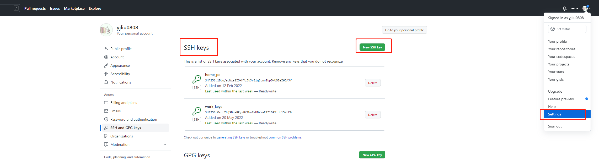

### git配置本地用户名和邮箱—连接远程仓库(github)

- 设置或者修改用户名及邮箱

  ```
  git config --global user.name "yjliu0808"
  git config –-global user.email "yjliu0808@163.com"
  ```

- 查看配置信息

  ```
  git config --list
  ```

- 生成shh秘钥

  ```
   ssh-keygen -t rsa -C "yjliu0808@163.com"   替换为你自己的邮箱
  ```

- Windows系统大概就在这个位置 下/c/Users/Administrator/.ssh/id_rsa.pub.中的内容即为刚生成的ssh秘钥


<div align="center">  </div><br>

- 也可以命令获取ssh密钥

  ```
  生成完密钥之后输入
  cd ~/.ssh
  ls -la
  cat id_rsa.pub  （红色的部分就是密钥内容）
  
  ```

  <div align="left">  </div><br>

- 打开github配置密钥

  <div align="left">  </div><br>

- 测试是否连接成功

  ```
  ssh -T git@github.com
  ```

  若出现以下提示表示连接成功。若提示ip要输入yes确认

>  Hi ***! You’ve successfully authenticated, but GitHub does notprovide shell access. 

git基本命令:

```java
$git clone (克隆远程仓库文件夹到本地仓库)
$ git add .  (提交该文件下的所有文档，注意add空格再点)
$ git status （查看文件状态）
git remote -v （查看文件所上传到哪个路径）
$ git commit -m "First commit" （提交到本地仓库，表示待提交）
$ git push -u origin master  （把待提交的文件上传到远程服务器仓库）
```


