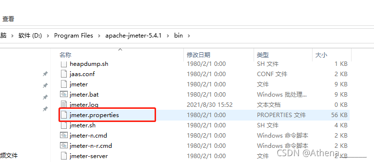

### 安装Jmeter

#### 下载

- https://jmeter.apache.org/download_jmeter.cgi

  
 
 

#### 环境检查

- java -version

  
 
 

#### 启动

- windows:bin路径下，jmeter.bat

  
 
 

#### 设置永久中文

- 打开配置文件：\bin\ jmeter.properties
- 更新配置文件：language=zh_CN （第37行添加）
- 重启jmeter.bat

 
 

 
 
