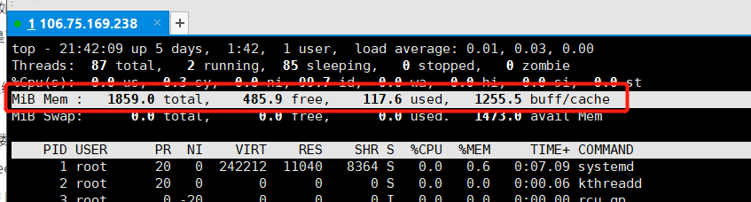
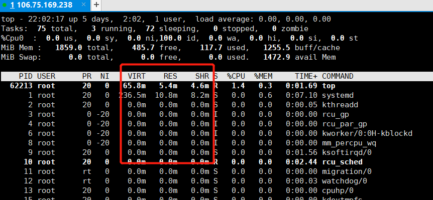
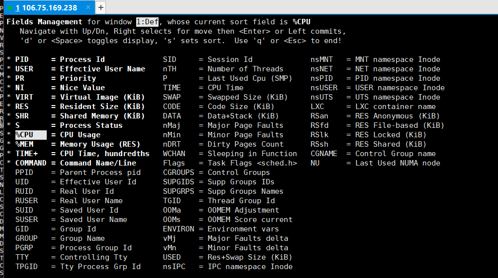
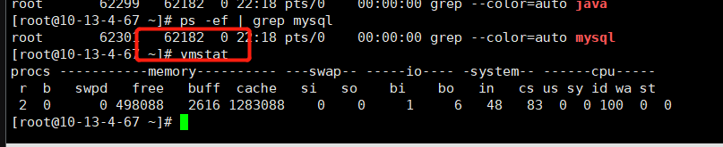
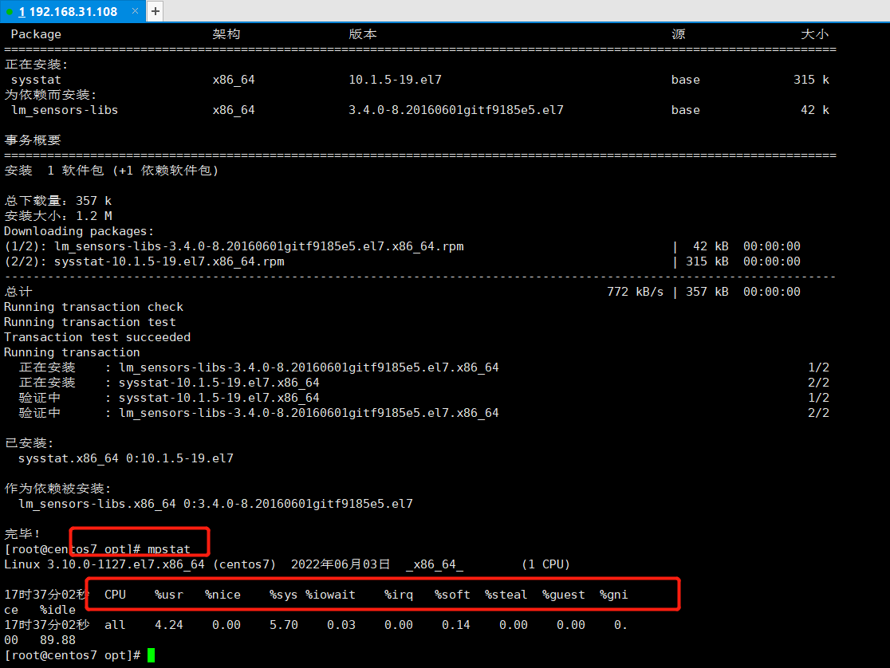
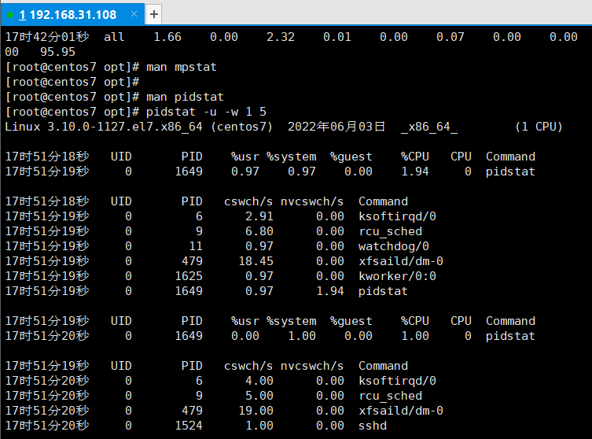
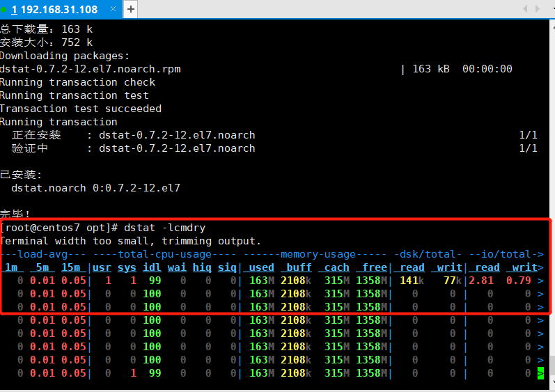
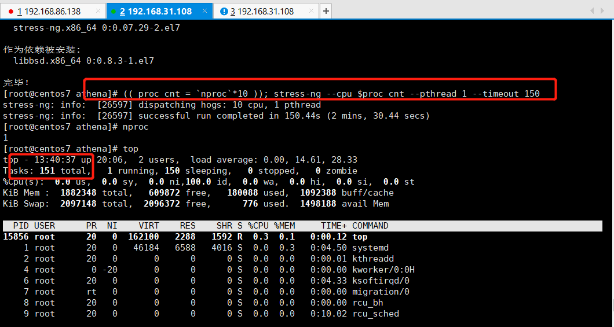

### linux性能分析命令

#### 1.常用的top命令

<div align="left">  </div><br>

+ top 查看系统**进程**的资源使用情况， 也可以查看线程, Threads:   可以按 H  来切换为线程 
+ top - 21:28:23 up  1:30,  3 users,  load average: 0.00, 0.01, 0.05
  + 3 users ： 当前系统有几个用户连接进来， 这个用户，可以是同一个user
  + load average: 0.13, 0.03, 0.01  系统瓶颈负载值
    + 第1个： 系统过去**1分钟**系统的平均负载值
    + 第2个：系统过去**5分钟**系统的平均负载值
    + 第3个：系统过去**15分钟**系统的平均负载值
    + 系统负载值，不等于cpu使用率值。因为系统的负载值，它主要由两部分组成： cpu的使用率 + io使用率
      + 历史的经验，系统负载高低，与cpu的数量有一定关系。
      + io：换入 换出（网络、内存、cpu等的换入换出，读写是换入换出的一种）
      + cpu使用率高： 影响因素us、 sy 、ni 、hi 、si、等
    + us：用户态使用cpu的时间占比 （非cpu内核计算）
    + sy： 系统态 在cpu的内核中进行计算消耗的时间占比 （内核）
    + ni：优先级切换
    + hi：hard interrupt 硬中断  中断会导致时间浪费，也会导致资源占用升高
    + si：soft interrupt 软中断
    + wa： wait 等待    等待资源 
    + st：  管理者占用资源
    + id： 休闲
    + 以后，不要说系统负载值大于cpu数量，就一定负载高。
  + load average: 0.00, 0.01, 0.05  如何知道我们现在系统的负载情况？
    + 看第1个值 是上升趋势，还是下降======我们现在系统负载正在上升，可能还会继续上升
    + 第1个值小于第二值，现在系统负载正在下降，再过一段时间可能会恢复正常。
  + 数字 1  可以看到cpu的数量， 核数


<div align="left">  </div><br>

+ Tasks: 112 total,   1 running, 111 sleeping,   0 stopped,   0 zombie  
  + Tasks进程数：Threads:   可以按 H  来切换为线程 
    + 任务列表中， S列 对应
      + S sleep
      + R running
      + T  stoped
      + Z  zombie

<div align="left">  </div><br>

+ Mem :  1881936 total,   808532 free,   468140 used,   605264 buff/cache
  KiB Swap:  4063228 total,  4063228 free,        0 used.  1255740 avail Mem
  + buff/cache: 缓存
    + buffer 缓冲区  磁盘虚拟出来的一个缓冲区，用于内存**读取**磁盘数据时，加快读取速度
    + cache 缓存   存在内存、cpu中
  + swap: 交互分区 主要是用来，交换内存空间。它也是由磁盘虚拟而来，一般为内存的2倍

+ Task   Thread  两个数字不相同，  Thread数字大于Task数字， 因为 一个进程可能有多个线程

  Tasks进程数：Threads:   可以按 H  来切换为线程 1

+ top命令中按数字1可以看到 多个核，每个核的cpu的使用情况

  + 在没有按1，  在我们用监控工具\平台来收集cpu的使用率
    + 看到是 所有cpu数量的一个总体的使用率

<div align="left">  </div><br>

+ 任何一个程序启动，都会在内存中占用：虚拟内存核物理内存

+ PID 进程id

+ USER      进程的归属用户

+ PR  优先级的级别

+ NI    优先级的值，越低，优先级越高

+ VIRT  虚拟内存  进程使用虚拟内存大小   默认是KB

+ RES    物理内存大小  进程使用的物理内存大小 默认是KB

+ SHR   共享内存大小 默认单位也是KB   

+ S  进程的状态

+ ​    VIRT  \RES SHR 这三个都是进程的内存相关数据，按小写e  可以切换单位

  <div align="left">  </div><br>

+ %CPU   进程占用的cpu率
+ %MEM     进程使用内存率
+ TIME+  进程使用cpu的时间
+ COMMAND   进程名称
+ 查看当前系统cpu使用率最高的4个进程： n  4 回车

<div align="left">  </div><br>

- top 命令后，按**f**可以有命令说明，**q**退出

<div align="left">  </div><br>

- top命令默认3秒钟刷新一次数据： s\d 数字

<div align="left">  </div><br>

- 我只想看某个进程下的线程资源使用情况: top -H -p pid值

<div align="left">  </div><br>


#### 2.ps命令

+ ps -ef\\-eF\\-ely 使用标准语法查看系统上的每个进程
+ ps aux |grep mysqld |grep -v grep 

<div align="left">  </div><br>

####  3.vmstat命令

+ 这个命令是系统自带
+ 虚拟内存统计的缩写，可对虚拟内存、进程、cpu活动进行监控

```sh
[root@vircent7 ~]# vmstat 1 1
procs -----------memory---------- ---swap-- -----io---- -system-- ------cpu-----
 r  b   swpd   free   buff  cache   si   so    bi    bo   in   cs us sy id wa st
 2  0      0 1094548   2108 362988    0    0    58     7   40   52  0  0 100  0  0

```

<div align="left">  </div><br>

+ procs
  + r  :  数字  显示cpu中有多少个进程正在等待
    + 如果r列是数字，大于cpu核数，那么说明现在现在有大量的进程在等待cpu进行计算，现在可能出现了cpu不够用的情况。----cpu成了我们的性能瓶颈，此时，可能需要去增加cpu数量；或者减少运行的进程数。
  + b ： 数字   现在有多少进程正在不可中断的休眠.   如果这个数字过大，就说明，资源不够用。

```sh
总：
+ memory
  + swap
  + free
  + buff\buffer
  + cache
+ swap
  + si  交换分区中的换入
  + so 交换分区中的换出
+ io
  + bi  块设备的读
  + bo  块设备的写
+ system
  + in  interrupet  cpu中断   数字
  + cs  cpu上下文切换  数学
+ cpu
  + us 
  + sy 
  + id 
  + wa 
  + st
```

#### 4.sysstat命令

<div align="left">  </div><br>

+ sysstat的工具包，这个工具包中带了很性能分析命令`yum install sysstat -y`
  + mpstat  查看cpu的相关数据
  + mpstat -P ALL 2 5  每间隔2秒显示5次CPU 具体 
    +  %usr   %nice   %sys %iowait    %irq   硬中断   、%soft  软中断  、%steal  
    +  %guest    显示cpu或cpu运行虚拟机处理器所花费的时间占比
    +  %gnice   显示cpu或cpu运行nices客户机所花费的时间占比
    +  %idle

  + iostat
  + pidstat

#### 5.pidstat 

<div align="left">  </div><br>

pidstat：能看磁盘、内存、cpu的数据，主要看cpu的上下文数据

- man pidstat

pidstat -u -w 1 5 (每间隔1秒收集上下文切换，总收集5次)
+ -u 用于查看cpu的数据
+ -w  看cpu的上下文数据
+ UID       PID   
+ cswch/s   自愿上下文切换次数
+ nvcswch/s   非自愿上下文切换次数
+ Command

中断  VS  上下文切换：
+ 中断： 中断当前正在运行的，去做其他事情
+ 上下文切换： 资源的切换
+ 中断，一定会导致上下文切换，但是上下文切换，不一定会中断。

#### 6.iostat

iostat：  看数据换入换出

+ iostat -dx 1 3    ------没有带m，数据单位，默认kb
  + rrqm/s    合并的每秒读请求
  + wrqm/s     合并的每秒写请求
  + r/s    读/秒
  + w/s    写/s
  + rkB/s     读kb/s
  + wkB/s 
  + avgrq-sz   平均情况的扇区数
  + avgqu-sz   等待大的请求数
  + await   等待的时间
  + r_await   读等待的时间
  + w_await  写等待的时间
  + svctm   实际请求的时间
  + %util   至少有一个活跃请求的所占的时间百分比

#### 7.dstat

+ yum install dstat -y
+ dstat -lcmdry

<div align="left">  </div><br>

#### 8.sar

- sar：  主要用在网络相关数据的查看

+ -n  网络相关数据统计
+ -d -b  磁盘驱动
+ -r  内存相关
+ -u  -P  cpu相关

块：从磁盘中读取数据的 最小单位

页：从内存中交互数据的 最小单位   页的大小要比 块要大

#### 9.中央处理器cpu

性能测试分析的思路：先分析硬件 、网络、 系统配置、应用程序

硬件： cpu、内存、磁盘、网络、io

+ cpu  中央处理器
  + 架构、主频、核
+ cpu：结构 主要物理结构是3个，实际是有4
  + 运算器： 真正进行计算的单元
  + 控制器： leader
  + 寄存器： 存储 指令、数据、地址
  + 时钟：计时(强制中断)

- cpu中： 内核、线程、架构
- 看cpu的数据信息： `top`  `lscpu`  `cat /proc/cpuinfo`
- /proc  虚拟文件，操作系统启动时，读取的信息，这些信息放内存中

- 内存：程序代码、网络数据，外部数据进入cpu的桥梁，内存的速度，要比cpu的速度慢
- `cat /proc/cpuinfo |grep "physical id" |sort |uniq |wc -l ` 查看物理cpu数量
- `cat /proc/cpuinfo | grep "cpu cores" |uniq `查看CPU的core数，即核数
- `cat /proc/cpuinfo | grep "processor" |wc -l` 查看逻辑CPU数量
- load average（系统平均负载） = cpuload（cpu负载）  + ioload （io负载）

#### 10.上下文切换

+ 上下文切换：  寄存器中的资源进行切换
  + 自愿上下文切换： 资源不够，自觉的切换到另外指令上
  + 非自愿上下文切换： 有可能有优先级更高的指令、指令执行的时间已经到了，被迫中止当前的指令，去执行其他指令

#### 11.cpu性能分析

+ top、 mpstat

  情况一：sys高 （系统态cpu使用率高）， 内核中计算比较高

  + 程序进行计算，非内核态  进入内核态，重点关注 上下文切换的数据
    + 自愿上下文切换， 资源不够用，所以要进行切换，===资源有关，===可能存在IO/内存资源
    + 非自愿上下文切换 -----强制进行资源切换 =====考虑cpu不够用
      + 解决：
        +  要么在服务器上，减少启动的程序
        +  要么增加cpu的数量

   


#### 12.stress-ng

- stress-ng:  性能测试模拟工具，可以直接模拟服务器各种压力情况


+ stress-ng   我可以通过它，来模拟，你们企业中的响应有cpu相关性能问题

```
# 安装epel源，更新系统
yum install -y epel-release.noarch && yum -y update

# 安装stess-ng 的工具
yum install -y stress-ng
```

```
进程上下文切换
(( proc_cnt = `nproc`*10 )); stress-ng --cpu $proc_cnt --pthread 1 --timeout 150  
# (( proc_cnt = `nproc`*10 ));   把cpu核的数量乘以10倍，给变量proc_cnt
# --cpu $proc_cnt  $proc_cnt shell编程中的变量引用
# --pthread  每个进程有多少个线程
# --timeout   超时时间，在命令执行多长时间之后自动结束
```

<div align="left">  </div><br>

```
stress-ng  -i 6 --hdd 1 --timeout 150
```
