# 服务器性能分析

## 第一部分：linux基础分析命令

#### 1.常用的top命令

<div align="left">  </div><br>

+ top 查看系统**进程**的资源使用情况， 也可以查看线程, Threads:   可以按 H  来切换为线程 
+ top - 21:28:23 up  1:30,  3 users,  load average: 0.00, 0.01, 0.05
  + 3 users ： 当前系统有几个用户连接进来， 这个用户，可以是同一个user
  + load average: 0.13, 0.03, 0.01  系统瓶颈负载值
    + 第1个： 系统过去**1分钟**系统的平均负载值
    + 第2个：系统过去**5分钟**系统的平均负载值
    + 第3个：系统过去**15分钟**系统的平均负载值
    + 系统负载值，不等于cpu使用率值。因为系统的负载值，它主要由两部分组成： cpu的使用率 + io使用率
      + 系统负载高低，与cpu的数量有一定关系。
      + io：换入 换出（内存和cup的转移）
      + cpu使用率高： 影响因素us、 sy 、ni 、hi 、si、等
    + us：用户态使用cpu的时间占比 （非cpu内核计算）
    + sy： 系统态 在cpu的内核中进行计算消耗的时间占比 （内核）
    + ni：优先级切换
    + hi：hard interrupt 硬中断  中断会导致时间浪费，也会导致资源占用升高
    + si：soft interrupt 软中断
    +   wa： wait 等待    等待资源 
    + st：  管理者占用资源
    + id： 休闲
    + 以后，不要说系统负载值大于cpu数量，就一定负载高。
  + load average: 0.00, 0.01, 0.05  如何知道我们现在系统的负载情况？
    + 看第1个值 是上升趋势，还是下降======我们现在系统负载正在上升，可能还会继续上升
    + 第1个值小于第二值，现在系统负载正在下降，再过一段时间可能会恢复正常。
  + 数字 1  可以看到cpu的数量， 核数


<div align="left">  </div><br>

+ Tasks: 112 total,   1 running, 111 sleeping,   0 stopped,   0 zombie  
  + Tasks进程数：Threads:   可以按 H  来切换为线程 
    + 任务列表中， S列 对应
      + S sleep
      + R running
      + T  stoped
      + Z  zombie

<div align="left">  </div><br>

+ Mem :  1881936 total,   808532 free,   468140 used,   605264 buff/cache
  KiB Swap:  4063228 total,  4063228 free,        0 used.  1255740 avail Mem
  + buff/cache: 缓存
    + buffer 缓冲区  磁盘虚拟出来的一个缓冲区，用于内存**读取**磁盘数据时，加快读取速度
    + cache 缓存   存在内存、cpu中
  + swap: 交互分区 主要是用来， 交换内存空间。它也是由磁盘虚拟而来，一般为内存的2倍

+ Task   Thread  两个数字不相同，  Thread数字大于Task数字， 因为 一个进程可能有多个线程

  Tasks进程数：Threads:   可以按 H  来切换为线程 1

+ top命令中按数字1可以看到 多个核，每个核的cpu的使用情况

  + 在没有按1，  在我们用监控工具\平台来收集cpu的使用率
    + 看到是 所有cpu数量的一个总体的使用率

<div align="left">  </div><br>

+ 任何一个程序启动，都会在内存中占用：虚拟内存核物理内存

+ PID 进程id

+ USER      进程的归属用户

+ PR  优先级的级别

+ NI    优先级的值，越低，优先级越高

+ VIRT  虚拟内存  进程使用虚拟内存大小   默认是KB

+ RES    物理内存大小  进程使用的物理内存大小 默认是KB

+ SHR   共享内存大小 默认单位也是KB   

+ S  进程的状态

+ ​    VIRT  \RES SHR 这三个都是进程的内存相关数据，按小写e  可以切换单位

  <div align="left">  </div><br>

+ %CPU   进程占用的cpu率
+ %MEM     进程使用内存率
+ TIME+  进程使用cpu的时间
+ COMMAND   进程名称
+ 查看当前系统cpu使用率最高的4个进程： n  4 回车

<div align="left">  </div><br>

- top 命令后，按**f**可以有命令说明，**q**退出

<div align="left">  </div><br>

- top命令默认3秒钟刷新一次数据： s  数字

<div align="left">  </div><br>

- 只看某个进程下的线程资源使用情况: top -H -p pid值

<div align="left">  </div><br>


#### 2.ps命令

+ ps -ef\\-eF\\-ely 使用标准语法查看系统上的每个进程
+ ps aux |grep mysqld |grep -v grep 

<div align="left">  </div><br>

####  3.vmstat命令

+ 这个命令是系统自带
+ 虚拟内存统计的缩写，可对虚拟内存、进程、cpu活动进行监控

```sh
[root@vircent7 ~]# vmstat 1 1
procs -----------memory---------- ---swap-- -----io---- -system-- ------cpu-----
 r  b   swpd   free   buff  cache   si   so    bi    bo   in   cs us sy id wa st
 2  0      0 1094548   2108 362988    0    0    58     7   40   52  0  0 100  0  0

```

<div align="left">  </div><br>

+ procs
  + r  :  数字  显示cpu中有多少个进程正在等待
    + 如果r列是数字，大于cpu核数，那么说明现在现在有大量的进程在等待cpu进行计算，现在可能出现了cpu不够用的情况。----cpu成了我们的性能瓶颈，此时，可能需要去增加cpu数量；或者减少运行的进程数。
  + b ： 数字   现在有多少进程正在不可中断的休眠.   如果这个数字过大，就说明，资源不够用。

```sh
总：
+ memory
  + swap
  + free
  + buff\buffer
  + cache
+ swap
  + si  交换分区中的换入
  + so 交换分区中的换出
+ io
  + bi  块设备的读
  + bo  块设备的写
+ system
  + in  interrupet  cpu中断   指次数
  + cs  cpu上下文切换  数学 指次数
+ cpu
  + us 
  + sy 
  + id 
  + wa 
  + st
```

#### 4.sysstat命令

<div align="left">  </div><br>

+ sysstat的工具包，这个工具包中带了很性能分析命令`yum install sysstat -y`
  + mpstat  查看cpu的相关数据
  + mpstat -P ALL 2 5  每间隔2秒显示5次CPU 具体 
    +  %usr   %nice   %sys %iowait    %irq   硬中断   、%soft  软中断  、%steal  
    +  %guest    显示cpu或cpu运行虚拟机处理器所花费的时间占比
    +  %gnice   显示cpu或cpu运行nices客户机所花费的时间占比
    +  %idle

  + iostat
  + pidstat

#### 5.pidstat 

<div align="left">  </div><br>

pidstat：能看磁盘、内存、cpu的数据，主要看cpu的上下文数据

- man pidstat

pidstat -u -w 1 5 (每间隔1秒收集上下文切换，总收集5次)
+ -u 用于查看cpu的数据
+ -w  看cpu的上下文数据
+ UID       PID   
+ cswch/s   自愿上下文切换次数
+ nvcswch/s   非自愿上下文切换次数
+ Command

中断  VS  上下文切换：
+ 中断： 中断当前正在运行的，去做其他事情
+ 上下文切换： 资源的切换
+ 中断，一定会导致上下文切换，但是上下文切换，不一定会中断。

#### 6.iostat

iostat：  看数据换入换出

+ iostat -dx 1 3    ------没有带m，数据单位，默认kb
  + rrqm/s    合并的每秒读请求
  + wrqm/s     合并的每秒写请求
  + r/s    读/秒
  + w/s    写/s
  + rkB/s     读kb/s
  + wkB/s 
  + avgrq-sz   平均情况的扇区数
  + avgqu-sz   等待大的请求数
  + await   等待的时间
  + r_await   读等待的时间
  + w_await  写等待的时间
  + svctm   实际请求的时间
  + %util   至少有一个活跃请求的所占的时间百分比

#### 7.dstat

+ yum install dstat -y
+ dstat -lcmdry   集合（磁盘、cpu、id\内存、网络）命令

<div align="left">  </div><br>

#### 8.sar

- sar：  主要用在网络相关数据的查看

+ -n  网络相关数据统计
+ -d -b  磁盘驱动
+ -r  内存相关
+ -u  -P  cpu相关

块：从磁盘中读取数据的 最小单位

页：从内存中交互数据的 最小单位   页的大小要比 块要大

## 第二部分：中央处理器cpu

性能测试分析的思路：先分析硬件 、网络、 系统配置、应用程序

硬件： cpu、内存、磁盘、网络、io

+ cpu  中央处理器
  + 架构、主频、核
+ cpu：结构 主要物理结构是3个，实际是有4
  + 运算器： 真正进行计算的单元
  + 控制器： leader
  + 寄存器： 存储 指令、数据、地址  
  + 时钟：计时(强制中断)

- cpu中： 内核、线程、架构
- 看cpu的数据信息： `top`  `lscpu`  `cat /proc/cpuinfo`
- /proc  虚拟文件，操作系统启动时，读取的信息，这些信息放内存中

- 内存：程序代码、网络数据，外部数据进入cpu的桥梁，内存的速度，要比cpu的速度慢
- `cat /proc/cpuinfo |grep "physical id" |sort |uniq |wc -l ` 查看物理cpu数量
- `cat /proc/cpuinfo | grep "cpu cores" |uniq `查看CPU的core数，即核数
- `cat /proc/cpuinfo | grep "processor" |wc -l` 查看逻辑CPU数量
- load average（系统平均负载） = cpuload（cpu负载）  + ioload （io负载）

#### 10.上下文切换

（因为有数据交互：cpu将网络数据转换为系统可读数据，即寄存器出现了上下文切换的概念）

+ 上下文切换：  寄存器中的资源进行切换
  + 自愿上下文切换： 资源不够，自觉的切换到另外指令上
  + 非自愿上下文切换： 有可能有优先级更高的指令、指令执行的时间已经到了，被迫中止当前的指令，去执行其他指令

#### 11.cpu性能分析

+ top、 mpstat

  情况一：sys高 （系统态cpu使用率高）， 内核中计算比较高

  + 程序进行计算，非内核态  进入内核态，重点关注 上下文切换的数据
    + 自愿上下文切换， 资源不够用，所以要进行切换，===资源有关，===可能存在IO/内存资源
    + 非自愿上下文切换 -----强制进行资源切换 =====考虑cpu不够用
      + 解决：
        +  要么在服务器上，减少启动的程序
        +  要么增加cpu的数量

   


#### 12.stress-ng

- stress-ng:  性能测试模拟工具，可以直接模拟服务器各种压力情况


+ stress-ng   我可以通过它，来模拟，你们企业中的响应有cpu相关性能问题

```
# 安装epel源，更新系统
yum install -y epel-release.noarch && yum -y update

# 安装stess-ng 的工具
yum install -y stress-ng
```

```
进程上下文切换
(( proc_cnt = `nproc`*10 )); stress-ng --cpu $proc_cnt --pthread 1 --timeout 150  
# (( proc_cnt = `nproc`*10 ));   把cpu核的数量乘以10倍，给变量proc_cnt
# --cpu $proc_cnt  $proc_cnt shell编程中的变量引用
# --pthread  每个进程有多少个线程
# --timeout   超时时间，在命令执行多长时间之后自动结束
```

<div align="left">  </div><br>

```
stress-ng  -i 6 --hdd 1 --timeout 150
```

## 第三部分：内存

+ 内存知识

  + 当打开一个软件，就会分配虚拟内存、物理内存空间，cpu读取虚拟内存
  + 程序在启动时，并不会把所有的数据，加到内存
  + 32位的系统，最大支持的内存条，只有4g，64位系统，最大可以支持128T
  + 程序在启动时，会有一个内存配置信息，就会告诉系统，我要在整改内存条中，申请多少m内存空间。

+ 内存中，内存地址与存储单元组成的

  + 存储单元中，就是来真正存储内容
  + 不同的数据类型，存储单元大小不一样
    + int float, char
    + 列表  数组
    + python：列表 [8,'nmb',['vip8','vip12'],]
      + 列表中，插入一个数据，要把插入位置之后的所有数据都移动位置
      + 所以，这种，速度是比较慢

+ 数据结构

  + 链表：  自行车链条
  + 每一个数据，都有自己的地址 + 数据 +下一个数据的地址
  + 插入数据时， 数据本身可以在内存空间的任意位置，然后，在插入数据的位置前一个数据改变下一个数据地址，指向我的这位置，我的数据位置记录的下一个位置......
  + 这种数据插入方式，速度要比列表要块
  + 但是，读取某个数据的速度降低，因为我们每查询一个数据，都要从链表的第1个数据开始查找，一直到找到为止，这个中间，我们可能要进行大量IO数据交互

+ 堆栈：  两种数据结构

  + 栈： LIFO

  + 队列：FIFO

  + 堆：

+ 内存地址  + 内存存储单元
+ 内存中数据结构
  + 列表：往列表中插入数据，插入点之后的数据，全部都需要移动，这个插入速度比较慢
  + 链表：每一个数据，它都存储了下一个数据的地址(内存地址)，在插入数据的时候，我可以把数据放在任何位置
    + 链表在查数据时，它的链路可能会很长，那么它的IO可能消耗比较高
  + 二叉树
    + 它也链表
    + 插入数据时，数据进行比较，比数据小的在左边，比数据大的插入在右边
    + 查找数据时，比数据大的，我就去右边找，比数据小，我就去左边找，这个时候，IO就比链表要少很多。

+ 数据类型：
  + 栈stack： 存储的数据比较小，比如某个变量
    + LIFO  后进先出
      + 压入 push
      + 弹出 pop  弹出我们最后一个数据
  + 队列： FIFO   排队
    + 顺序队列，
    + 循环队列
  + 堆heap： 存储的数据比较复杂
    + 对象

+ 一个程序： 如： 这个程序启动要 256m

  + 先有一个虚拟内存地址  +  物理内存地址
  + 虚拟内存地址： 记录物理内存中存储了哪些数据，在什么地方

+ jvm： java虚拟机

  + 程序计数器、java虚拟机栈、本地方法栈、方法区、堆内存
  + 程序计数器：记录程序执行字节码的行号指示器

  + **内存泄漏**： 内存的资源不及时释放，一直占用，导致可用的内存资源越来越少。
  + **内存溢出**：内存泄漏到一定的时间，可用的空间就会越来越少，某一次我要用比较大的空间时，发现，我申请不到足够的空间了，我申请的空间已经超过最大可用空间，内存溢出。
    + 内存溢出，在错误日志，会出现
    + jmap
    + arthas

top:  进程列表中有3列，  虚拟内存、物理内存、共享内存

+ 堆内存：新生代、老年代、永久代(元空间)

  + 新生代new：昙花一现，朝生夕死的对
    + 如：你写的代码，方法里面变量
  + 老年代Tenured：
    + 新生代数据，经过copy算法，如copy了15次，

  

YGC:Young Generation   Minor GC

FGC:Major GC

资源回收的时候，都会出现卡顿，YGC的卡断时间会比较短，FGC卡顿的时间会比较长

性能测试中，就对于这个gc是要关注

+ 如果 新生代资源分配过多，那么，老年代这变就要少， 老年代的空间，我可能就要经常的进行FGC， FGC频率高了，那么累计的gc的时间就长，导致性能比较差

+ 如果 新生代分配的资源少了，那么老年代就分配多些，我的新生代的资源回收频率YGC就要高， 那么累计的ygc的时间也可能长，我的性能也可能较差

+ gc资源回收
  + 哪些是可以被回收？
    + 是否已死

-XX:SurivivorRatio=8   eden空间、from空间、to空间的比例 8:1:1

-XX:MaxMetaspaceSize   jdk1.7  jdk1.8这个元空间参数配置名称变了

+ 查看内存：

  + free -h


## 性能测试分析过程

硬件： cpu、内存、磁盘、网络、io

### 一、环境部署

#### 1.CentOS 7安装python3

```shell
# 安装python3依赖
yum install wget -y
yum install gcc -y
yum groupinstall 'Development tools' -y
yum install openssl-devel bzip2-devel expat-devel gdbm-devel readline-devel  sqlite-devel libffi-devel -y
```

- 上传服务器python3.9.1包和运行的项目包 
- 链接：https://pan.baidu.com/s/1nev1JkG6bJqhQszBXho0vg  提取码：athe

```
#解压，进入解压后的文件夹后执行命令：指定安装路径/usr/local/python3/
./configure --prefix=/usr/local/python3/
# 安装命令
make && make install 
# 指定软链接
ln -s /usr/local/python3/bin/python3 /usr/bin/python3
ln -s /usr/local/python3/bin/pip3 /usr/bin/pip3
安装flask
pip3 install flask 
运行项目： python3 pertest_io.py
```

启动程序提示端口被使用：Address already in use   Port 9800 is in use by another program.

```
#根据pid结束进程
netstat -anp | grep 9800
kill -9 27037
```

<div align="left"> 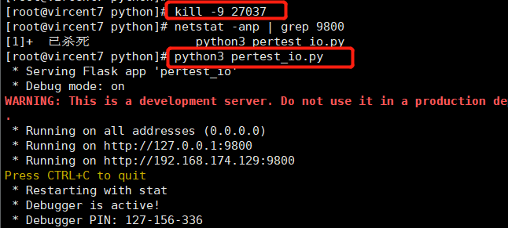 </div><br>

### 二、jmeter发起请求分析数据

- 请求地址：GET http://192.168.174.129:9800/pertestio/47

  <div align="left"> 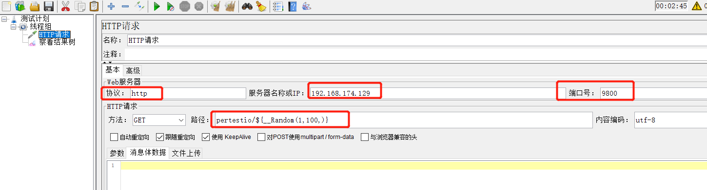 </div><br>

  <div align="left"> 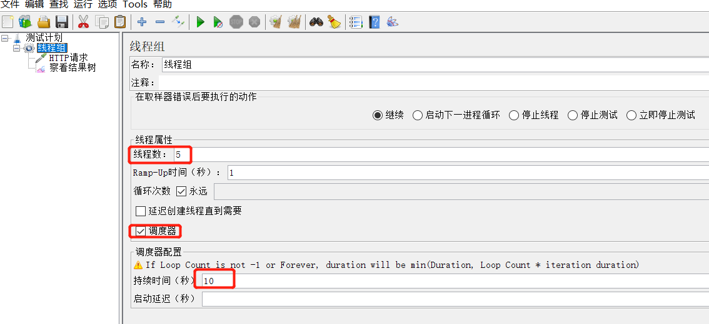 </div><br>

场景：5个线程数持续运行10秒

yum install sysstat -y  安装工具包才可用此命令 mpstat -P ALL 2

服务器运行以下命令进行分析：2秒收集一次

```
top
vmstat 2
yum install sysstat -y
mpstat -P ALL 2
```

分析过程：
未执行jmeter脚本之前的参数：

- top

<div align="left"> 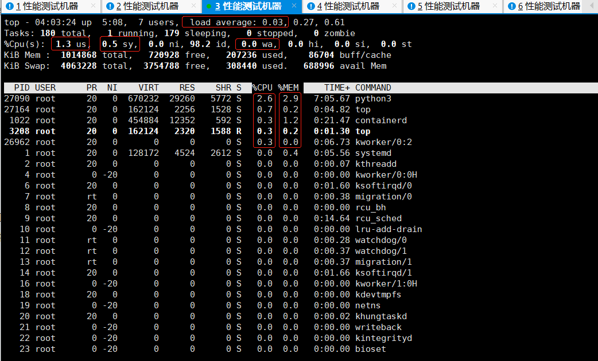 </div><br>

```
 load average: 0.03, 0.27, 0.61系统瓶颈负载值
 wa：0.0  wait 等待    等待资源 
 us：1.3  用户态使用cpu的时间占比 （非cpu内核计算）
 sy：0.5  系统态 在cpu的内核中进行计算消耗的时间占比 （内核）
 %CPU 2.6  进程占用的cpu率
 %MEM 2.9  进程使用内存率    
```

- vmstat 2

<div align="left"> 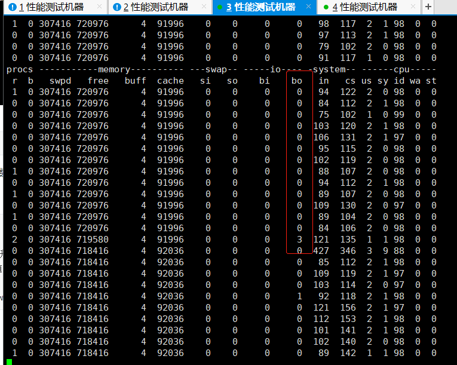 </div><br>

```
vmstat 2  : 0  io的bo值无明显数据
```

- mpstat -P ALL 2

<div align="left"> 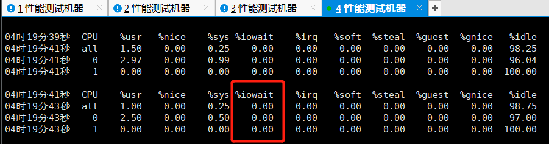 </div><br>

```
mpstat -P ALL 2  -- 每间隔2秒显示CPU 具体
```

- iostat：  看数据换入换出 （rrqm/s    合并的每秒读请求   wrqm/s     合并的每秒写请求）

<div align="left"> 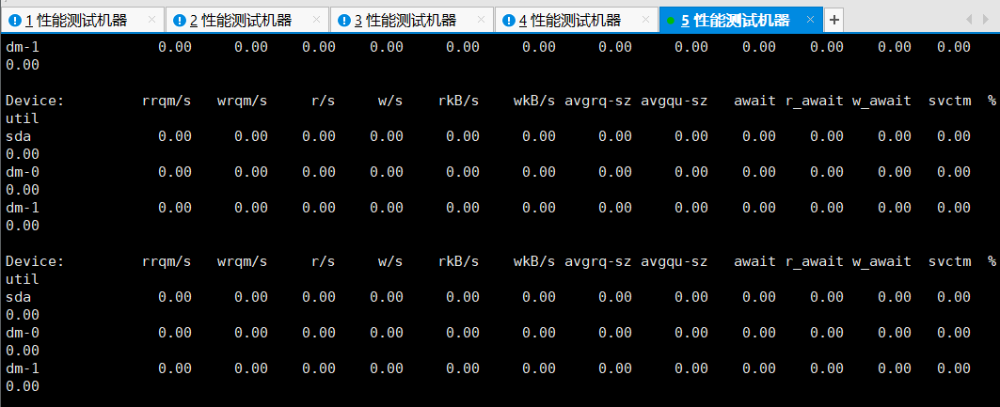 </div><br>

观察执行jmeter脚本之后的参数：

- top

<div align="left"> 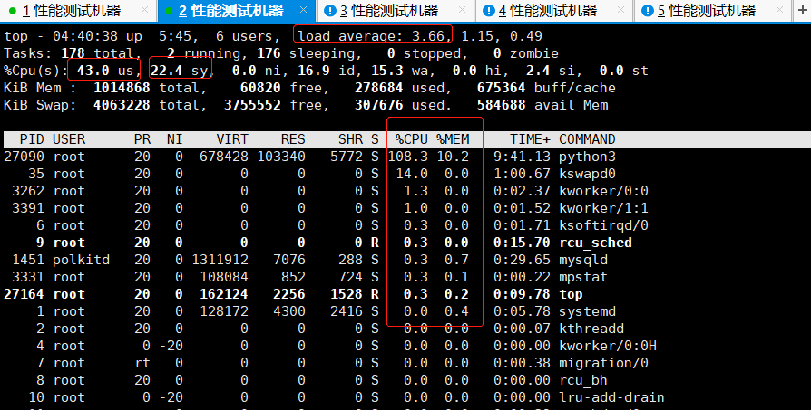 </div><br>

- vmstat 2

<div align="left"> 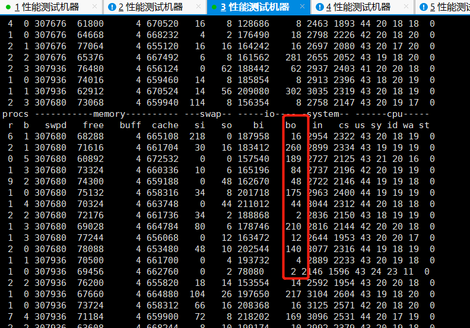 </div><br>

- mpstat -P ALL 2

<div align="left"> 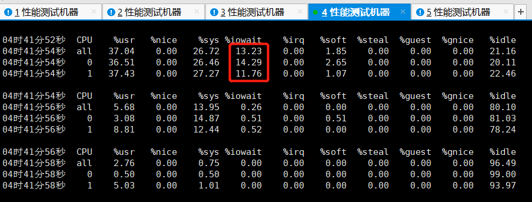 </div><br>

- iostat -dx 2

<div align="left"> 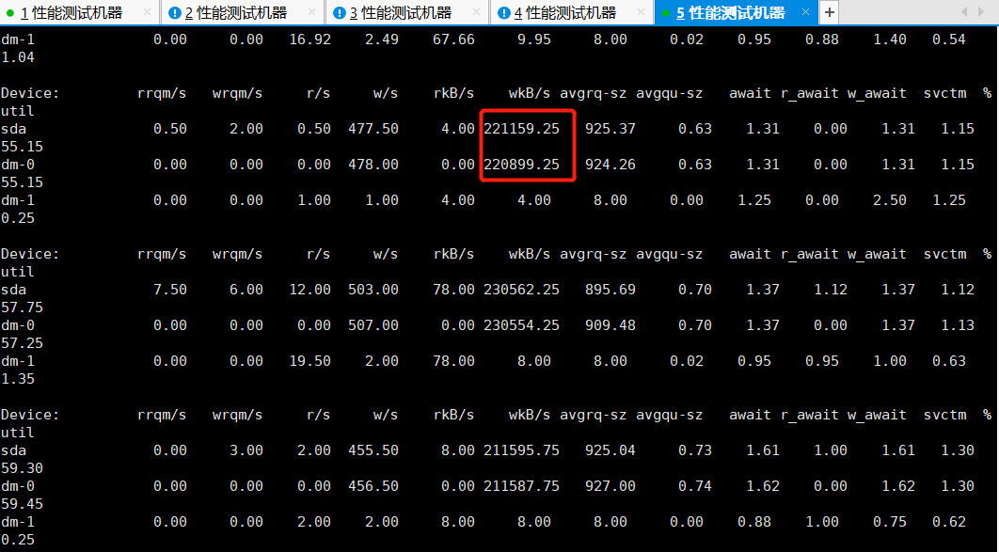 </div><br>

```
定位： 
+ top   cpu的wa值(大量的等待) 非常高
+ vmstat 2  : io的bo值，有明显的数据==有大量的写磁盘操作
+ mpstat -P ALL 2  io的bo值明显写入数据
+ iostat -dx 2   看到wKB/S有非常大的数据,现在的磁盘 有大量的写操作
```

总结：系统平均负载在上升


## 第二部分：网络

概述HTTP：即超文本传输协议，HTTP是应用层协议，当你上网浏览网页的时候，浏览器和web服务器之间就会通过HTTP在Internet上进行数据的发送和接收。HTTP是一个基于请求/响应模式的、无状态的协议。即我们通常所说的Request/Response。

HTTP连接中报文分为请求（request）和响应（response）两种。每种报文在HTTP首部都有不同的字段来标识不同的用途。

请求报文：HTTP协议使用TCP协议进行传输，在应用层协议发起交互之前，首先是TCP的三次握手。完成了TCP三次握手后，客户端会向服务器发出一个请求报文。

附件主题目的：性能调优的步骤：
1.首先解决发起方端口问题 

2.服务器的操作系统修改调优

3.应用中间件：连接池：应用连接池、数据库连接池

### 1.网络

+ TCP协议：通过数据发送者和接收者相互回应对方发来的确认信息，可靠的进行数据传输
+ IP协议：指定数据发送的ip信息，以及通过路由转发数据

+ **TCP组成：源地址、源端口、目的地址、目的端口**    ===》 ”数据“ + tcp + ip + 帧头\帧尾

  + 电脑最多： 65535个端口

  + 1- 1023  公认端口 21、22、25、80、443

  + 1024-49151  注册端口  8080  9800 3000

  + 49152~65535 私有端口  约16800  （端口有等待时间，不用则关闭）

  性能测试场景：很多个并发数短时间发起请求，占用大量的端口，端口数量是有限的，端口数量就可能成为性能瓶颈

  可能出现问题：连接被拒，连接超时、Address already in use: connect

  + 优化方向：

    + 扩大端口范围： 1024 注册端口  ~ 65535 私有端口    达到6.4w端口
    + 让端口占用的时长缩短：  去掉keepalive
    + 1、keepalve 勾去掉
    + 2、修改发起方的系统信息
      + windows: 注册表：  MaxUsePort： 十进制65535    TcpTimedWaitDelay:  十进制 30
      + linux： sysctl  net.ipv4.ip_local_port_range   1024 65535

  + 分析：查看端口是否成为性能瓶颈 ，如果发起方机器，如下命令的数值，约1.4w，可以肯定本地端口成为性能瓶颈

    ```
    #查看端口使用数量：
    #windows：  /i   不匹配大小写  /c  统计
    netstat -ano | find "TCP" /i /c
    #linux：
    netstat -ano | grep "TCP" | wc -l
    ```

    <div align="left"> 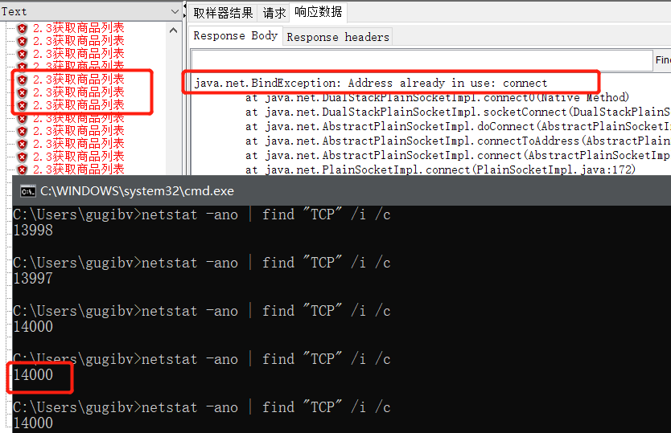 </div><br>

    + 调优：

      1.去掉： keepalive  并不能解决问题，只是把这个报错时间往后延迟一点

      <div align="left"> 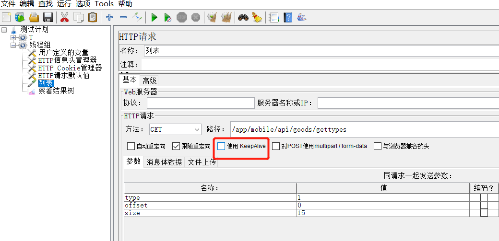 </div><br>

      2.修改注册表：计算机\HKEY_LOCAL_MACHINE\SYSTEM\CurrentControlSet\Services\Tcpip\Parameters

      + 添加 MaxUserPort  十进制 65534
      + 添加TcpTimedWaitDelay  十进制  30
      + 重启系统

      <div align="left"> 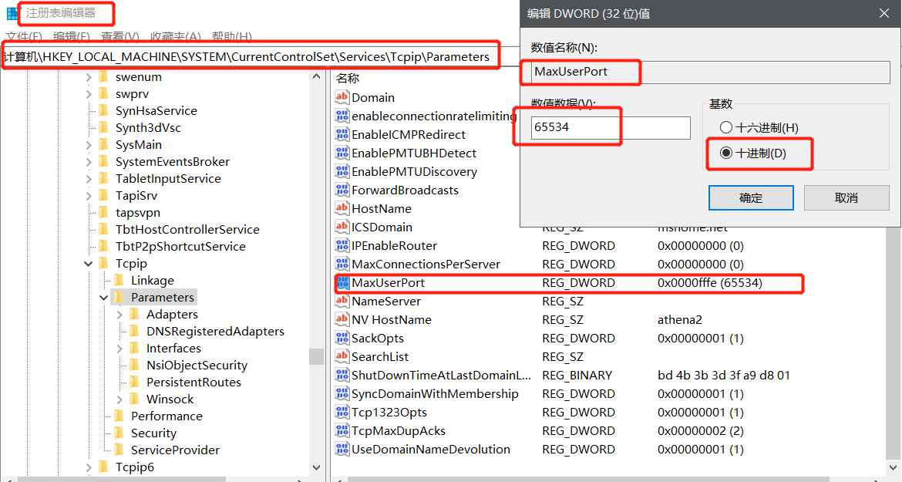 </div><br>

      <div align="left"> 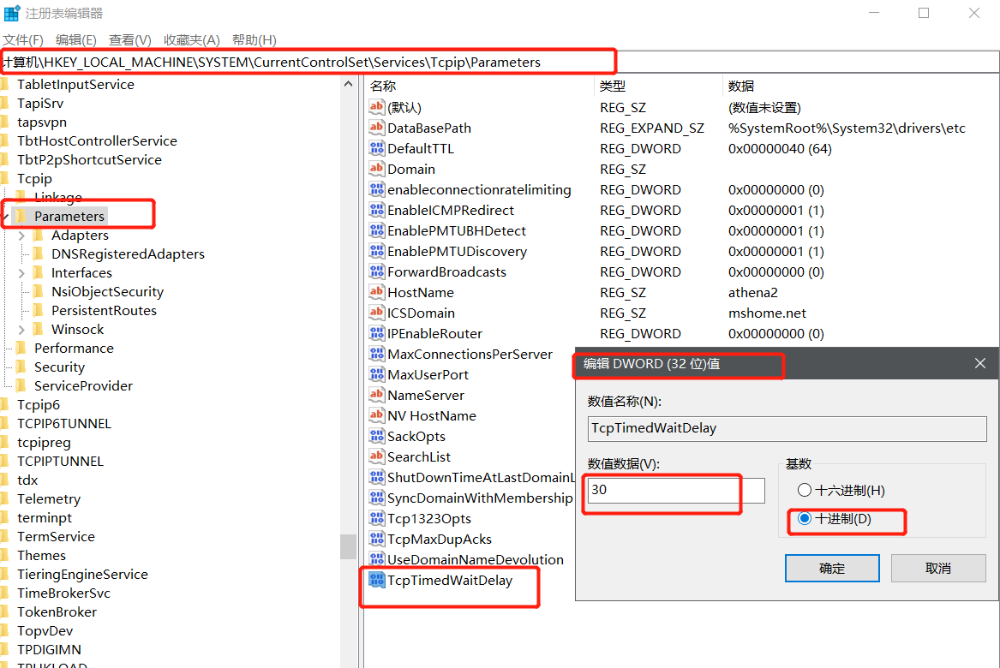 </div><br>

      2.linux，如果发起方是Linux

      ```shell
      #查看端口范围：
      sysctl -a |grep net.ipv4.ip_local_port_range
      #net.ipv4.ip_local_port_range = 32768    60999  =====2.8w
      #改端口范围： 
      sysctl -w net.ipv4.ip_local_port_range="1024 65535"
      sysctl -p
      ```

      

      <div align="left"> 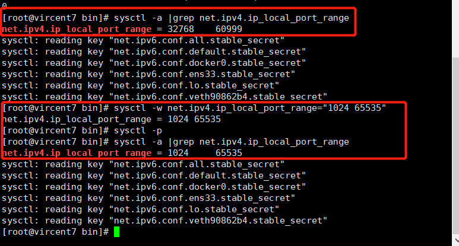 </div><br>

      

### 2.宽带

+ 判断带宽有没有问题：

  + 吞吐率

    + 1Mbps = 1024Kbps  = 1024/8 KB/s = 128KB/s

  + ping目标服务器  

    + 看时间   没有测试前的时间 与在进行性能测试时的  时间之间有没有明显的差异
    + 看丢包： 如果有丢包  肯定时网络瓶颈

    <div align="left"> 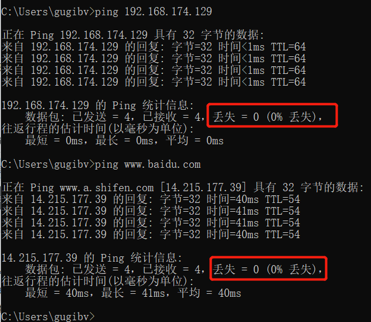 </div><br>

<div align="left"> 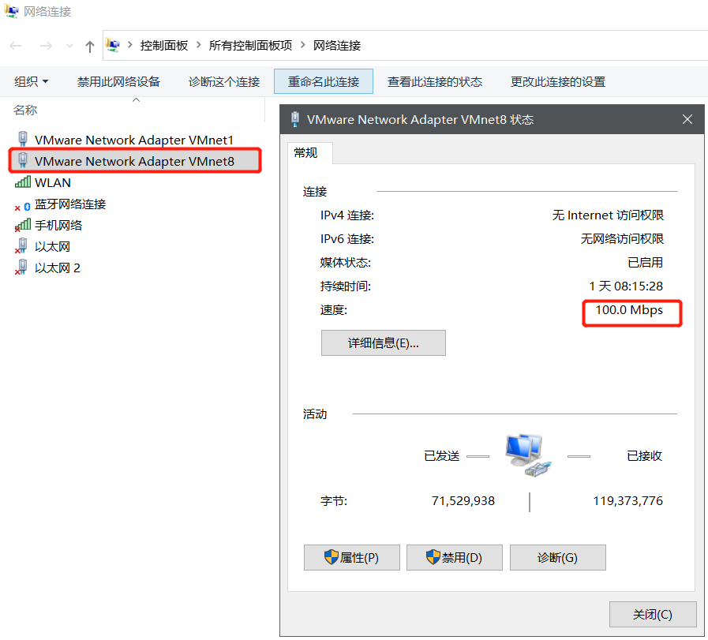 </div><br>

网卡：网络传输介质与终端设备连接的关卡

发起源：
win10 查看网络连接-选中网卡-状态-速度

100Mbps = 100/8 MB/s = 12.5MB/s

1.0Gbps = 1024Mbps =1024 /8 MB/s =128MB/s

服务器\目的地：
Linux :ethtool 网卡名称| grep Speed

<div align="left"> 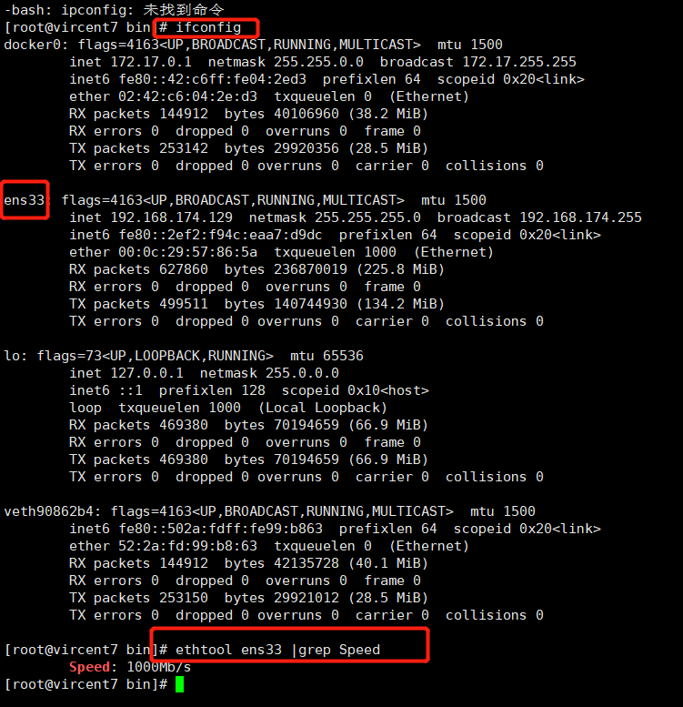 </div><br>


## 第三部：服务器要调优

### 1.os操作系统修改调优

+ ulimit   `ulimit -a`  查看所有的限制

+ `ulimit -n`  open files  打看文件数量限制  默认1024. 某一个应用程序，最多可以打开的文件数量

+ 修改配置项： `ulimit -选项参数 配置值`  ----这种修改，只是**临时**修改，系统重启之后，自动还原。

  <div align="left"> 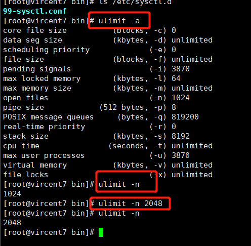 </div><br>

- 持久化\永久性的修改

```
vim /etc/security/limits.conf

*	soft	nproc	32768
*	hard	nproc	32768
*	soft	nofile	16000
*	hard	nofile	16000
```

<div align="left"> 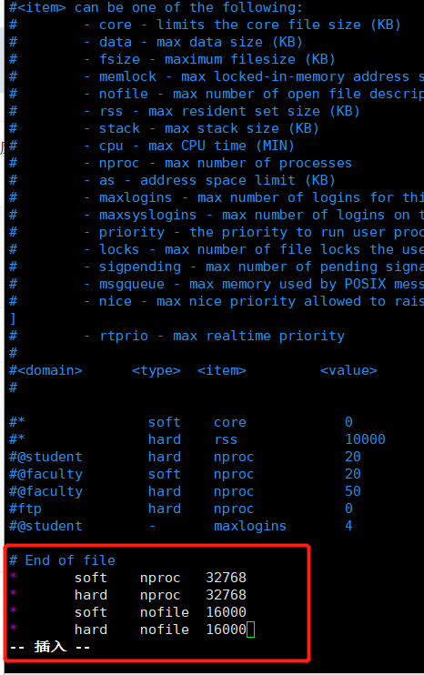 </div><br>

不管你是用  ulimit命令修改，还是 修改文件limits.conf， 你的应用程序要使用这个配置，那么你的应用程序需要重启

<div align="left"> 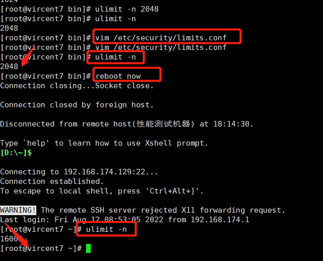 </div><br>

- 检查系统配置是否成为瓶颈：

```
#lsof -p pid |wc -l
yum install lsof
ps -ef | grep java
lsof -p 1622
lsof |wc -l
cat /proc/1622/limits	 # 看具体某个进程运行打开的文件数量  （1622进程数）

```

<div align="left"> 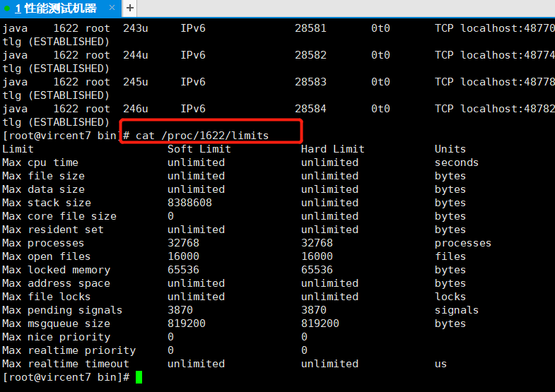 </div><br>

+ 禁ping

```
# 禁ping
sysctl -w net.ipv4.icmp_echo_ignore_all=1
sysctl -w net.ipv4.route.flush=1
sysctl -p

# 开启
sysctl -w net.ipv4.icmp_echo_ignore_all=0
sysctl -w net.ipv4.route.flush=1
sysctl -p
```

<div align="left">  </div><br>

<div align="left"> 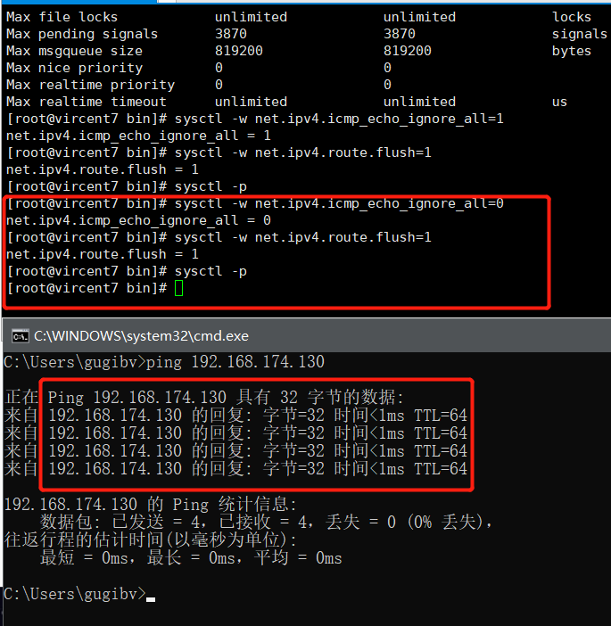 </div><br>


第四部分：USE方法

use方法：对于所有资源，查看他的使用率、饱和度和错误

资源：硬件资源、软件资源
使用率：规定时间间隔内，资源用服务工作时间百分比

饱和度：资源不能再服务更多额外工作的程度

错误：错误事件个数

```
+ + + + 中断切换

    + cpu性能分析：
      + top
      + vmstat    proc   r列
      + pidstat   具体看  自愿上下文切换  非自愿上下文切换   定位具体的pid
  + 内存：
    + 虚拟内存
    + 物理内存
      + 内存问题怎么定位：
        + OOM：
          + jstat   dump
          + arthas    threaddump
          + MAT
        + 内存溢出
        + 内存泄漏
  + io问题
    + iostat
    + vmstat  io bi/bo
    + buff  
    + cache

+ 网络：
  + 源地址
  + 源端口： 
    + 发起方window：
      + 1、去掉keepalive
      + 2、改注册表： MaxUserPort   65535、 TcpTimedWaitDelay 30
    + 发起方linux
      + 1、去掉keepalive
      + 2、sysctl -w net.ipv4.ip_local_port_range="1024 65535"; sysctl -p
      + 3、ulimit -n 16000
  + 目标地址
    + ~~sysctl -w net.ipv4.ip_local_port_range="1024 65535"; sysctl -p~~
    + ulimit -n 16000    ulimit -u 65535
      + nproc、 nofile
  + 目标端口： 线程池

如果看到响应信息中有，too many open file       ` too many connection`
+ tps上不去，可能的原因
  + 带宽
  + io
  + 连接池： 应用连接池、数据库连接池  默认151
  + 资源回收： gc、堆栈配置
  + 数据库的配置
  + linux服务器的配置
  + 通信连接机制：  http   websocket
  + 硬件
  + 脚本本身，  beanshell
  + 压力机  
  + 业务逻辑
  + 系统架构
```

## 第四部分：应用服务

### 1.tomcat

- apache托管，主要用于java项目部署

- tomcat

  + bin文件夹中 catalina.sh  文件中，配置堆栈

  + conf 文件夹中  server.xml 文件   修改协议端口的

  + 如果你一台电脑上想要启动多个tomcat，你这个server.xml文件，要修改3个端口

  + logs文件夹：看日志，catalina.out

  + webapps文件夹 ：项目工程包

    + 包： war  自动解压，  其他格式，不会自动解压

    + 在webapps下丢多个项目包，解压后，就可以实现一个tomcat部署多个项目
    + springcloud，自己带有tomcat，它打出来的jar包，可以直接运行
    + java -jar xxxx.jar    默认就是8080


# DOCKER

## 什么是 Docker？

Docker是一个开源的应用容器引擎，使用GO语言开发，并利用 Linux 内核的几个特性来提供其功能。Docker 使应用程序与基础设施分开，以便可以快速交付软件。

Docker 是一个开源的[容器化](https://www.ibm.com/cloud/learn/containerization)平台。 开发人员可使用 Docker 将应用程序打包到容器中；容器是标准化的可执行组件，可以将应用程序源代码与在任何环境中运行该代码所需的操作系统 (OS) 库和依赖项相结合。 容器简化了分布式应用程序的交付，并且随着组织转向云原生开发和混合[多云](https://www.ibm.com/cloud/learn/multicloud)环境而变得越来越流行。

开发人员可以在不使用 Docker 平台的情况下创建容器，但该平台可以使构建、部署和管理容器的过程变得更便捷且更安全。 Docker 本质上是一个工具包，支持开发人员通过单个 API，使用简单的命令和省力的自动化技术来构建、部署、运行、更新和停止容器。

## docker应用场景

- 快速、一致地交付您的应用程序
  - Docker 允许开发人员使用提供应用程序和服务的本地容器在标准化环境中工作，从而简化了开发生命周期。容器非常适合持续集成和持续交付 (CI/CD) 工作流。
- 响应式部署和扩展
  - Docker 的可移植性和轻量级特性还使动态管理工作负载、根据业务需求几乎实时地扩展或拆除应用程序和服务变得容易。
- 在相同硬件上运行更多工作负载
  - Docker 是轻量级和快速的。它为基于管理程序的虚拟机提供了一种可行且经济高效的替代方案，因此您可以使用更多的计算能力来实现您的业务目标。Docker 非常适合高密度环境以及需要以更少资源完成更多任务的中小型部署。

- docker：  虚拟化技术发展的一个产品。  

+ vmware、virtualbox  +  一个完整的操作系统os  ======比较大的资源
+ docker一个软件  +  一个不完整的os(最小操作系统)  ====对于资源的消耗很少
+ 最小的操作系统os： cgroups、namespace、unionFS
+ docker虚拟出来的小的操作系统，我们较容器，  docker容器
+ k8s：一个容器编排与管理的平台\工具
+ 目前企业中，使用k8s来管理容器，它创建容器，基本上都是使用docker，2022年，k8s中，将不再支持docker创建容器

docker： 软件

docker容器container： 它是一个沙箱。每一个沙箱之间是相互隔离，默认只有一个出入口

docker仓库repository：管理容器的镜像的地方

镜像image： 根据你的要求，封装好的一个文件集合

docker容器： docker软件+镜像，运行，  就可以提供服务出来

+ docker安装

```
yum install -y yum-utils device-mapper-persistent-data lvm2
curl -fsSL https://get.docker.com | bash -s docker --mirror Aliyun


#docker 加速
vim /etc/docker/daemon.json
{"registry-mirrors": ["http://f1361db2.m.daocloud.io", "http://hub-mirror.c.163.com", "https://registry.docker-cn.com"]}
systemctl daemon-reload


systemctl restart docker（重启）
systemctl enable docker（开机启动）

```

检查你的系统是否安装docker   `docker -v`

在不知道用，获取帮助 `docker --help`

[Hub · DaoCloud](https://hub.daocloud.io/)  国内的镜像

<div align="left"> 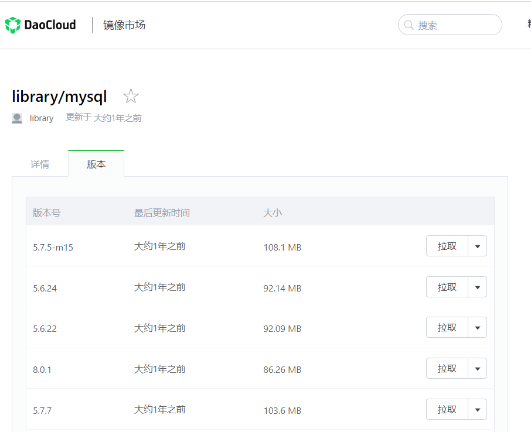 </div><br>

+ 创建一个tomcat容器
  + 找镜像  docker pull tomcat:8.5-jdk8-corretto
+ 创建容器： 

```
docker run -itd --name tomcat85 -p 8989:8080 tomcat:8.5-jdk8-corretto
```

