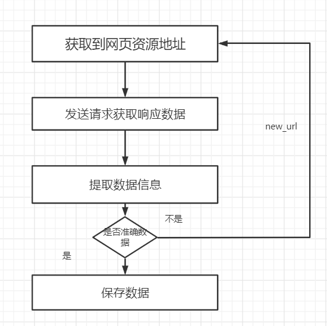

# 爬虫基础

## 一、爬虫的分类与爬虫的流程

###  1.爬虫的分类

根据被爬网站的数量的不同，我们把爬虫分为：

- 通用爬虫 ：通常指搜索引擎的爬虫（[https://www.baidu.com）](https://www.baidu.com）)
- 聚焦爬虫 ：针对特定网站的爬虫

### 2.爬虫的流程

爬虫的工作流程

<div align="left">  </div><br>


- 2.1获取到资源地址

```
爬虫首先要做的工作就是获取数据的资源地址，有了准确的地址之后我们才能数据去进行发送请求
```

- 2.2发送请求获取数据 

```
第二步要做的工作就是获取网页，这里就是获取网页的源代码。源代码里包含了网页的部分有用信息，所以 只要把源代码获取下来，就可以从中提取想要的信息了。
```

- 2.3提取信息

```
获取网页源代码后，接下来就是分析网页源代码，从中提取我们想要的数据。首先，最通用的方法便是采用正则表达式提取，这是一个万能的方法，但是在构造正则表达式时比较复杂且容易出错。 另外，由于网页的结构有一定的规则，所以还有一些根据网页节点属性、CSS选择器或 XPath来提取网页信息的库，如Beautiful Soup、pyquery、lxml 等。使用这些库，我们可以高效快速地从中提取网页信 息，如节点的属性、文本值等。 提取信息是爬虫非常重要的部分，它可以使杂乱的数据变得条理清晰，以便我们后续处理和分析数据。
```

- 2.4保存数据

```
提取信息后，我们一般会将提取到的数据保存到某处以便后续使用。这里保存形式有多种多样，如可以简单保 存为 TXT 文本或 JSON 文本，也可以保存到数据库，如 MySQL 和 MongoDB 等，也可保存至远程服务 器，如借助 SFTP 进行操作等。
```

