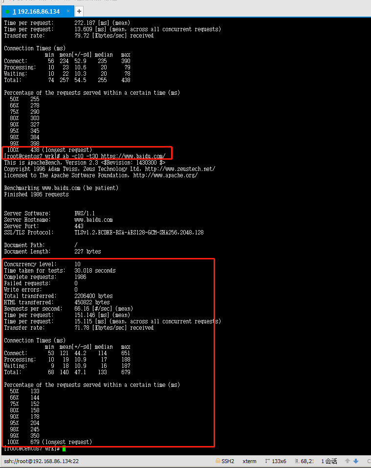
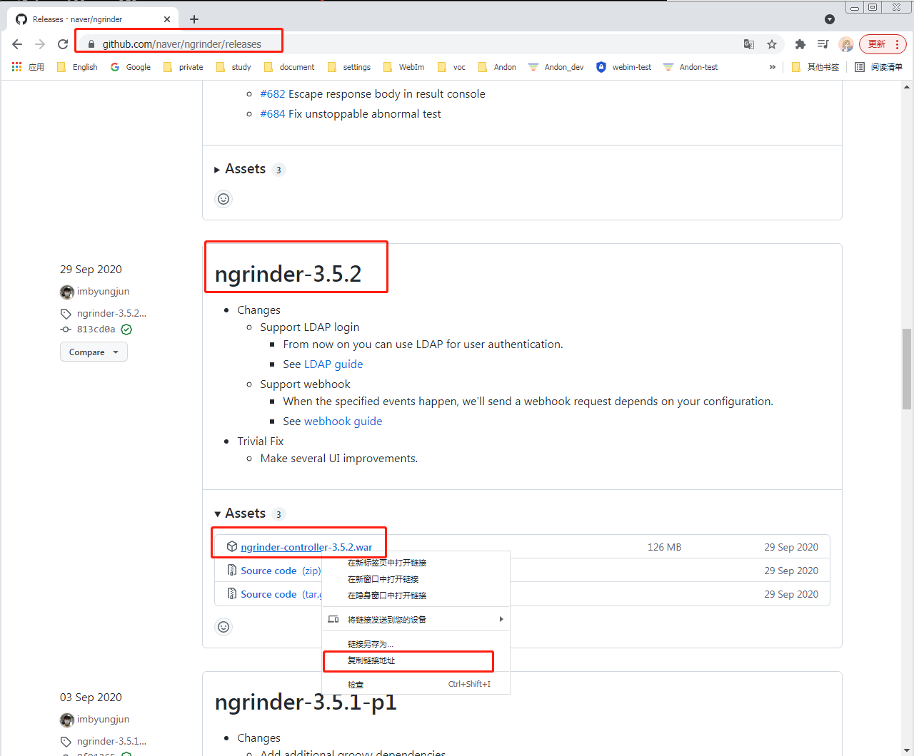
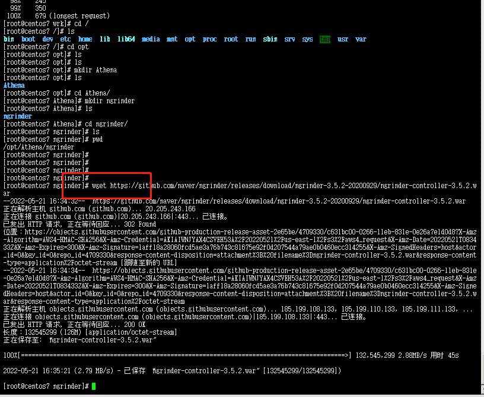
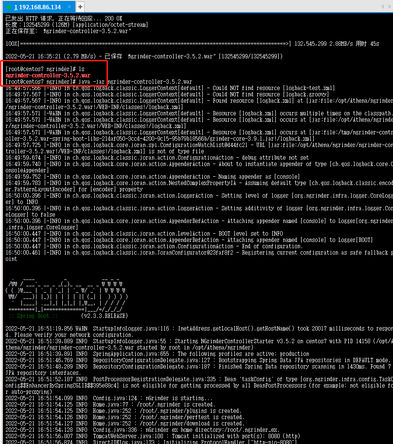
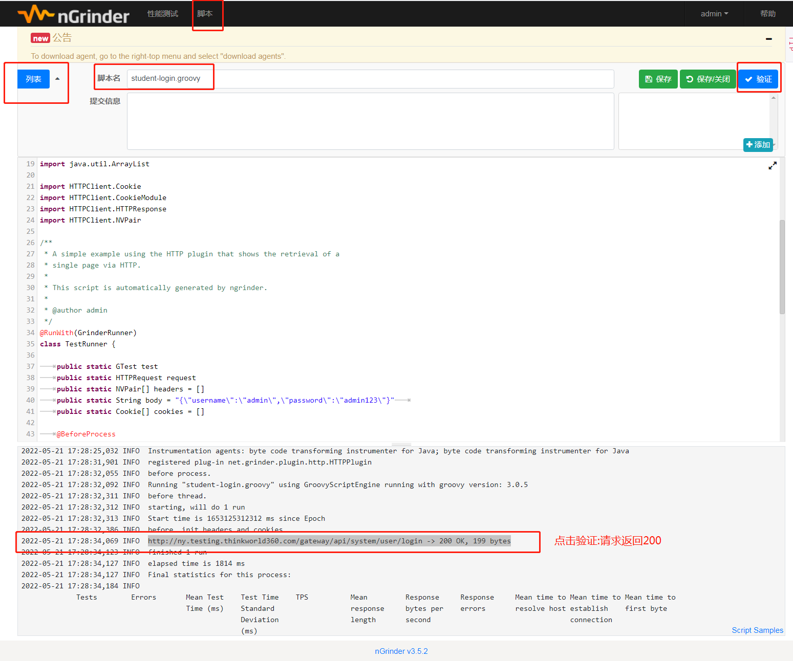

## 其他测试工具的拓展

性能测试工具分类:

1. jmeter
2. loadrunner
3. wrk
4. ab
5. ngrinder
6. python + locust

### 1.测试工具-wrk

#### 1.wrk介绍

wrk是一款HTTP性能测试工具，即使运行在单核CPU上也能产生显著的压力。它融合了多线程设计，并使用了一些可扩展事件通知机制，例如epoll and kqueue。一个可选的脚本能产生HTTP请求，响应处理和自定义报告.

#### 2.下载安装wrk

```
# 全空系统，初始化安装的一些软件
yum install git vim gcc wget unzip -y
# 使用git下载wrk的源码
git clone https://gitee.com/mirrors/wrk.git
# 安装make  防止系统没有make这个命令
yum install make -y
cd wrk
make
# 验证 wrk是否安装成功
./wrk -v
```

<div align="left">  </div><br>

#### 3.wrk参数选项

```
[root@centos7 wrk]# ./wrk -v
wrk 4.2.0 [epoll] Copyright (C) 2012 Will Glozer
Usage: wrk <options> <url>                            
  Options:                                            
    -c, --connections <N>  Connections to keep open   --连接数
    -d, --duration    <T>  Duration of test                 --持续运行时长
    -t, --threads     <N>  Number of threads to use    --线程数
                                                      
    -s, --script      <S>  Load Lua script file             --Lua脚本
    -H, --header      <H>  Add header to request      --请求头
        --latency          Print latency statistics           --打印响应信息
        --timeout     <T>  Socket/request timeout      --请求超时时间
    -v, --version          Print version details             --查看版本详情
                                                      
  Numeric arguments may include a SI unit (1k, 1M, 1G)
  Time arguments may include a time unit (2s, 2m, 2h)
[root@centos7 wrk]# 
```

#### 4.案例

- 页面的性能情况:有4个线程建立100个连接向百度页面发起1分钟请求
  (Running 1m test https://www.baidu.com/  4 threads and 100 connections)
- git请求命令: ./wrk -t4 -c100 -d60s --latency https://www.baidu.com/

- 响应结果:

  ```
   [root@centos7 wrk]# ./wrk -t4 -c100 -d60s --latency https://www.baidu.com/
  Running 1m test @ https://www.baidu.com/
    4 threads and 100 connections
    Thread Stats   Avg      Stdev     Max   +/- Stdev          -- Avg 平均值     Stdev 标准值    Max最大值
      Latency   343.62ms   67.43ms   1.81s    90.15%
      Req/Sec    72.66     21.36   171.00     67.23%               
    Latency Distribution
       50%  336.52ms
       75%  359.68ms
       90%  388.35ms
       99%  596.68ms
    17177 requests in 1.00m, 171.92MB read              -- 1分钟发送请求次数: 17177
  Requests/sec:    286.08                                        --每秒钟请求次数:286.08
  Transfer/sec:      2.86MB                                      --每秒钟通过网络数据:2.86MB
  [root@centos7 wrk]# 
  ```

- post请求命令

-  ./wrk -t1 -c1 -d60s ./data.lua --latency http://ny.testing.thinkworld360.com/#/student/resume 

  ```
   ./wrk -t4 -c100 -d60s ./data.lua --latency http://ny.testing.thinkworld360.com/#/student/resume 
  ```

- 上传请求参数的文件

  ```
  data.lua文件名
  文件内容:
  wrk.method = "POST"
  wrk.headers["Content-Type"] = "application/json"
  wrk.body="{"username":"admin","password":"admin123"}"
  ```

### 2.测试工具-ab

#### 1.ab介绍

- ab是ApacheBench命令的缩写

- ab是Apache自带的压力测试工具。ab非常实用，它不仅可以对Apache服务器进行网站访问压力测试，也可以对其它类型的服务器进行压力测试。比如Nginx、Tomcat、IIS等。

+ php语言项目，apache中自带了这个工具
+ centos、Ubuntu中安装的工具名不一样

#### 2.安装工具ab 

```
#  centos
[root@centos7 wrk]# yum install httpd-tools -y
# ubuntu
apt-get -y install apache2-utils
```

<div align="left">  </div><br>

#### 3.ab参数选项

```shell
[root@centos7 wrk]# ab -v
ab: option requires an argument -- v
ab: wrong number of arguments
Usage: ab [options] [http[s]://]hostname[:port]/path
Options are:
    -n requests     Number of requests to perform
    -c concurrency  Number of multiple requests to make at a time
    -t timelimit    Seconds to max. to spend on benchmarking
                    This implies -n 50000
    -s timeout      Seconds to max. wait for each response
                    Default is 30 seconds
    -b windowsize   Size of TCP send/receive buffer, in bytes
    -B address      Address to bind to when making outgoing connections
    -p postfile     File containing data to POST. Remember also to set -T
    -u putfile      File containing data to PUT. Remember also to set -T
    -T content-type Content-type header to use for POST/PUT data, eg.
                    'application/x-www-form-urlencoded'
                    Default is 'text/plain'
    -v verbosity    How much troubleshooting info to print
    -w              Print out results in HTML tables
    -i              Use HEAD instead of GET
    -x attributes   String to insert as table attributes
    -y attributes   String to insert as tr attributes
    -z attributes   String to insert as td or th attributes
    -C attribute    Add cookie, eg. 'Apache=1234'. (repeatable)
    -H attribute    Add Arbitrary header line, eg. 'Accept-Encoding: gzip'
                    Inserted after all normal header lines. (repeatable)
    -A attribute    Add Basic WWW Authentication, the attributes
                    are a colon separated username and password.
    -P attribute    Add Basic Proxy Authentication, the attributes
                    are a colon separated username and password.
    -X proxy:port   Proxyserver and port number to use
    -V              Print version number and exit
    -k              Use HTTP KeepAlive feature
    -d              Do not show percentiles served table.
    -S              Do not show confidence estimators and warnings.
    -q              Do not show progress when doing more than 150 requests
    -g filename     Output collected data to gnuplot format file.
    -e filename     Output CSV file with percentages served
    -r              Don't exit on socket receive errors.
    -h              Display usage information (this message)
    -Z ciphersuite  Specify SSL/TLS cipher suite (See openssl ciphers)
    -f protocol     Specify SSL/TLS protocol
                    (SSL3, TLS1, TLS1.1, TLS1.2 or ALL)
[root@centos7 wrk]# 

-n：在测试会话中所执行的请求个数。默认时，仅执行一个请求。
-c：一次产生的请求个数。默认是一次一个。
-t：测试所进行的最大秒数。其内部隐含值是-n 50000，它可以使对服务器的测试限制在一个固定的总时间以内。默认时，没有时间限制。
-p：包含了需要POST的数据的文件。
-T：POST数据所使用的Content-type头信息。
-v：设置显示信息的详细程度-4或更大值会显示头信息，3或更大值可以显示响应代码(404,200等),2或更大值可以显示警告和其他信息。
-C：对请求附加一个Cookie:行。其典型形式是name=value的一个参数对，此参数可以重复。
-H：对请求附加额外的头信息。此参数的典型形式是一个有效的头信息行，其中包含了以冒号分隔的字段和值的对(如,”Accept-Encoding:zip/zop;8bit”)。
```

<div align="left">  </div><br>

#### 4.案例

```
ab -c10 -t30 https://www.baidu.com/
#ab进行post传参的压测
#将 parm.txt放在和ab.exe相同的文件夹中，parm.txt中存放的是需要post格式传递的参数。
-T ：post请求的head头
ab -n 400 -c20  -p  parm.txt  -T "application/x-www-form-urlencoded" http://localhost:3000/login
```

<div align="left">  </div><br>

### 3.测试工具-ngrinder

#### 1.什么是NGrinder？

- 是一个基于Java的开源性能测试框架，通过多个agent负载机很方便的进行分布式测试。nGrinder 在 Grinder 的基础上：实现多测试并行、基于web的管理、实现cluster、内置svn，方便的脚本编辑、管理，支持Groovy脚本，相对于Jython，可以启动更多的虚拟用户，实现对目标服务器的监控，插件系统扩展。

#### 2.下载ngrinder

- 安装包地址:https://github.com/naver/ngrinder/releases

  <div align="left">  </div><br>

- ```
  wget https://github.com/naver/ngrinder/releases/download/ngrinder-3.5.2-20200929/ngrinder-controller-3.5.2.war
  ```

  <div align="left">  </div><br>

#### 3.ngrinder原理

- 由一个控制端controller和多个代理端agent组成，通过控制端(浏览器访问)建立测试场景，然后分发到代理端进行压力测试。用户按照一定规范编写测试脚本，controller会将脚本以及需要的资源分发到agent，用jython执行。

- ngrinder-controller 管理\ngrinder-agent 代理

+ 测试脚本： 自动生成或者(groovy:java的衍生语言、jython: java+ python  )

#### 4.ngrinder 部署

```
+ 依赖java运行环境， jre、jdk
+ ngrinder的版本使用3.x版本，jdk不能低于1.8
+ 下载的包是war包可用 tomcat部署,缺点:速度比较慢启动
+ ngrinder-controller使用微服务框架spring-boot开发
+ 可直接部署启动运行:java -jar ngrinder-controller-3.5.2.war 
+访问地址: http://ngrinder_ip:8080/ 
 默认端口：8080  默认账密:admin/ admin 
```

<div align="left">  </div><br>

<div align="left">  </div><br>

#### 5.创建脚本

```
1.菜单栏 脚本创建脚本
2.选择请求方法，填写URL地址
3.高级选项： Content-Type： application/json   请求体
```

<div align="left">  </div><br>

<div align="left">  </div><br>

#### 6.配置ngrinder-agent

+ web管理的登录名， 下载代理   这种方法下载的代理agent的配置文件，已经修改，不需要再次修改
  + 如果不是这种方法下载，那么就要修改 agent.conf配置文件中controller的ip地址
+ 解压包  tar -xvf ngrinder-agent-xxxxx.tar
+ agent部署在非被测服务器上
+ 启动

```sh
# sh 结尾的linux文件
./run_agent.sh    # 交互模式运行
./run_agent_bg.sh  # 后台运行
./run_agent_internal.sh  # 第一次是初始化运行
```


+ 性能测试：
  + 菜单 》 性能测试
  + 目标主机： 被测服务器的ip地址  ------千万不要忘记

ngrinder进行性能测试，是 进程 + 线程的组合模式