### 性能测试—jmeter脚本

#### 1.环境及项目部署

- 本地安装VMware虚拟机：[下载地址](https://pan.baidu.com/s/1Nfq1LnkovlEOXeHsXWq99A)

- 下载test项目：[下载地址](https://pan.baidu.com/s/1FxHr_C1pWM1OOknRAV2v9Q)

- VMware中导入test项目(.ova)文件

- 备注：

  1. 首次导入出现报错提示，尝试重试即可

  2. 编辑虚拟机设置：修改内存、处理器、网络配置项（可用NAT模式）

     <div align="left"> 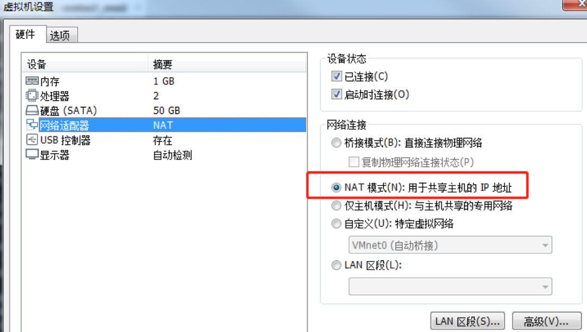 </div><br>

  3. 登录账密（root/123456）ifconfig查看本机ip：

     <div align="left">  </div><br>

     

#### 2.启动tomcat

- 项目基本信息：
  1. tomcat安装路径：   /opt/apache-tomcat-8
  2. jdk版本：1.7  
  3. docker方式安装的mysql，开机自启动mysql

- **启动tomcat**

  ```shell
  cd /opt/apache-tomcat-8.5.56/bin
  ./startup.sh  
  ```

#### 3.API文档

- [查看](https://github.com/yjliu0808/Notebook/blob/master/docs/Athena%E9%A1%B9%E7%9B%AE%E6%8E%A5%E5%8F%A3%E6%96%87%E6%A1%A3.md)

#### 4.运行简单的jmeter脚本

- 测试计划：脚本的根文件夹

- 包括：线程组、取样器、监听器
- 当请求体为json， 一定要有请求头 Content-Type：application/json

<div align="left"> 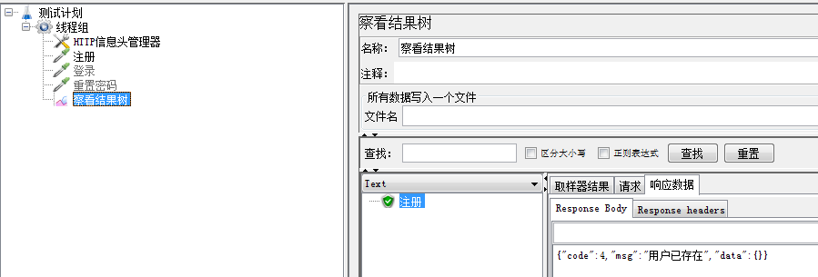 </div><br>

#### 5.jmeter路径说明

+ bin：启动配置文件

+ docs:文档用于jmeter进行二次开发调用的api接口文档

+ extras  扩展   CICD 性能测试持续集成

+ lib：jar包 、工具自身jar、以及第三方jar包、ext文件(第三方插件管理)

+ printable_docs:离线帮助文档

+ 在线帮助文档:

  <div align="left">  </div><br>

  <div align="left"> 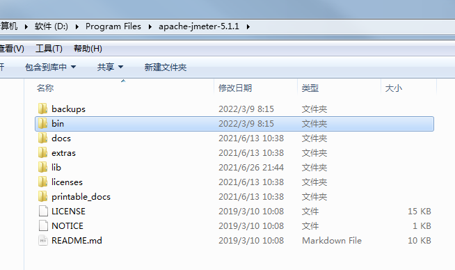 </div><br>

#### 6.jmeter脚本元件

##### 1.线程组

+ 线程组：**进行性能场景设计**(模拟多个用户)
+ setup线程组:之前执行
+ teardown线程组:之后执行

##### 2.配置元件

+ 优先级是最高（请求之前最先运行）
+ **用户定义变量**

##### 3.监听器

+ 性能结果进行监控，展示结果数据
+ 不同的元件，是从不同的角度，展示结果数据
+ 监听器： 调试脚本时使用，**性能测试执行时**，**禁用**

不管哪种监听器，都是对结果数据进行不同维度的展示，这些展示，是需要消耗本地资源的

##### 4.取样器

- 根据不同的协议，使用不同的取样器**编写脚本**
- 用户参数

##### 5.定时器

- 脚本功能增强 前面接口的响应信息，有动态值，作为后续接口的参数参数

#### 7.【用户定义的变量】和【用户参数】区别

- 用户定义的变量
  1. 位置：测试计划/配置元件/用户定义的变量
  2. 作用域：全局变量,作用整个测试计划
  3. 每次启动运行获取一次值，过程中不再改变，运行过程无法动态获取值
  
- 用户参数
  1. 位置：测试计划/前置处理器/用户参数、线程组/前置处理器/用户参数
  2. 作用域：<u>局部变量,当前线程组或者当前的取样器</u>
  3. 每次启动运行获取值，运行过程可以动态获取值

- 应用场景

  1. 添加【定义变量】和【用户参数】

     <div align="left"> 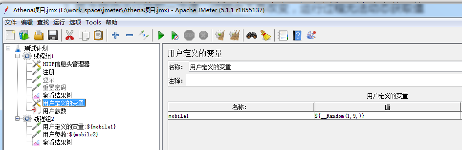 </div><br>

  2. 使用自定义变量语法：${变量名称}

     ```java
     {"mobile":"${mobile1}","password":"123456","code":"1234","platform":"windows"}
     ```

  3. 通过调试取样器-查看作用域效果

     <div align="left">  </div><br>

  4. 启动过程中的变量取值规则：

     <div align="left"> 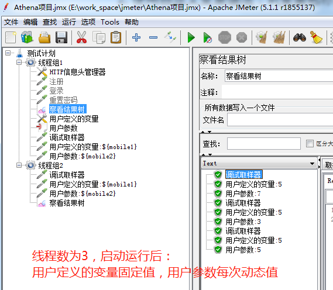 </div><br>

  5. 【用户定义的变量】设置为手机号,线程数设置3,运行注册+登录接口：1次注册success,3次登录success

  6. 【用户参数】设置为手机号，线程数设置3，运行注册+登录接口：3次注册success，0次登录success
  
  7. 备注：用户参数内【每次迭代更新一次】选择勾选后，线程组内执行过程中参数不变，比如注册后直接登录。
  
     <div align="left"> 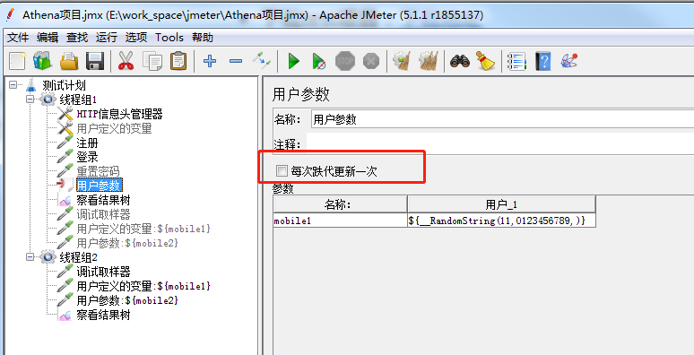 </div><br>

#### 8.jmeter函数助手

- tools/函数助手对话框 ----点击帮助可进入[官方API](https://jmeter.apache.org/usermanual/functions.html)

- 举例随机函数用法：__Random 生成随机数 

  ```
  1. ${__Random(a,b,c)} ----一个范围内最小的随机数a,允许最大的随机数b，存储结果的变量名c.第3个参数不是必填。
  2. ${__Random(0,100,)} ----[0-100]之间的随机整数
  3. ${__Random(0,100,num)}----[0-100]之间的随机整数，结果可以存储到num变量中。可以通过 ${num}去使用。
  ```

  <div align="left">  </div><br>

  <div align="left"> 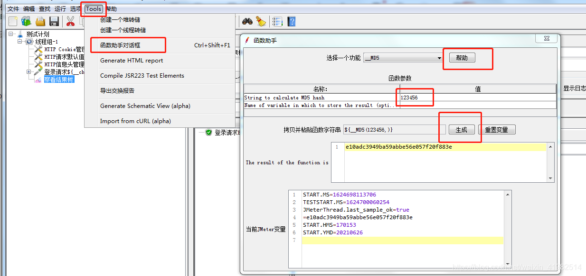 </div><br>

- 常用函数：

  | 函数名称       | 含义                 | 函数名称          | 含义                     |
  | -------------- | -------------------- | ----------------- | ------------------------ |
  | __Random       | 生成随机整数         | __timeShift       | 数据格式化               |
  | __RandomDate   | 生成随机日期         | __dateTimeConvert | 时间格式转换             |
  | __RandomString | 生成随机字符串       | __time            | 返回指定格式的当前时间戳 |
  | __setProperty  | 设置属性             | __threadNum       | 线程的编号               |
  | __property     | 读取属性             | __TestPlanName    | 测试计划名称             |
  | __P            | 读取属性             | __StringFromFile  | 从文件中读取一行         |
  | __V            | 拼接字符串           | __iterationNum    | 线程循环次数             |
  | __strLen       | 字符串长度           | __if              | if 判断                  |
  | __MD5          | 将字符串MD5加密      | __digest          | 将字符串加密             |
  | __UUID         | 生成随机UUID字符串   | __intSum          | 两个或多个整数的总和     |
  | __split        | 将字符串拆分为变量   | __longSum         | 两个或多个长值的总和     |
  | __substring    | 提取字符串的子串     | __FileToString    | 读取文件                 |
  | __isDefined    | 判断变量是否已存在   | __eval            | 读取变量表达式           |
  | __counter      | 计数器========       | __env             | 获取环境变量的值         |
  | __chooseRandom | 从指定的范围里面取值 | __BeanShell       | 可执行beanshell脚本      |
  | __char         | 根据unicode生成字符  | __machineName     | 机器名                   |
  | __machineIP    | 机器IP               |                   |                          |
  
  

#### 9.计数器函数&计数器元件

- 计数器函数：${__counter(,)} ：只有+1功能

+ 计数器元件：

  1.  可设置初始值,最大值,如果运行结果超过最大值时,又会从起始值开始循环

     <div align="left">  </div><br

     <div align="left">  </div><br

  2. 与每用户独立的跟踪计数器勾选后，按照线程计数

     <div align="left"> 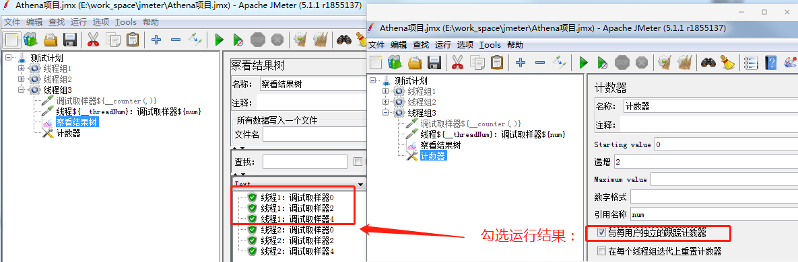 </div><br

     <div align="left">  </div><br

#### 10.函数使用

- ${__dateTimeConvert(,,,)}   时间格式转换

  ```java
  ${__dateTimeConvert(01212018,MMddyyyy,dd/MM/yyyy,)}
  ${__dateTimeConvert(1526574881000,,dd/MM/yyyy HH:mm,)}
  ```

  <div align="left">  </div><br

- ${__time(,)}  获取**当前时间戳函数**：当前的时间

+ ${__timeShift(,,,,)}  数据格式化

+ ${__RandomDate(,,,,)}  随机日期：不包括结束日期

+ ${__digest(,,,,)}  **加密**  简单加密

  <div align="left">  </div><br

+ ${__intSum(,,)}  整数相加函数

+ ${__V(,)} 拼接函数应用：

  - 变量var_1、var_2、var_3,动态获取变量名称可用v函数拼。

  - 计数器函数：${__counter(,)}------var变量名称+计数器函数，通过v函数拼接实现动态变量

    <div align="left"> 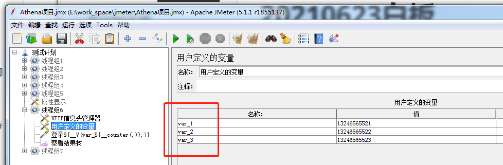 </div><br

    <div align="left"> 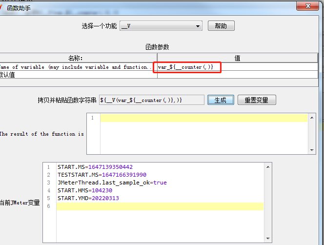 </div><br

+ ${__P(,)}   **获取属性函数**

  <div align="left">  </div><br

- 设置jmeter的动态属性：（可跨线程使用用户参数）----关闭jmeter就会自动释放

  - 步骤一：新增用户参数var，设置取值：${__Random(1000,9999)

  - 步骤二：设置属性显示：${__setProperty(pro_var1,${var},)}

  - 步骤三：运行动态设置参数：${__setProperty(pro_var1,${var},)}
  
  - 步骤四：可跨线程获得动态用户参数：${__P(pro_var1,)}
  
  - 备注：jmeter工具属性可能被改变，系统属性无法改变
  
    <div align="left">  </div><br


#### 11.jmeter执行顺序

测试计划的元素执行是有序的，通过以下方式执行：
1–配置元件（Config Element）
2–前置处理器（Pre Processors）
3–定时器（Timer）
4–取样器（sampler）
5–后置处理器（Post Processors，只在有结果可用情况下执行）
6–断言（Assertions，只在有结果可用情况下执行）
7–监听器（Listener，只在有结果可用情况下执行）

- 多个线程在执行时，【默认】并行执行。

  <div align="left">  </div><br

  

- 查看结果树中的显示顺序是，根据收到响应的先后顺序显示

- jmeter中取样器的执行顺序：在没有逻辑控制器控制时，顺序是从上往下，不管多少人并发，每个线程用户都是从上往下执行,会出现取样器的执行顺序与查看结果树中的显示顺序不一致。

#### 12.响应结果json提取器

- json提取器 :

  ```java
  {"code":0,"msg":"成功调用","data":{"id":160132,"username":"4000068"}
  - $.节点名称.二级节点名称(绝对路径)    $.data.id   
  - $..末梢节点名称(相对路径)           $..id
  ```

- 一个json提取器写多个json提取式:英文分号相隔、默认值(default value)必须填写

  <div align="left">  </div><br

- 正则提取器：左边界(正则式)右边界

  ```java
  {"code":0,"msg":"成功调用","data":{"id":160132,"token":"mGfp5oBuUEMged6SmYJoC29enkX7ZKf2ocjZ/3mb+oP0MulHw9WR+2ZzIo4G6X/kxRU/jxaEwo/fQbjJJq9BrA=="}
  token":"(.*?)"----一个正则提取器
  多个正则提取式，分隔符用 (.*?)    
  $1$模板1指第1个括号内   
  ```

  <div align="left"> 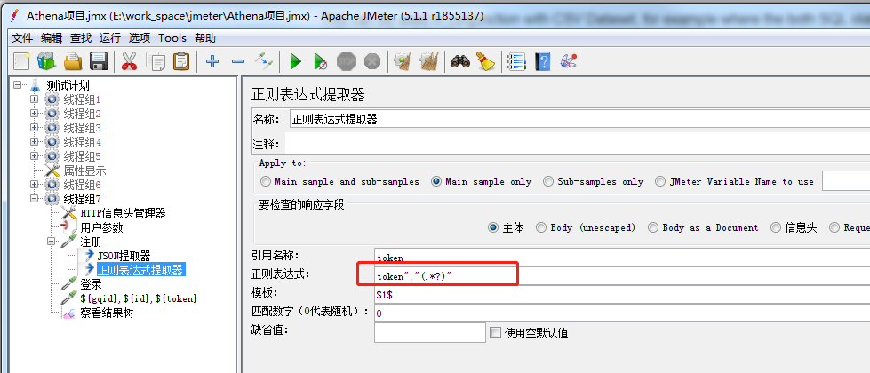 </div><br


#### 13.DDT数据驱动-CSV 数据文件设置

- csv数据文件设置使用

  1. 文件名：绝对路径\相对路径: ./ 开相对地址默认jmeter的bin
  2. 变量名称： 可以写多个，多个之间用“，” 固定使用逗号
  3. 是否允许带引号：一对英文双引号
  4. 遇到文件结束符再次循环
     + true： 运行次数超过总数量行数时，会从头开始取值
     + False：运行次数超过总数量行数时，还会继续运行，但是取不到值
     + 管理**取值**的情况
  5. 遇到文件结束符停止线程
     + 管理**运行状态**

  + 使用csv数据文件设置，默认配置的情况下
    + 当多用并发时
      + 第1th，第一次取值，取第1行，
      + 第2th，第一次取值，取第2行
      + 第3th，第一次取值，取第3行

  <div align="left"> 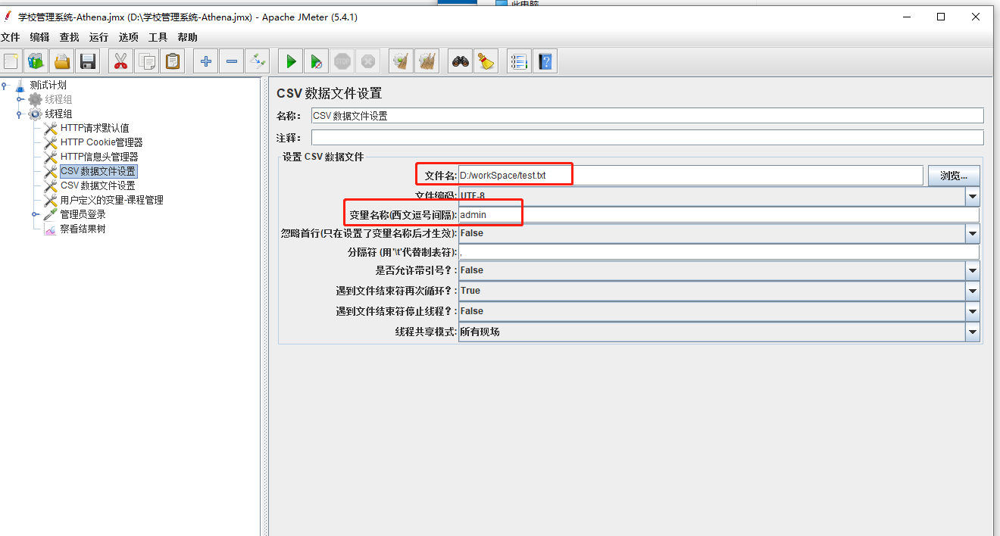 </div><br>

  <div align="left">  </div><br>

<div align="left"> 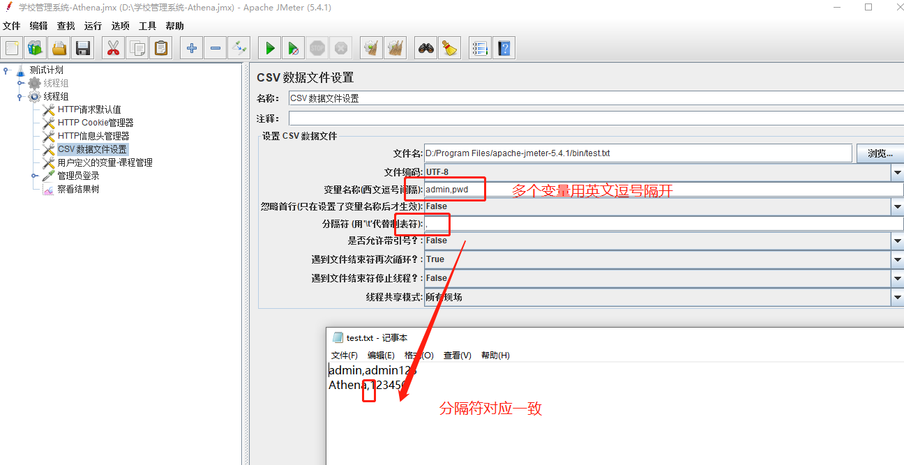 </div><br>

<div align="left"> 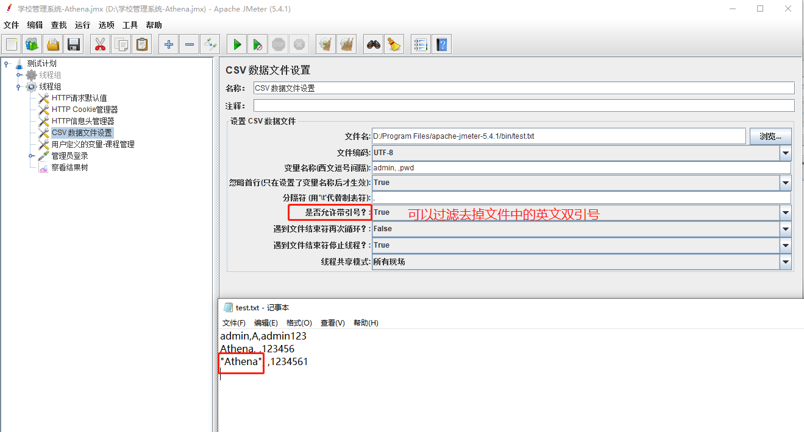 </div><br>

#### 14.逻辑控制器

- 循环控制器:可控制重复运行请求次数

- foreach控制器:使用带有_下滑线变量引用

  <div align="left"> 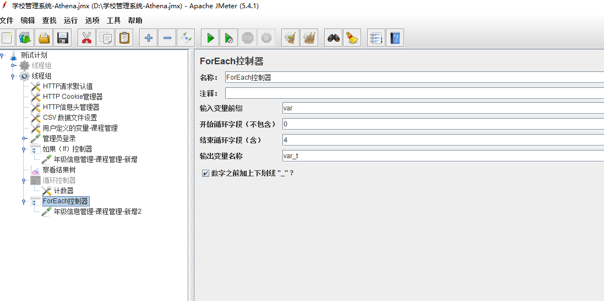 </div><br>

- if条件控制器:

  - 默认的情况下,条件框中,要使用 \_\_jexl3 or \_\_groovy 函数的**计算结果**为true False,${__groovy(1==1,)} 必须函数为true执行

  - 如果不勾选 Interpret condition as variable express   是把 条件框中的 **表达式** 当做js脚本，进行计算，计算的结果为真，则执行下面请求

  <div align="left"> 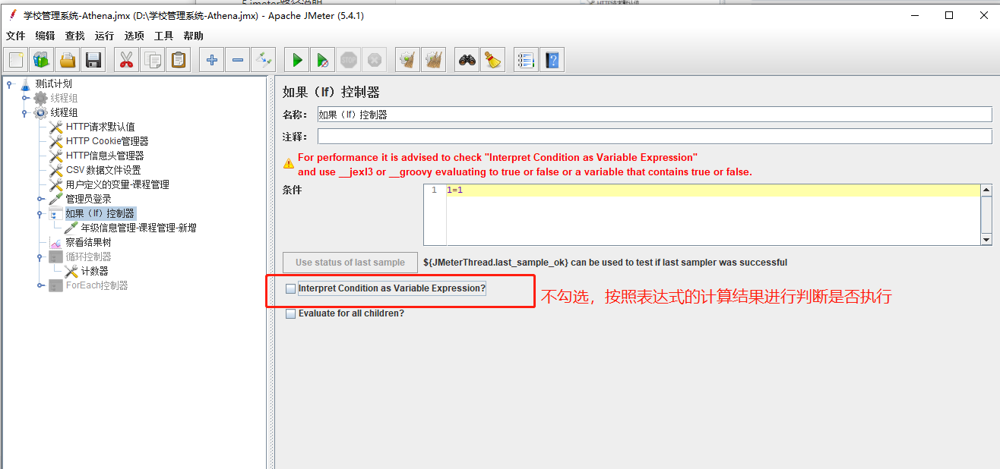 </div><br>

#### 15.事务控制器

+ 在jmeter中，默认一个取样器，就是一个事务

+ 事务控制器，控制其子集取样器(n)，合并为一个事务

  + 事务：TPS服务器每秒处理的事务数

  + 在事务控制器下，挂载多个取样器，想要把多个取样器合并为1个事务，**必须勾选**“Generate parent sample”

    <div align="left">  </div><br>

+ 性能测试中，是否要勾选“Generate parent sample”？

  + 性能测试，要先做单接口的性能测试，然后再做多接口的性能测试。
  + 在做多接口合并的时候，需要勾选。
  + 在性能测试中， 需要先用单个取样器，做出某个接口的性能测试指标，然后再出多个接口的性能指标， 然后再使用事务控制器，勾选Generate parent sample，做出业务的性能指标， 把所有 业务都出来，再合并，做出整个系统的性能指标
    + 如果做某个业务的性能指标，需要先梳理出，这个业务所有的接口，然后对这个业务所有的接口进行性能测试，得到性能指标，再使用事务控制器，合并取样器，最终才得到业务的性能指标。
  + 性能测试时，所有的监听器，都要禁用

#### 16.聚合报告

+ 在性能测试中，看聚合报告，有前提条件：**没有网络瓶颈\并发用户数不变**

  - 并发用户数不变:负载测试时,并发用户数会随着时间变化而变化,就不能看聚合报告。

  + 吞吐量的值等价为TPS的值
  + 怎么判断有没有网络瓶颈?
    + 聚合报告最后两列是吞吐率, 此吞吐率与我们的带宽是有关系，是可以看出是否存在网络瓶颈.
    + 1Mb =  1 x 1024kb = 1024kb/8  = 128KB/s  b和B有8倍关系的
    + 上行和下行最大的理论值:128KB/s,若吞吐率接近此最大值就出现了网络瓶颈.

  <div align="left"> 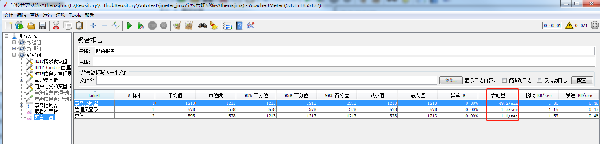 </div><br>


####  17.临界控制器

- Critical Section Controller

+ 严格控制请求顺序
+ 锁名称： 默认是一个固定锁名称
  + 相当于把性能测试中的**并行**执行，强制转换为 **串行**
+ 如何让锁变成动态锁，生成多把锁？
  + 锁名称变成一个动态名称
  + global_lock_${\_\_threadNum}

每个用户是串行,整个并行.

<div align="left">  </div><br>

#### 18.仅一次控制器及随机控制器

- Once Only Controller 

+ 仅一次控制器：一个线程用户只执行一次
  + 并发用户是10，不管你设置循环多少次，其下挂载的取样器，每个都只会执行10次
  + 并发用户是10，不管你运行多长时间，其下挂载的取样器，每个都只会执行10次

<div align="left"> 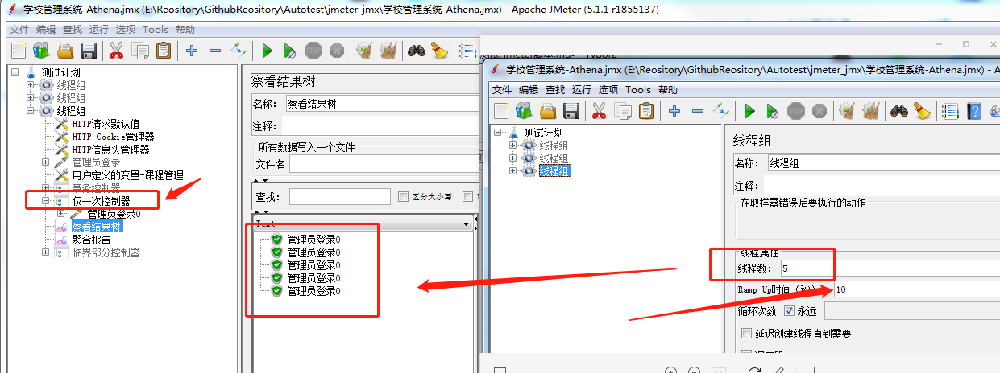 </div><br>

+ 吞吐量控制器

  + 总的吞吐量:网络中传输的频率的设定
  + 控制百分比， 使用多个吞吐量控制器
  + 总请求量 = 并发用户数  \*  时间 \*  频率(强制降低了频率)--无法测试到真实服务性能

  <div align="left"> 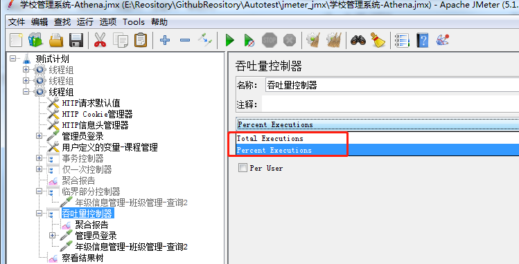 </div><br>

+ 随机控制器：

  + 随机挑选其下挂载的取样器中1个执行

+ 随机顺序控制器：

  + 其下的所有取样器都会被打乱顺序执行

- Switch控制器:
  - 匹配到取样器名称符合条件的1个执行

<div align="left">  </div><br>

