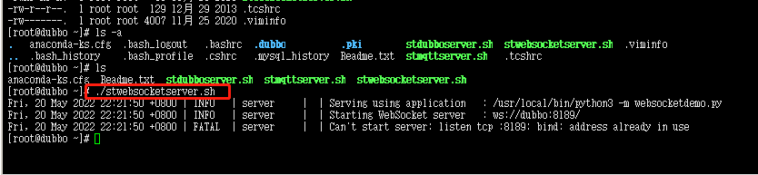
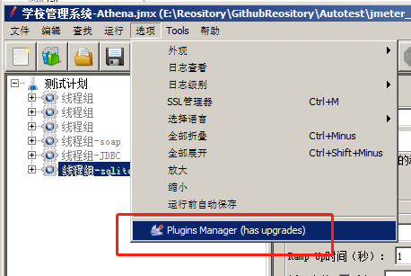
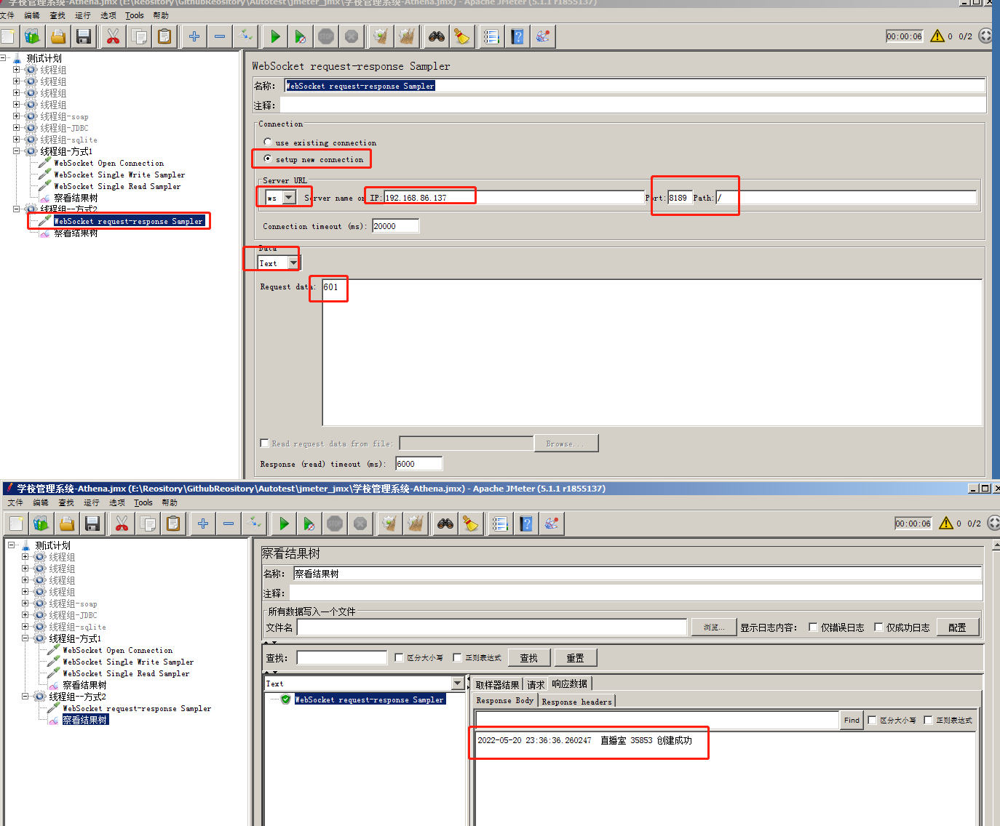
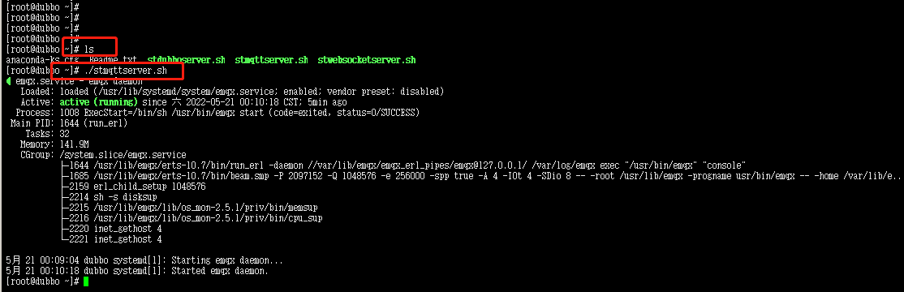
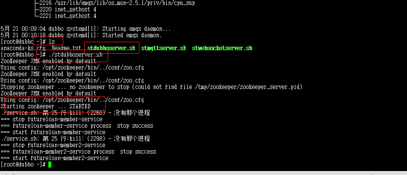
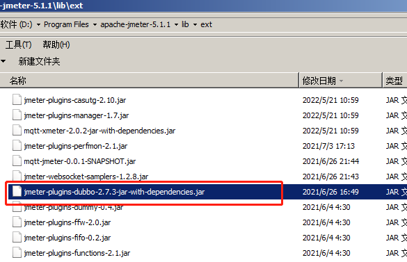
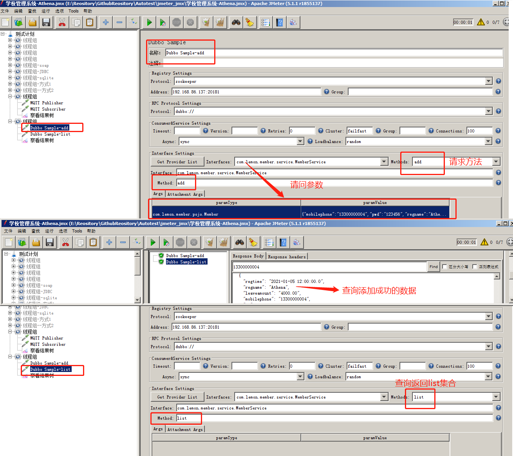

### Jmeter测试-websocket|mq|dubbo三种协议请求

#### 1.什么是websocket协议?

- WebSocket，是一种网络传输协议，位于OSI模型的应用层。可在单个TCP连接上进行全双工通信，能更好的节省服务器资源和带宽并达到实时通迅.
- **全双工**通信允许数据在两个方向上同时传输，它在能力上相当于两个单工通信方式的结合.例如指 A→B 的同时 B→A ，是瞬时同步的
- websocket：
  + ws
  + wss： ws + ssl 证书  进行数据加密传输
- http协议簇 ： 
  + http
  + https： http + ssl  进行数据加密传输

#### 2.jmeter如何来测试websocket协议？

##### 1.启动项目

```
 vmware 打开这个项目机器-ova3
 ./stwebsocketserver.sh 启动项目
```

<div align="left">  </div><br>

##### 2.jmeter引入插件

+ jmeter中要引入插件， jmeter本身的取样器中，不支持websocket协议

+ 插件管理.jar   jmeter-plugins-manager-1.6.jar
  + jar包 jmeter的lib\ext文件夹中， 这个文件夹下放第三方开发的jar

  + 再启动jmeter

  + jmeter的菜单>选项>plugin manager的入口(没有放plugin的jar包时，没有这个入口)

    <div align="left">  </div><br>

  + 点击入口，出现插件管理弹窗
    + Installed plugins   已安装
    + Available plugins   可用的，但是需要你手动去安装
      + 搜索： websocket 
      + 勾选    WebSocket Samplers by Peter Doornbosch    
      + 点击  右下角  apply changes and restart jmeter
    + upgrades  可以升级
    
    <div align="left">  </div><br>

##### 3.编写脚本

+ 取样器
  + websocket close   关闭websocket
  
  + websocket open connection  建立一个websocket
  
  + websocket ping/pong  测试websocket协议
  
  + websocket single read sampler   客户端从服务器端口获取
  
  + websocket single write sampler   客户端向服务端发请求(不会获取响应)
  
  + websocket request-response sampler   同时具备向服务端发请求 和 获取响应功能
  
    <div align="left">  </div><br>
  
     

```
方式一:
1.WebSocket Open Connection        填写URL
2.WebSocket Single Write Sampler  使用已经建立连接 填写Data
3.WebSocket Single Read Sampler   使用已经建立连接
4.查看结果树
WebSocket Single Write Sampler
 connect：
   user exist connection  使用已经建立连接
   setup new connection   新建一个连接
 Data:
   数据： text 文本    binary 二进制
  request data
```

<div align="left">  </div><br>

```
方式二:
1.WebSocket request-response Sampler 同时具备向服务端发请求 和 获取响应功能
```

<div align="left">  </div><br>

#### 3.什么是MQ?

- MQ: 消息队列的总称
  - kfaka
  - rabait mq
  - MQTT

#### 4.jmeter如何来测试MQTT协议？

##### 1.启动项目

```
vmware 打开这个项目机器
./stmqttserver.sh  启动项目(MQTT)
http://192.168.86.137:18083/ --启动后可访问图形界面 (admin/public)
```

<div align="left">  </div><br>

##### 2.jmeter下载mqtt的协议插件

+ MQTT Protocol Support   如果下载失败，左边有红色， 再次点击  apply changes  and restat jmeter

  <div align="left">  </div><br>

##### 3.编写脚本

```
MQTT Publisher
MQTT Subscriber
```

<div align="left">  </div><br>

<div align="left">  </div><br>


#### 5.什么是dubbo协议?

- dubbo： 微信服务器框架协议， 不对外暴露接口
- 远程rpc服务调用， server服务 + 注册中心+ 消费者

#### 6.jmeter如何来测试dubbo协议？

##### 1.启动项目

```
 vmware 打开这个项目机器-ova3
./stdubboserver.sh 启动项目
项目的zookeeper的端口：20181(用这个)
zookeeper的默认端口：2181
```

<div align="left">  </div><br>

##### 2.jmeter引入插件

+ jmeter-plugins-dubbo-2.7.3-jar-with-dependencies.jar 丢到jmeter的lib\ext

  <div align="left">  </div><br>

##### 3.编写脚本

```
1.添加Dubbo Sample取样器
2.register seting:选择zookeeper
3.192.168.86.137:20181
4. Interface setting   点击  get provider list
```

<div align="left">  </div><br>

<div align="left">  </div><br>

```java
5.获取到接口路径及方法
6.可以选择add/list等方法
{mobilephone": "13300000004", "pwd": "123456","regname": "Athena","type":"1","regtime": "2021-01-05 12:00:00.0"}
```

<div align="left">  </div><br>

