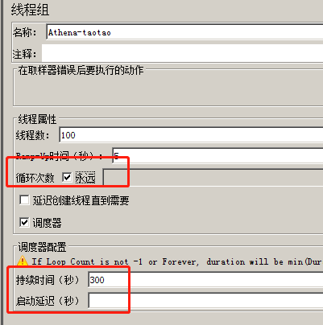
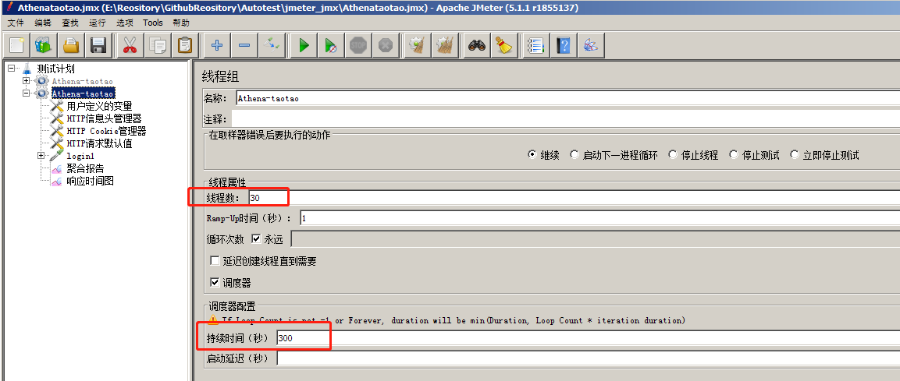
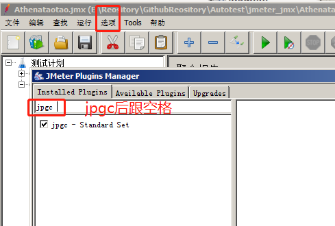
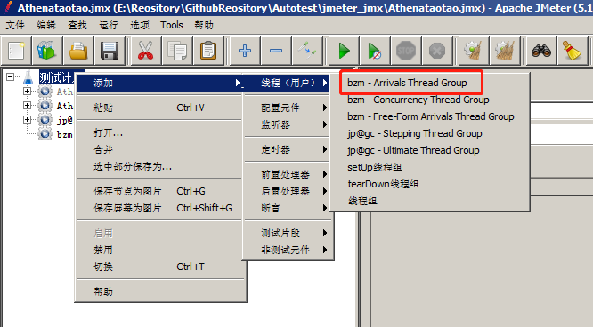
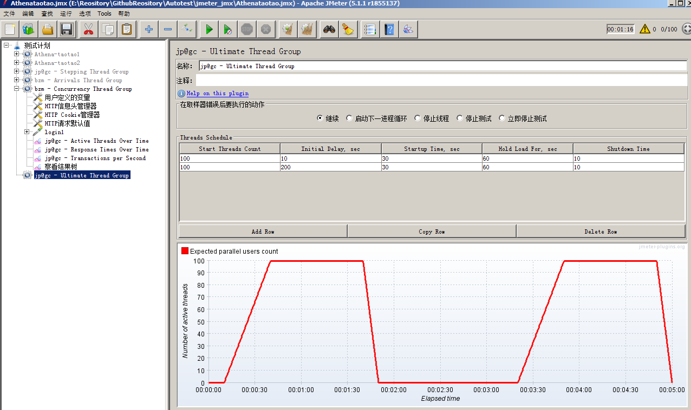
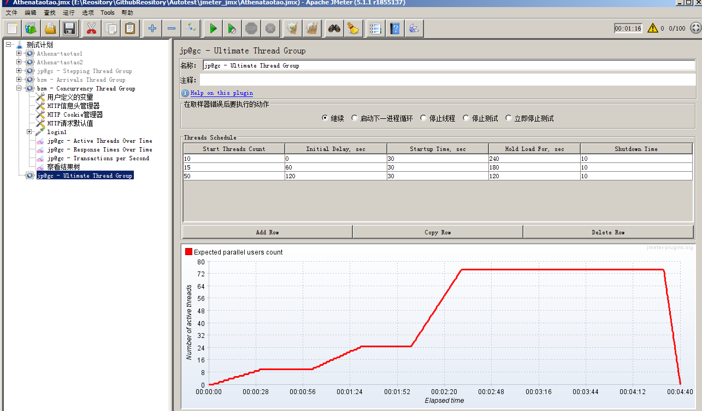
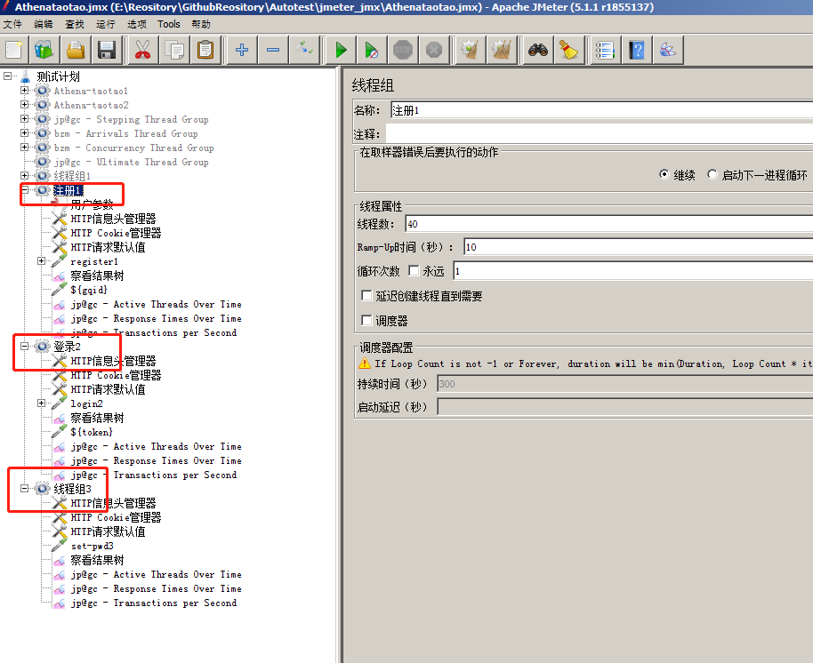

### 性能测试场景设计

#### 1.性能场景设计方法

1. 普通性能场景设计
2. 阶梯性能场景(负载测试场景)
3. 压力测试场景
4. 面向目标场景
5. 混合场景设计
6. 有时间规律场景

#### 2.线程组参数解释

##### 1.线程数

-  模拟的并发用户数量

  - jmeter本身没有对线程数做限制,但jmeter启动这些并发用户数时，需要消耗资源，受电脑cpu的主频限制，一台电脑不可能创建无限量的线程数
  - 1台电脑，**http协议**脚本，保守估计是可以参数1000个并发用户数

  + 如果你想模拟超过1000并发用户数，需要考虑 **分布式**

<div align="left">  </div><br>

##### 2.ramp-up时间

- 启动所有线程数启动的时间(线程数在合理的范围)
  1. 在ramp-up时间结束点,模拟的并发用户数量都会产生
  2. 在ramp-up时间内，是否均匀产出并发用户数，是不确定
  3. 在启动时间内，产生的并发用户数，立刻会发起请求
  4. 启动的并发用户发起请求，不同时间产生的并发用户数，与前面产生的并发用户数，调用的接口可能不一样
  5. jmeter性能测试，广义并发(A登录/B注册--算并发)
  6. 同个时间向不同的接口发起请求是广义并发,同个时间向同个接口是狭义并发)
  7. ramp-up时间要**大于等于1**0     

##### 3.线程数 + ramp-up时间合理设置

1. 原则: ramp-up时间在总执行时间中，占比要很低
2. 一个性能测试的总执行时间  几十秒钟  ~ 几十分钟
3. 500以内并发用户， ramp-up   2~4s
4. 500-1000    ramp-up  5s
5. \>1000    ramp-up 5-8s

##### 4.循环次数

1. 默认必须**大于等于1**

2. 循环次数:是每个并发用户数要去执行的请求数量

3. 复习框永远 :一直循环，直到手动点击停止

4. **永远**应该怎么用呢？

   + 要与  调度器 一起使用:必须把两个勾都勾选
   + 调度器：持续时长(自动持续时长停止)\启动延迟(延时启动)

   <div align="left">  </div><br>


#### 3.普通测试性能场景

- 场景:30个并发用户，持续运行300s

<div align="left">  </div><br>

+ 聚合报告： avgRT： 2.472s  90%RT：2.834s   avgTPS： 12.1

  1. 90%RT：2.834s可以看到，这个响应时间是比较长，已经超过了我们用户能容忍的范围了，用户满意度指数1.5s，说明我们的接口响应比较慢。
  2. 30个人， avgTPS:12.1,tps<user  那么，每个人1秒钟发不了1个请求，所以，我们次数 30个并发用户数，已经超过接口能承受最大并发用户数了。
  3. 可以简单得到一个结论： 服务器注册接口最大并发用户数小于30的

  <div align="left">  </div><br>

#### 4.负载测试性能场景

+ 负载测试： 逐步增加并发用户数

##### 1.引入插件

+ 插件管理： jpgc  安装这个插件 

  <div align="left">  </div><br>

##### 2.新增线程组

- jp@gc - Stepping Thread Group

  <div align="left">  </div><br>

##### 3.参数设置

1. **用 5秒钟 增加10个并发用户数，持续运行30秒**

<div align="left">  </div><br>

## ✅ Stepping Thread Group 参数说明（带单位）

| 配置项（界面中的字段）    | 说明                                                   | 填写示例 | 单位               |
| ------------------------- | ------------------------------------------------------ | -------- | ------------------ |
| **This group will start** | 总线程数（用户数）                                     | `50`     | 无单位（就是数量） |
| **First, wait for**       | 脚本开始执行前的延迟时间                               | `0`      | **秒（seconds）**  |
| **Then start**            | 初始启动线程数                                         | `0`      | 无单位（数量）     |
| **Next, add**             | 每次增加的线程数                                       | `5`      | 无单位（数量）     |
| **threads every**         | 增加线程的间隔时间                                     | `5`      | **秒（seconds）**  |
| **using ramp-up**         | 增加线程所使用的时间（每批次的线程分布在这个时间段内） | `5`      | **秒（seconds）**  |
| **Then hold load for**    | 保持最大线程负载的时间                                 | `60`     | **秒（seconds）**  |
| **Finally, stop**         | 每次停止的线程数                                       | `5`      | 无单位（数量）     |
| **threads every**         | 停止线程的间隔时间                                     | `5`      | **秒（seconds）**  |

------

## ✅ 例子：典型配置样式

> 假设你希望总共模拟 50 个用户，逐步增加并保持一段时间，再平稳退出：

```
sql复制编辑This group will start: 50
First, wait for: 0 seconds
Then start: 0 threads
Next, add: 5 threads every 5 seconds using ramp-up 5 seconds
Then hold load for: 60 seconds
Finally, stop: 5 threads every 5 seconds
```

### 🧠 含义：

- 一开始等待 0 秒，立即开始执行；
- 起初不启动线程；
- 然后每 5 秒启动 5 个线程（分布在 5 秒时间内）；
- 重复添加直到达到最大线程数（50）；
- 保持这些线程运行 60 秒；
- 最后每 5 秒停止 5 个线程，直到线程数为 0。

##### 4.性能分析

1. jp@gc - Active Threads Over Time

2. jp@gc - Response Times Over Time

3. jp@gc - Transactions per Second

   <div align="left">  </div><br>

1. 阶梯线程组： 负载测试： 逐步增加并发用户数
2. 逐步增加并发用户数**相同**可用:stepping threads group
3. 逐步增加并发用户数**不同**不可用stepping threads group
4. 在阶梯线程组，执行过程中，我们的并发用户数是时刻发生变化
5. 阶梯线程组设计的规律：缓起步，快结束(并不是瞬间结束)
6. 阶梯线程组不可以看聚合报告:
   + 聚合报告中的数据，都是平均值
   + 在负载场景(阶梯场景)，不看聚合报告
   + 聚合报告是可以看到失败率

#### 5.压力测试场景

- 压力测试： 长时间
- 普通线程组和阶梯线程组均可做压力测试的场景

#### 6.面向目标性能场景

- 场景:期望接口都要能满足50tps

  ```
  计算产品访问量和tps的关系:
  假如:tps=50 -> 50个事务每秒
        1秒:    50 个事务
        1分钟(60s)：50*60s = 3000 事务   
        1小时(60min):  3000 * 60(min) =  180000 事务
        1小时要处理18w个请求   
        10小时  180w个请求     
        24小时  432w个请求
        日均访问量约为千万， 50tps基本已经能满足要求了
  
  ```

##### 1.第一种方式

- 采用Transactions per Second

  <div align="left">  </div><br>

  <div align="left">  </div><br>

##### 2.第二种方式

- 采用Transactions per Second

  <div align="left">  </div><br>

  <div align="left">  </div><br>

##### 3.第三种方式

- 有时间规律： 波浪型Ultimate Thread Group  终极线程组

+ 第二行，起始时间  要大于等于前一行的所有时间之和

+ Arrivals Thread  ： 达到多少率  tps

+ Concurrency Thread： 达到多少并发数

+ 步长相同，或不相同的阶梯线程组，可以使用Ultimate Thread Group

  <div align="left">  </div><br>

  <div align="left">  </div><br>

1. Ultimate Thread Group 阶梯线程组

   + 规律：

   + 添加第二行配置，期望结束时间时重合

   + 第1行的结束时间要远远大于后面时间之和

   + 添加3个阶梯规律：

   + 1、下一行的初始化时间 =  上一行的initial + startup + 你期望运行多长时间之后启动第二个波浪的时间

     2、每一行的  initial + 持续运行时间hold load    要相等才能保证，在相同时间点来结束

##### 4.场景设计

- 要求1:某个时间点开始运行，运行一段时间之后暂停，然后再过一段时间又运行,怎么设计？

  <div align="left">  </div><br>

#### 7.性能测试报告

1. 性能测试时，不启用监听器
2. CLI-mode  无图形界面模式  命令行
3. GUI-mode  仅仅用于编写调试脚本
4. jmeter的html报告与是否启用添加监听器无关

练习:

需求1:某活动页面的性能测试:看是否能满足1000个人同时访问.

需求2:某接口要满足50tps.

需求3:服务器能否支持500个人同时秒杀活动.

#### 8.混合场景-实际情况

+ 混合场景： **不同数量的并发用户数，向不同接口发起请求**--产品实际情况

  + 在一个线程组中，添加逻辑控制器，控制我们脚本的运行，脚本混合运行， 但是于生产的情况还是有差异。
  + 在做性能测试时，不要连续去执行性能测试，在前一轮性能测试结束的时候，要休息一会，等待服务器的压力释放，再开始下一轮性能测试，不然，因为前面的性能测试导致服务器压力过大，未释放，从而影响后续性能测试结果。

  <div align="left">  </div><br>


