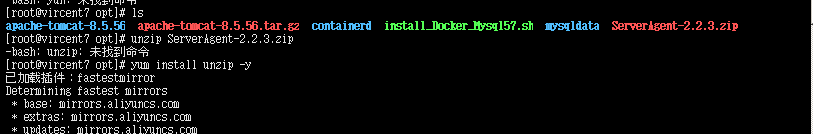
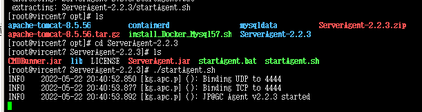
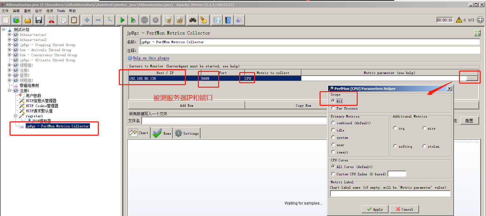
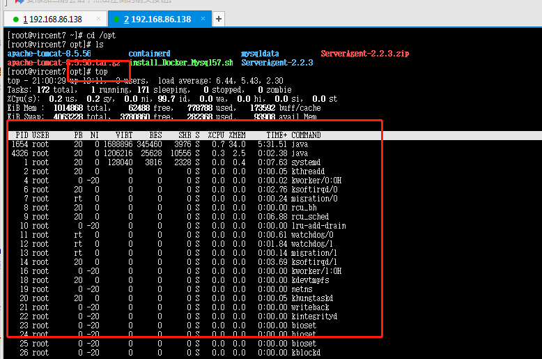
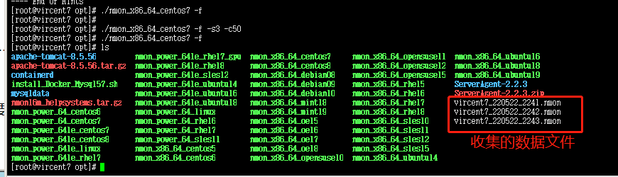
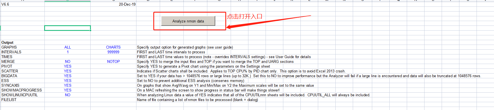

### 性能监控

#### 1.监控工具介绍

- 性能监控:监控我们性能测试过程，收集性能测试过程中数据，拥有性能分析,主要时收集被测服务器的资源使用情况

+ 被测服务器的资源有几下：
  + 硬件资源： cpu、内存、io、网络
  + 软件资源：  tomcat、jvm、数据库、连接池、中间件
  + 监控：硬件资源，再监控软件资源

-  nmon： 监控服务器硬件资源，这是一个独立的服务器资源监控工具.nmon是一种在AIX与各种Linux操作系统上广泛使用的监控与分析工具，它能在系统运行过程中实时地捕捉系统资源的使用情况，记录的信息比较全面，并且能输出结果到文件中，然后通过nmon_analyzer工具产生数据文件与图形化结果.
- SeverAgent：可以和jmeter集成，在jmeter的GUI界面可以看到数据。
- 监控工具是监控被测服务器的，所以监控工具要安装在被测服务器上，本身也有资源消化，所以，选择监控工具，要尽可能选择资源消耗比较少的工具.

#### 2.监控工具SeverAgent

##### 1.SeverAgent安装

1. ServerAgent zip安装包上传到被测服务器，解压

   ```
   1. yum install unzip -y
   2. unzip ServerAgent-2.2.3.zip
   ```

   <div align="left">  </div><br>

##### 2.启动SeverAgent

```
./startAgent.sh   ----解压文件中启动命令， 绑定的端口是 4444
4444这个端口，云服务器中，可能不允许开放这个端口
```

<div align="left">  </div><br>

```
更新端口:
./startAgent.sh --udp-port 0 --tcp-port 5689
--udp-port 0   意思是，关闭UDP数据传输方式
--tcp-port 自定义端口， 自定义一个开放tcp数据传输的端口
端口的范围理论设置为1024 ~ 65535之间
```

<div align="left">  </div><br>

##### 3.SeverAgent和jmeter集成

- 导入Jar包: jpgc - Standard Set    

  <div align="left">  </div><br>

- jmeter-新增监听器PerfMon Metrics Collector

  <div align="left">  </div><br>

- PerfMon Metrics Collector 参数选项

  <div align="left">  </div><br>

- 性能监控收集数据:在监听器的使用时，不同的单位，选择用多个监听器，不建议放在1个监听器中

  <div align="left">  </div><br>

- 服务器top命令

  <div align="left">  </div><br>


##### 4.ServerAgent-ConnectExpection连接被拒

1. 服务已经停止

2. 网络不通:要检查服务能否连通： telnet ip地址 服务端口

3. 如果telnet不通，排查:

   防火墙没有开放这个端口,云服务器要再web管理台中开放端口

##### 5.特点

1. 可以监控window、linux
2. 服务器硬件资源监控
3. 可以结合jmeter来使用

#### 3.监控工具nmon

+ nmon：这个工具，只能监控，linux服务器(不能监控windows)
+ 独立工具，不依赖我们性能测试工具
+ nmon工具，进行服务器资源监控时，本身资源消耗很少，收集的监控数据比较全。
+ nmon有三种运行模式：
  + 屏幕交互模式
  + 数据收集模式-用的比较多
  + 定时执行模式

##### 1.nmon下载安装

+ 获得nmon工具:要知道你的服务器是什么系统

  ```sh
  # 查看 centos系统的发现版本
  cat /etc/redhat-release
  # 查看 debain家族   ubuntu
  ls -l /etc/*release*
  cat ***
  # 看到系统架构  x84_64
  uname -a
  ```


- 官网地址:http://nmon.sourceforge.net/pmwiki.php

- 安装包:http://sourceforge.net/projects/nmon/files/nmon16m_helpsystems.tar.gz

- 上传被测服务侧-解压启动

  <div align="left">  </div><br>

  <div align="left">  </div><br>

##### 2.启动nmon

```sh
命令   ./nmon_x86_64_centos7
屏幕交互模式   ./nmon_x86_64_centos7
```

<div align="left">  </div><br>

##### 3.执行nmon进行监控-参数选项

1. 输入keys:m c 等keys查看数据,q退出

   <div align="left">  </div><br>

1. 数据收集模式  `./nmon_x86_64_centos7 -f`

2.   ./nmon_x86_64_centos7 -f -s3 -c50

3. ./nmon_x86_64_centos7 -f -s3 -c50 -m /opt/t(指定目录存放收集的数据)

   <div align="left">  </div><br>

4. 分析收集数据的文件:vircent7_220522_2242.nmon

   打开后分析 :

   [下载支持查看的可用文件](https://github.com/yjliu0808/Autotest/tree/master/file_package_url/nmon_analyser_v66) 

   + 打开nmon analyser v66.xlsm 带有宏文件,默认wps是不支持宏的

   + nmon analyser v66.xlsm 要用 office打开

     <div align="left">  </div><br>

5. 定时执行模式 `./nmon_x86_64_centos7 -x`

   <div align="left">  </div><br>

####  4.jmeter+ influxdb +grafana 集成

1. jmeter进行性能测试过程中的数据，写入influxdb数据库中，通过grafana前端平台来展示出来.
2. grafana：专门用于数据展示的前端平台，通过浏览器来访问,自身没有数据存储功能.
3. influxdb：时序数据库
   + 数据库： 持久化存储数据的管理系统dbms
   + 时序数据库：时间序列数据库中,存放的数据,根据时间字段来存数据，根据时间排序
   + 时间：时间戳， 时间戳是一个连续的数字段
4. jmeter：进行性能测试，产生数据写入influxdb数据库

5. vs  jmeter + severAgent： ServerAgent也可以和jmeter集成，但是只能在jmeter的gui界面中展示，脱离了jmeter的gui界面，就不能看到数据，也不能回看数据.

- 操作步骤
  1. 项目启动，确保项目是启动
  2. jmeter调试脚本正常
  3. jmeter中，添加 **后端监听器**

+ 后端监听器配置
  + 选择 后端实现器：  xxx.influxdb.xxxxx
  + influxdbUrl  要修改为自己的infxludb数据库的ip地址

+ 4、安装influxdb数据，以及创建一个jmeter库
  + 能不能安装在被测服务器中？====不能安装在被测服务器上。要求安装在非被测服务器上。
  + 非被测服务器的要求： jdk要大于等于1.8
  + influxdb数据库的版本，**建议使用1.x** (不能是用2.x )
  + `yum install influxdb-1.7.0.x86_64.rpm -y` 执行完，把influxdb数据库已经安装成功
  + influxdb数据库默认端口 8086
  + 启动inflxudb数据库
    + `influxd ` ---启动命令
  + 进入数据库要创建jmeter库
    + 在另外一个终端中执行：`influx`
    + 查看当前所有的数据库，我想知道当前influxdb数据库中，有哪些库：` show databases;` 我们看到没有jmeter库，我们就需要去创建一个库
    + 创建jmeter库： `create database jmeter;`
+ 5、jmeter进行性能测试，把数据写入influxdb数据库中。
+ 6、安装grafana
  + ` yum install grafana-7.4.3-1.x86_64.rpm -y`
+ 7、启动：systemctl restart **grafana-server**
+ 8、配置：
  + 访问grafana： http://grafana-server-ip:3000   admin  admin
  + 点击 add data source
    + 选择influxdb  进入配置页面
    + 一定要配置  url   http://influxdb数据库的IP:8086
    + database： jmeter
    + save & test
  + import 前端模板： 5496
    + DBname选择自己上一步添加的数据源名称

