### 持续集成工具Jenkins

1. 基于Java开发的持续集成工具

2. 可用于监控持续重复的工作

3. 软件版本发布/**项目测试**

4. 功能测试： 用它来打包，部署环境

5. 自动化测试： 打包代码，运行代码，进行自动化测试

6. 性能测试： 打包性能脚本，进行性能测试，获得性能报告

   http://106.75.169.238:8080/jenkins/  (athena/athena)

#### 1.下载/安装Jenkins

- 官网下载：https://jenkins.io/download/

<div align="left">  </div><br>

#### 2.环境搭建

- 下载war包：jenkins.war
- 下载tommcat包,[部署tomcat环境](https://github.com/yjliu0808/Notebook/blob/master/docs/Linux%E7%B3%BB%E7%BB%9F%E4%B8%AD%E9%85%8D%E7%BD%AETomcat.md)
- 部署到tomcat（将war包放置到tomcat目录下的webapps文件夹下）
  启动Tomcat（在tomcat的bin目录中找到startup.bat执行启动）
  验证：
  http://localhost:8080验证Tomcat
  http://localhost:8080/jenkins验证Jenkins (若404即版本不对应，jenkins或者JDK)

#### 3.重新安装jenkins

- 若需要删此文件重新部署才生效

<div align="left"> 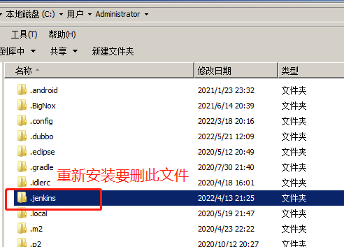 </div><br>

#### 4.jenkins密码设置

- 在第一次使用jenkins的时候默认会生成一个密码文件
- 打开文件，复制其中的初始登录的密码，粘贴然后登录

<div align="left">  </div><br>

<div align="left"> 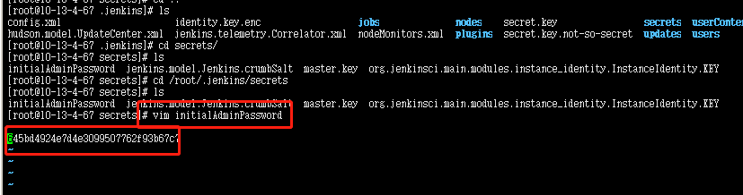 </div><br>

5.安装插件

<div align="left"> 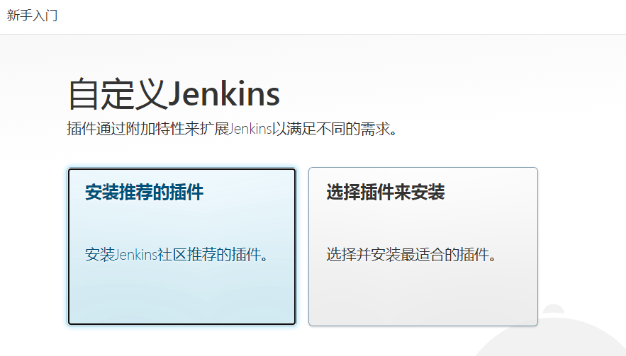 </div><br>

<div align="left">  </div><br>

#### 6.使用Jenkins

<div align="left">  </div><br>

<div align="left">  </div><br>

#### 7.Jenkins + jmeter + ant 集成

1. jmeter、ant 都是 java 开发的，所以我们要有 java 运行环境安装 jre 或 jdk

##### 1.安装ant插件

- 确保 ant插件已经安装

- [Ant下载](https://ant.apache.org/bindownload.cgi)

- 配置ant本地路径

  <div align="left"> 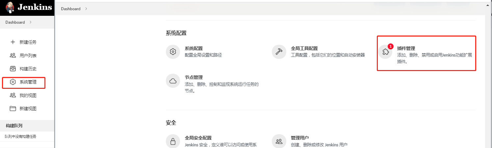 </div><br>

  <div align="left"> 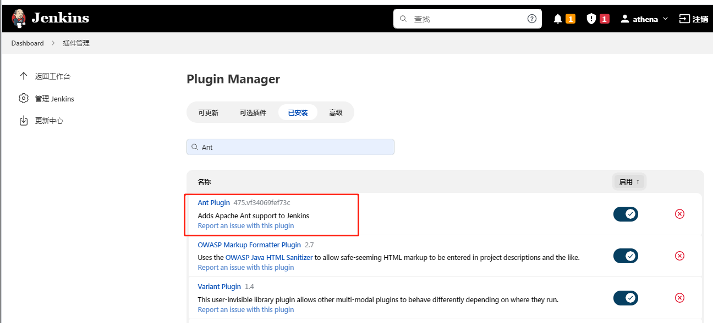 </div><br>

  <div align="left">  </div><br>

##### 2.配置ant

<div align="left"> 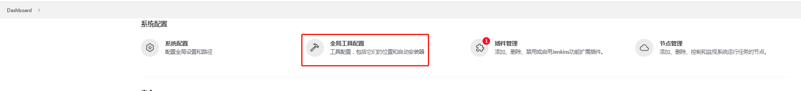 </div><br>

<div align="left">  </div><br>

##### 3.新建item

+ 构建： invoke ant

+ 高级配置： 一定要选择你的jmeter的extas文件夹中的build.xml

  <div align="left">  </div><br>

  <div align="left"> 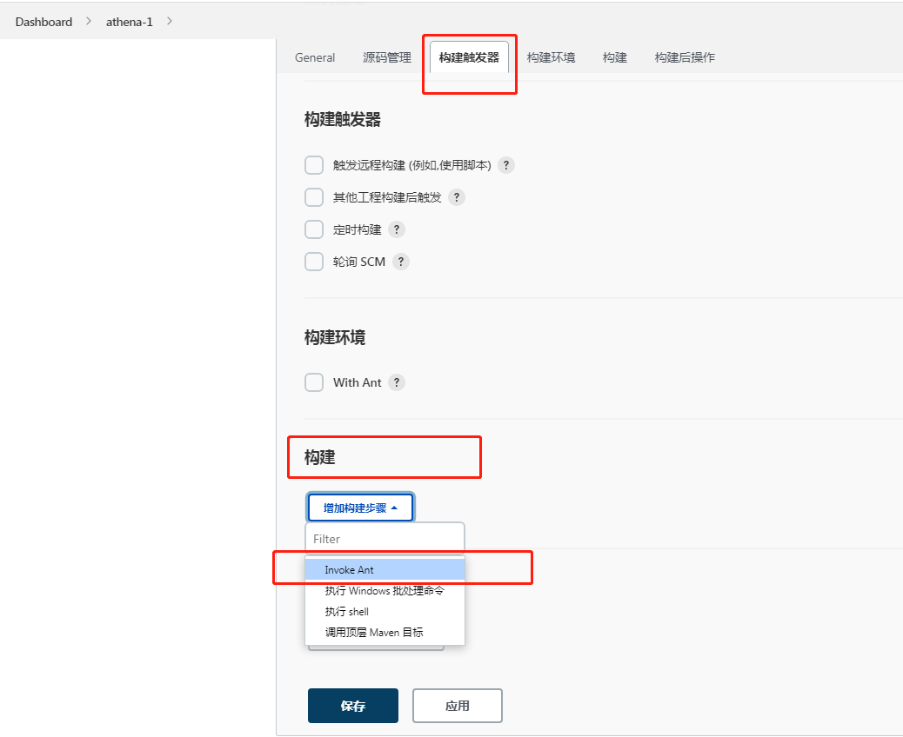 </div><br>

  <div align="left">  </div><br>

  <div align="left"> 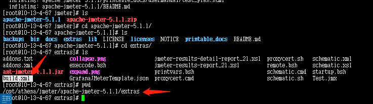 </div><br>

  <div align="left">  </div><br>

##### 4.本地ant环境变量配置

1.配置ANT_HOME 环境变量

```
export ANT_HOME=/opt/athena/apacheAnt/apache-ant-1.9.16
export PATH=$PATH:$ANT_HOME/bin
```

2.修改jmeter的jmeter.properties 

```
搜索output_format
jmeter.save.saveservice.output_format=xml
```

<div align="left"> 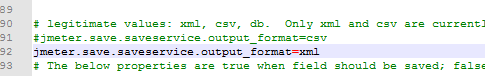 </div><br>

3.jmeter的extras文件夹中 ant-jmeter-1.1.1.jar  拷贝到ant的lib文件  ----发邮件

##### 5.修改jmeter的build.xml配置文件

- /opt/athena/jmeter/apache-jmeter-5.1.1/extras

  **重点：** build.xml 配置修改说明 

  ```
  project 标签： ant 的根目录，每个 build 文件必须包括一个
  project(Each buildfile contains one project and at least one (default) target) 
  ```

  ```
  name:project 的名称 
  default: 指定默认执行是的 target 
  basedir: 指定基路径
  每个项目定义一个或多个*目标*。 目标是一组你想要完成的任务 
  Each project defines one or more *targets*. A target is a set of *tasks* you want to be 
  执行。 在启动Ant时，您可以选择需要哪些目标 
  executed. When starting Ant, you can select which target(s) you want to have 
  执行。 如果没有给出目标，则使用项目的默认值。
  executed. When no target is given, the project's default is used. 
  target 节点target 为 ant 的基本执行单元，它可以包含一个或多个，多个之间可以存在相互依赖关系
  ```

+ project:  有且仅有一个
+ default=all   默认情况下，会执行任务名称为all的任务，all的任务，它包含了test、report、mail  也就是说，默认情况下，会执行测试任务、生成报告任务、发送邮件任务。
+ 在jenkins的item中配置  构建 invoke ant中 也有targets， 如果这个targets没有填，那么就根据build.xml文件中default值来执行，如果有填就执行你填写的任务。targets可填多个.

<div align="left">  </div><br>

<div align="left"> 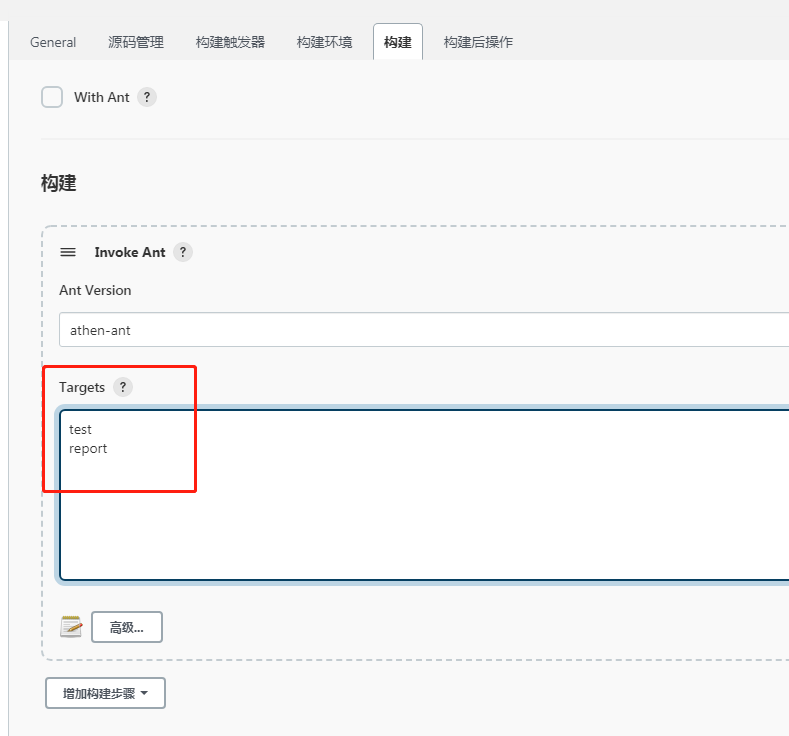 </div><br>

##### 6.build.xml 文件

```xml
<?xml version="1.0" encoding="UTF-8"?>
<project name="athena" default="all" basedir=".">  
 <tstamp>
        <format property="time" pattern="yyyyMMddhhmm" />
 </tstamp>
	<property name="encoding" value="UTF-8" />
    <!-- 需要改成自己本地的 Jmeter 目录-->  
    <property name="jmeter.home" value="/opt/athena/jmeter/apache-jmeter-5.1.1" />
    <property name="report.title" value="性能测试持续集成报告"/>
    <!-- jmeter生成jtl格式的结果报告的路径--> 
    <property name="jmeter.result.jtl.dir" value="${jmeter.home}\worklogs\jtl" />
    <!-- jmeter生成html格式的结果报告的路径-->
    <property name="jmeter.result.html.dir" value="${jmeter.home}\worklogs\${time}html" />
    <!-- 生成的报告的前缀-->  
    <property name="ReportName" value="PerformReport" />
    <property name="jmeter.result.jtlName" value="${jmeter.result.jtl.dir}\${ReportName}${time}.jtl" />
    <property name="jmeter.result.htmlName" value="${jmeter.result.html.dir}\${ReportName}${time}.html" />

    <target name="all">
        <antcall target="test" />
        <antcall target="report" />
		<antcall target="mail" />
    </target>
    
    <target name="test">
        <taskdef name="jmeter" classname="org.programmerplanet.ant.taskdefs.jmeter.JMeterTask" />
        <jmeter jmeterhome="${jmeter.home}" resultlog="${jmeter.result.jtlName}">
            <!-- 声明要运行的脚本"*.jmx"指包含此目录下的所有jmeter脚本-->
            <testplans dir="${jmeter.home}\bin\jmeter_jmx" includes="*.jmx" />
	
            
            <property name="jmeter.save.saveservice.output_format" value="xml"/>
        </jmeter>
    </target>
        
    <path id="xslt.classpath">
        <fileset dir="${jmeter.home}\lib" includes="xalan*.jar"/>
        <fileset dir="${jmeter.home}\lib" includes="serializer*.jar"/>
    </path>


    <target name="report">
        <tstamp> <format property="report.datestamp" pattern="yyyy/MM/dd HH:mm" /></tstamp>
        <xslt 
              classpathref="xslt.classpath"
              force="true"
              in="${jmeter.result.jtlName}"
              out="${jmeter.result.htmlName}"
			  style="${jmeter.home}\extras\jmeter-results-detail-report_21.xsl">

              <param name="showData" expression="${show-data}"/>

              <param name="dateReport" expression="${report.datestamp}"/>
              <param name="titleReport" expression="${report.title}:${report.datestamp}"/>

       </xslt>

                <!-- 因为上面生成报告的时候，不会将相关的图片也一起拷贝至目标目录，所以，需要手动拷贝 --> 
        <copy todir="${jmeter.result.html.dir}">
            <fileset dir="${jmeter.home}\extras">
                <include name="collapse.png" />
                <include name="expand.png" />
            </fileset>
        </copy>
    </target>
	<property name="mail_from" value="2761104162@qq.com" />
	<property name="password" value="fnsnemrckimxdfcd" />
	<!--mail_to:发送列表,多个之间逗号间隔 -->
	
	<property name="mail_to" value="1421721323@qq.com" /> 
	<property name="mailport" value="25" />
	<!--邮箱需要开通smtp服务-->
	<property name="mailhost" value="smtp.163.com" />

	<target name="mail">
		
		<loadfile property="report" srcFile="${jmeter.result.htmlName}" encoding="${encoding}" />
		<mail from="${mail_from}" tolist="${mail_to}" mailport="${mailport}" mailhost="${mailhost}" user="${mail_from}" password="${password}" subject="TestReport-${ant.project.name}" messagemimetype="text/html">
			<message>
		     	   			本轮构建的结果如下：
		     	   			${report}	        	   			
		     	   </message>
		</mail>
    <delete file="${jmeter.result.htmlName}" />
	</target>
</project>

```

##### 7.jenkins构建

1. 开始构建之前:启动项目

   检查jmx中的启用的线程组场景设计的

<div align="left">  </div><br>

<div align="left"> 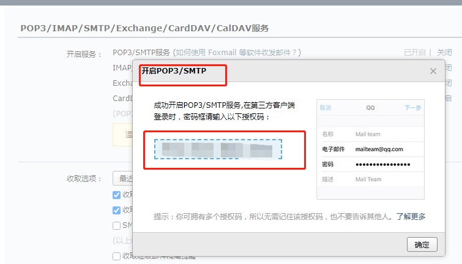 </div><br>

<div align="left"> 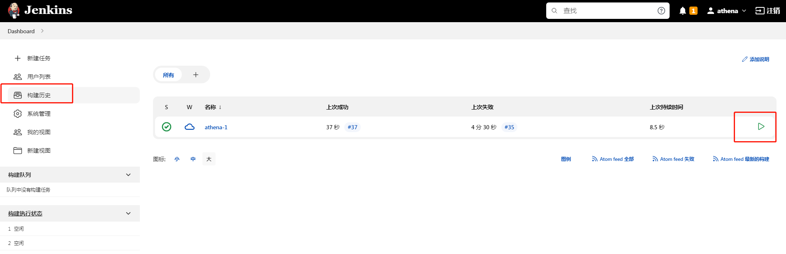 </div><br>

#### 8.Jenkins 持续集成java+maven项目

##### 1.jdk配置

- System Configuration(系统管理) -> Global Tool Configuration（全局工具配置）

  <div align="left"> 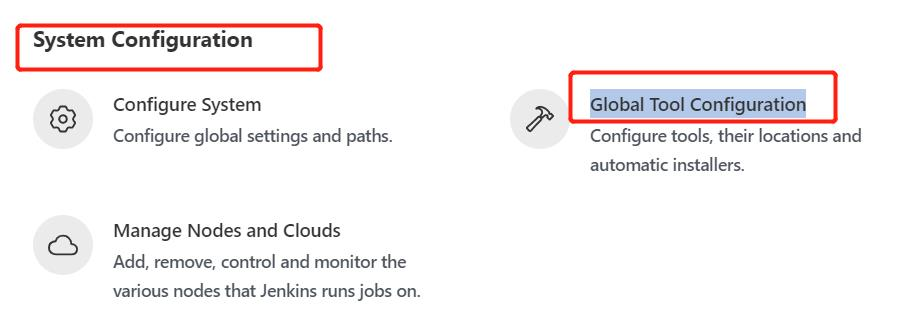 </div><br>

- 配置本地 jdk

  <div align="left"> 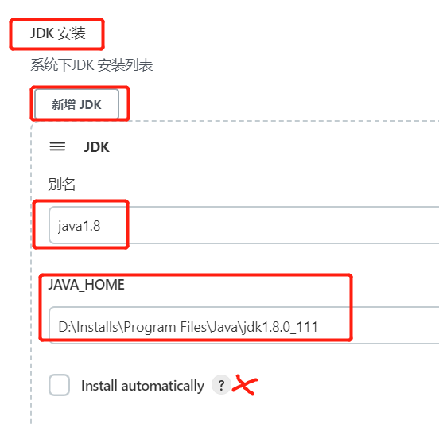 </div><br>

##### 2.maven配置

- 配置本地 maven

  <div align="left"> 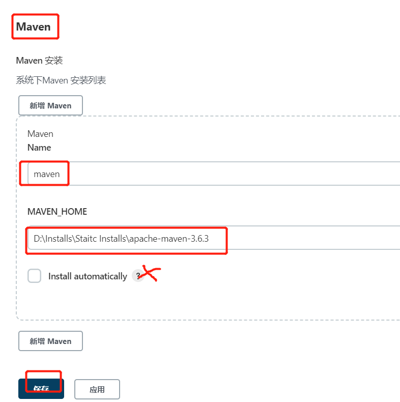 </div><br>

##### 3.新建maven项目

1. 插件管理中下载 maven插件：maven intergration

   <div align="left"> 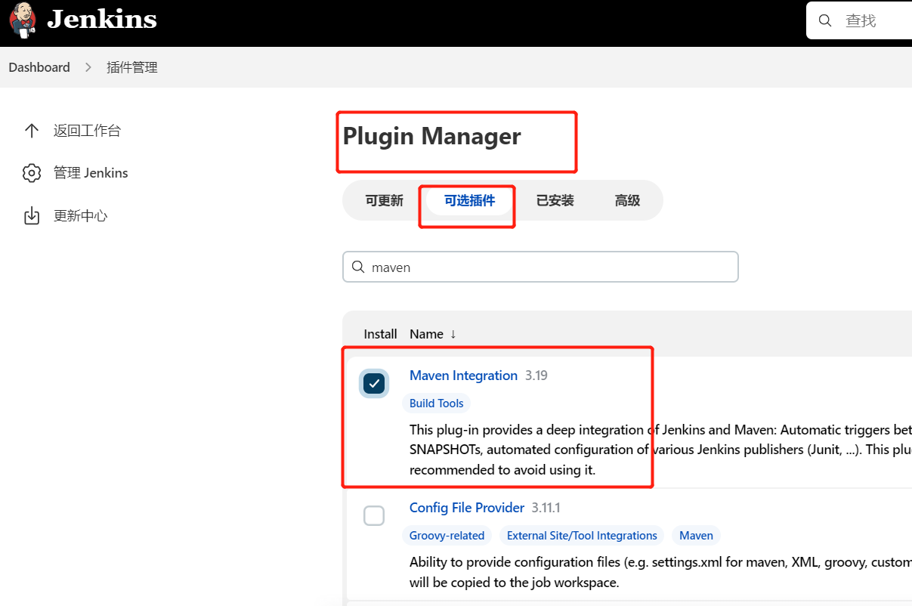 </div><br>

2. 新建item-构建maven项目

   <div align="left"> 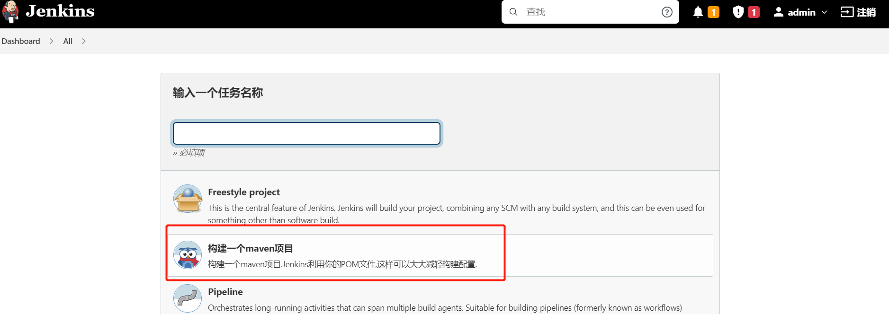 </div><br>

   


