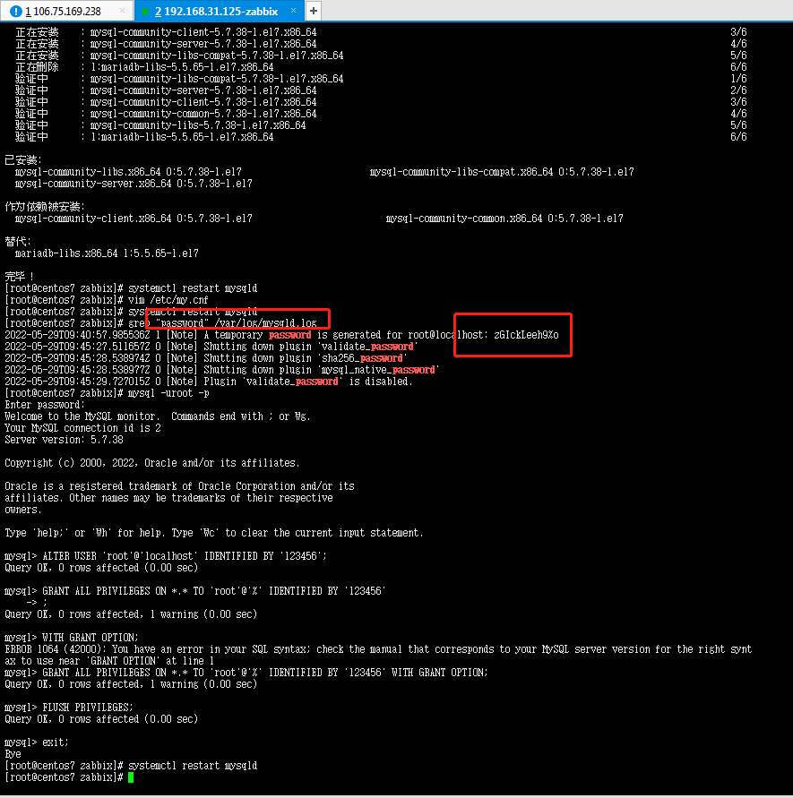
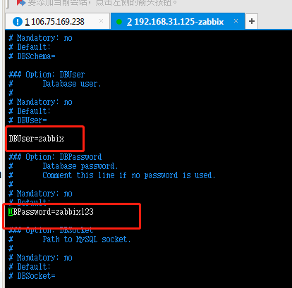
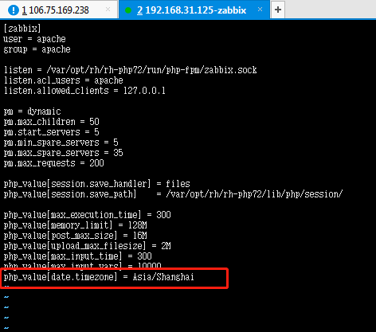

#### 监控平台zabbix  

1. zabbix： 服务器资源监控平台

2. zabbix 应用:

   + grafana(前端展示) + zabbix

   + zabbix本身前端 + 数据库 + 数据收集
   + 不局限于性能测试,可以独立监控硬件资源 + 软件资源
   + 组成有多个:最主要的zabbix-server    zabbix-agent(收集安装被测服务器)


##### 1.zabbix安装

官网指引文档

https://www.zabbix.com/cn/download?zabbix=5.0&os_distribution=centos&os_version=7&db=mysql&ws=nginx

<div align="left">  </div><br>

1.安装zabbix

```shell
rpm -Uvh https://repo.zabbix.com/zabbix/5.0/rhel/7/x86_64/zabbix-release-5.0-1.el7.noarch.rpm
yum clean all
yum install zabbix-server-mysql zabbix-agent -y
yum install centos-release-scl -y
yum install vim
vim /etc/yum.repos.d/zabbix.repo
[zabbix-frontend]
enable =1
yum install zabbix-web-mysql-scl zabbix-nginx-conf-scl -y 
```

<div align="left">  </div><br>

2.安装mysqld

```sh
rpm -Uvh http://dev.mysql.com/get/mysql57-community-release-el7-10.noarch.rpm
rpm --import https://repo.mysql.com/RPM-GPG-KEY-mysql-2022
yum install mysql-community-server -y
systemctl restart mysqld
vim /etc/my.cnf
# 添加validate_password_policy配置 0（LOW），1（MEDIUM），2（STRONG）
validate_password_policy=0
# 关闭密码策略
validate_password = off
# 设置字符集
#[mysqld]
character-set-server=utf8mb4
collation-server=utf8mb4_general_ci
init_connect='SET NAMES utf8mb4'
# 再次重启mysqld
systemctl restart mysqld
 
```

3.改mysql的root密码

```
grep "password" /var/log/mysqld.log
# 复制密码 BabZ5aLn!pjQ
mysql -uroot -p回车
上面复制密码  回车
ALTER USER 'root'@'localhost' IDENTIFIED BY '123456';
# 开启远程访问
GRANT ALL PRIVILEGES ON *.* TO 'root'@'%' IDENTIFIED BY '123456' WITH GRANT OPTION;
FLUSH PRIVILEGES;
exit;
systemctl restart mysqld
```

<div align="left">  </div><br>

4.初始化zabbix的数据库

```
# 初始化zabbix的数据库
mysql -uroot -p回车
密码：123456
# 创建数据库
create database zabbix character set utf8 collate utf8_bin;
# 创建zabbix账号并赋予权限
create user zabbix@localhost identified by 'zabbix123';
grant all privileges on zabbix.* to zabbix@localhost;
quit;
# 初始化表结构和数据
zcat /usr/share/doc/zabbix-server-mysql*/create.sql.gz | mysql -uzabbix -p zabbix
输入密码： zabbix123
```

5.修改zabbix_server的配置文件

```
vim /etc/zabbix/zabbix_server.conf
DBPassword=zabbix123
```

<div align="left">  </div><br>

6.修改zabbix前端配置

```
vim /etc/opt/rh/rh-nginx116/nginx/conf.d/zabbix.conf
把第2、3行前面的# 去掉
```

```
vim /etc/opt/rh/rh-php72/php-fpm.d/zabbix.conf
listen.acl_users = apache,nginx
# 去掉最后一行前面 ;
#把 时区  Asia/Shanghai
; php_value[date.timezone] = Europe/Riga 更新
```

<div align="left">  </div><br>

7.启动Zabbix server和agent进程

启动Zabbix server和agent进程，并为它们设置开机自启：

```
# systemctl restart zabbix-server zabbix-agent rh-nginx116-nginx rh-php72-php-fpm
# systemctl enable zabbix-server zabbix-agent rh-nginx116-nginx rh-php72-php-fpm
```

8.配置Zabbix前端

连接到新安装的Zabbix前端： http://server_ip_or_name

http://192.168.31.125/

根据Zabbix文件里步骤操作： [Installing frontend](https://www.zabbix.com/documentation/5.0/manual/installation/install#installing_frontend)
