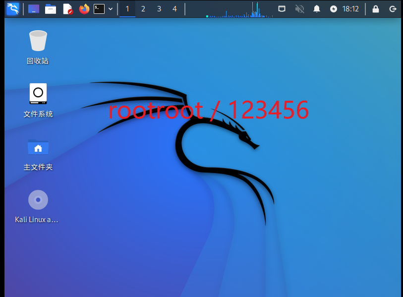
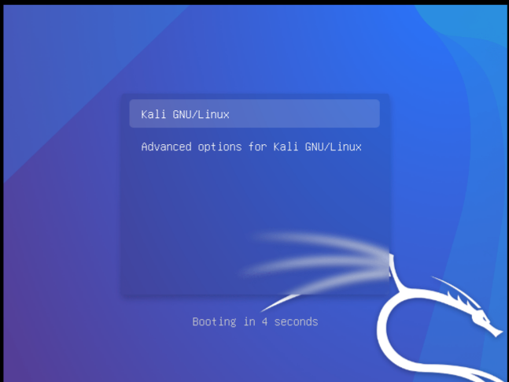
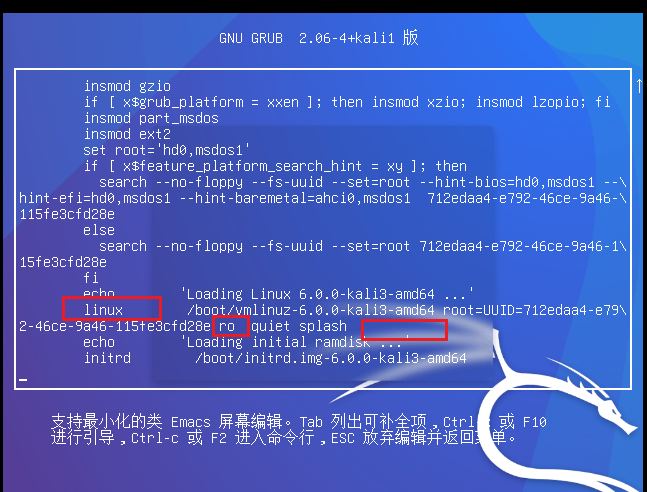
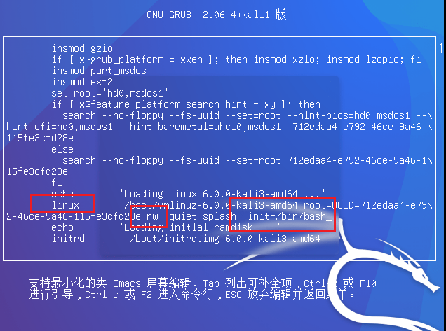
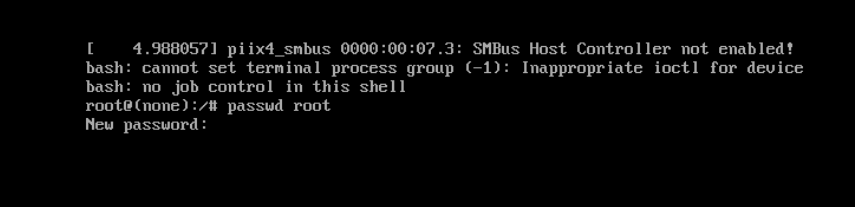
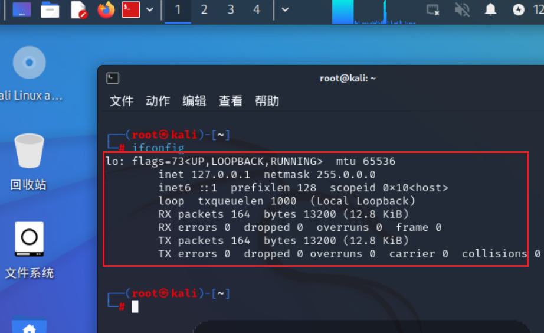
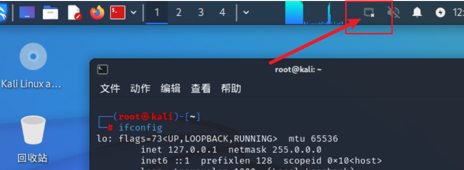
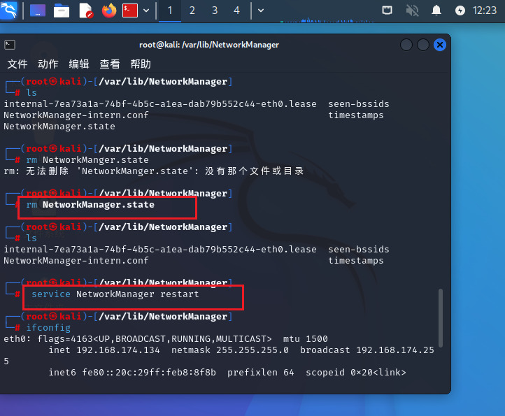
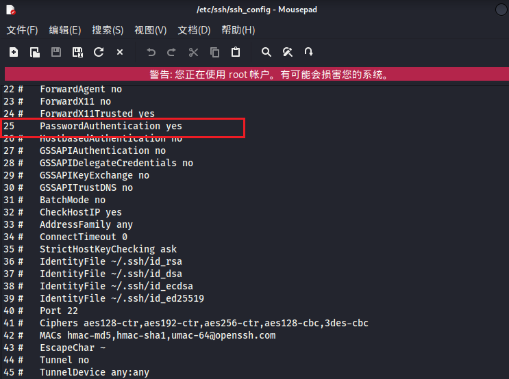
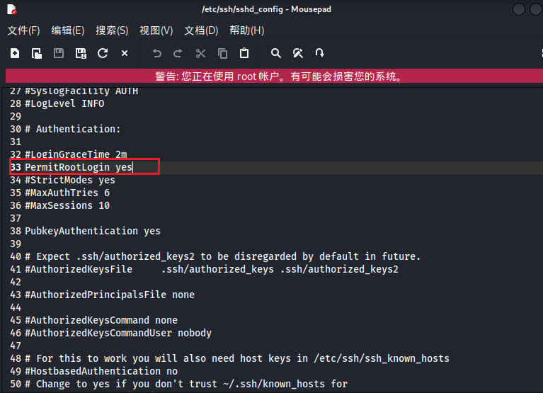

## 一、安全测试入门基础

## 1、安全测试之虚拟机安装配置

### [1、vmware下载](https://www.vmware.com/cn.html)

### 2、VMWare虚拟机上网模式

VMWare提供了三种网络适配器模式，它们是bridged(桥接模式)、NAT(网络地址转换模式)和host-only(主机模式)。

- 桥接模式

- 在这种模式下，VMWare虚拟出来的操作系统就像是局域网中的一台独立的主机，它可以访问网内任何一台机器。在桥接模式下，你需要手工为虚拟系统配置IP地址、子网掩码，而且还要和宿主机器处于同一网段，这样虚拟系统才能和宿主机器进行通信。同时，由于这个虚拟系统是局域网中的一个独立的主机系统，那么就可以手工配置它的TCP/IP配置信息，以实现通过局域网的网关或路由器访问互联网。

  使用桥接模式的虚拟系统和宿主机器的关系，就像连接在同一个Hub上的两台电脑。想让它们相互通讯，你就需要为虚拟系统配置IP地址和子网掩码，否则就无法通信。

  如果你想利用VMWare在局域网内新建一个虚拟服务器，为局域网用户提供网络服务，就应该选择桥接模式

- NAT模式

- 使用NAT模式，就是让虚拟系统借助NAT(网络地址转换)功能，通过宿主机器所在的网络来访问公网。也就是说，使用NAT模式可以实现在虚拟系统里访问互联网。NAT模式下的虚拟系统的TCP/IP配置信息是由VMnet8(NAT)虚拟网络的DHCP服务器提供的，无法进行手工修改，因此虚拟系统也就无法和本局域网中的其他真实主机进行通讯。采用NAT模式最大的优势是虚拟系统接入互联网非常简单，你不需要进行任何其他的配置，只需要宿主机器能访问互联网即可。

  如果你想利用VMWare安装一个新的虚拟系统，在虚拟系统中不用进行任何手工配置就能直接访问互联网，建议你采用NAT模式。

- 仅主机模式

- 在某些特殊的网络调试环境中，要求将真实环境和虚拟环境隔离开，这时你就可采用host-only模式。在host-only模式中，所有的虚拟系统是可以相互通信的，但虚拟系统和真实的网络是被隔离开的。

  提示:在host-only模式下，虚拟系统和宿主机器系统是可以相互通信的，相当于这两台机器通过双绞线互连。

  在host-only模式下，虚拟系统的TCP/IP配置信息(如IP地址、网关地址、DNS服务器等)，都是由VMnet1(host-only)虚拟网络的DHCP服务器来动态分配的。

  如果你想利用VMWare创建一个与网内其他机器相隔离的虚拟系统，进行某些特殊的网络调试工作，可以选择host-only模式

### 3、Kali linux系统

- [下载kali](https://www.kali.org/get-kali/)

- VMware中登录kali系统，我安装的kali系统账密：rootroot /123456    默认的账密kali/kali

  <div align="left">  </div><br>

```
poweroff --关机
```

#### 1、Kali linux修改root权限

1、在此界面按E键

<div align="left">  </div><br>

- 2、找到以linux开头的行，将ro改成rw，在最后添加init=/bin/bash

  <div align="left">  </div><br>

  <div align="left">  </div><br>

- 3、使用F10(或ctrl+x)进入单用户模式，输入passwdroot进行密码修改后，重启

  <div align="left">  </div><br>

#### 2、kali没有ip地址的解决方法

<div align="left">  </div><br>

我的此问题由于：vm虚拟机虚拟网络已禁用导致，
<div align="left">  </div><br>

提示虚拟网络已禁用或者彻底没有网络图标，解决步骤：

```
1、关闭网络守护进程
service NetworkManager stop
2 、进入NetworkManger服务目录
cd  /var/lib/NetworkManager
3、删除 NetworkManager.state文件
rm NetworkManager.state
4、重启NetworkManager服务
service NetworkManager restart
5、ifconfig
```

<div align="left">  </div><br>

#### 3、kali上开启SSH远程登录服务

```
1、修改配置文件/etc/ssh/ssh_config：将PasswordAuthentication  yes 前的注释符#去掉
2、修改配置文件/etc/ssh/sshd_config将#PermitRootLogin prohibit-password前的注释符#去掉，将prohibit-password改为yes
3、service ssh start        启动ssh服务
4、update-rc.d ssh enable   添加开机自动启动ssh服务
5、update-rc.d ssh disabled 关闭开机自动启动ssh服务 （重启即可生效）
```

<div align="left">  </div><br>

<div align="left">  </div><br>

### 4、windows基础

#### 1、windows常见目录

```
1、C:\Windows\System32\drivers\etc\hosts 域名解析ip地址
2.C:\Program Files 一般是安装64位程序的文件存放的位置
3.C:\Program Files(x86) 32位应用程序的默认安装文件夹
4.C:\ProgramData 系统文件夹，都是用来存放一些setting文件、缓存文件的(是个隐藏文件来，win7打开路径:组织-文件夹和搜索选项-查看-显示隐藏的文件文件夹和驱动器)
5.C:\Windows系统配置文件安装目录
6.C:\Windows\System32\config\SAM存储账号和密码，运行状态下是无法打开的。
```

#### 2、hosts文件

```
C:\Windows\System32\drivers\etc\hosts  hosts文件位置
作用：
Hosts是一个没有扩展名的系统文件，可以用记事本等工具打开，其作用就是将-些常用的网址域名与其对应的IP地址建立一个关联“数据库”，当用户在浏览器中输入一个需要登录的网址时，系统会首先自动从Hosts文件中寻找对应的IP地址，一日找到，系统会立即打开对应网页，如果没有找到，则系统会再将网址提交DNS域名解析服务器进行IP地址的解析。
Hosts文件配置的映射是静态的，如果网络上的计算机更改了请及时更新IP地址，否则将不能访问,也就是说Hosts的请求级别比DNS高。
刷新dns命令:ipconfig/flushdns
```

#### 3、服务

```
1、服务是一种应用程序类型，它在后台运行。服务应用程序通常可以在本地和通过网络为用户提供一些功能，例如客户端/服务器应用程序、Web服务器、数据库服务器以及其他服务器的应用程序。
2、本机服务快捷打开方法: services.msc
web服务
dns服务(提供域名解析)
DHCP服务(给客户机发送一个可用的IP)
SMTP邮件服务
telnet服务 Telnet默认使用的端口号是23
ossh服务(就是一个命令行，一般用于linux的命令控制，远程终端)。ftp服务
smb服务(文件共享服务)
telnet和ssh的区别: ssh是一种加密的，需要交换密钥，但是telnet是明文传输的，不安全。
```

  
