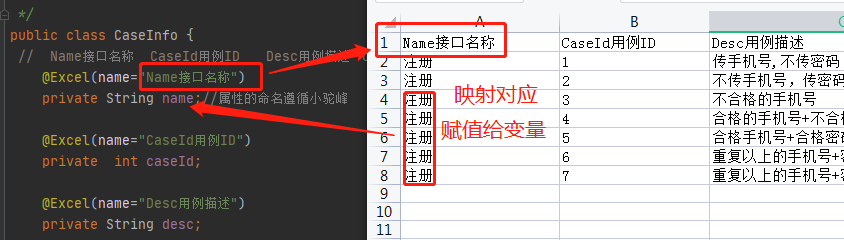

#### 1.通过restassured发起请求

- pom.xml文件配置jar包

  ```xml
   <dependency>
              <groupId>io.rest-assured</groupId>
              <artifactId>rest-assured</artifactId>
              <version>4.2.0</version>
          </dependency>
          <dependency>
              <groupId>org.testng</groupId>
              <artifactId>testng</artifactId>
              <version>7.5</version>
              <scope>test</scope>
          </dependency>
      </dependencies>
  ```

- post请求接口

  ```java
      @Test
      public void  http_post() {
          Response response = given()
                          .header("Content-Type", "application/json")
                          .body("{\"Content\":\"测试\"}")
                          .post("https://cloud.tencent.com/voc/gateway/DescribeRequirements");
          int statusCode = response.statusCode();
          Headers headers =response.headers();
          System.out.println(response.asString());//响应体不调用asString,返回response对象
          System.out.println(statusCode);
          System.out.println(headers);
  ```
  

- JSONPath断言

  ```java
  @Test
      public void  jsonpathTest() {
          Response response = given()
                  .header("Content-Type", "application/json")
                  .body("{\"Content\":\"测试\"}")
                  .post("https://cloud.tencent.com/voc/gateway/DescribeRequirements");
          String body =response.asString();
          //JSONPath.read(json字符串,jsonpath表达式)
          System.out.println(JSONPath.read(body, "$.code"));
          System.out.println(JSONPath.read(body, "$.msg"));
          System.out.println(JSONPath.read(body, "$.data"));
      }
  ```

- testng- @DataProvider数据驱动

  ```java
  @DataProvider
      public Object[][] allDatas(){
          //多个参数用二维数组，1个参数用一维数组
          Object[][] datas = {{"张三","20"},{"李四","18"},{"王五","25"},{"赵六","30"}};
          return datas;
      }
  
      //1、数据源的数据识别（dataProvider = "allDatas"方法名）
      //2、通过测试方法形参来接受
      @Test(dataProvider = "allDatas")
  
      public void print(String name, String age){
          //多个参数用二维数组，1个参数用一维数组
          System.out.println("获取名字,获取年龄");
          //打印名字
          System.out.println(name);
          System.out.println(age);
      }
  
  ```

  ```java
    @Test(dataProvider = "datas")
      public void  RegisterTest(String url ,String params){
          //注册接口测试
          Map<String,Object> headers = new HashMap<String, Object>();
          headers.put("Content-Type", "application/json");
          String body = HttpUtils.mypost(url,headers,params);
          System.out.println(body);
      }
     @DataProvider
      public Object[][]datas(){
          Object[][] datas ={
                  {"http://192.168.86.135:8080/app/mobile/api/user/register","{\"mobile\":\"67078985788\",\"password\":\"123456\",\"code\":\"1234\",\"platform\":\"windows\"}"},
                  {"http://192.168.86.135:8080/app/mobile/api/user/register","{\"mobile\":\"67078985789\",\"password\":\"123456\",\"code\":\"1234\",\"platform\":\"windows\"}"},
                  {"http://192.168.86.135:8080/app/mobile/api/user/register","{\"mobile\":\"67078985789\",\"password\":\"1234564\",\"code\":\"1234\",\"platform\":\"windows\"}"},
            };
         return datas;
     }
  ```

#### 2.excel文件读取

- easypoiDemo

  ```xml
    <dependency>
              <groupId>cn.afterturn</groupId>
              <artifactId>easypoi-annotation</artifactId>
              <version>4.0.0</version>
          </dependency>
  ```

- excel--映射实体类

  <div align="left">  </div><br>

  ```java
  @Excel(name="Name接口名称")
      private String name;//特别注意：属性的命名遵循小驼峰
      //生成get/set方法
  ```

  ```java
  @Test
      public static void read() throws Exception {
          //1.加载excel文件
          FileInputStream fis = new FileInputStream("src/test/resources/Athena1.xlsx");//注意是斜杠
          //2.创建easypoi导入参数对象
          ImportParams params = new ImportParams();
          //开始读取的sheet位置,默认为0  
          params.setStartSheetIndex(0);
          //上传表格需要读取的sheet数量,默认为1
          params.setSheetNum(2);
          //3.importExcel(文件流,映射实体类.class,easyPOI导入参数)
          List<CaseInfo> caseinfolist = ExcelImportUtil.importExcel(fis, CaseInfo.class,params);
          for(CaseInfo caseInfo: caseinfolist){
              System.out.println(caseInfo);
          }
          fis.close();
  
      }
  ```

  

  <div align="left">  </div><br>

- 总结：excel表读取执行顺序eg:
  1. 首先运行loginCase方法，当发现该方式有注解dataProvider时，即执行对应的dataProvider()方法；
  2. dataProvider()方法调用了封装的excel获取数据read()方法；
  3. read()方法将excel数据读取到输入流，然后通过ExcelImportUtil.importExcel()封装到实体类;
  4. 最后将返回实体类对象到注册接口作为请求参数，restassured完成请求。

#### 3.excel文件回写

### 4.Testng注解

#### 5.JSONPath断言
