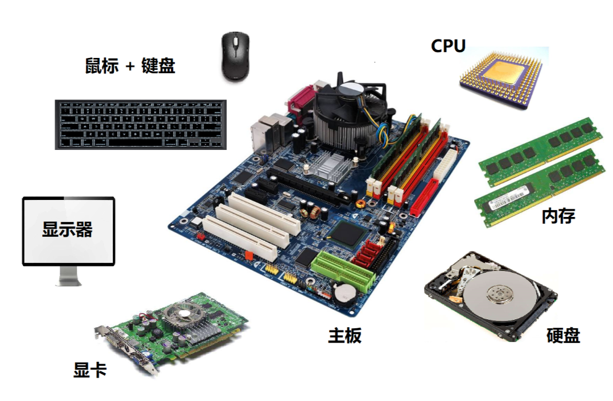
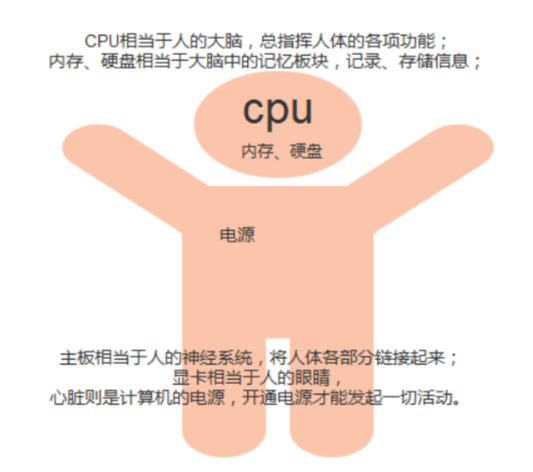
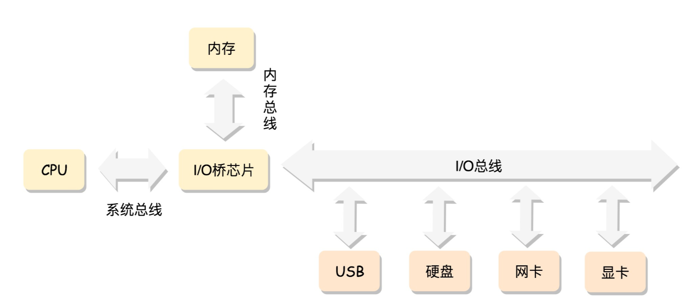
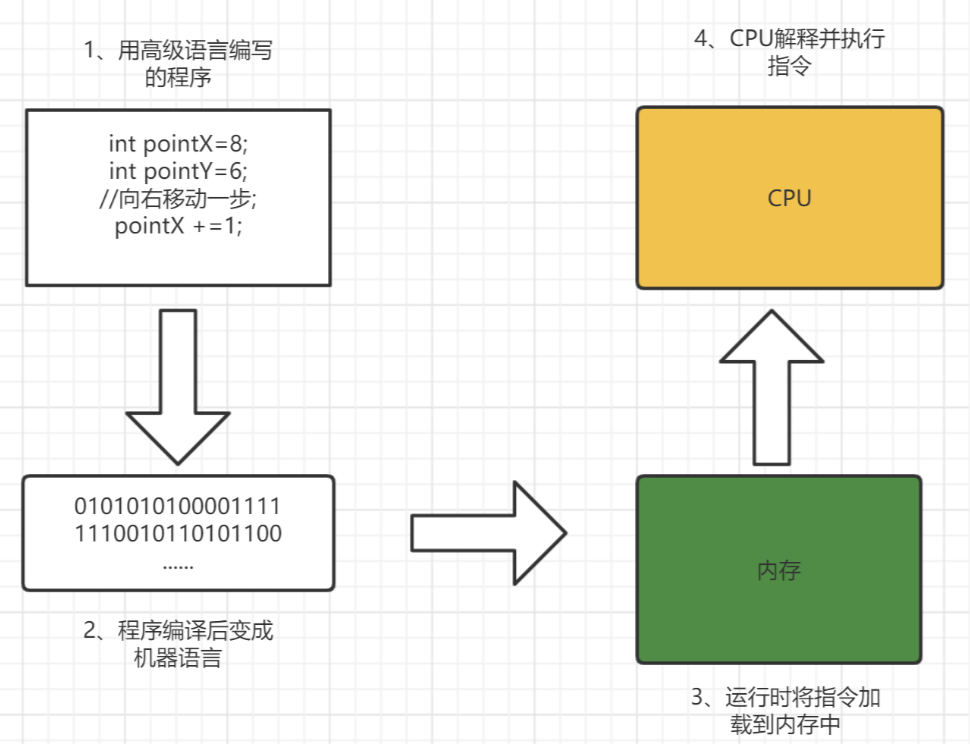
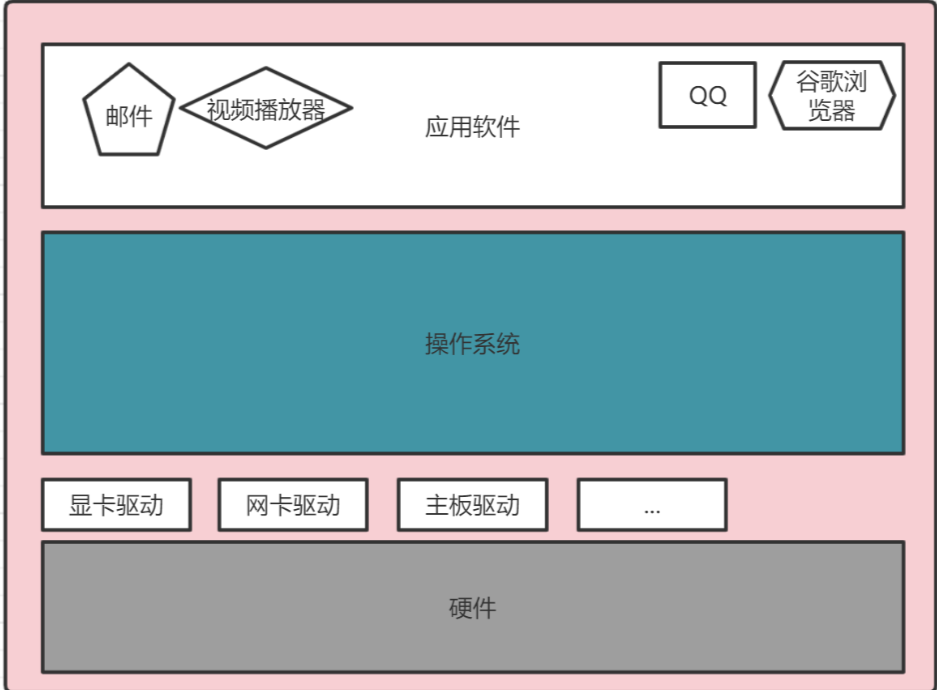
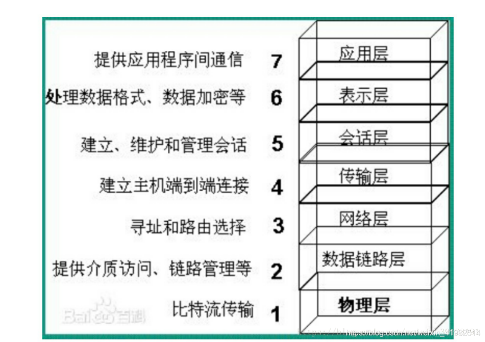

# 第一部分：计算机组成原理

## 1.计算机的基本硬件组成

  
 

CPU相当于人的大脑，总指挥人体的各项功能；内存、硬盘相当于大脑中的记忆板块，记录、存储信息的，主板相当于人的神经系统，将人体各部分链接起来；显卡相当于人的眼睛，心脏则是计算机的电源，开通电源才能发起一切活动

  
 

### CPU 

CPU的全称是 `Central Processing Unit`，它是你的电脑中最`硬核`的组件，这种说法一点不为过。CPU 是能够让你的计算机叫`计算机`的核心组件，但是它却不能代表你的电脑，CPU 与计算机的关系就相当于大脑和人的关系。CPU 的核心是从程序或应用程序获取指令并执行计算。此过程可以分为三个关键阶段：**提取，解码和执行**。CPU从系统的主存中提取指令，然后解码该指令的实际内容，然后再由 CPU 的相关部分执行该指令。

### 内存

内存（Memory）是计算机中最重要的部件之一，它是程序与CPU进行沟通的桥梁。计算机中所有程序的运行都是在内存中进行的，因此内存对计算机的影响非常大，内存又被称为`主存`，其作用是存放 CPU 中的运算数据，以及与硬盘等外部存储设备交换的数据。只要计算机在运行中，CPU 就会把需要运算的数据调到主存中进行运算，当运算完成后CPU再将结果传送出来，主存的运行也决定了计算机的稳定运行。

### 主板

主板上集成了各种电子元件、插槽和接口等，为CPU、内存和各种功能卡，如声卡、网卡等提供了安装插槽，为各种多媒体和通信设备提供了接口

主板是一个有着各种各样，有时候多达数十乃至上百个插槽的配件。我们的 CPU 要插在主板上，内存也要插在主板上。主板的**芯片组**（Chipset）和**总线**（Bus）解决了 CPU 和内存之间如何通信的问题。芯片组控制了数据传输的流转，也就是数据从哪里到哪里的问题。总线则是实际数据传输的高速公路。因此，**总线速度**（Bus Speed）决定了数据能传输得多快。

### 系统总线和IO总线

一般主机板芯片组有分北桥与南桥， 北桥的系统总线称为系统总线，因为是CPU、内存、显卡传输的主要通道，所以速度较快。南桥就是所谓的输入输出(I/O)总线，主要在联系硬盘、USB、网络卡等周边设备，最常见的是PCI总线。这两条总线之间用桥接的芯片或者说电路连接起来。

  
 

### I/O 设备

有了三大件，只要配上**电源**供电，计算机差不多就可以跑起来了。但是现在还缺少各类输入（Input）/ 输出（Output）设备，也就是我们常说的**I/O 设备**。如果你用的是自己的个人电脑，那显示器肯定必不可少，只有有了显示器我们才能看到计算机输出的各种图像、文字，这也就是所谓的**输出设备**。

同样的，鼠标和键盘也都是必不可少的配件。这样我才能输入文本，写下这篇文章。它们也就是所谓的**输入设备**。

### 显卡

还有一个很特殊的设备，就是**显卡**（Graphics Card）。现在，使用图形界面操作系统的计算机，无论是 Windows、Mac OS 还是 Linux，显卡都是必不可少的。有人可能要说了，我装机的时候没有买显卡，计算机一样可以正常跑起来啊！那是因为，现在的主板都带了内置的显卡。如果你用计算机玩游戏，做图形渲染或者跑深度学习应用，你多半就需要买一张单独的显卡，插在主板上。显卡之所以特殊，是因为显卡里有除了 CPU 之外的另一个“处理器”，也就是**GPU**（Graphics Processing Unit，图形处理器），GPU 一样可以做各种“计算”的工作。

## 2.CPU如何执行指令

CPU 的内部由**寄存器、控制器、运算器和时钟**四部分组成

- `寄存器`是中央处理器内的组成部分。它们可以用来暂存指令、数据和地址。可以将其看作是内存的一种。根据种类的不同，一个 CPU 内部会有 20 – 100个寄存器。
- `控制器`负责把内存上的指令、数据读入寄存器，并根据指令的结果控制计算机
- `运算器`负责运算从内存中读入寄存器的数据
- `时钟` 负责发出 CPU 开始计时的时钟信号

  
 

计算机的CPU，其工作都可以分为5个阶段：**取指令、指令译码、执行指令、访存取数、结果写回**。

- `取指令`阶段是将内存中的指令读取到 CPU 中寄存器的过程，程序寄存器用于存储下一条指令所在的地址
- `指令译码`阶段，在取指令完成后，立马进入指令译码阶段，在指令译码阶段，指令译码器按照预定的指令格式，对取回的指令进行拆分和解释，识别区分出不同的指令类别以及各种获取操作数的方法。
- `执行指令`阶段，译码完成后，就需要执行这一条指令了，此阶段的任务是完成指令所规定的各种操作，具体实现指令的功能。
- `访问取数`阶段，根据指令的需要，有可能需要从内存中提取数据，此阶段的任务是：根据指令地址码，得到操作数在主存中的地址，并从主存中读取该操作数用于运算。
- `结果写回`阶段，作为最后一个阶段，结果写回阶段把执行指令阶段的运行结果数据“写回”到某种存储形式：结果数据经常被写到CPU的内部寄存器中，以便被后续的指令快速地存取；

## 3.内存的使用

### 指针

指针是 C 语言非常重要的特征，指针也是一种变量，只不过它所表示的不是数据的值，而是内存的地址。通过使用指针，可以对任意内存地址的数据进行读写。

### 数组是内存的实现

数组是指多个`相同`的数据类型在内存中连续排列的一种形式。作为数组元素的各个数据会通过`下标编号`来区分，这个编号也叫做`索引`，如此一来，就可以对指定索引的元素进行读写操作。

## 4.磁盘

  
 

## 5.磁盘缓存

磁盘往往和内存是互利共生的关系，相互协作，彼此持有良好的合作关系。每次内存都需要从磁盘中读取数据，必然会读到相同的内容，所以一定会有一个角色负责存储我们经常需要读到的内容。我们大家做软件的时候经常会用到`缓存技术`，那么硬件层面也不例外，磁盘也有缓存，磁盘的缓存叫做`磁盘缓存`。

磁盘缓存指的是把从磁盘中读出的数据存储到内存的方式，这样一来，当接下来需要读取相同的内容时，就不会再通过实际的磁盘，而是通过磁盘缓存来读取。某一种技术或者框架的出现势必要解决某种问题的，那么磁盘缓存就大大**改善了磁盘访问的速度**。

## 6.虚拟内存

`虚拟内存`是内存和磁盘交互的第二个媒介。虚拟内存是指把磁盘的一部分作为`假想内存`来使用。这与磁盘缓存是假想的磁盘（实际上是内存）相对，虚拟内存是假想的内存（实际上是磁盘）。

虚拟内存是计算机系统内存管理的一种技术。它使得应用程序认为它拥有`连续可用`的内存（一个完整的地址空间），但是实际上，它通常被分割成多个物理碎片，还有部分存储在外部磁盘管理器上，必要时进行数据交换。

通过借助虚拟内存，在内存不足时仍然可以运行程序。例如，在只剩 5MB 内存空间的情况下仍然可以运行 10MB 的程序。由于 CPU 只能执行加载到内存中的程序，因此，虚拟内存的空间就需要和内存中的空间进行`置换（swap）`，然后运行程序。

虚拟内存的方法有`分页式` 和 `分段式` 两种。Windows 采用的是分页式。该方式是指在不考虑程序构造的情况下，把运行的程序按照一定大小的页进行分割，并以`页`为单位进行置换。在分页式中，我们把磁盘的内容读到内存中称为 `Page In`，把内存的内容写入磁盘称为 `Page Out`。Windows 计算机的页大小为 4KB ，也就是说，需要把应用程序按照 4KB 的页来进行切分，以页（page）为单位放到磁盘中，然后进行置换。

# 第二部分：操作系统

操作系统的简化图：

  
 

大部分计算机有两种运行模式：`内核态` 和 `用户态`，软件中最基础的部分是`操作系统`，它运行在 `内核态` 中，内核态也称为 `管态` 和 `核心态`，它们都是操作系统的运行状态，只不过是不同的叫法而已。操作系统具有硬件的访问权，可以执行机器能够运行的任何指令。软件的其余部分运行在 `用户态` 下。（软件-用户态、操作系统-内核态）

## 1.什么是内核

计算机是由各种外部硬件设备组成的，比如内存、cpu、硬盘等，如果每个应用都要和这些硬件设备对接通信协议，那这样太累了。

所以，这个中间人就由内核来负责，**让内核作为应用连接硬件设备的桥梁**，应用程序只需关心与内核交互，不用关心硬件的细节。

操作系统，内核一般会提供 4 个基本能力：

- 管理进程、线程，决定哪个进程、线程使用 CPU，也就是进程调度的能力；
- 管理内存，决定内存的分配和回收，也就是内存管理的能力；
- 管理硬件设备，为进程与硬件设备之间提供通信能力，也就是硬件通信能力；
- 提供系统调用，如果应用程序要运行更高权限运行的服务，那么就需要有系统调用，它是用户程序与操作系统之间的接口。

内核具有很高的权限，可以控制 cpu、内存、硬盘等硬件，而应用程序具有的权限很小，因此大多数操作系统，把内存分成了两个区域：

- 内核空间，这个内存空间只有内核程序可以访问；
- 用户空间，这个内存空间专门给应用程序使用；

用户空间的代码只能访问一个局部的内存空间，而内核空间的代码可以访问所有内存空间。

因此，当程序使用用户空间时，我们常说该程序在**用户态**执行，而当程序使内核空间时，程序则在**内核态**执行。

# 第三部分：计算机网络基础

## 1.网络协议

一台机器将自己想要表达的内容，按照某种约定好的格式发送出去，当另外一台机器收到这些信息后，也能够按照约定好的格式解析出来，从而准确、可靠地获得发送方想要表达的内容。这种约定好的格式就是**网络协议**（Networking Protocol）

## 2.网络分层

为什么网络要分层呢？因为网络环境过于复杂，不是一个能够集中控制的体系。全球数以亿记的服务器和设备各有各的体系，但是都可以通过同一套网络协议栈通过切分成多个层次和组合，来满足不同服务器和设备的通信需求。

两种网络协议模型，一种是**OSI 的标准七层模型**，一种是**业界标准的 TCP/IP 模型**。

###  什么是OSI七层参考模型？

 1. [OSI模型定义](https://baike.baidu.com/item/OSI%E6%A8%A1%E5%9E%8B/10119902?fr=aladdin)：开放式系统互联通信参考模型 ，简称OSI模型，一种概念模型，由国际标准化组织提出，一个试图使各种计算机在世界范围内互连为网络的标准框架

 2. OSI将[计算机网络体系结构](https://baike.baidu.com/item/计算机网络体系结构)(architecture）划分为以下七层 ，由低到高分别为：物理层、数据链路层、网络层、传输层、会话层、表示层、应用层。
     
     
  
 

### 什么是TCP/IP四层协议模型？

 1. 定义：TCP/IP协议在一定程度上参考了OSI的体系结构。OSI模型共有七层，这显然是有些复杂的，所以在TCP/IP协议中，它们被简化为了四个层次，分别是：网络访问层、网际互联层（主机到主机）、传输层、和应用层。
 2. TCP/IP四层协议和OSI的七层协议对应关系如下：

数据链路层有时候我们简称为二层或者 MAC 层。所谓 MAC，就是每个网卡都有的唯一的硬件地址（不绝对唯一，相对大概率唯一即可）。这虽然也是一个地址，但是这个地址是没有全局定位功能的。

 3[. TCP 连接的“ 三次握手 ”与“ 四次挥手 ”](https://baijiahao.baidu.com/s?id=1654225744653405133&wfr=spider&for=pc)