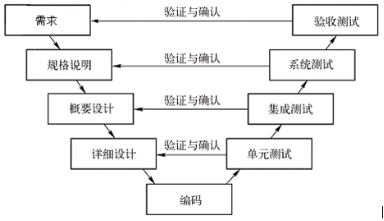
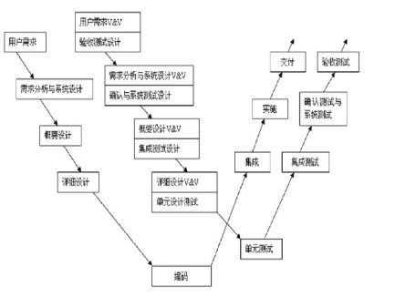

# 软件测试工程师

# 1、面试导读

1、简历上做一个引导：

在词汇上做好区分，比如熟悉Java，了解python，精通c语言

这样表达，对自己的掌握程度能有个区分，也好让面试官有个着重去问，python本来写的也只是了解，自然就不会多问你深入的一些东西了。

2、在面试过程中做一个引导：

面试过程中尽量引导到自己熟知的一个领域，比如问到你说一下DNS寻址，然后你简单回答（甚至这步也可以省略）之后，可以说一句，自己对这块可能不是特别熟悉，对计算机网络中的运输层比较熟悉，如果有具体的，甚至可以再加一句，比如TCP和UDP

这样的话你可以把整个面试过程往你熟知的地方引导，也能更倾向于体现出你的优势而不是劣势，但是此方法仅限于掌握合适的度，比如有的知识点是必会的，而你想往别处引就有点说不过去了，比如让你说几个机器学习算法，你一个也说不上来，那可能就真的没辙了。

3、在自我介绍中做一个引导：

一般面试的开头都会有一个自我介绍，在这个位置你也可以尽情的为自己的优势方面去引导。

4、面试过程中展示出自信：

面试过程中的态度也要掌握好，不要自卑，也不要傲娇，自信的回答出每个问题，尤其遇到不会的问题，要么做一些引导，实在不能引导也可以先打打擦边球，和面试官交流一下问题，看起来像是没听懂题意，这个过程也可以再自己思考一下，如果觉得这个过程可以免了的话也直接表明一下这个地方不太熟悉或者还没有掌握好，千万不要强行回答。

**面试前的准备：**

最重要的肯定是系统的学习了，有一个知识的框架，基础知识的牢靠程度等。

其中算法尤其重要，越来越多公司还会让你现场或者视频面试中手写代码；

另一大重要的和加分项就是项目，在面试前，一定要练习回答自己项目的三个问题：

- 这是一个怎样的项目
- 用到了什么技术，为什么用这项技术（以及每项技术很细的点以及扩展）
- 过程中遇到了什么问题，怎么解决的？
  

# 2、软件测试基础知识

##  请你分别介绍一下单元测试、集成测试、系统测试、验收测试、回归测试

### 参考回答：

1、单元测试（Unit Testing）：单元测试是对软件中最小的可测试单元进行测试的过程，通常是针对函数、方法或类等独立单元的测试。它的目的是验证单元的行为是否符合预期，通过对每个单元进行独立测试，发现和修复代码中的错误，以提高代码的质量和稳定性。单元测试通常由开发人员编写，并在开发过程中进行。

2、集成测试（Integration Testing）：集成测试是将多个独立的单元或组件组合在一起，并测试它们之间的交互是否正常。在集成测试中，各个单元或组件的功能已经经过单元测试验证，现在的目标是测试它们在集成后的行为。集成测试有助于发现组件之间的接口问题、数据传递问题、协作问题等，以确保系统的各个组件能够协同工作。

3、系统测试（System Testing）：系统测试是对整个软件系统进行的测试，以验证其是否满足特定的需求和规格。系统测试在完整的系统环境中进行，包括硬件、操作系统、数据库、网络等。它主要关注系统的功能、性能、安全性、可靠性等方面。系统测试可以通过测试用例和测试场景来模拟真实使用情况，以验证系统的功能和性能是否符合预期。

4、回归测试：在对软件进行更改、修复或升级后执行的测试，以确保修改不会对现有功能产生负面影响。回归测试的目标是验证修改后的代码与旧代码相容，并且之前的功能仍然正常工作。回归测试通常包括重新运行先前的测试用例、添加新的测试用例以及比较测试结果，以捕获由于软件更改而引入的新问题或错误，并确保软件的稳定性和可靠性。回归测试可以手动进行，也可以使用自动化测试工具来提高效率。

5、验收测试：由最终用户、客户或独立的测试团队执行的测试，以确认软件是否满足预期的需求和规格。验收测试是在软件开发的最后阶段进行的，旨在验证软件是否满足用户的业务需求，并能够按照用户的预期进行操作。验收测试可以包括功能测试、用户界面测试、性能测试等，以确保软件能够被接受并准备好交付使用。验收测试包括Alpha测试和Beta测试。

Alpha测试：是由用户在开发者的场所来进行的，在一个受控的环境中进行。

Beta测试：由软件的最终用户在一个或多个用户场所来进行的，开发者通常不在现场，用户记录测试中遇到的问题并报告给开发者，开发者对系统进行最后的修改，并开始准备发布最终的软件。

## 请你回答一下单元测试、集成测试、系统测试、验收测试、回归测试这几步中最重要的是哪一步

### 参考回答：

这些测试步骤分别在软件开发的不同阶段对软件进行测试，我认为对软件完整功能进行测试的系统测试很重要，因为此时单元测试和集成测试已完成，能够对软件所有功能进行功能测试，能够覆盖系统所有联合的部件，是针对整个产品系统进行的测试，能够验证系统是否满足了需求规格的定义，因此我认为系统测试很重要。

## 请回答集成测试和系统测试的区别，以及它们的应用场景主要是什么？

### 参考回答：

区别：

1、计划和用例编制的先后顺序：从V模型来讲，在需求阶段就要制定系统测试计划和用例，HLD的时候做集成测试计划和用例，有些公司的具体实践不一样，但是顺序肯定是先做系统测试计划用例，再做集成。

2、用例的粒度：系统测试用例相对很接近用户接受测试用例，集成测试用例比系统测试用例更详细，而且对于接口部分要重点写，毕竟要集成各个模块或者子系统。

3、执行测试的顺序：先执行集成测试，待集成测试出的问题修复之后，再做系统测试。

应用场景：

集成测试：完成单元测试后，各模块联调测试；集中在各模块的接口是否一致、各模块间的数据流和控制流是否按照设计实现其功能、以及结果的正确性验证等等；可以是整个产品的集成测试，也可以是大模块的集成测试；集成测试主要是针对程序内部结构进行测试，特别是对程序之间的接口进行测试。集成测试对测试人员的编写脚本能力要求比较高。测试方法一般选用黑盒测试和白盒测试相结合。

系统测试：针对整个产品的全面测试，既包含各模块的验证性测试（验证前两个阶段测试的正确性）和功能性（产品提交个用户的功能）测试，又包括对整个产品的健壮性、安全性、可维护性及各种性能参数的测试。系统测试测试软件《需求规格说明书》中提到的功能是否有遗漏，是否正确的实现。做系统测试要严格按照《需求规格说明书》，以它为标准。测试方法一般都使用黑盒测试法。

## 请问测试开发需要哪些知识？需要具备什么能力？

### 参考回答：

需要的知识：

软件测试基础理论知识，如黑盒测试、白盒测试等；

考编程语言基础，如C/C++、java、python等；

自动化测试工具，如Selenium、Appium、Robotium等；

计算机基础知识，如数据库、Linux、计算机网络等；

测试框架，如JUnit等。

需要具备的能力：

业务分析能力，分析整体业务流程、分析被测业务数据、分析被测系统架构、分析被测业务模块、分析测试所需资源、分析测试完成目标；

缺陷洞察能力，一般缺陷的发现能力、隐性问题的发现能力、发现连带问题的能力、发现问题隐患的能力、尽早发现问题的能力、发现问题根源的能力；

团队协作能力，合理进行人员分工、协助组员解决问题、配合完成测试任务、配合开发重现缺陷、督促项目整体进度、出现问题勇于承担；

专业技术能力，掌握测试基础知识、掌握计算机知识、熟练运用测试工具；

逻辑思考能力，判断逻辑的正确性、对可行性逻辑分析、站在客观角度思考；

问题解决能力，技术上的问题、工作中的问题、沟通问题；

沟通表达能力，和技术人员、产品人员、上下级的沟通；

宏观把控能力，有效控制测试时间、有效控制测试成本、有效制定测试计划、有效进行风险评估、有效控制测试方向。

## 请说一说黑盒与白盒的测试方法

### 参考回答：

黑盒测试：

黑盒测试也称功能测试或数据驱动测试，它是在已知产品所应具有的功能，通过测试来检测每个功能是否都能正常使用，在测试时，把程序看作一个不能打开的黑盆子，在完全不考虑程序内部结构和内部特性的情况下，测试者在程序接口进行测试，它只检查程序功能是否按照需求规格说明书的规定正常使用，程序是否能适当地接收输入数锯而产生正确的输出信息，并且保持外部信息（如数据库或文件）的完整性。

“黑盒”法着眼于程序外部结构、不考虑内部逻辑结构、针对软件界面和软件功能进行测试。“黑盒”法是穷举输入测试，只有把所有可能的输入都作为测试情况使用，才能以这种方法查出程序中所有的错误。实际上测试情况有无穷多个，因此不仅要测试所有合法的输入，而且还要对那些不合法但是可能的输入进行测试。

常用的黑盒测试方法有：等价类划分法；边界值分析法；因果图法；场景法；正交实验设计法；判定表驱动分析法；错误推测法；功能图分析法。

白盒测试：

白盒测试也称为结构测试或逻辑驱动测试，是针对被测单元内部是如何进行工作的测试。它根据程序的控制结构设计测试用例，主要用于软件或程序验证。白盒测试法检查程序内部逻辑结构，对所有的逻辑路径进行测试，是一种穷举路径的测试方法，但即使每条路径都测试过了，但仍然有可能存在错误。因为：穷举路径测试无法检查出程序本身是否违反了设计规范，即程序是否是一个错误的程序；穷举路径测试不可能检查出程序因为遗漏路径而出错；穷举路径测试发现不了一些与数据相关的错误。

白盒测试需要遵循的原则有：1. 保证一个模块中的所有独立路径至少被测试一次；2. 所有逻辑值均需要测试真（true）和假（false）；两种情况；3. 检查程序的内部数据结构，保证其结构的有效性；4. 在上下边界及可操作范围内运行所有循环。

常用白盒测试方法：

静态测试：不用运行程序的测试，包括代码检查、静态结构分析、代码质量度量、文档测试等等，它可以由人工进行，充分发挥人的逻辑思维优势，也可以借助软件工具（Fxcop）自动进行。

动态测试：需要执行代码，通过运行程序找到问题，包括功能确认与接口测试、覆盖率分析、性能分析、内存分析等。

白盒测试中的逻辑覆盖包括语句覆盖、判定覆盖、条件覆盖、判定/条件覆盖、条件组合覆盖和路径覆盖。六种覆盖标准发现错误的能力呈由弱到强的变化：

1.语句覆盖每条语句至少执行一次。

2.判定覆盖每个判定的每个分支至少执行一次。

3.条件覆盖每个判定的每个条件应取到各种可能的值。

4.判定/条件覆盖同时满足判定覆盖条件覆盖。

5.条件组合覆盖每个判定中各条件的每一种组合至少出现一次。

6.路径覆盖使程序中每一条可能的路径至少执行一次。

## 请说一下手动测试与自动化测试的优缺点

### 参考回答：

手工测试缺点：

1、重复的手工回归测试，代价昂贵、容易出错。

2、依赖于软件测试人员的能力。

手工测试优点：

1、测试人员具有经验和对错误的猜测能力。

2、测试人员具有审美能力和心理体验。

3、测试人员具有是非判断和逻辑推理能力。

自动化测试的优点：

1、对程序的回归测试更方便。这可能是自动化测试最主要的任务，特别是在程序修改比较频繁时，效果是非常明显的。由于回归测试的动作和用例是完全设计好的，测试期望的结果也是完全可以预料的，将回归测试自动运行，可以极大提高测试效率，缩短回归测试时间。

2、可以运行更多更繁琐的测试。自动化的一个明显的好处是可以在较少的时间内运行更多的测试。

3、可以执行一些手工测试困难或不可能进行的测试。比如，对于大量用户的测试，不可能同时让足够多的测试人员同时进行测试，但是却可以通过自动化测试模拟同时有许多用户，从而达到测试的目的。

4、更好地利用资源。将繁琐的任务自动化，可以提高准确性和测试人员的积极性，将测试技术人员解脱出来投入更多精力设计更好的测试用例。有些测试不适合于自动测试，仅适合于手工测试，将可自动测试的测试自动化后，可以让测试人员专注于手工测试部分，提高手工测试的效率。

5、测试具有一致性和可重复性。由于测试是自动执行的，每次测试的结果和执行的内容的一致性是可以得到保障的，从而达到测试的可重复的效果。

6、测试的复用性。由于自动测试通常采用脚本技术，这样就有可能只需要做少量的甚至不做修改，实现在不同的测试过程中使用相同的用例。

7、增加软件信任度。由于测试是自动执行的，所以不存在执行过程中的疏忽和错误，完全取决于测试的设计质量。一旦软件通过了强有力的自动测试后，软件的信任度自然会增加。

自动化测试的缺点：

1、不能取代手工测试

2、手工测试比自动测试发现的缺陷更多

3、对测试质量的依赖性极大

4、测试自动化不能提高有效性

5、测试自动化可能会制约软件开发。由于自动测试比手动测试更脆弱，所以维护会受到限制，从而制约软件的开发。

6、工具本身并无想像力

## 请问你怎么看待软件测试的潜力和挑战

### 参考回答：

软件测试是正在快速发展，充满挑战的领域。尽管现在许多自动化测试软件的出现使得传统手工测试的方式被代替，但自动化测试工具的开发、安全测试、测试建模、精准测试、性能测试、可靠性测试等专项测试中仍然需要大量具有专业技能与专业素养的测试人员，并且随着云计算、物联网、大数据的发展，传统的测试技术可能不再适用，测试人员也因此面临着挑战，需要深入了解新场景并针对不同场景尝试新的测试方法，同时敏捷测试、Devops的出现也显示了软件测试的潜力。

## ● 你觉得软件测试的核心竞争力是什么

### 参考回答：

测试人员的核心竞争力在于提早发现问题，并能够发现别人无法发现的问题。

1、早发现问题：问题发现的越早，解决的成本越低。如果一个需求在还未实现的时候就能发现需求的漏洞，那么这种问题的价值是最高的。

2、发现别人无法发现的问题：所有人都能发现的问题，你发现了，那就证明你是可以被替代的。别人发现不了，而你可以发现，那么你就是无法被替代。

## 你觉得测试和开发需要怎么结合才能使软件的质量得到更好的保障

### 参考回答：

测试和开发应该按照W模型的方式进行结合，测试和开发同步进行，能够尽早发现软件缺陷，降低软件开发的成本。

  
 

在V模型中，测试过程被加在开发过程的后半部分，单元测试所检测代码的开发是否符合详细设计的要求。集成测试所检测此前测试过的各组成部分是否能完好地结合到一起。系统测试所检测已集成在一起的产品是否符合系统规格说明书的要求。而验收测试则检测产品是否符合最终用户的需求。V模型的缺陷在于仅仅把测试过程作为在需求分析、系统设计及编码之后的一个阶段，忽视了测试对需求分析、系统设计的验证，因此需求阶段的缺陷很可能一直到后期的验收测试才被发现，此时进行弥补将耗费大量人力物力资源。

相对于V模型，W模型增加了软件各开发阶段中应同步进行的验证和确认活动。W模型由两个V字型模型组成，分别代表测试与开发过程，图中明确表示出了测试与开发的并行关系。

W模型强调：测试伴随着整个软件开发周期，而且测试的对象不仅仅是程序，需求、设计等同样要测试，也就是说，测试与开发是同步进行的。W模型有利于尽早地全面的发现问题。例如，需求分析完成后，测试人员就应该参与到对需求的验证和确认活动中，以尽早地找出缺陷所在。同时，对需求的测试也有利于及时了解项目难度和测试风险，及早制定应对措施，这将显著减少总体测试时间，加快项目进度。

  
 

W模型中测试的活动与软件开发同步进行，测试的对象不仅仅是程序，还包括需求和设计，因此能够尽早发现软件缺陷，降低软件开发的成本。

## ● 你觉得单元测试可行吗

### 参考回答：

可行，单元测试可以有效地测试某个程序模块的行为，是未来重构代码的信心保证。事前可以保证质量，事后可以快速复现问题，并在修改代码后做回归自测。可行性考虑的是要用一些可行的方法做到关键的代码可测试，如通过边界条件、等价类划分、错误、因果，设计测试用例要覆盖常用的输入组合、边界条件和异常。

## ● 你觉得自动化测试有什么意义，都需要做些什么

### 参考回答：

自动化测试的意义在于

1、可以对程序的新版本自动执行回归测试

2、可以执行手工测试困难或者不可能实现的测试，如压力测试，并发测试，

3、能够更好的利用资源，节省时间和人力

执行自动化测试之前首先判断这个项目是不是和推广自动化测试，然后对项目做需求分析，指定测试计划，搭建自动化测试框架，设计测试用例，执行测试，评估

## ● 请你回答一下测试的相关流程是什么？

### 参考回答：

测试最规范的过程如下

需求测试->概要设计测试->详细设计测试->单元测试->集成测试->系统测试->验收测试

来自W模型

## ● 请你说一下如何写测试用例

### 参考回答：

1、测试人员尽早介入，彻底理解清楚需求，这个是写好测试用例的基础

2、如果以前有类似的需求，可以参考类似需求的测试用例，然后还需要看类似需求的bug情况

3、清楚输入、输出的各种可能性，以及各种输入的之间的关联关系，理解清楚需求的执行逻辑，通过等价类、边界值、判定表等方法找出大部分用例

4、找到需求相关的一些特性，补充测试用例

5、根据自己的经验分析遗漏的测试场景

6、多总结类似功能点的测试点，才能够写出质量越来越高的测试用例

7、书写格式一定要清晰

## ● 请问你觉得测试项目具体工作是什么？

### 参考回答：

搭建测试环境

撰写测试用例

执行测试用例

写测试计划，测试报告

测试，并提交BUG表单

跟踪bug修改情况

执行自动化测试，编写脚本，执行，分析，报告

进行性能测试，压力测试等其他测试，执行，分析，调优，报告

## ● 请问如果想进行bug的测评，怎么去评测bug？

### 参考回答：

Bug的priority（）和severity（）是两个重要属性，通常人员在提交bug的时候，只定义severity，而将priority交给leader定义，通常bug管理中，severity分为四个等级blocker、critical、major、minor/trivial，而priority分为五个等级immediate、urgent、high、normal、low。

Severity：

1、blocker：即系统无法执行，崩溃，或严重资源不足，应用模块无法启动或异常退出，无法测试，造成系统不稳定。常见的有严重花屏、内存泄漏、用户数据丢失或破坏、系统崩溃/死机/冻结、模块无法启动或异常退出、严重的数值计算错误、功能设计与需求严重不符、其它导致无法测试的错误， 如服务器500错误。

2、critical：即映像系统功能或操作，主要功能存在严重缺陷，但不会映像到系统稳定性。常见的有：功能未实现，功能错误、系统刷新错误、数据通讯错误、轻微的数值计算错误、影响功能及界面的错误字或拼写错误。

3、major：即界面、性能缺陷、兼容性，常见的有：操作界面错误，边界条件错误，提示信息错误，长时间操作无进度提示，系统未优化，兼容性问题。

4、minor/trivial：即易用性及建议性问题。

Priority

1、immediate：即马上解决，

2、urgent：急需解决

3、high：高度重视，有时间要马上解决

4、low：在系统发布前解决，或确认可以不用解决。

## 请你说一说测试用例的边界

### 参考回答：

边界值分析法就是对输入或输出的边界值进行测试的一种黑盒测试方法。通常边界值分析法是作为对等价类划分法的补充，这种情况下，其测试用例来自等价类的边界。

常见的边界值

1)对16-bit 的整数而言 32767 和 -32768 是边界

2)屏幕上光标在最左上、最右下位置

3)报表的第一行和最后一行

4)数组元素的第一个和最后一个

5)循环的第 0 次、第 1 次和倒数第 2 次、最后一次

## ● 请你说一下软件质量的六个特征

### 参考回答：

按照软件质量国家标准GB-T8566--2001G，软件质量可以用下列特征来评价：

a.功能特征：与一组功能及其指定性质有关的一组属性，这里的功能是满足明确或隐含的需求的那些功能。

b.可靠特征：在规定的一段时间和条件下，与软件维持其性能水平的能力有关的一组属性。

c.易用特征：由一组规定或潜在的用户为使用软件所需作的努力和所作的评价有关的一组属性。

d.效率特征：与在规定条件下软件的性能水平与所使用资源量之间关系有关的一组属性。

e.可维护特征：与进行指定的修改所需的努力有关的一组属性。

f.可移植特征：与软件从一个环境转移到另一个环境的能力有关的一组属性。

## ● 请你说一下设计测试用例的方法

### 参考回答：

黑盒测试：

1.等价类划分

等价类划分是将系统的输入域划分为若干部分，然后从每个部分选取少量代表性数据进行测试。等价类可以划分为有效等价类和无效等价类，设计测试用例的时候要考虑这两种等价类。

2.边界值分析法

边界值分析法是对等价类划分的一种补充，因为大多数错误都在输入输出的边界上。边界值分析就是假定大多数错误出现在输入条件的边界上，如果边界附件取值不会导致程序出错，那么其他取值出错的可能性也就很小。

边界值分析法是通过优先选择不同等价类间的边界值覆盖有效等价类和无效等价类来更有效的进行测试，因此该方法要和等价类划分法结合使用。

3.正交试验法

正交是从大量的试验点中挑选出适量的、有代表性的点。正交试验设计是研究多因素多水平的一种设计方法，他是一种基于正交表的高效率、快速、经济的试验设计方法。

4.状态迁移法

状态迁移法是对一个状态在给定的条件内能够产生需要的状态变化，有没有出现不可达的状态和非法的状态，状态迁移法是设计足够的用例达到对系统状态的覆盖、状态、条件组合、状态迁移路径的覆盖。

5.流程分析法

流程分析法主要针对测试场景类型属于流程测试场景的测试项下的测试子项进行设计，这是从白盒测试中路径覆盖分析法借鉴过来的一种很重要的方法。

6.输入域测试法

输入域测试法是针对输入会有各种各样的输入值的一个测试，他主要考虑 极端测试、中间范围测试，特殊值测试 。

7.输出域分析法

输出域分析法是对输出域进行等价类和边界值分析，确定是要覆盖的输出域样点，反推得到应该输入的输入值，从而构造出测试用例，他的目的是为了达到输出域的等价类和边界值覆盖。

8.判定表分析法

判定表是分析和表达多种输入条件下系统执行不同动作的工具，他可以把复杂的逻辑关系和多种条件组合的情况表达的即具体又明确；

9.因果图法

因果图是用于描述系统输入输出之间的因果关系、约束关系。因果图的绘制过程是对被测系统的外部特征的建模过程，根据输入输出间的因果图可以得到判定表，从而规划出测试用例。

10.错误猜测法

错误猜测法主要是针对系统对于错误操作时对于操作的处理法的猜测法，从而设计测试用例

11.异常分析法

异常分析法是针对系统有可能存在的异常操作，软硬件缺陷引起的故障进行分析，分析发生错误时系统对于错误的处理能力和恢复能力依此设计测试用例。

白盒测试：

白盒测试也称为结构测试或逻辑驱动测试，是针对被测单元内部是如何进行工作的测试。它根据程序的控制结构设计测试用例，主要用于软件或程序验证。白盒测试法检查程序内部逻辑结构，对所有的逻辑路径进行测试，是一种穷举路径的测试方法，但即使每条路径都测试过了，但仍然有可能存在错误。因为：穷举路径测试无法检查出程序本身是否违反了设计规范，即程序是否是一个错误的程序；穷举路径测试不可能检查出程序因为遗漏路径而出错；穷举路径测试发现不了一些与数据相关的错误。

白盒测试需要遵循的原则有：1. 保证一个模块中的所有独立路径至少被测试一次；2. 所有逻辑值均需要测试真（true）和假（false）；两种情况；3. 检查程序的内部数据结构，保证其结构的有效性；4. 在上下边界及可操作范围内运行所有循环。

常用白盒测试方法：

静态测试：不用运行程序的测试，包括代码检查、静态结构分析、代码质量度量、文档测试等等，它可以由人工进行，充分发挥人的逻辑思维优势，也可以借助软件工具（Fxcop）自动进行。

动态测试：需要执行代码，通过运行程序找到问题，包括功能确认与接口测试、覆盖率分析、性能分析、内存分析等。

白盒测试中的逻辑覆盖包括语句覆盖、判定覆盖、条件覆盖、判定/条件覆盖、条件组合覆盖和路径覆盖。六种覆盖标准发现错误的能力呈由弱到强的变化：

1.语句覆盖每条语句至少执行一次。

2.判定覆盖每个判定的每个分支至少执行一次。

3.条件覆盖每个判定的每个条件应取到各种可能的值。

4.判定/条件覆盖同时满足判定覆盖条件覆盖。

5.条件组合覆盖每个判定中各条件的每一种组合至少出现一次。

6.路径覆盖使程序中每一条可能的路径至少执行一次。

## ● 请你说一说测试工程师的必备技能

### 参考回答：

需要的知识：

•  软件测试基础理论知识，如黑盒测试、白盒测试等；

•  编程语言基础，如C/C++、java、python等；

•  自动化测试工具，如Selenium、Appium、Robotium等；

•  计算机基础知识，如数据库、Linux、计算机网络等；

•  测试框架，如JUnit等。

需要具备的能力：

•  业务分析能力，分析整体业务流程、分析被测业务数据、分析被测系统架构、分析被测业务模块、分析测试所需资源、分析测试完成目标；

•  缺陷洞察能力，一般缺陷的发现能力、隐性问题的发现能力、发现连带问题的能力、发现问题隐患的能力、尽早发现问题的能力、发现问题根源的能力；

•  团队协作能力，合理进行人员分工、协助组员解决问题、配合完成测试任务、配合开发重现缺陷、督促项目整体进度、出现问题勇于承担；

•  专业技术能力，掌握测试基础知识、掌握计算机知识、熟练运用测试工具；

•  逻辑思考能力，判断逻辑的正确性、对可行性逻辑分析、站在客观角度思考；

•  问题解决能力，技术上的问题、工作中的问题、沟通问题；

•  沟通表达能力，和技术人员、产品人员、上下级的沟通；

•  宏观把控能力，有效控制测试时间、有效控制测试成本、有效制定测试计划、有效进行风险评估、有效控制测试方向。

## ● 请你说一下app性能测试的指标

### 参考回答：

1、内存：内存消耗测试节点的设计目标是为了让应用不占用过多的系统资源，且及时释放内存，保障整个系统的稳定性。当然关于内存测试，在这里我们需要引入几个概念：空闲状态、中等规格、满规格。

空闲状态指打开应用后，点击home键让应用后台运行，此时应用处于的状态叫做空闲；中等规格和满规格指的是对应用的操作时间的间隔长短不一，中等规格时间较长，满规格时间较短。

内存测试中存在很多测试子项，清单如下：

●空闲状态下的应用内存消耗；

●中等规格状态下的应用内存消耗；

●满规格状态下的应用内存消耗；

●应用内存峰值；

●应用内存泄露；

●应用是否常驻内存；

●压力测试后的内存使用。

2、CPU：

使用Android提供的view plaincopy在CODE上查看代码片派生到我的代码片

adbshell dumpsys CPUinfo |grep packagename >/address/CPU.txt来获取；

使用top命令view plaincopy在CODE上查看代码片派生到我的代码片

adbshell top |grep packagename>/address/CPU.txt来获取。

3、流量：

网络流量测试是针对大部分应用而言的，可能还有部分应用会关注网速、弱网之类的测试。

流量测试包括以下测试项：

应用首次启动流量提示；

应用后台连续运行2小时的流量值；

应用高负荷运行的流量峰值。

4、电量：

●测试手机安装目标APK前后待机功耗无明显差异；

●常见使用场景中能够正常进入待机，待机电流在正常范围内；

●长时间连续使用应用无异常耗电现象。

5、启动速度：

第一类：首次启动--应用首次启动所花费的时间；

第二类：非首次启动--应用非首次启动所花费的时间；

第三类：应用界面切换--应用界面内切换所花费的时间。

6、滑动速度、界面切换速度

7、与服务器交互的网络速度

## ● 请你说一说app测试的工具

### 参考回答：

功能测试自动化

a) 轻量接口自动化测试

jmeter，

b) APP UI层面的自动化

android：UI Automator Viewer，Android Junit，Instrumentation，UIAutomator，

iOS:基于Instrument的iOS UI自动化，

性能测试

a) Web前端性能测试

网络抓包工具：Wireshark

网页文件大小

webpagetest

pagespeed insight

chrome adb

b) APP端性能测试

Android内存占用分析：MAT

iOS内存问题分析：ARC模式

Android WebView性能分析：

iOS WebView性能分析

c) 后台服务性能测试

负载，压力，耐久性

可拓展性，基准

工具：apacheAB，Jmeter，LoadRunner，

专项测试

a) 兼容性测试

手工测试：操作系统，分辨率，rom，网络类型

云平台：testin，脚本编写，Android。

b) 流量测试

Android自带的流量管理，

iOS自带的Network

tcpdump抓包

WiFi代理抓包：Fiddler

流量节省方法：压缩数据，json优于xml；WebP优于传统的JPG，PNG；控制访问的频次；只获取必要的数据；缓存；

c) 电量测试

基于测试设备的方法，购买电量表进行测试。

GSam Battery Monitoe Pro

iOS基于Instrument Energy工具

d) 弱网络测试

手机自带的网络状况模拟工具

基于代理的弱网络的模拟:

工具：windows：Network Delay Simulator

Mac：Network Link Conditioner

## ● 请你说一说bug的周期，以及描述一下不同类别的bug

### 参考回答：

1、New:（新的）

当某个“bug”被第一次发现的时候，测试人员需要与项目负责人沟通以确认发现的的确是一个bug，如果被确认是一个bug，就将其记录下来，并将bug的状态设为New

2、Assigned（已指派的）

当一个bug被指认为New之后，将其反馈给开发人员，开发人员将确认这是否是一个bug，如果是，开发组的负责人就将这个bug指定给某位开发人员处理，并将bug的状态设定为“Assigned”

3、Open（打开的）

一旦开发人员开始处理bug的时候，他（她）就将这个bug的状态设置为“Open”，这表示开发人员正在处理这个“bug”

4、Fixed（已修复的）

当开发人员进行处理（并认为已经解决）之后，他就可以将这个bug的状态设置为“Fixed”并将其提交给开发组的负责人，然后开发组的负责人将这个bug返还给测试组

5、Pending Reset（待在测试的）

当bug被返还到测试组后，我们将bug的状态设置为Pending Reset”

6、Reset(再测试)

测试组的负责人将bug指定给某位测试人员进行再测试，并将bug的状态设置为“Reset”

7、Closed（已关闭的）

如果测试人员经过再次测试之后确认bug 已经被解决之后，就将bug的状态设置为“Closed”

8、Reopen（再次打开的）

如果经过再次测试发现bug（指bug本身而不是包括因修复而引发的新bug）仍然存在的话，测试人员将bug再次传递给开发组，并将bug的状态设置为“Reopen”

9、Pending Reject（拒绝中）

如果测试人员传递到开发组的bug被开发人员认为是正常行为而不是bug时，这种情况下开发人员可以拒绝，并将bug的状态设置为“Pending Reject”

10、Rejected(被拒绝的)

测试组的负责人接到上述bug的时候，如果他（她）发现这是产品说明书中定义的正常行为或者经过与开发人员的讨论之后认为这并不能算作bug的时候，开发组负责人就将这个bug的状态设置为“Rejected”

11、Postponed（延期）

有些时候，对于一些特殊的bug的测试需要搁置一段时间，事实上有很多原因可能导致这种情况的发生，比如无效的测试数据，一些特殊的无效的功能等等，在这种情况下，bug的状态就被设置为“Postponed“

不同类别的bug：

Bug类型

•  代码错误

•  界面优化

•  设计缺陷

•  配置相关

•  安装部署

•  安全相关

•  性能问题

•  标准规范

•  测试脚本

•  其他

## ● 请你说一说PC网络故障，以及如何排除障碍

### 参考回答：

(1)首先是排除接触故障，即确保你的网线是可以正常使用的。然后禁用网卡后再启用，排除偶然故障。打开网络和共享中心窗口，单击窗口左上侧“更改适配器设置”右击其中的“本地连接“或”无线网络连接”，单击快捷菜单中的“禁用”命令，即可禁用所选网络。接下来重启网络，只需右击后单击启用即可。

(2)使用ipconfig查看计算机的上网参数

1、单击“开始|所有程序|附件|命令提示符“，打开命令提示符窗口

2、输入ipconfig，按Enter确认，可以看到机器的配置信息，输入ipconfig/all,可以看到IP地址和网卡物理地址等相关网络详细信息。

(3)使用ping命令测试网络的连通性，定位故障范围

在命令提示符窗口中输入”ping 127.0.0.1“，数据显示本机分别发送和接受了4个数据包，丢包率为零，可以判断本机网络协议工作正常，如显示”请求超时“，则表明本机网卡的安装或TCP/IP协议有问题，接下来就应该检查网卡和TCP/IP协议，卸载后重装即可。

(4)ping本机IP

在确认127.0.0.1地址能被ping通的情况下，继续使用ping命令测试本机的IP地址能否被ping通，如不能，说明本机的网卡驱动程序不正确，或者网卡与网线之间连接有故障，也有可能是本地的路由表面收到了破坏，此时应检查本机网卡的状态是否为已连接，网络参数是否设置正确，如果正确可是不能ping通，就应该重新安装网卡驱动程序。丢失率为零，可以判断网卡安装配置没有问题，工作正常。

(5)ping网关

网关地址能被ping通的话，表明本机网络连接以及正常，如果命令不成功，可能是网关设备自身存在问题，也可能是本机上网参数设置有误，检查网络参数。

## ● 请你说一说测试的常用方法

### 参考回答：

黑盒测试：

黑盒测试也称功能测试或数据驱动测试，它是在已知产品所应具有的功能，通过测试来检测每个功能是否都能正常使用，在测试时，把程序看作一个不能打开的黑盆子，在完全不考虑程序内部结构和内部特性的情况下，测试者在程序接口进行测试，它只检查程序功能是否按照需求规格说明书的规定正常使用，程序是否能适当地接收输入数锯而产生正确的输出信息，并且保持外部信息（如数据库或文件）的完整性。

“黑盒”法着眼于程序外部结构、不考虑内部逻辑结构、针对软件界面和软件功能进行测试。“黑盒”法是穷举输入测试，只有把所有可能的输入都作为测试情况使用，才能以这种方法查出程序中所有的错误。实际上测试情况有无穷多个，因此不仅要测试所有合法的输入，而且还要对那些不合法但是可能的输入进行测试。

常用的黑盒测试方法有：等价类划分法；边界值分析法；因果图法；场景法；正交实验设计法；判定表驱动分析法；错误推测法；功能图分析法。

白盒测试：

白盒测试也称为结构测试或逻辑驱动测试，是针对被测单元内部是如何进行工作的测试。它根据程序的控制结构设计测试用例，主要用于软件或程序验证。白盒测试法检查程序内部逻辑结构，对所有的逻辑路径进行测试，是一种穷举路径的测试方法，但即使每条路径都测试过了，但仍然有可能存在错误。因为：穷举路径测试无法检查出程序本身是否违反了设计规范，即程序是否是一个错误的程序；穷举路径测试不可能检查出程序因为遗漏路径而出错；穷举路径测试发现不了一些与数据相关的错误。

白盒测试需要遵循的原则有：1. 保证一个模块中的所有独立路径至少被测试一次；2. 所有逻辑值均需要测试真（true）和假（false）；两种情况；3. 检查程序的内部数据结构，保证其结构的有效性；4. 在上下边界及可操作范围内运行所有循环。

常用白盒测试方法：

静态测试：不用运行程序的测试，包括代码检查、静态结构分析、代码质量度量、文档测试等等，它可以由人工进行，充分发挥人的逻辑思维优势，也可以借助软件工具（Fxcop）自动进行。

动态测试：需要执行代码，通过运行程序找到问题，包括功能确认与接口测试、覆盖率分析、性能分析、内存分析等。

白盒测试中的逻辑覆盖包括语句覆盖、判定覆盖、条件覆盖、判定/条件覆盖、条件组合覆盖和路径覆盖。六种覆盖标准发现错误的能力呈由弱到强的变化：

1.语句覆盖每条语句至少执行一次。

2.判定覆盖每个判定的每个分支至少执行一次。

3.条件覆盖每个判定的每个条件应取到各种可能的值。

4.判定/条件覆盖同时满足判定覆盖条件覆盖。

5.条件组合覆盖每个判定中各条件的每一种组合至少出现一次。

6.路径覆盖使程序中每一条可能的路径至少执行一次。

## ● 请你说一下黑盒白盒

### 参考回答：

黑盒测试：

黑盒测试也称功能测试或数据驱动测试，它是在已知产品所应具有的功能，通过测试来检测每个功能是否都能正常使用，在测试时，把程序看作一个不能打开的黑盆子，在完全不考虑程序内部结构和内部特性的情况下，测试者在程序接口进行测试，它只检查程序功能是否按照需求规格说明书的规定正常使用，程序是否能适当地接收输入数锯而产生正确的输出信息，并且保持外部信息（如数据库或文件）的完整性。

“黑盒”法着眼于程序外部结构、不考虑内部逻辑结构、针对软件界面和软件功能进行测试。“黑盒”法是穷举输入测试，只有把所有可能的输入都作为测试情况使用，才能以这种方法查出程序中所有的错误。实际上测试情况有无穷多个，因此不仅要测试所有合法的输入，而且还要对那些不合法但是可能的输入进行测试。

常用的黑盒测试方法有：等价类划分法；边界值分析法；因果图法；场景法；正交实验设计法；判定表驱动分析法；错误推测法；功能图分析法。

白盒测试：

白盒测试也称为结构测试或逻辑驱动测试，是针对被测单元内部是如何进行工作的测试。它根据程序的控制结构设计测试用例，主要用于软件或程序验证。白盒测试法检查程序内部逻辑结构，对所有的逻辑路径进行测试，是一种穷举路径的测试方法，但即使每条路径都测试过了，但仍然有可能存在错误。因为：穷举路径测试无法检查出程序本身是否违反了设计规范，即程序是否是一个错误的程序；穷举路径测试不可能检查出程序因为遗漏路径而出错；穷举路径测试发现不了一些与数据相关的错误。

白盒测试需要遵循的原则有：1. 保证一个模块中的所有独立路径至少被测试一次；2. 所有逻辑值均需要测试真（true）和假（false）；两种情况；3. 检查程序的内部数据结构，保证其结构的有效性；4. 在上下边界及可操作范围内运行所有循环。

常用白盒测试方法：

静态测试：不用运行程序的测试，包括代码检查、静态结构分析、代码质量度量、文档测试等等，它可以由人工进行，充分发挥人的逻辑思维优势，也可以借助软件工具（Fxcop）自动进行。

动态测试：需要执行代码，通过运行程序找到问题，包括功能确认与接口测试、覆盖率分析、性能分析、内存分析等。

白盒测试中的逻辑覆盖包括语句覆盖、判定覆盖、条件覆盖、判定/条件覆盖、条件组合覆盖和路径覆盖。六种覆盖标准发现错误的能力呈由弱到强的变化：

1.语句覆盖每条语句至少执行一次。

2.判定覆盖每个判定的每个分支至少执行一次。

3.条件覆盖每个判定的每个条件应取到各种可能的值。

4.判定/条件覆盖同时满足判定覆盖条件覆盖。

5.条件组合覆盖每个判定中各条件的每一种组合至少出现一次。

6.路径覆盖使程序中每一条可能的路径至少执行一次。

## ● 请你说一说你知道的自动化测试框架

### 参考回答：

1、模块化测试框架

模块化测试脚本框架（TEST MODulARITY FRAMEWORK）需要创建小而独立的可以描述的模块、片断以及待测应用程序的脚本。这些树状结构的小脚本组合起来，就能组成能用于特定的测试用例的脚本。在五种框架中，模块化框架是最容易掌握和使用的。在一个组件上方建立一个抽象层使其在余下的应用中隐藏起来，这是众所周知的编程技巧。这样应用同组件中的修改隔离开来，提供了程序设计的模块化特性。模块化测试脚本框架使用这一抽象或者封装的原理来提高自动测试组合的可维护性和可升级性。

2、测试库框架

测试库框架（Test Library Architecture）与模块化测试脚本框架很类似，并且具有同样的优点。不同的是测试库框架把待测应用程序分解为过程和函数而不是脚本。这个框架需要创建描述模块、片断以及待测应用程序的功能库文件。

3、关键字驱动或表驱动的测试框架

对于一个独立于应用的自动化框架，关键字驱动（KEYWORD DRIVEN）I9LJJ试和表驱动（TABLE DRIVEN）测试是可以互换的术语。这个框架需要开发数据表和关键字。这些数据表和关键字独立于执行它们的测试自动化工具，并可以用来“驱动＂待测应用程序和数据的测试脚本代码，关键宇驱动测试看上去与手工测试用例很类似。在一个关键字驱动测试中，把待测应用程序的功能和每个测试的执行步骤一起写到一个表中。这个测试框架可以通过很少的代码来产生大量的测试用例。同样的代码在用数据表来产生各个测试用例的同时被复用。

4、数据驱动测试框架

数据驱动（DATA DRIVEN），LJ试是一个框架。在这里测试的输入和输出数据是从数据文件中读取（数据池，ODBC源，CSV文件，EXCEL文件，ADO对象等）并且通过捕获工具生成或者手工生成的代码脚本被载入到变量中。在这个框架中，变量不仅被用来存放输入值还被用来存放输出的验证值。整个程序中，测试脚本来读取数值文件，记载测试状态和信息。这类似于表驱动测试，在表驱动测 试中，它的测试用例是包含在数据文件而不是在脚本中，对于数据而言，脚本仅仅是一个“驱动器”，或者是一个传送机构。然而，数据驱动测试不同于表驱动测试，尽管导航数据并不包含在表结构中。在数据驱动测试中，数据文件中只包含测试数据。这个框架意图减少需要执行所有测试用例所需要的总的测试脚本数。数据驱动需要很少的代码来产生大量的测试用例，这与表驱动极其类似。

5、混合测试自动化（Hybrid Test Automation）框架

最普遍的执行框架是上面介绍的所有技术的一个结合，取其长处，弥补其不足。这个混合测试框架是由大部分框架随着时间并经过若干项目演化而来的

## ● 请你说一说web测试和app测试的不同点

### 参考回答：

系统架构方面：

web项目，一般都是b/s架构，基于浏览器的

app项目，则是c/s的，必须要有客户端，用户需要安装客户端。

web测试只要更新了服务器端，客户端就会同步会更新。App项目则需要客户端和服务器都更新。

性能方面:

web页面主要会关注响应时间

而app则还需要关心流量、电量、CPU、GPU、Memory这些。

它们服务端的性能没区别，都是一台服务器。

兼容方面：

web是基于浏览器的，所以更倾向于浏览器和电脑硬件，电脑系统的方向的兼容

app测试则要看分辨率，屏幕尺寸，还要看设备系统。

web测试是基于浏览器的所以不必考虑安装卸载。

而app是客户端的，则必须测试安装、更新、卸载。除了常规的安装、更新、卸载还要考虑到异常场景。包括安装时的中断、弱网、安装后删除安装文件 。

此外APP还有一些专项测试：如网络、适配性。

## ● 请问你了解什么测试方法

### 参考回答：

等价类划分，边界值分析，错误推测，因果图法，逻辑覆盖法，程序插桩技术，基本路径法，符号测试，错误驱动测试

## ● 请问黑盒测试和白盒测试有哪些方法

### 参考回答：

黑盒测试方法有等价类划分，边界值分析，错误推测，因果图法

白盒测试方法有逻辑覆盖法，程序插桩技术，基本路径法，符号测试，错误驱动测试

## ● 请问你怎么看待测试，知道哪些测试的类型，有用过哪些测试方法？

### 参考回答：

测试是软件开发中不可或缺的一环，测试通过经济，高效的方法，捕捉软件中的错误，从而达到保重软件内在质量的目的。

测试分为功能测试和非功能测试，非功能测试又可以分为性能测试、压力测试、容量测试、健壮性测试、安全性测试、可靠性测试、恢复性测试、备份测试、协议测试、兼容性测试、可用性测试、配置测试、GUI测试。

测试方法用过等价划分法、边值分析法、错误推测法、因果图法。

## ● 请问你怎么测试网络协议

### 参考回答：

协议测试包括四种类型的测试

1、一致性测试：检测协议实现本身与协议规范的符合程度

2、互操作性测试：基于某一协议检测不同协议实现间互操作互通信的能力

3、性能测试：检测协议实现的性能指标，比如数据传输速度，连接时间，执行速度，吞吐量，并发度，

4、健壮性测试：检测协议是现在各种恶劣环境下运行的能力，比如注入干扰报文，通信故障，信道被切断

## ● 请你回答一下什么是α测试和β测试，以及什么时候用到他们

### 参考回答：

α测试：在受控的环境中进行，由用户在开发者的场所进行，并且在开发者对用户的指导下进行测试，开发者负责记录发现的错误和使用中遇到的问题

β测试：在开发者不能控制的环境中的真实应用，由软件的最终用户们在一个或多个客户场所下进行，由用户记录在测试中遇到的一系列问题，并定期报给开发者。